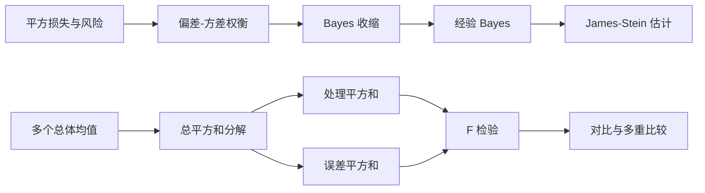

# 第 14 章：收缩估计与单因素方差分析

> 本章连接两个看似不同、实际上共享同一思想的主题：估计多个参数时如何借用整体结构降低风险，以及比较多个总体时如何把总变异拆成组间变异与组内变异。

---

## 0. 本章知识图谱



核心思想是：

- 单独估计每个参数会浪费组间共同结构；
- 单独比较许多组对会浪费整体变异分解，并放大第一类错误；
- 合理地“汇总信息”能够降低风险或提高检验功效。

---

## 1. 从无偏性转向风险

### 1.1 平方损失与均方误差

估计参数向量 $\theta\in\mathbb R^p$ 时，常用平方损失

$$
L(\theta,\delta)=\|\delta-\theta\|_2^2.
$$

估计规则 $\delta(Y)$ 的频率学风险为

$$
R(\theta,\delta)=E_\theta\|\delta(Y)-\theta\|_2^2.
$$

一维情况下，MSE 分解为

$$
E_\theta(\hat\theta-\theta)^2
=\operatorname{Var}_\theta(\hat\theta)
+\operatorname{Bias}_\theta(hat\theta)^2.
$$

因此，“无偏”只是让第二项为零，不保证总风险最小。若引入少量偏差能显著降低方差，总 MSE 反而会更小。

### 1.2 可容许性与支配

若存在另一个估计量 $\delta_1$，使

$$
R(\theta,\delta_1)\le R(\theta,\delta_0)
\quad\text{对所有 }\theta,
$$

并且至少在某些 $\theta$ 处严格小于，则称 $\delta_1$ **支配** $\delta_0$。被其他估计量支配的规则称为不可容许。

这比比较某个固定参数点的 MSE 更强：支配要求在整个参数空间都不差。

---

## 2. Normal-Normal 模型中的 Bayes 收缩

先看一维模型：

$$
Y\mid\theta\sim N(\theta,\sigma^2),
\qquad
\theta\sim N(\mu,\tau^2).
$$

后验仍为正态，其均值为

$$
E(\theta\mid Y)
=\frac{\tau^2}{\tau^2+\sigma^2}Y
+\frac{\sigma^2}{\tau^2+\sigma^2}\mu.
$$

记

$$
B=\frac{\sigma^2}{\tau^2+\sigma^2},
$$

则平方损失下的 Bayes 估计为

$$
\hat\theta_B=(1-B)Y+B\mu.
$$

它把观测值向先验中心 $\mu$ 收缩：

- $\tau^2$ 大：各组真实参数差异大，对共同中心信任少，收缩弱；
- $\sigma^2$ 大：单组观测噪声大，更依赖总体信息，收缩强；
- $\sigma^2\to0$：观测几乎无噪声，$\hat\theta_B\to Y$。

这种“向中心拉近”不是任意修改数据，而是后验均值的直接结果。

---

## 3. 经验 Bayes：从多组数据学习收缩强度

设

$$
Y_i\mid\theta_i\sim N(\theta_i,\sigma^2),
\qquad
\theta_i\overset{i.i.d.}\sim N(\mu,\tau^2),
\quad i=1,\ldots,p.
$$

若 $\mu,\tau^2$ 已知，则每个参数的后验均值为

$$
\hat\theta_i=(1-B)Y_i+B\mu.
$$

实际中超参数未知，可由全部 $Y_i$ 估计：

$$
\hat\mu=\bar Y,
$$

而边缘分布 $Y_i\sim N(\mu,\tau^2+\sigma^2)$，所以可用样本方差减去 $\sigma^2$ 估计 $\tau^2$：

$$
\hat\tau^2=\left(S_Y^2-\sigma^2\right)_+.
$$

代回得到经验 Bayes 估计。其意义是“向他人学习”：每组保留自身数据，同时借用其他组估计出的共同中心与组间离散程度。

典型应用包括多名运动员的真实命中率、多家医院的风险率、多个地区的患病率、多个广告单元的转化率。样本很少的组通常收缩更多，样本充分的组收缩较少。

---

## 4. James-Stein 现象

### 4.1 基本设定

设

$$
Y\sim N_p(\theta,\sigma^2I_p),
$$

最自然的 MLE 为

$$
\hat\theta_0=Y.
$$

它在平方损失下的风险为

$$
R(\theta,Y)=E_\theta\|Y-\theta\|^2=p\sigma^2.
$$

当 $p\ge3$ 时，James-Stein 估计量

$$
\hat\theta_{JS}
=\left(1-\frac{(p-2)\sigma^2}{\|Y\|^2}\right)Y
$$

在所有参数点的风险都不大于 $Y$，并在非平凡区域严格更小。因此 $Y$ 在 $p\ge3$ 时不可容许。

### 4.2 正部 James-Stein

当 $\|Y\|^2<(p-2)\sigma^2$ 时，上式收缩因子为负，会把方向反转。常用正部版本

$$
\hat\theta_{JS}^+
=\left(1-\frac{(p-2)\sigma^2}{\|Y\|^2}\right)_+Y,
$$

其中 $(a)_+=\max(a,0)$。它通常进一步降低风险。

### 4.3 向非零中心收缩

若希望向已知中心 $m\in\mathbb R^p$ 收缩，可写为

$$
\hat\theta_{JS,m}
=m+\left(1-\frac{(p-2)\sigma^2}{\|Y-m\|^2}\right)(Y-m).
$$

若中心也由同一数据选择，风险分析需要额外处理。向样本均值所在的一维子空间收缩时，有效维数和系数也会相应改变。

### 4.4 正确理解“更优”

James-Stein 结论比较的是向量总平方误差：

$$
\sum_{j=1}^p(\hat\theta_j-\theta_j)^2.
$$

它不保证每一个分量在每一次样本中都更接近真值，也不意味着任何相关变量或异方差问题都能直接套用上述公式。协方差已知但非球形时，应先白化或使用相应广义形式。

---

## 5. 从两个总体推广到多个总体

两样本 t 检验只能比较两个均值。若有 $k\ge3$ 个处理组，逐对做

$$
\binom{k}{2}
$$

次 t 检验会导致整体第一类错误率膨胀。例如每次检验水平为 0.05，若 10 次检验近似独立，至少一次假阳性的概率约为

$$
1-(1-0.05)^{10}\approx0.401.
$$

单因素方差分析先检验整体假设

$$
H_0:\mu_1=\mu_2=\cdots=\mu_k,
$$

在拒绝后再进行受控制的组间比较。

---

## 6. 单因素 ANOVA 模型

第 $j$ 个处理组有 $n_j$ 个观测：

$$
Y_{ij}=\mu_j+\varepsilon_{ij},
\qquad
\varepsilon_{ij}\overset{i.i.d.}\sim N(0,\sigma^2),
$$

其中 $i=1,\ldots,n_j$，$j=1,\ldots,k$。等价地可写成效应模型

$$
Y_{ij}=\mu+\tau_j+\varepsilon_{ij},
\qquad \sum_jn_j\tau_j=0.
$$

三条核心假设：

1. **独立性**：不同实验单元的误差独立；
2. **正态性**：每组误差近似正态；
3. **方差齐性**：各组共享方差 $\sigma^2$。

独立性主要由实验设计保证，不能靠正态性检验补救。F 检验对温和非正态通常较稳健，但对严重异方差且组样本量不平衡较敏感。

---

## 7. 平方和分解

记

$$
N=\sum_{j=1}^kn_j,
\qquad
\bar Y_{\cdot j}=\frac1{n_j}\sum_iY_{ij},
\qquad
\bar Y_{\cdot\cdot}=\frac1N\sum_{j,i}Y_{ij}.
$$

总离差可分解为

$$
Y_{ij}-\bar Y_{\cdot\cdot}
=(Y_{ij}-\bar Y_{\cdot j})
+(\bar Y_{\cdot j}-\bar Y_{\cdot\cdot}).
$$

平方并求和，交叉项因每组内部离差和为 0 而消失，得到

$$
SS_{Tot}=SS_{Tr}+SS_E,
$$

其中

$$
SS_{Tot}=\sum_{j=1}^k\sum_{i=1}^{n_j}
(Y_{ij}-\bar Y_{\cdot\cdot})^2,
$$

$$
SS_{Tr}=\sum_{j=1}^kn_j
(\bar Y_{\cdot j}-\bar Y_{\cdot\cdot})^2,
$$

$$
SS_E=\sum_{j=1}^k\sum_{i=1}^{n_j}
(Y_{ij}-\bar Y_{\cdot j})^2.
$$

- $SS_{Tr}$ 衡量组均值之间的变异；
- $SS_E$ 衡量同组个体围绕组均值的随机变异；
- $SS_{Tot}$ 是不区分分组时的总变异。

---

## 8. F 检验为何成立

在 $H_0$ 下，所有组均值相同。正态模型给出

$$
\frac{SS_{Tr}}{\sigma^2}\sim\chi^2_{k-1},
\qquad
\frac{SS_E}{\sigma^2}\sim\chi^2_{N-k},
$$

且二者独立。因此均方

$$
MS_{Tr}=\frac{SS_{Tr}}{k-1},
\qquad
MS_E=\frac{SS_E}{N-k}
$$

之比满足

$$
F=\frac{MS_{Tr}}{MS_E}\sim F_{k-1,N-k}.
$$

在 $H_0$ 下，两种均方都估计 $\sigma^2$；在 $H_1$ 下，$MS_{Tr}$ 还包含真实组间差异，因而倾向变大。拒绝域只在右尾。

| 变异成分 | 平方和 | 自由度 | 均方 | 检验统计量 |
|---|---:|---:|---:|---:|
| 处理/组间 | $SS_{Tr}$ | $k-1$ | $MS_{Tr}$ | $MS_{Tr}/MS_E$ |
| 误差/组内 | $SS_E$ | $N-k$ | $MS_E$ |  |
| 总计 | $SS_{Tot}$ | $N-1$ |  |  |

---

## 9. 手算例子

三组数据为

$$
(4,5),\qquad(6,7),\qquad(8,9).
$$

组均值为 $4.5,6.5,8.5$，总均值为 $6.5$。于是

$$
SS_{Tr}
=2[(4.5-6.5)^2+0^2+(8.5-6.5)^2]
=16.
$$

每组内部平方和均为

$$
(0.5)^2+(-0.5)^2=0.5,
$$

所以 $SS_E=1.5$。自由度为 $2$ 与 $3$，

$$
F=\frac{16/2}{1.5/3}=16.
$$

这个值很大，说明组间均值差相对于组内波动较强。但 ANOVA 的整体结论仍只是“至少有两个均值不同”。

---

## 10. 效应大小

显著性依赖样本量；还应报告组间差异占总变异的比例。常见指标

$$
\eta^2=\frac{SS_{Tr}}{SS_{Tot}}.
$$

$\eta^2$ 在样本中通常偏乐观。偏差修正形式之一为

$$
\omega^2=
\frac{SS_{Tr}-(k-1)MS_E}{SS_{Tot}+MS_E}.
$$

效应量应结合具体量纲下的均值差和置信区间解释，而不是只报告一个比例。

---

## 11. 对比：回答预先指定的问题

对比是组均值的线性组合

$$
C=\sum_{j=1}^kc_j\mu_j,
\qquad
\sum_{j=1}^kc_j=0.
$$

例如三组中“前两组平均与第三组比较”可取

$$
C=\frac12\mu_1+\frac12\mu_2-\mu_3.
$$

自然估计量为

$$
\hat C=\sum_jc_j\bar Y_{\cdot j},
$$

其估计标准误

$$
\widehat{se}(\hat C)
=\sqrt{MS_E\sum_j\frac{c_j^2}{n_j}}.
$$

因此

$$
t=\frac{\hat C}{\widehat{se}(\hat C)}
\sim t_{N-k}\quad(H_0:C=0).
$$

预先计划的少数对比通常比事后搜索全部组对更有功效，也更容易形成可解释的科学问题。

---

## 12. Tukey 多重比较

整体 ANOVA 显著后，若希望比较所有组对，需要控制同时覆盖率或族错误率。

各组样本量相等为 $n_0$ 时，Tukey 同时置信区间为

$$
(\bar Y_{\cdot i}-\bar Y_{\cdot j})
\pm
q_{1-\alpha;k,N-k}\sqrt{\frac{MS_E}{n_0}},
$$

其中 $q$ 是学生化极差分布分位数。

样本量不等时，Tukey-Kramer 区间为

$$
(\bar Y_{\cdot i}-\bar Y_{\cdot j})
\pm
q_{1-\alpha;k,N-k}
\sqrt{\frac{MS_E}{2}
\left(\frac1{n_i}+\frac1{n_j}\right)}.
$$

若某个同时区间不包含 0，则对应组对在控制整体错误后显著不同。

---

## 13. 诊断与替代方法

### 13.1 残差图

残差为

$$
e_{ij}=Y_{ij}-\bar Y_{\cdot j}.
$$

检查：

- 残差随拟合值是否呈漏斗形：提示异方差；
- QQ 图是否有严重弯曲或极端点：提示非正态或离群值；
- 残差随采集顺序是否有结构：提示时间依赖；
- 每组是否存在不同的数据质量或测量机制。

### 13.2 异方差

方差明显不等时可考虑 Welch ANOVA。不要把“先做方差齐性检验，再根据结果选择普通 ANOVA 或 Welch”当成完全无代价的流程，因为这种数据驱动选择会改变整体推断性质。

### 13.3 非正态与离群值

可考虑：

- 对响应作有解释的变换；
- 置换检验；
- Kruskal-Wallis 秩检验；
- 稳健位置估计与 bootstrap 区间。

替代方法改变的往往不只是计算方式，也可能改变所检验的参数或零假设。

---

## 14. 本章复习清单

| 核心内容 | 需要做到 |
|---|---|
| MSE | 会写偏差-方差分解，理解无偏不等于最小风险 |
| Bayes 收缩 | 会推 Normal-Normal 后验均值 |
| 经验 Bayes | 理解超参数由多组数据共同估计 |
| James-Stein | 记住 $p\ge3$、平方损失和整体风险含义 |
| ANOVA 模型 | 会写独立、正态、方差齐性假设 |
| 平方和 | 会推 $SS_{Tot}=SS_{Tr}+SS_E$ |
| F 检验 | 会写自由度、拒绝方向和整体假设 |
| 对比 | 会检查系数和为 0 并计算标准误 |
| Tukey | 理解为什么需要多重比较控制 |
| 诊断 | 能根据异方差、依赖和离群值选择替代方案 |

---

## 15. 本章主线

```text
多个参数 -> 单独估计噪声大 -> 共享结构 -> 收缩 -> 总体风险下降

多个均值 -> 总变异分解 -> 组间/组内均方 -> F 检验
       -> 整体拒绝 -> 计划对比或多重比较 -> 具体差异
```
