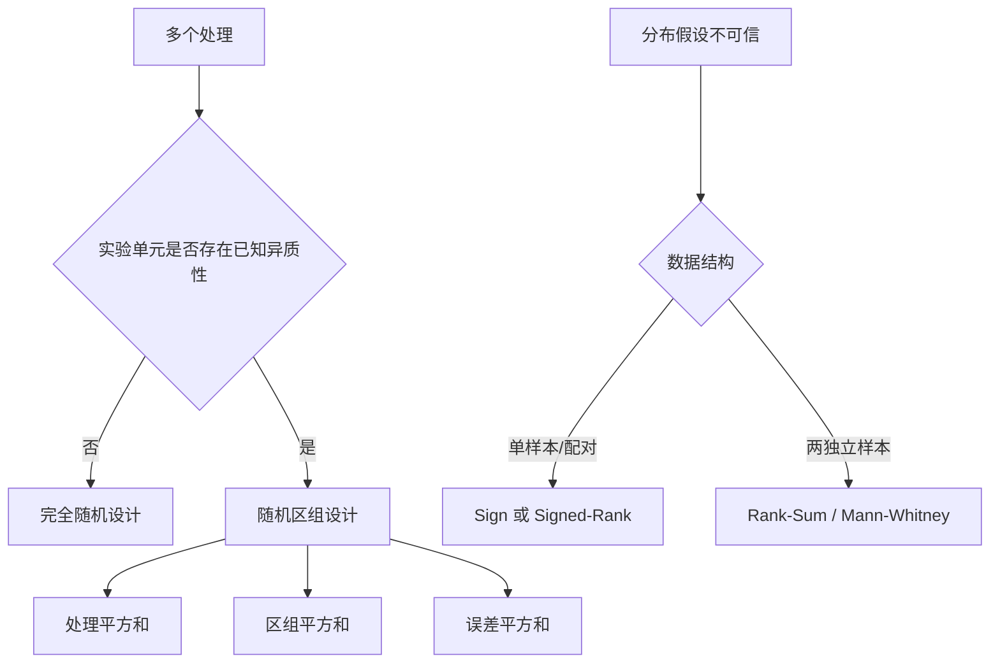

# 第 15 章：随机区组设计与非参数方法

> 本章处理两类常见困难：已知的个体差异会掩盖处理效应，以及正态性、方差齐性等参数假设不可信。前者通过区组设计减少噪声，后者通过符号与秩构造稳健推断。

---

## 0. 总览



---

## 1. 为什么要设置区组

设我们比较几种疗法，而患者初始病情差异很大。若直接完全随机分组，初始严重程度会进入误差项，使组内方差增大。区组设计的思想是：

1. 根据已知且重要的干扰变量把实验单元分成相对同质的区组；
2. 在每个区组内部随机分配处理；
3. 分析时显式扣除区组效应。

区组变量应满足：

- 与响应有较强关系，因此值得控制；
- 在处理分配前已知；
- 不是处理作用后的中介变量；
- 每个区组内能够安排全部或规定的处理。

区组不是事后按结果分组。设计阶段的区组化同时改善协变量平衡与分析效率。

---

## 2. 随机区组模型

设有 $b$ 个区组和 $k$ 个处理，每个区组内每个处理观察一次。记第 $i$ 个区组、第 $j$ 个处理的响应为 $Y_{ij}$：

$$
Y_{ij}=\mu+\beta_i+\tau_j+\varepsilon_{ij},
$$

其中

$$
\sum_{i=1}^b\beta_i=0,
\qquad
\sum_{j=1}^k\tau_j=0,
$$

且

$$
\varepsilon_{ij}\overset{i.i.d.}\sim N(0,\sigma^2).
$$

- $\mu$：总体基线；
- $\beta_i$：第 $i$ 个区组的系统偏移；
- $\tau_j$：第 $j$ 个处理效应；
- $\varepsilon_{ij}$：扣除处理和区组后的随机误差。

该模型假定处理效应与区组效应可加，即没有处理 $\times$ 区组交互。每个单元格只有一个观测时，交互与误差无法分开估计，因此可加性是重要前提。

---

## 3. 三部分平方和分解

记

$$
\bar Y_{i\cdot}=\frac1k\sum_jY_{ij},
\qquad
\bar Y_{\cdot j}=\frac1b\sum_iY_{ij},
\qquad
\bar Y_{\cdot\cdot}=\frac1{bk}\sum_{i,j}Y_{ij}.
$$

总平方和

$$
SS_{Tot}=\sum_{i=1}^b\sum_{j=1}^k
(Y_{ij}-\bar Y_{\cdot\cdot})^2
$$

可分解为

$$
SS_{Tot}=SS_{Block}+SS_{Tr}+SS_E,
$$

其中

$$
SS_{Block}=k\sum_{i=1}^b
(\bar Y_{i\cdot}-\bar Y_{\cdot\cdot})^2,
$$

$$
SS_{Tr}=b\sum_{j=1}^k
(\bar Y_{\cdot j}-\bar Y_{\cdot\cdot})^2,
$$

$$
SS_E=\sum_{i=1}^b\sum_{j=1}^k
(Y_{ij}-\bar Y_{i\cdot}-\bar Y_{\cdot j}
+\bar Y_{\cdot\cdot})^2.
$$

自由度也相加：

$$
bk-1=(b-1)+(k-1)+(b-1)(k-1).
$$

| 变异成分 | 平方和 | 自由度 | 均方 |
|---|---:|---:|---:|
| 区组 | $SS_{Block}$ | $b-1$ | $MS_{Block}$ |
| 处理 | $SS_{Tr}$ | $k-1$ | $MS_{Tr}$ |
| 误差 | $SS_E$ | $(b-1)(k-1)$ | $MS_E$ |
| 总计 | $SS_{Tot}$ | $bk-1$ |  |

---

## 4. 处理效应与区组效应检验

处理效应原假设为

$$
H_{0,Tr}:\tau_1=\cdots=\tau_k=0.
$$

检验统计量

$$
F_{Tr}=\frac{MS_{Tr}}{MS_E}
\sim F_{k-1,(b-1)(k-1)}
\quad(H_{0,Tr}).
$$

区组效应原假设为

$$
H_{0,Block}:\beta_1=\cdots=\beta_b=0,
$$

对应

$$
F_{Block}=\frac{MS_{Block}}{MS_E}
\sim F_{b-1,(b-1)(k-1)}.
$$

区组检验不应被理解为“只有区组显著才允许使用区组设计”。区组是在实验前依据设计原则引入的；即使样本中的区组 p 值不显著，也不宜事后删除区组并假装数据来自完全随机设计。

---

## 5. 区组为何能提高功效

忽略区组时，区组间差异会混入误差。理想情况下，完全随机设计的残差变异近似包含

$$
SS_{Block}+SS_E.
$$

区组分析把 $SS_{Block}$ 从误差中剔除，使处理检验分母 $MS_E$ 更小。如果区组变量确实与响应强相关，处理效应更容易被检测到。

但区组化并非总能获益：

- 区组与响应几乎无关时，自由度损失可能抵消收益；
- 区组内实验单元并不相似时，控制效果弱；
- 强烈处理-区组交互被错误塞入误差，会破坏简单加性模型。

---

## 6. 配对 t 检验是区组设计的特例

当每个区组只有两个处理，记响应为 $Y_{i1},Y_{i2}$。差值

$$
D_i=Y_{i1}-Y_{i2}
$$

满足

$$
D_i=(\tau_1-\tau_2)+(\varepsilon_{i1}-\varepsilon_{i2}),
$$

区组效应 $\beta_i$ 自动消失。因此可直接检验

$$
H_0:E(D_i)=0
$$

并使用

$$
T=\frac{\bar D}{S_D/\sqrt b}
\sim t_{b-1}.
$$

如果同一个体两次测量正相关，

$$
\operatorname{Var}(D)
=\operatorname{Var}(Y_1)+\operatorname{Var}(Y_2)
-2\operatorname{Cov}(Y_1,Y_2),
$$

配对能显著降低标准误。分析时打乱配对关系会丢失这种优势。

---

## 7. 参数方法与非参数方法

“非参数”不意味着完全没有假设。它通常表示不需要把总体指定为某个有限维参数分布族，但仍可能要求：

- 观测独立；
- 分布连续，避免大量并列；
- 差值分布对称；
- 两组分布除位置外形状相同。

符号检验只利用正负；秩检验利用次序；置换检验利用零假设下的可交换性。不同方法检验的零假设并不总是相同。

---

## 8. 单样本符号检验

希望检验总体中位数 $m$：

$$
H_0:m=m_0.
$$

对连续分布，$H_0$ 下

$$
P(X_i>m_0)=P(X_i<m_0)=\frac12.
$$

去掉等于 $m_0$ 的观测，令 $B$ 为正差值个数，则

$$
B\sim\operatorname{Bin}(n,1/2).
$$

双侧精确 p 值根据 $B$ 在二项零分布两端的极端程度计算。大样本时

$$
Z=\frac{B-n/2}{\sqrt{n/4}}
$$

近似标准正态，必要时使用连续性校正。

### 配对符号检验

对配对差值 $D_i$ 做同样处理即可检验差值中位数是否为 0。零差值不计入有效样本量。

优点：对异常值极其稳健，只要求中位数条件。缺点：忽略差值大小，功效可能较低。

---

## 9. Wilcoxon 符号秩检验

符号秩检验同时利用差值方向与绝对大小的秩。以配对差值为例：

1. 计算 $D_i$，删除 $D_i=0$；
2. 对 $|D_i|$ 从小到大排序；
3. 并列值取平均秩；
4. 把原符号加回秩；
5. 计算正秩和 $W^+$ 或负秩和 $W^-$。

无并列时，$H_0$ 下每个秩独立地以概率 $1/2$ 取正号，因此

$$
E(W^+)=\frac{n(n+1)}4,
$$

$$
\operatorname{Var}(W^+)
=\frac{n(n+1)(2n+1)}{24}.
$$

大样本标准化统计量为

$$
Z=\frac{W^+-n(n+1)/4}
{\sqrt{n(n+1)(2n+1)/24}}.
$$

小样本应使用精确分布；并列秩和零差值需要相应修正。

### 零假设的含义

符号秩检验通常要求差值分布关于 0 对称。此时它可解释为检验位置参数为 0。若分布不对称，拒绝可能来自形状差异，而不只是中位数偏移。

---

## 10. 两独立样本 Wilcoxon 秩和检验

第一组 $X_1,\ldots,X_{n_1}$，第二组 $Y_1,\ldots,Y_{n_2}$，总样本量 $N=n_1+n_2$。

1. 合并全部观测并排序；
2. 计算第一组秩和 $R_1$；
3. 比较 $R_1$ 与“随机标签”下的零分布。

无并列时，

$$
E(R_1)=\frac{n_1(N+1)}2,
$$

$$
\operatorname{Var}(R_1)=
\frac{n_1n_2(N+1)}{12}.
$$

Mann-Whitney 统计量可写为

$$
U_1=R_1-\frac{n_1(n_1+1)}2.
$$

$U_1$ 统计第一组观测超过第二组观测的成对次数（并列通常计 $1/2$）。因此

$$
\frac{U_1}{n_1n_2}
$$

可估计概率型效应

$$
P(X>Y)+\frac12P(X=Y).
$$

---

## 11. “中位数检验”说法的条件

秩和检验最一般的零假设是两组分布相同：

$$
H_0:F_X=F_Y.
$$

只有当两组分布形状和尺度相同、仅位置可能平移时，才可把它简单解释为位置或中位数差异检验。若一组更分散，即使中位数相同，秩和检验也可能拒绝。

因此报告时应先说明希望比较的是：

- 完整分布；
- 位置参数；
- 中位数；
- 随机抽取一个 $X$ 超过一个 $Y$ 的概率。

---

## 12. 精确分布、正态近似与置换思想

### 12.1 精确分布

样本很小时，可以枚举所有可能符号分配或组标签分配。精确 p 值来自这些等可能配置，不依赖大样本 CLT。

### 12.2 正态近似

样本量增大后，秩统计量是许多弱依赖项之和，可用正态近似。应使用并列修正与连续性校正，并明确近似条件。

### 12.3 置换检验

若零假设下组标签可交换，可固定观测值、反复重新分配标签并计算统计量。置换检验可使用均值差、秩和或其他统计量。其有效性来自实验设计或分布交换性，而不是“随机打乱就一定正确”。

---

## 13. 方法比较

| 数据结构与条件 | 推荐方法 | 主要目标 |
|---|---|---|
| 单样本，近似正态 | 单样本 t | 均值 |
| 单样本，强偏态或离群 | Sign | 中位数/正负概率 |
| 单样本，对称但非正态 | Signed-Rank | 位置 |
| 配对差值近似正态 | 配对 t | 平均差 |
| 配对差值强偏态 | 配对 Sign | 差值中位数 |
| 配对差值对称 | Signed-Rank | 差值位置 |
| 两独立样本，均值目标 | Welch t | 均值差 |
| 两独立样本，分布/位置目标 | Rank-Sum | 分布或位置差 |
| 多个独立组 | ANOVA / Welch ANOVA | 多组均值 |
| 多个处理且存在区组 | 随机区组 ANOVA | 控制区组后的处理效应 |

“数据不正态”并不自动意味着必须用秩检验；需要结合样本量、目标参数、异常值、方差结构和设计决定。

---

## 14. 常见错误

### 错误 1：把重复测量当成独立样本

同一个体的多次观测共享个体效应，必须采用配对、区组或更一般的重复测量模型。

### 错误 2：ANOVA 显著后逐对做未校正 t 检验

这会膨胀族错误率。应使用预先计划的对比或 Tukey、Bonferroni 等校正。

### 错误 3：把所有秩检验都称为“中位数检验”

秩检验的解释依赖形状、尺度和对称性条件。

### 错误 4：认为非参数方法不需要独立性

独立性或可交换性仍是零分布成立的基础。

### 错误 5：根据结果变量事后构造区组

这可能引入选择偏差。区组应在处理分配前定义。

---

## 15. 本章复习清单

| 核心内容 | 需要做到 |
|---|---|
| 区组思想 | 解释为何剔除已知异质性可提高功效 |
| 区组模型 | 会写 $Y_{ij}=\mu+\beta_i+\tau_j+\varepsilon_{ij}$ |
| 平方和 | 会写区组、处理、误差三部分及自由度 |
| F 检验 | 会写处理效应统计量与零分布 |
| 配对关系 | 理解配对 t 是两处理区组设计的特例 |
| Sign | 会用 $Bin(n,1/2)$ 做精确检验 |
| Signed-Rank | 会排绝对值秩并计算正负秩和 |
| Rank-Sum | 会计算秩和、均值、方差和 $U$ |
| 解释条件 | 能区分中位数、位置和完整分布零假设 |
| 精确与近似 | 知道何时枚举、何时正态近似及如何处理并列 |

---

## 16. 本章主线

```text
已知干扰因素 -> 设计阶段区组化 -> 分离区组变异 -> 更精确的处理检验

参数假设不可信 -> 用符号或秩保留稳定信息
                 -> 根据单样本/配对/独立两样本选择零分布
                 -> 解释所检验的到底是中位数、位置还是完整分布
```
