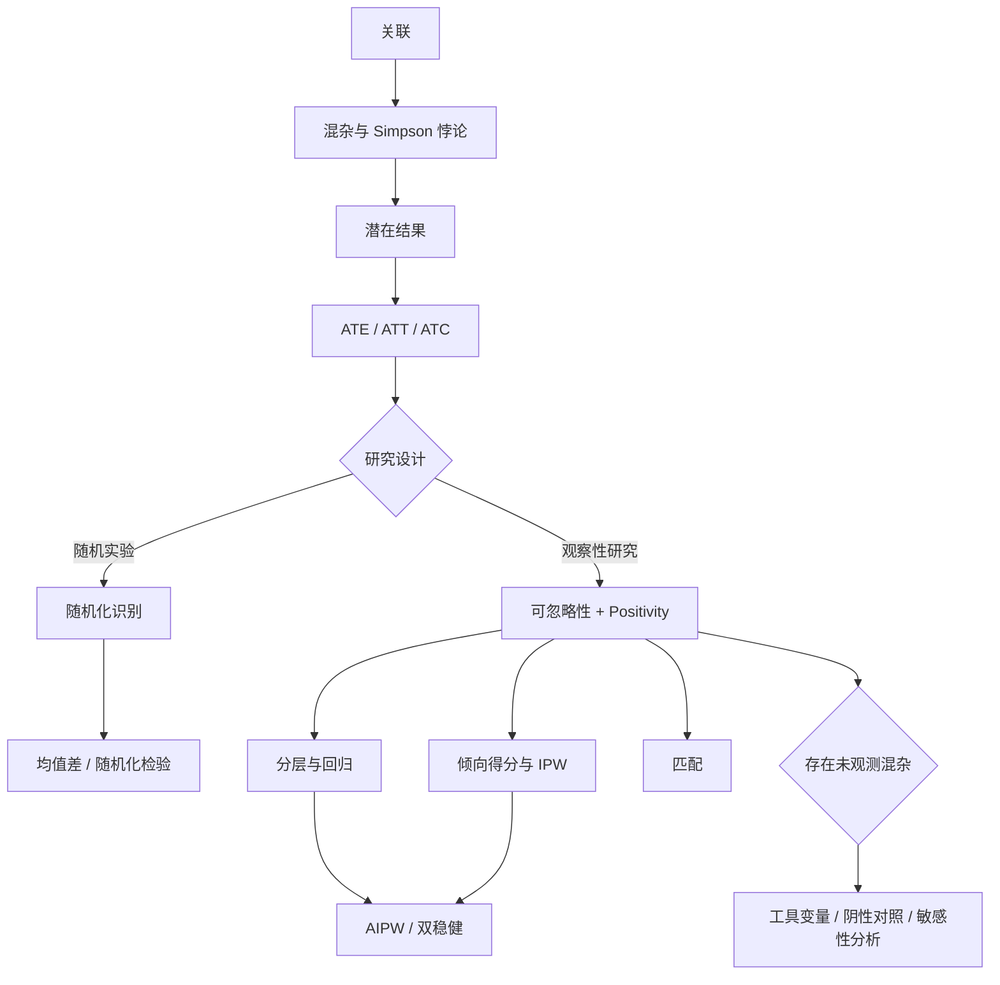

# 第 16 章：因果推断基础

> 统计关联描述“共同出现”，因果效应回答“如果把同一个研究对象的处理状态改变，结果会怎样”。从关联跨越到因果，需要研究设计或不可由数据单独验证的识别假设。

---

## 0. 知识图谱



因果分析必须依次回答：

1. 处理、结果和目标总体是什么？
2. 目标因果量是什么？
3. 哪些假设使它能由观测分布识别？
4. 在识别成立后，用什么估计量？
5. 哪些诊断和敏感性分析能说明结论是否稳健？

---

## 1. 二元变量的关联度量

令 $Z\in\{0,1\}$ 为处理，$Y\in\{0,1\}$ 为结果。记

$$
p_z=P(Y=1\mid Z=z).
$$

### 1.1 风险差

$$
RD=p_1-p_0.
$$

它有直接的概率差解释。例如 $RD=0.08$ 表示处理组结果发生率高 8 个百分点。

### 1.2 风险比

$$
RR=\frac{p_1}{p_0}.
$$

$RR=1$ 表示无边缘关联。

### 1.3 优势比

$$
OR=
\frac{p_1/(1-p_1)}{p_0/(1-p_0)}.
$$

当结果罕见时，$OR\approx RR$；结果不罕见时，OR 往往看起来比 RR 更远离 1，不能把二者混用。

若各单元格概率均为正，则

$$
RD=0\Longleftrightarrow RR=1\Longleftrightarrow OR=1,
$$

但它们对效应大小的刻画不同。

---

## 2. 混杂与 Simpson 悖论

混杂变量 $X$ 同时影响处理 $Z$ 和结果 $Y$。若忽略 $X$，处理组与对照组可能本来就不是可比人群。

### 肾结石治疗例子

汇总数据中：

| 治疗 | 成功 | 失败 | 成功率 |
|---|---:|---:|---:|
| 开放手术 | 273 | 77 | 78.0% |
| 小穿刺 | 289 | 61 | 82.6% |

边缘上似乎小穿刺更好。但结石大小同时影响治疗选择和成功率。按结石大小分层后，两个层内都可能显示开放手术成功率更高。

反转的原因不是算术矛盾，而是两种治疗面对的病例构成不同：更困难的大结石更常接受开放手术。边缘成功率混合了处理效应和病例严重程度。

因此

$$
E(Y\mid Z=1)-E(Y\mid Z=0)
$$

通常只是关联，不自动等于因果效应。

---

## 3. 潜在结果模型

对个体 $i$ 定义两个潜在结果：

$$
Y_i(1)=\text{个体 }i\text{ 接受处理时的结果},
$$

$$
Y_i(0)=\text{个体 }i\text{ 接受对照时的结果}.
$$

观测结果满足一致性关系

$$
Y_i=Z_iY_i(1)+(1-Z_i)Y_i(0).
$$

每个个体只能处于一种处理状态，所以只能看到两个潜在结果之一。缺失的那个是反事实。这就是因果推断的基本困难。

### 3.1 个体处理效应

$$
\tau_i=Y_i(1)-Y_i(0).
$$

通常无法直接识别，因为无法同时观察同一个体的两种状态。

### 3.2 平均处理效应

$$
ATE=E[Y(1)-Y(0)].
$$

它针对目标总体的平均因果效应。

### 3.3 ATT 与 ATC

$$
ATT=E[Y(1)-Y(0)\mid Z=1],
$$

$$
ATC=E[Y(1)-Y(0)\mid Z=0].
$$

若处理组比例为 $\pi=P(Z=1)$，则

$$
ATE=\pi ATT+(1-\pi)ATC.
$$

ATE、ATT 与 ATC 面向不同人群，在效应异质时数值可能明显不同。

---

## 4. SUTVA、一致性与干扰

稳定单元处理值假设通常包括：

1. **处理版本明确**：同一个 $Z=1$ 不应混合实质不同的干预；
2. **无个体间干扰**：个体 $i$ 的结果只取决于自己的处理，而不取决于他人的处理。

若疫苗接种具有群体免疫、社交网络中的信息会扩散、班级教学会影响同学，则无干扰可能失败。此时潜在结果应写成整个处理向量的函数

$$
Y_i(\mathbf Z),
$$

需要定义直接效应、溢出效应或总体策略效应。

---

## 5. 随机化实验

随机化使处理分配独立于潜在结果：

$$
Z\perp\{Y(1),Y(0)\}.
$$

于是

$$
E[Y(1)]=E(Y\mid Z=1),
\qquad
E[Y(0)]=E(Y\mid Z=0),
$$

从而

$$
ATE=E(Y\mid Z=1)-E(Y\mid Z=0).
$$

随机化把因果效应转化为可观测均值差，这是实验被称为因果识别“黄金标准”的原因。

### 5.1 Bernoulli 随机化

每个个体独立地以概率 $p$ 接受处理：

$$
Z_i\overset{i.i.d.}\sim\operatorname{Bernoulli}(p).
$$

优点是分配独立、实施简单；缺点是处理组人数随机，极端情况下可能严重不平衡。

### 5.2 完全随机化

固定恰好 $n_1$ 人接受处理，从所有

$$
\binom n{n_1}
$$

种分配中等概率抽取。组容量精确平衡，但不同个体的处理指标并不独立。

### 5.3 分层随机化

按预处理协变量（如性别、医院、疾病阶段）分层，在每层内完全随机化。这样能保证关键离散协变量在处理组和对照组内平衡。

### 5.4 重随机化

连续或高维协变量难以精确分层时，可反复生成完全随机分配，只有在平衡准则满足时才接受。例如使用协变量均值差的 Mahalanobis 距离

$$
M=(\bar X_1-\bar X_0)^TS_X^{-1}(\bar X_1-\bar X_0)
$$

并要求 $M\le a$。接受规则必须预先确定，分析应与实际随机化机制一致。

---

## 6. Fisher 随机化检验

考虑 sharp null

$$
H_0:Y_i(1)=Y_i(0)quad\text{对每个 }i.
$$

在该假设下，观测到的 $Y_i$ 同时等于两种潜在结果，因此对任何可能处理分配都能计算结果和检验统计量。

步骤：

1. 固定观测结果 $Y$；
2. 按实验设计生成所有或大量允许的处理分配 $Z^{(b)}$；
3. 计算每个分配下的统计量 $T(Z^{(b)},Y)$；
4. 计算至少与实际统计量同样极端的比例。

Monte Carlo 随机化 p 值常写为

$$
\hat p=\frac{1+\sum_{b=1}^BI\{|T_b|\ge|T_{obs}|\}}{B+1},
$$

加 1 可以避免有限模拟下得到 0。

sharp null 比 $ATE=0$ 更强：后者允许正负个体效应相互抵消，前者要求每个人的效应都为 0。

---

## 7. 观察性研究的识别假设

### 7.1 条件可忽略性

$$
\{Y(1),Y(0)\}\perp Z\mid X.
$$

含义是：给定观测协变量 $X$ 后，处理分配可视为随机。它也称无未测量混杂或 unconfoundedness。

这个假设无法仅由观测数据检验，因为它涉及从未同时观察的潜在结果。其合理性依赖研究设计、领域知识以及是否测量了所有共同原因。

### 7.2 Positivity / Overlap

$$
0<P(Z=1\mid X=x)<1
$$

应在目标总体中的所有相关 $x$ 上成立。如果某类人必然接受处理，就没有同类对照可用于估计其反事实结果。

positivity 分为：

- **结构性违反**：某类人按制度绝不可能接受某处理；
- **有限样本重叠差**：理论概率非零，但样本中几乎没有对应个体。

前者需要重新定义目标总体或 estimand，后者导致高方差和模型外推。

### 7.3 识别公式

在一致性、条件可忽略性和 positivity 下，

$$
E[Y(z)]=E_X\{E(Y\mid Z=z,X)\}.
$$

因此

$$
ATE=E_X\left[m_1(X)-m_0(X)\right],
$$

其中

$$
m_z(x)=E(Y\mid Z=z,X=x).
$$

这就是 outcome regression / g-formula 的基础。

---

## 8. 分层估计

若 $X$ 只有有限个取值，可在每层计算处理与对照均值差：

$$
\hat\tau(x)=\bar Y_{1x}-\bar Y_{0x}.
$$

再按目标总体层比例加权：

$$
\hat\tau_{str}
=\sum_x\hat P(X=x)\hat\tau(x).
$$

它直观地实现了“只比较背景相同的人”。但当协变量很多时，层数指数增长，大量层会为空，这就是维数灾难。

---

## 9. 回归调整

拟合结果模型

$$
m_z(x)=E(Y\mid Z=z,X=x),
$$

再标准化到目标样本：

$$
\hat\tau_{reg}
=\frac1n\sum_{i=1}^n
[\hat m_1(X_i)-\hat m_0(X_i)].
$$

### 9.1 线性模型

最简单模型

$$
Y=\beta_0+\tau Z+\beta^TX+\varepsilon
$$

假定处理效应在所有 $X$ 上相同。若加入交互

$$
Y=\beta_0+\tau Z+\beta^TX+Z\gamma^TX+\varepsilon,
$$

则条件效应为

$$
E[Y(1)-Y(0)\mid X=x]=\tau+\gamma^Tx.
$$

若协变量先中心化，$\tau$ 更接近样本平均协变量水平处的处理效应。

### 9.2 二元结果

可用 logistic 回归估计条件概率，但 ATE 应由预测概率差计算：

$$
\hat\tau
=\frac1n\sum_i
[\hat P(Y=1\mid Z=1,X_i)
-\hat P(Y=1\mid Z=0,X_i)].
$$

logistic 模型中 $Z$ 的系数是条件 log-odds ratio，不等于风险差 ATE。

---

## 10. 倾向得分

倾向得分定义为

$$
e(X)=P(Z=1\mid X).
$$

若处理在给定 $X$ 后可忽略，则给定一维的 $e(X)$ 后仍可忽略：

$$
\{Y(1),Y(0)\}\perp Z\mid e(X).
$$

同时，倾向得分具有平衡性质

$$
Z\perp X\mid e(X).
$$

这使高维协变量调整可转化为倾向得分分层、加权或匹配。但倾向得分不是结果模型，也不应只按处理预测准确率评价。真正要检查的是调整后的协变量平衡。

---

## 11. 逆概率加权

利用恒等式

$$
E\left[\frac{ZY}{e(X)}\right]=E[Y(1)],
$$

$$
E\left[\frac{(1-Z)Y}{1-e(X)}\right]=E[Y(0)],
$$

可得 Horvitz-Thompson 型估计量

$$
\hat\tau_{HT}
=\frac1n\sum_{i=1}^n
\left[
\frac{Z_iY_i}{\hat e_i}
-\frac{(1-Z_i)Y_i}{1-\hat e_i}
\right].
$$

每个个体按“接受自己实际处理的概率倒数”加权，从而构造一个加权伪总体，使处理与协变量近似独立。

### 11.1 Hájek 归一化

$$
\hat\mu_1^H
=\frac{\sum_iZ_iY_i/\hat e_i}
{\sum_iZ_i/\hat e_i},
$$

$$
\hat\mu_0^H
=\frac{\sum_i(1-Z_i)Y_i/(1-\hat e_i)}
{\sum_i(1-Z_i)/(1-\hat e_i)},
$$

$$
\hat\tau_H=\hat\mu_1^H-\hat\mu_0^H.
$$

归一化估计通常在有限样本更稳定，但会引入小量偏差。

### 11.2 权重诊断

必须检查：

- 倾向得分在两组的重叠区间；
- 最大权重与权重分布；
- 加权后协变量标准化均值差；
- 有效样本量
  $$
  n_{eff}=\frac{(\sum_iw_i)^2}{\sum_iw_i^2}.
  $$

极端权重表明某些反事实只能依靠少量观测推断。截尾或稳定权重可降低方差，但会改变偏差与目标总体，应明确报告。

---

## 12. 双稳健与 AIPW

把结果回归与倾向得分加权结合：

$$
\hat\tau_{AIPW}
=\frac1n\sum_{i=1}^n
\Bigg[
\hat m_1(X_i)-\hat m_0(X_i)
+\frac{Z_i\{Y_i-\hat m_1(X_i)\}}{\hat e(X_i)}
-\frac{(1-Z_i)\{Y_i-\hat m_0(X_i)\}}
{1-\hat e(X_i)}
\Bigg].
$$

结构可理解为

$$
\text{回归预测差}
+\text{处理组残差修正}
-\text{对照组残差修正}.
$$

双稳健性质：若结果模型 $m_z(X)$ 或倾向模型 $e(X)$ 至少一个正确，估计仍相合。若两者都正确，可达到半参数效率下界。

双稳健不等于“双重保险”：

- 两个模型都严重错误时可能表现更差；
- positivity 差时残差修正仍可能被极端权重放大；
- 使用复杂机器学习时，应通过样本拆分或 cross-fitting 减少过拟合带来的经验过程偏差。

---

## 13. 匹配

匹配为处理组个体寻找协变量相近的对照，反之亦然，以近似填补缺失潜在结果。

常见选择：

- 最近邻匹配；
- 是否允许重复使用对照；
- 1 对 1 或 1 对多；
- caliper：只允许距离小于阈值；
- 在原始协变量、Mahalanobis 距离或倾向得分上匹配。

匹配后的关键不是“匹配算法运行成功”，而是：

1. 匹配后协变量是否平衡；
2. 丢弃了哪些个体，目标 estimand 是否从 ATE 变成重叠人群或 ATT；
3. 标准误是否考虑匹配结构和重复匹配；
4. 是否仍可能存在未观测混杂。

倾向得分把多维协变量压缩为一维平衡分数，但不同倾向分相近不保证每一个关键协变量都在有限样本中平衡，因此仍需逐项诊断。

---

## 14. 不依从与主层类型

设 $Z$ 是随机分配或鼓励，$D$ 是实际接受处理。对每个人定义

$$
D_i(1),D_i(0).
$$

按二者组合分为：

| 类型 | $D(1)$ | $D(0)$ | 含义 |
|---|---:|---:|---|
| 始终接受者 | 1 | 1 | 无论分配如何都接受 |
| 依从者 | 1 | 0 | 按分配行动 |
| 反抗者 | 0 | 1 | 与分配相反 |
| 从不接受者 | 0 | 0 | 无论分配如何都不接受 |

随机分配 $Z$ 对结果的意向处理效应为

$$
ITT_Y=E(Y\mid Z=1)-E(Y\mid Z=0),
$$

对实际处理的第一阶段效应为

$$
ITT_D=E(D\mid Z=1)-E(D\mid Z=0).
$$

---

## 15. 工具变量与 LATE

把 $Z$ 作为实际处理 $D$ 的工具变量，需要：

1. **相关性**：$Z$ 确实改变 $D$；
2. **独立性**：$Z$ 与潜在结果、潜在处理类型独立；
3. **排除限制**：$Z$ 只通过 $D$ 影响 $Y$；
4. **单调性**：$D_i(1)\ge D_i(0)$，没有反抗者。

在这些条件下，依从者局部平均处理效应

$$
LATE
=E[Y(1)-Y(0)\mid\text{complier}]
=\frac{ITT_Y}{ITT_D}.
$$

LATE 只属于由工具变量推动而改变处理状态的依从者，不一定能推广为 ATE。

### 15.1 线性 IV 与两阶段最小二乘

结构模型

$$
Y=\alpha+\tau D+\beta^TX+\varepsilon
$$

中，若 $D$ 与 $\varepsilon$ 相关，OLS 有内生性偏差。两阶段最小二乘：

1. 第一阶段用 $Z,X$ 回归 $D$，得到 $\hat D$；
2. 第二阶段用 $\hat D,X$ 回归 $Y$。

实际标准误不能把第二阶段当作普通回归直接计算，应使用正确的 2SLS 方差公式或软件实现。

弱工具使第一阶段信号很小，导致有限样本偏差、重尾分布和不可靠置信区间。第一阶段显著并不自动证明排除限制成立。

---

## 16. 阴性对照

当担心未观测混杂 $U$ 时，可引入与 $U$ 相关、但按科学知识不应具有目标因果路径的变量。

### 16.1 阴性对照暴露

变量 $W$ 与混杂相关，但不应直接影响结果。若 $W$ 在调整后仍与结果相关，提示残余混杂或模型错误。

### 16.2 阴性对照结果

变量 $V$ 与混杂相关，但不应受处理影响。若处理与 $V$ 仍有关联，也提示未控制混杂。

阴性对照最直接的用途是诊断。若希望进一步非参数识别因果效应，还需要完备性、桥函数或离散矩阵可逆等额外条件，不能仅凭一个阴性对照变量自动消除混杂。

---

## 17. 识别、估计与检验必须分开

因果分析常见的逻辑错误是：估计方法很复杂，于是误以为因果假设也被验证。实际上：

- **识别**：在总体层面，观测分布和假设是否唯一决定目标因果量；
- **估计**：有限样本中如何逼近已识别的量；
- **推断**：如何量化估计误差；
- **敏感性分析**：识别假设偏离时结论如何变化。

回归、神经网络、倾向得分或双稳健方法主要解决估计问题。若存在未测量混杂，它们不能仅靠拟合能力恢复不存在的信息。

---

## 18. 实际分析流程

### 第一步：定义 estimand

明确 ATE、ATT、LATE、风险差、风险比，或某个时间点的平均结果。先定义目标，后选择算法。

### 第二步：画出因果结构

列出处理前共同原因、处理后的中介、碰撞点和潜在工具变量。不要机械地“控制所有变量”：控制中介会改变目标效应，控制碰撞点可能引入偏差。

### 第三步：说明识别假设

随机化、条件可忽略性、positivity、排除限制、单调性等必须明确写出。

### 第四步：检查设计与重叠

查看处理组/对照组样本量、倾向得分重叠、权重、协变量平衡和缺失机制。

### 第五步：使用至少一种主分析方法

根据设计选择均值差、分层、回归、IPW、AIPW、匹配或 IV。

### 第六步：量化不确定性

使用与设计和估计量相匹配的解析标准误、bootstrap、随机化分布或影响函数。

### 第七步：做敏感性分析

改变模型规格、权重截尾、目标人群、未观测混杂强度或排除限制，检查结论是否稳定。

---

## 19. 常见错误

### 错误 1：把显著回归系数直接叫作因果效应

回归系数只有在处理定义、无混杂、一致性、positivity 和模型条件成立时才有相应因果解释。

### 错误 2：把 propensity score 当成结果预测分数

倾向得分建模的目标是实现协变量平衡，不是最大化 AUC。

### 错误 3：忽略 overlap

即使模型能输出 0.001 或 0.999 的概率，也不表示数据对相应反事实有充分支持。

### 错误 4：把双稳健理解为永远可靠

双稳健要求两个工作模型至少一个正确，且仍依赖因果识别假设和重叠。

### 错误 5：把 LATE 报告成总体平均效应

LATE 针对依从者，其人群由具体工具变量定义。

### 错误 6：根据观测结果事后修改随机化规则

随机化检验必须按真实设计产生零分布。

---

## 20. 本章复习清单

| 核心内容 | 需要做到 |
|---|---|
| 关联量 | 会计算并区分 RD、RR、OR |
| Simpson 悖论 | 能解释分层与汇总方向为何反转 |
| 潜在结果 | 会定义 $Y(1),Y(0)$、ATE、ATT、ATC |
| 基本困难 | 说明为何个体效应通常不可直接观察 |
| 随机化 | 区分 Bernoulli、完全、分层与重随机化 |
| 随机化检验 | 理解 sharp null 与分配零分布 |
| 可忽略性 | 会写 $\{Y(1),Y(0)\}\perp Z\mid X$ |
| Positivity | 理解无重叠为何导致不可识别或外推 |
| 回归估计 | 会写 g-formula 标准化估计 |
| IPW | 会写 HT、Hájek 并检查极端权重 |
| AIPW | 会解释结果模型和倾向模型的两项修正 |
| 匹配 | 能区分匹配算法与平衡诊断 |
| IV/LATE | 会写 Wald 比率并说明四个关键假设 |
| 阴性对照 | 理解诊断作用与额外识别条件 |

---

## 21. 全章主线

```text
相关不等于因果
  -> 用潜在结果定义“改变处理会怎样”
  -> 用随机化或可忽略性等假设识别反事实均值
  -> 用回归、加权、匹配或双稳健方法估计
  -> 当无混杂不可信时考虑 IV、阴性对照与敏感性分析
  -> 始终区分目标人群、识别假设、估计误差与可推广性
```
