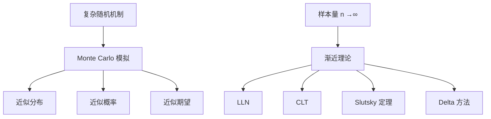
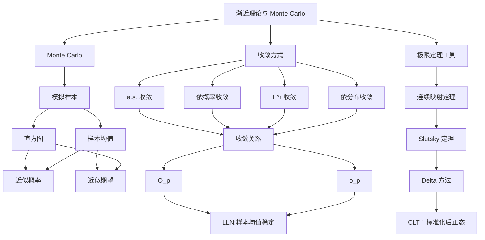

# 第 6 章：渐近理论与蒙特卡洛模拟

> 这一章连接“概率模型”与“统计推断”：样本量很大时，随机量会如何稳定？复杂分布算不出时，能否用模拟近似？

---

## 0. 本章定位

前面章节主要在精确计算分布。  
但统计推断中常遇到两类困难：

1. 精确分布太复杂；
2. 样本量大时更关心极限近似。

于是有两条路线：




---

## 1. Monte Carlo 模拟

### 1.1 思想

如果一个随机变量的真实分布难以手算，就从模型中大量生成样本，用模拟结果近似真实分布。

基本流程：

1. 建立随机模型；
2. 重复生成随机样本；
3. 对每次模拟计算目标量；
4. 用直方图、均值、分位数等总结结果；
5. 用模拟结果回答概率或决策问题。

### 1.2 电视保修例子的结构

保修问题可以拆成：

- 两年内维修次数：由故障到达过程决定；
- 每次维修成本：可近似为正态分布；
- 总维修费：维修次数与单次成本共同决定。

若解析分布很麻烦，就模拟很多次“两年使用过程”，比较总维修费超过保修价格的频率。

### 1.3 Monte Carlo 的关键

Monte Carlo 不是“随便试几次”，它依赖大数定律：

$$
\frac1N\sum_{i=1}^N h(X_i)\to E[h(X)]
$$

模拟次数越大，模拟平均越接近理论期望。

---

## 2. 四种收敛方式

设 $X_n,X$ 为随机向量。

### 2.1 几乎处处收敛

$$
\boxed{X_n\xrightarrow{a.s.}X}
$$

含义：

$$
P(\lim_{n\to\infty}X_n=X)=1
$$

这是很强的逐路径收敛。

### 2.2 依概率收敛

$$
\boxed{X_n\xrightarrow{p}X}
$$

含义：对任意 $\varepsilon>0$，

$$
\lim_{n\to\infty}P(\|X_n-X\|>\varepsilon)=0
$$

统计中的“一致估计”就是依概率收敛到真值。

### 2.3 $L^r$ 收敛

$$
\boxed{X_n\xrightarrow{L^r}X}
$$

含义：

$$
E\|X_n-X\|^r\to0
$$

例如 $L^2$ 收敛要求均方误差趋于 0。

### 2.4 依分布收敛

$$
\boxed{X_n\xrightarrow{d}X}
$$

含义：在 $X$ 的 CDF 连续点上，

$$
F_{X_n}(x)\to F_X(x)
$$

这是最弱但最常用于极限分布的收敛。

---

## 3. 收敛关系图

本章中的核心关系可记为：

```
L^r 收敛 ─┐
         ├──> 依概率收敛 ───> 依分布收敛
a.s.收敛 ─┘
```

补充：

- 若 $X_n\xrightarrow{d}c$，其中极限是常数，则 $X_n\xrightarrow{p}c$。
- 依概率收敛可以抽出几乎处处收敛的子序列。
- Borel-Cantelli 型条件可用于证明几乎处处收敛。

---

## 4. 随机阶记号 $O_p$ 与 $o_p$

### 4.1 普通阶

$$
a_n=O(b_n)
$$

表示 $|a_n|$ 至多与 $|b_n|$ 同阶。

$$
a_n=o(b_n)
$$

表示 $a_n/b_n\to0$。

### 4.2 随机阶

$$
\boxed{X_n=O_p(a_n)}
$$

表示 $X_n/a_n$ 在概率意义下有界。

$$
\boxed{X_n=o_p(a_n)}
$$

表示

$$
X_n/a_n\xrightarrow{p}0
$$

常见写法：

$$
\bar X-\mu=O_p(n^{-1/2})
$$

意思是样本均值误差通常是 $1/\sqrt n$ 量级。

---

## 5. 连续映射、Slutsky 与 Delta 方法

### 5.1 连续映射定理

若 $X_n\to X$，且 $g$ 连续，则

$$
\boxed{g(X_n)\to g(X)}
$$

这里的收敛可以是 a.s.、依概率或依分布。

例：

$$
X_n\xrightarrow{d}N(0,1)\implies X_n^2\xrightarrow{d}\chi_1^2
$$

### 5.2 Slutsky 定理

若

$$
X_n\xrightarrow{d}X,\quad Y_n\xrightarrow{p}c
$$

则

$$
X_n+Y_n\xrightarrow{d}X+c
$$

$$
X_nY_n\xrightarrow{d}cX
$$

$$
\frac{X_n}{Y_n}\xrightarrow{d}\frac Xc,\quad c\ne0
$$

用途：把未知参数替换为一致估计量。

### 5.3 Delta 方法

若

$$
a_n(X_n-c)\xrightarrow{d}Y,\quad a_n\to\infty
$$

且 $g$ 在 $c$ 可微，则

$$
\boxed{
a_n[g(X_n)-g(c)]\xrightarrow{d}g'(c)Y
}
$$

多维情形：

$$
a_n[g(X_n)-g(c)]\xrightarrow{d}\nabla g(c)^\top Y
$$

典型用途：已知 $\hat\theta$ 的渐近分布，求 $g(\hat\theta)$ 的渐近分布。

---

## 6. 大数定律 LLN

### 6.1 强大数定律

若 $X_1,X_2,\dots$ i.i.d. 且 $E|X_1|<\infty$，则

$$
\boxed{
\frac1n\sum_{i=1}^nX_i\xrightarrow{a.s.}E(X_1)
}
$$

### 6.2 弱大数定律

在较弱意义下：

$$
\boxed{
\frac1n\sum_{i=1}^nX_i\xrightarrow{p}E(X_1)
}
$$

### 6.3 统计含义

大数定律说明：

- 样本均值会稳定到总体均值；
- Monte Carlo 平均会稳定到理论期望；
- 估计量的一致性通常靠 LLN 证明。

---

## 7. 中心极限定理（CLT）

### 7.1 i.i.d. 版本

若 $X_1,\dots,X_n$ i.i.d.，$E(X_i)=\mu$，$Var(X_i)=\sigma^2<\infty$，则

$$
\boxed{
\frac{\sqrt n(\bar X-\mu)}{\sigma}\xrightarrow{d}N(0,1)
}
$$

或者：

$$
\sqrt n(\bar X-\mu)\xrightarrow{d}N(0,\sigma^2)
$$

### 7.2 多元 CLT

若 $X_i$ 是 $k$ 维随机向量，$E(X_i)=\mu$，$Var(X_i)=\Sigma$，则

$$
\boxed{
\frac1{\sqrt n}\sum_{i=1}^n(X_i-\mu)\xrightarrow{d}N_k(0,\Sigma)
}
$$

### 7.3 Lindeberg / Lyapunov 条件

当变量独立但不完全同分布时，需要额外条件保证没有单个变量支配总和。

直觉：

```
总和近似正态
  需要很多“小贡献”叠加
  不能由一个“巨大贡献”主导
```

---

## 8. 本章知识图谱




---

## 9. 易错点与考点

|            误区             |         正确认识          |
| :-----------------------: | :-------------------: |
|       依分布收敛能推出依概率收敛       |     一般不能；极限是常数时可以     |
|       $O_p(1)$ 等于有界       | 是“概率意义下有界”，不是每个样本路径有界 |
| Slutsky 中 $Y_n$ 可以收敛到随机变量 |    标准形式要求替换项收敛到常数     |
|       Delta 方法不需要可微       |   一阶 Delta 需要在极限点可微   |
|        LLN 给出正态近似         |  LLN 给稳定性，CLT 给正态波动   |
|    Monte Carlo 不需要理论支撑    |   它依赖 LLN/CLT 解释误差    |

---

## 10. 关键公式速查表

|    内容    |                       公式                       |
| :------: | :--------------------------------------------: |
|  依概率收敛   |         $P(\|X_n-X\|>\varepsilon)\to0$         |
|  依分布收敛   |             $F_{X_n}(x)\to F_X(x)$             |
| $L^r$ 收敛 |               $E\|X_n-X\|^r\to0$               |
| 随机小 $o$  |        $X_n=o_p(a_n)\iff X_n/a_n\to_p0$        |
|   连续映射   |      $X_n\to X\Rightarrow g(X_n)\to g(X)$      |
| Slutsky  | $X_n\to_dX,Y_n\to_pc\Rightarrow X_nY_n\to_dcX$ |
| Delta 方法 |         $a_n[g(X_n)-g(c)]\to_d g'(c)Y$         |
|   LLN    |                $\bar X\to E(X)$                |
|   CLT    |    $\sqrt n(\bar X-\mu)/\sigma\to_dN(0,1)$     |

---

## 11. 学习建议

1. 先记清四种收敛的强弱关系。
2. 看到“估计量是否稳定”，想 LLN 和依概率收敛。
3. 看到“估计量误差的分布”，想 CLT。
4. 看到“估计量的函数”，想 Delta 方法。
5. 看到“用估计量替换未知参数”，想 Slutsky。
6. Monte Carlo 题按“生成机制 -> 重复模拟 -> 汇总目标量”的流程写。

---

## 12. 专题深化：Monte Carlo 的完整工作流

Monte Carlo 不是“用电脑随便模拟一下”，而是用随机重复试验近似理论概率、期望或分布。它背后的理论正是 LLN 和 CLT。

### 12.1 Monte Carlo 估计概率

假设目标是估计

$$
p=P(A).
$$

做 $B$ 次独立模拟，定义

$$
I_b=
\begin{cases}
1,&\text{第 }b\text{ 次模拟中事件 }A\text{ 发生},\\
0,&\text{否则}.
\end{cases}
$$

Monte Carlo 估计量为

$$
\hat p_B=\frac1B\sum_{b=1}^B I_b.
$$

由 LLN，

$$
\hat p_B\to p.
$$

由 CLT，

$$
\frac{\hat p_B-p}{\sqrt{p(1-p)/B}}\approx N(0,1).
$$

实际中用 $\hat p_B$ 替换 $p$，Monte Carlo 标准误为

$$
\operatorname{MCSE}(\hat p_B)\approx
\sqrt{\frac{\hat p_B(1-\hat p_B)}{B}}.
$$

### 12.2 Monte Carlo 估计期望

若目标是

$$
\theta=E[g(X)],
$$

模拟 $X_1,\dots,X_B$，估计

$$
\hat\theta_B=\frac1B\sum_{b=1}^B g(X_b).
$$

标准误近似为

$$
\operatorname{MCSE}(\hat\theta_B)
=\frac{s_g}{\sqrt B},
$$

其中 $s_g^2$ 是 $g(X_1),\dots,g(X_B)$ 的样本方差。

### 12.3 保修/寿命类模拟的套路

以“产品寿命、保修成本、系统是否失效”为例，完整模拟步骤一般是：

1. 明确随机输入，例如每个零件寿命 $T_i$ 的分布；
2. 明确系统规则，例如串联系统取最小寿命，并联系统取最大寿命；
3. 明确事件或损失函数，例如 $I(T<\text{warranty})$ 或 repair cost；
4. 重复模拟 $B$ 次；
5. 汇总均值、比例、分位数；
6. 报告 Monte Carlo 标准误。

例如估计保修期内失效概率：

$$
\hat p=\frac1B\sum_{b=1}^B I(T_b<w).
$$

估计平均保修成本：

$$
\hat c=\frac1B\sum_{b=1}^B C_b.
$$

### 12.4 模拟误差和模型误差要区分

Monte Carlo 误差来自模拟次数有限，可通过增大 $B$ 降低，通常以 $1/\sqrt B$ 速度下降。

模型误差来自你假设的分布不对，例如寿命并不服从指数分布。增加模拟次数不能消除模型误差。

因此报告模拟结果时，应该区分：

|       误差来源       |           如何降低            |
| :--------------: | :-----------------------: |
| Monte Carlo 随机误差 |        增大模拟次数、方差缩减        |
|      模型设定误差      |        改进建模、用数据校准         |
|      数值实现误差      | 检查代码、设随机种子、做 sanity check |

---

## 13. 专题深化：四种收敛的关系与例子

### 13.1 几乎处处收敛

$$
X_n\to X\quad a.s.
$$

表示除一个概率为 0 的异常集合外，对每条样本路径都有普通数列意义下的收敛。

这是很强的收敛形式。强大数定律说：

$$
\bar X_n\to\mu\quad a.s.
$$

### 13.2 依概率收敛

$$
X_n\to_p X
$$

表示对任意 $\varepsilon>0$，

$$
P(|X_n-X|>\varepsilon)\to0.
$$

弱大数定律说：

$$
\bar X_n\to_p\mu.
$$

依概率收敛关注“偏离目标的概率是否趋近 0”，不要求每条样本路径最终收敛。

### 13.3 $L^r$ 收敛

$$
X_n\to_{L^r} X
$$

表示

$$
E|X_n-X|^r\to0.
$$

当 $r=2$ 时，常用于均方误差：

$$
MSE(X_n)=E[(X_n-X)^2].
$$

若 $X_n\to_{L^r}X$，则 $X_n\to_pX$。

### 13.4 依分布收敛

$$
X_n\to_d X
$$

表示在 $X$ 的连续点处，

$$
F_{X_n}(x)\to F_X(x).
$$

它比依概率收敛弱。CLT 的结论就是依分布收敛：

$$
\frac{\sqrt n(\bar X-\mu)}{\sigma}\to_d N(0,1).
$$

### 13.5 强弱关系

常用关系：

$$
a.s.\Rightarrow p\Rightarrow d,
$$

$$
L^r\Rightarrow p\Rightarrow d.
$$

但一般不能反推。特别是，依分布收敛到常数时，可以推出依概率收敛：

$$
X_n\to_d c\quad\Rightarrow\quad X_n\to_p c.
$$

这是 Slutsky 定理中经常使用的细节。

---

## 14. 专题深化：随机大 O、小 o、连续映射与 Slutsky

### 14.1 随机小 $o$

记号

$$
X_n=o_p(a_n)
$$

表示

$$
\frac{X_n}{a_n}\to_p0.
$$

例如若

$$
\sqrt n(\hat\theta-\theta)=O_p(1),
$$

则

$$
\hat\theta-\theta=O_p(n^{-1/2}).
$$

这表示估计误差通常是 $1/\sqrt n$ 量级。

### 14.2 随机大 $O$

记号

$$
X_n=O_p(a_n)
$$

表示 $X_n/a_n$ 在概率意义下有界。直观地说，$X_n$ 的典型大小不超过 $a_n$ 的阶。

在渐近推导中经常写：

$$
\hat\theta-\theta=O_p(n^{-1/2})
$$

表示 $\hat\theta$ 是 root-n consistent。

### 14.3 连续映射定理

若

$$
X_n\to X,
$$

且 $g$ 连续，则

$$
g(X_n)\to g(X)
$$

在相同收敛意义下成立。

例子：

若 $\hat\sigma^2\to_p\sigma^2$，且 $\sigma^2>0$，则

$$
\hat\sigma=\sqrt{\hat\sigma^2}\to_p\sigma.
$$

### 14.4 Slutsky 定理

若

$$
X_n\to_d X,\qquad Y_n\to_p c,
$$

则

$$
X_n+Y_n\to_d X+c,
$$

$$
X_nY_n\to_d cX,
$$

若 $c\ne0$，

$$
\frac{X_n}{Y_n}\to_d \frac Xc.
$$

典型用法：CLT 中真实 $\sigma$ 未知时，用一致估计 $\hat\sigma$ 替换。

若

$$
\frac{\sqrt n(\bar X-\mu)}{\sigma}\to_d N(0,1),
$$

且 $\hat\sigma\to_p\sigma$，则

$$
\frac{\sqrt n(\bar X-\mu)}{\hat\sigma}\to_d N(0,1).
$$

---

## 15. 专题深化：Delta 方法

Delta 方法解决的问题是：如果估计量 $\hat\theta$ 渐近正态，那么函数 $g(\hat\theta)$ 的渐近分布是什么。

### 15.1 一阶 Delta 方法

若

$$
\sqrt n(\hat\theta-\theta)\to_d N(0,\sigma^2),
$$

且 $g'(\theta)\ne0$，则

$$
\sqrt n(g(\hat\theta)-g(\theta))
\to_d N(0,[g'(\theta)]^2\sigma^2).
$$

本质是 Taylor 展开：

$$
g(\hat\theta)=g(\theta)+g'(\theta)(\hat\theta-\theta)+o_p(\hat\theta-\theta).
$$

### 15.2 常见例子：比例的 logit 变换

若

$$
\sqrt n(\hat p-p)\to_d N(0,p(1-p)),
$$

取

$$
g(p)=\log\frac{p}{1-p},
$$

则

$$
g'(p)=\frac1{p(1-p)}.
$$

所以

$$
\sqrt n(g(\hat p)-g(p))
\to_d N\left(0,\frac1{p(1-p)}\right).
$$

这类变换在比例区间和 logistic 模型中常见。

### 15.3 当一阶导数为 0

如果 $g'(\theta)=0$，一阶 Delta 方法给出退化分布，需要看二阶项。

例如

$$
\sqrt n(\hat\theta-\theta)\to_d Z,
$$

且 $g'(\theta)=0,g''(\theta)\ne0$，则

$$
n(g(\hat\theta)-g(\theta))
\to_d \frac12g''(\theta)Z^2.
$$

这解释了为什么有些函数估计量收敛速度从 $\sqrt n$ 变成 $n$，极限分布也不再正态。

---

## 16. 专题深化：LLN、CLT 与多元推广

### 16.1 LLN 给稳定性

若 $X_1,\dots,X_n$ iid，$E(X_i)=\mu$，则

$$
\bar X_n\to_p\mu.
$$

如果进一步满足强大数定律条件，则

$$
\bar X_n\to\mu\quad a.s.
$$

LLN 的作用是说明“样本平均可以估计总体平均”。

### 16.2 CLT 给波动形状

若 $X_i$ iid，$E(X_i)=\mu$，$\operatorname{Var}(X_i)=\sigma^2<\infty$，则

$$
\frac{\sqrt n(\bar X_n-\mu)}{\sigma}\to_dN(0,1).
$$

等价地，

$$
\bar X_n\approx N\left(\mu,\frac{\sigma^2}{n}\right)
$$

在大样本下成立。

LLN 告诉你 $\bar X_n$ 往哪里去；CLT 告诉你它以什么形状、什么尺度在目标附近波动。

### 16.3 多元 CLT

若 $X_i$ 是 $p$ 维随机向量，均值为 $\mu$，协方差矩阵为 $\Sigma$，则

$$
\sqrt n(\bar X-\mu)\to_dN_p(0,\Sigma).
$$

这为多参数估计、回归估计、最大似然渐近正态性提供基础。

### 16.4 Cramer-Wold 思路

证明多元依分布收敛时，一个常用工具是 Cramer-Wold device：

$$
X_n\to_d X
$$

当且仅当对任意固定向量 $a$，

$$
a^\top X_n\to_d a^\top X.
$$

直觉是：一个多维分布可以通过所有一维投影刻画。

---

## 17. 本章复习清单

|      核心内容      |               复习时要能做到               |
| :--------------: | :---------------------------------: |
| Monte Carlo 估计概率 |           会写指示变量平均和 MCSE            |
| Monte Carlo 估计期望 |           会用样本均值和样本方差报告误差           |
|     保修/寿命模拟      |          会写生成机制、事件规则、汇总目标           |
|       四种收敛       |         能区分 a.s.、p、$L^r$、d          |
|      收敛强弱关系      | 会写 $a.s.\Rightarrow p\Rightarrow d$ |
|   随机 $O_p/o_p$   |              能解释估计误差量级              |
|       连续映射       |            会处理估计量函数的一致性             |
|     Slutsky      |           会用估计标准误替换真实标准差            |
|     Delta 方法     |          会写 Taylor 展开和渐近方差          |
|       LLN        |              知道它给估计稳定性              |
|       CLT        |            知道它给近似正态和标准误             |
|      多元 CLT      |            知道协方差矩阵进入极限分布            |

## 18. 综合深化：弱收敛、矩收敛与更一般的极限定理

### 18.1 弱收敛的等价刻画

$X_n\xrightarrow{d}X$ 的分布函数定义是：在 $F_X$ 的每个连续点 $x$，都有

$$
F_{X_n}(x)\to F_X(x).
$$

Portmanteau 定理还给出若干等价表述。例如，对每个有界连续函数 $f$，

$$
\mathbb E f(X_n)\to \mathbb E f(X).
$$

这提醒我们：依分布收敛控制的是“分布形状”，一般不能直接推出矩收敛。若想从分布收敛进一步推出期望收敛，还需要一致可积等附加条件。

Skorohod 表示定理则说明，在适当条件下，可以在另一个共同概率空间上构造同分布版本，使其几乎处处收敛。它是证明工具，并不表示原概率空间上的随机变量已经几乎处处收敛。

### 18.2 一致可积与矩的收敛

随机变量族 $\{X_n\}$ 一致可积，是指

$$
\lim_{M\to\infty}\sup_n
\mathbb E\!left[|X_n|\mathbf 1\{|X_n|>M\}\right]=0.
$$

若 $X_n\xrightarrow{p}X$ 且 $\{X_n\}$ 一致可积，则 $X_n\to X$ 在 $L^1$ 中成立。一个常用的充分条件是：存在 $\delta>0$，使

$$
\sup_n\mathbb E|X_n|^{1+\delta}<\infty.
$$

这正是“尾部不能悄悄携带大量期望”的数学表达。

### 18.3 Cramér--Wold 装置

对随机向量 $X_n,X\in\mathbb R^d$，有

$$
X_n\xrightarrow{d}X
\quad\Longleftrightarrow\quad
a^\top X_n\xrightarrow{d}a^\top X,
\quad \forall a\in\mathbb R^d.
$$

因此，多元渐近正态性常通过任意线性组合的一元 CLT 来证明，再由 Cramér--Wold 装置收回向量结论。

### 18.4 LLN 不是无条件成立：Cauchy 反例

若 $X_i$ 独立同分布且服从标准 Cauchy 分布，则

$$
\bar X_n=\frac1n\sum_{i=1}^nX_i
$$

仍服从标准 Cauchy 分布，不会收敛到某个常数。其根源是 Cauchy 分布不存在有限期望，经典大数定律的矩条件不满足。

### 18.5 高阶 Delta 方法

若 $\sqrt n(T_n-\theta)\xrightarrow{d}N(0,\tau^2)$，但 $g'(\theta)=0$，一阶 Delta 方法会退化。若 $g''(\theta)\ne0$，二阶 Taylor 展开给出

$$
n\{g(T_n)-g(\theta)\}
\xrightarrow{d}
\frac12g''(\theta)\tau^2\chi_1^2.
$$

例如 $g(x)=x^2$：当 $\theta\ne0$ 时用一阶 Delta 方法；当 $\theta=0$ 时必须改用二阶展开，收敛速度也由 $\sqrt n$ 变为 $n$。

### 18.6 非同分布情形

独立但非同分布时，不能机械套用 i.i.d. 版本。弱大数定律常要求总体方差之和相对 $n^2$ 足够小；中心极限定理则可用 Lindeberg 或 Lyapunov 条件控制“单个观测支配总波动”的风险。共同思想是：总随机波动应由许多小贡献组成，而不是被少数极端项主导。
