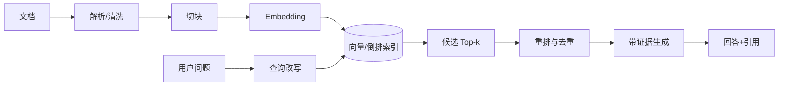

# 第 10 讲 RAG 检索增强生成

> 对应 [Lecture 10 slides](https://baojian.github.io/llm-26/slides/lecture-10-slides/) 与课程 `lecture-10-rag`。RAG 的本质是先从外部知识库选择证据，再让生成模型在证据条件下回答。

## 1. 为什么需要 RAG

参数记忆更新慢、来源不可见且可能幻觉。RAG 将知识放在可更新的外部索引中，适合私有文档、时效信息和需要引用的问答。但检索到错误证据会把错误“有依据地”交给模型，因此 RAG 不是自动消除幻觉，而是把问题拆成可诊断的 retrieval 与 generation 两部分。

## 2. 文档摄取与切块

解析必须保留标题、页码、章节、表格和来源 URL 等 metadata。固定长度 chunk 简单但可能切断语义；按段落/标题递归切分更自然；overlap 能保留边界上下文但增加重复和索引规模。

chunk 太小：召回精确但缺上下文；太大：embedding 混合多个主题且占满 prompt。应按文档结构和问题粒度调参，而不是机械使用固定字符数。表格、代码、公式和扫描 PDF 需要专门解析与 OCR 质量检查。

## 3. 稀疏与稠密检索

### BM25

BM25 基于词项匹配、逆文档频率和长度归一化，擅长专有名词、数字和精确关键词。其典型项：

$$
\operatorname{score}(q,d)=\sum_{t\in q}\mathrm{IDF}(t)
\frac{f(t,d)(k_1+1)}{f(t,d)+k_1(1-b+b|d|/\mathrm{avgdl})}.
$$

### Dense Retrieval

双塔编码 query 与 document：

$$
s(q,d)=\cos(e_q,e_d)\quad\text{或}\quad e_q^\top e_d.
$$

用对比学习让正文档分数高于负例。近似最近邻索引（如 HNSW、IVF）在速度、召回与内存间权衡。

### Hybrid 与 reranking

稀疏和稠密结果可用分数融合或 reciprocal rank fusion 合并。bi-encoder 快速召回较多候选，cross-encoder 同时读取 query/document 做精细重排，成本更高但准确。

## 4. Query 与 Context 处理

复杂问题可进行：

- query rewrite：消解指代、补全关键词；
- multi-query：生成多个视角提高召回；
- decomposition：把多跳问题拆成子问题；
- HyDE：先生成假想答案再检索相似文档；
- metadata filter：按时间、权限、文档类型过滤。

上下文装配要去重、保留来源、控制 token budget，并防止文档中的 prompt injection。外部文档是不可信数据，不能让其中“忽略系统指令”之类文字获得控制权。

## 5. Grounded Generation

提示应明确：只基于提供证据回答；证据不足时拒答；每个关键结论附引用。引用必须绑定到 chunk/source id，生成后验证引用是否真的支持句子，不能只检查 URL 是否存在。

长上下文中模型可能忽略中部证据（lost in the middle）。把高相关片段放在显著位置、按主题组织、压缩冗余和先重排再拼接通常比无脑增加 top-k 更有效。

## 6. 分层评测

### 检索层

- Recall@k：相关文档是否进入前 $k$；
- Precision@k：前 $k$ 有多少相关；
- MRR：首个相关结果排名倒数的均值；
- nDCG：考虑多级相关度与排名折损。

### 生成层

- answer correctness：答案是否正确；
- faithfulness/groundedness：断言是否由证据支持；
- citation precision/recall：引用是否准确且覆盖关键断言；
- answer relevance、拒答准确率、安全性与延迟/成本。

端到端失败必须归因：如果证据没召回，调 prompt 无法根治；证据已召回但回答错，才重点排查上下文装配与生成。

## 7. 常见失败与修复

| 失败 | 诊断 | 修复 |
| --- | --- | --- |
| 专有名词搜不到 | dense 语义漂移 | BM25/hybrid、领域 embedding |
| 相关段落被切开 | chunk 边界不当 | 结构化切块、适度 overlap |
| Top-k 都是重复内容 | 文档版本/相邻块重复 | 去重、MMR、多样化检索 |
| 有证据仍答错 | 排序或提示失败 | rerank、证据压缩、引用约束 |
| 自信回答无依据 | 无拒答策略 | 阈值、校准、abstention |
| 泄露越权文档 | 过滤在生成后做 | 检索前 ACL 与租户隔离 |

## 8. RAG、微调与长上下文

- RAG 适合事实知识可更新、需引用；
- 微调适合改变行为、格式、领域语言或任务能力，不适合频繁注入事实；
- 长上下文适合文档总量小、单次全读可承受，但成本与注意力有效性有限；
- 实际系统常组合：微调指令遵循 + RAG 获取知识 + 长上下文容纳证据。

## 9. TF-IDF 与 BM25 的公式直觉

一种常见 TF 采用对数饱和：

$$
\mathrm{tf}(t,d)=\begin{cases}1+\log f(t,d),&f(t,d)>0,\\0,&\text{otherwise},\end{cases}
\qquad
\mathrm{idf}(t)=\log\frac{N}{\mathrm{df}(t)}.
$$

BM25 把词频饱和与文档长度校正直接放进打分。$k_1$ 越大，重复词频影响持续越久；$b=0$ 不做长度归一化，$b=1$ 完全按平均长度校正。它不理解同义词，却对人名、编号、罕见术语和短实体查询非常强，因此现代 RAG 常保留 BM25 而不是只用向量检索。

## 10. 三种神经检索交互方式

### Cross-encoder

把 `[query; document]` 一起送入 encoder，token 可以充分交互，精度高；但每个候选都要重新前向，无法预计算文档，适合作 Top-k reranker。

### DPR / bi-encoder

查询与文档独立编码：

$$
s(q,d)=E_q(q)^TE_d(d).
$$

用 in-batch negatives 或 hard negatives 训练对比损失。文档向量可离线索引，适合大规模召回；若负例太容易，模型只学表面区分，若 hard negative 含实际相关文档又会产生假负例。

### ColBERT / late interaction

保留每个 query/document token 的向量，以 MaxSim 聚合：

$$
s(q,d)=\sum_{i\in q}\max_{j\in d}q_i^Td_j.
$$

它比单向量 DPR 保留更多词级匹配，又能预计算文档 token 表示；代价是索引更大、检索管线更复杂。三者形成“交互越晚越快、交互越早越精细”的连续谱。

## 11. 索引构建是离线模型的一部分

索引应保存 embedding 模型版本、维度、归一化方式、chunker 版本、来源权限与更新时间。更换 embedding 模型通常需要重建全量向量；只更新查询模型会让两侧向量空间不一致。增量更新还要正确处理删除、版本冲突和过期 chunk。

ANN 索引不是精确最近邻的同义词。HNSW 的图连接、搜索宽度影响内存/召回/延迟；IVF 先把向量分桶，再只搜索部分倒排簇。评测时要把“embedding 本身的准确率”和“近似索引造成的召回损失”分开。

## 12. 一套可定位责任的实验

准备带 gold evidence 与 gold answer 的问题集，然后依次记录：

1. oracle evidence + generator：测生成上限；
2. retriever Recall@k：测证据能否进入候选；
3. reranker nDCG/MRR：测排序；
4. assembled context：检查截断、重复和权限；
5. final answer：测正确性、faithfulness 与 citation；
6. no-answer 子集：测证据不足时能否拒答。

若 oracle evidence 下仍回答错，先修生成与提示；若 oracle 表现好但端到端差，优先修检索。这个分解比反复调整一个总分更高效。

## 延伸阅读

- Lewis et al., [Retrieval-Augmented Generation for Knowledge-Intensive NLP Tasks](https://arxiv.org/abs/2005.11401)
- Karpukhin et al., [Dense Passage Retrieval](https://arxiv.org/abs/2004.04906)
