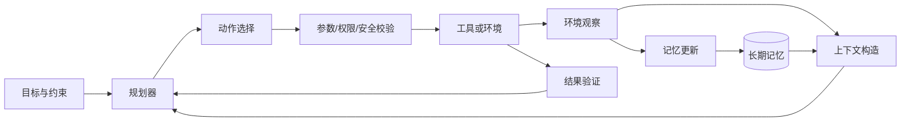

# 第 12 讲 大语言模型智能体

本讲对应 Week 15–16 的课堂内容。大语言模型智能体不是一次性文本生成器，而是让模型在环境中反复进行观察、推理、规划、行动和记忆更新的闭环系统。

## 1. 从语言模型到智能体

语言模型给定上下文 $c$ 生成 token：

$$
a_t\sim\pi_\theta(\cdot\mid c_t).
$$

当输出 token 被解析为工具调用、代码、点击或机器人控制指令时，模型就成为策略的一部分。一个通用闭环为

$$
o_t\xrightarrow{\text{reason/plan}}a_t
\xrightarrow{\text{environment}}o_{t+1}
\xrightarrow{\text{memory update}}m_{t+1}.
$$

其中 $o_t$ 是观察，$m_t$ 是记忆，$a_t$ 是动作。智能体能力来自基础模型、工具接口、记忆、规划器和环境反馈的组合，而不是单靠一个更长的 prompt。

## 2. Action space：模型到底能做什么

动作空间定义可执行操作及其参数，例如：

- 文本环境：回答、询问、检索、写入记忆；
- Web/移动端：点击、输入、滚动、导航；
- 代码环境：读写文件、运行测试、调用数据库或 API；
- 游戏：移动、选择道具、与角色交互；
- 机器人：导航、抓取、关节控制和语音交互。

自然语言动作表达力强但容易歧义；结构化 schema 更容易验证和执行。可靠系统通常让模型产生受约束的函数名与参数，并在执行前检查类型、权限、范围和前置条件。

动作成功后环境状态会改变。购物、发信、删除文件等动作可能不可逆，所以智能体必须区分只读观察、可回退修改和高风险提交，不能把所有工具调用视为同等安全。

## 3. Reasoning：思考与行动交替

复杂任务需要把内部推理与外部信息获取交替进行：

```text
观察 → 形成当前假设 → 选择动作 → 获取新证据 → 修正假设 → 继续
```

ReAct 范式把 reasoning 与 action 交错，优势是可以用搜索、计算器、测试或传感器结果纠正参数记忆。单纯“多想几步”无法获得环境中尚未读取的信息；单纯行动而不推理又容易盲目试错。

推理轨迹并不天然可信。模型可能先猜答案再补解释，或在长轨迹中积累错误。系统应优先验证可观测结果：搜索证据、代码测试、最终状态和任务约束，而不是只判断文字推理是否流畅。

## 4. Memory：工作记忆与长期记忆

### 工作记忆

当前上下文中的目标、观察、工具结果和中间状态构成工作记忆。上下文窗口有限，长任务需要压缩旧轨迹，保留未完成事项、关键事实和失败原因。

### 情景记忆

存储“在什么场景做过什么、结果如何”，可用于相似任务检索。情景记录应包含时间、任务、动作、结果和可信度，而不只是整段对话。

### 语义记忆

把多次经历抽象为较稳定的事实、规则或用户偏好，可存入文档库、向量索引或知识图谱。检索可用 BM25、稠密向量或混合排序；相关性、时效性和可信度需要共同进入评分。

### 程序记忆

把可复用技能固化为代码、工具定义、工作流或策略。与“记住一段历史”相比，程序记忆直接告诉智能体如何执行一类任务。

记忆写入必须选择性进行。无差别保存会造成噪声、冲突、隐私风险和检索退化；读取时也要防止旧事实覆盖新观察。长期记忆既可以外置，也可以通过训练固化进参数，但前者更易更新和追溯，后者调用成本低却难以定点修改。

## 5. Planning：从目标到动作序列

规划是在给定目标、状态、动作和约束时寻找可执行策略。常见方法可分为三类。

### Reactive planning

每次根据当前观察选择下一步动作。它响应快、实现简单，但容易局部最优，长程依赖弱，错误后可能反复试错。

### Search-based planning

生成多个候选步骤或子计划，用树搜索、beam search、价值函数或 verifier 选择。它能显式比较不同路径，但分支数随深度迅速增长，模型评分偏差也会传递给搜索。

### Model-based planning

学习或调用世界模型

$$
\hat o_{t+1}=f_\phi(o_t,a_t),
$$

先预测动作后果，再在想象轨迹中选择动作。它能减少真实环境中的昂贵试错，尤其适合网页交易、游戏与机器人；代价是世界模型误差会在长规划中累积。

层级规划先把高层目标拆成子任务，再为每个子任务生成动作。软件工程和科研任务尤其适合这种结构：定义数据源、检索资料、处理数据、运行实验、验证结果，任何一步失败都可局部重规划。

## 6. 一个可执行的 Agent 架构



执行循环应设置终止条件：目标已满足、验证失败需要人工介入、达到步数/费用上限，或继续行动的风险超过收益。否则模型可能陷入循环、无限检索或不断扩大任务范围。

## 7. 典型应用

### 代码智能体

环境包含代码库、测试、日志和版本控制；动作包括搜索、编辑、运行测试和读取错误。评价重点是仓库级任务是否通过测试、改动是否最小、是否引入回归，而不是生成代码看起来是否合理。

### Web 与移动智能体

观察通常是页面结构或截图，动作是点击、输入和导航。困难包括动态页面、登录态、弹窗、不可逆提交、隐私和网页内容中的提示注入。

### 游戏智能体

状态与动作边界较明确，适合研究探索、长期规划和技能迁移。仅在训练过的地图得高分不能证明泛化，应测试新地图、新目标和组合技能。

### 机器人与具身智能

观察来自视觉、语音、触觉和关节传感器，动作最终要映射为低层控制。真实环境的数据昂贵且设备接口不统一，可通过人类示范、模拟器和视频学习扩充数据，但 simulation-to-real gap 仍需处理。

## 8. 数据从哪里来

- 人类示范：高质量、贴近目标任务，但采集成本高且覆盖有限；
- 智能体交互轨迹：可自动扩展，需要过滤失败、循环和奖励利用；
- 虚拟环境：安全、可并行、状态可控，但与现实存在分布差异；
- 互联网视频与日志：规模大，却缺少精确动作、状态和因果标注；
- 合成任务：可控制难度，必须检查生成器与评测器的共同偏差。

数据不仅要记录成功轨迹。带有失败原因、回退位置和修复动作的轨迹能训练错误恢复；但若把未经验证的模型输出继续当标签，会累积自举偏差。

## 9. 智能体评测

开放任务不能只看最终一句回答。至少分层记录：

| 层次 | 典型指标 |
| --- | --- |
| 结果 | task success、最终状态、测试通过率 |
| 过程 | 步数、无效动作率、回退次数、规划一致性 |
| 效率 | 延迟、token、工具调用次数、费用 |
| 稳定性 | 多次运行成功率、对页面或措辞变化的鲁棒性 |
| 泛化 | 新任务、新环境、新工具组合上的迁移 |
| 安全 | 越权动作、隐私泄露、不可逆错误、攻击成功率 |

评测环境必须接近真实接口，任务初始状态可复现，并由脚本或可观测状态判定成功。LLM-as-a-judge 可补充评价开放文本，但不能替代可执行验证器；judge 自身的偏好、位置和长度偏差也要校准。

## 10. 安全边界

- 最小权限：只暴露完成任务必需的工具和数据；
- 读写分离：优先只读探索，外部提交前再次确认目标与参数；
- 环境内容不可信：网页、邮件和文档中的文字不能自动升级为系统指令；
- 沙箱执行：代码、文件和网络操作设置资源、路径和时间限制；
- 可审计：保存动作、参数、观察和批准记录，而不是只存最终答复；
- 失败可恢复：使用事务、检查点、幂等操作和人工接管。

基础模型能力越强，动作空间越大，潜在收益与失误半径都会同时增大。智能体的核心问题因此不只是“会不会规划”，还包括“应该被允许做什么”以及“如何证明它确实完成了目标”。

## 11. POMDP 视角与状态构造

真实智能体通常看不到完整环境状态，只得到观察 $o_t$，因此更接近部分可观测 MDP。模型需要用历史与记忆构造 belief/state：

$$
b_t=f(b_{t-1},o_t,a_{t-1}),\qquad
a_t\sim\pi_\theta(a\mid b_t,g),
$$

其中 $g$ 是目标。网页中的折叠内容、代码仓库中尚未读取的文件、机器人视野外物体都属于未观测状态。把“没有看到”当成“不存在”会造成错误计划，所以高质量 agent 会主动选择信息增益高的观察动作。

## 12. 长期记忆的四种实现路线

课堂把长期记忆放在统一视角下比较：

1. **参数记忆**：把成功轨迹用于 fine-tuning，调用快但更新慢、难追溯；
2. **长上下文**：把历史直接放入 context，简单但 token 成本高且可能 lost in the middle；
3. **检索记忆**：把经历切块并向量化，按当前任务取回，易更新但依赖写入与召回质量；
4. **结构化记忆**：用表格、知识图谱、事件图或显式状态机保存实体、关系与时间，查询精确但维护成本高。

记忆条目至少要包含内容、来源、时间、适用范围与置信度。写入时做重要性与新颖性判断，读取时同时考虑相关性、时效性和可信度，冲突时优先最新的直接观察。总结旧轨迹时应保留目标、已完成项、失败原因和下一步，而不是只生成一段流畅摘要。

## 13. 三类规划方法的成本结构

反应式规划每次只选下一动作，真实交互次数少但可能短视。基于真实交互的树搜索对多个候选动作都调用环境，分支深度 $d$、宽度 $b$ 时成本可能接近 $O(b^d)$，适合便宜模拟器，不适合付款、发信等真实系统。

基于模型的规划先用 world model 预测后果，在想象空间搜索，再只执行选中的动作。它把真实试错成本换成模型偏差：预测误差会随规划深度累积。实际系统常混合三者：先生成高层计划，执行一步后读取真实反馈，局部失败时重规划，并对高风险节点要求外部确认。

## 14. Reflection、验证器与停止条件

Reflection 让模型根据失败轨迹总结规则，再用于下一轮；它只有在反馈可靠时才有效。如果错误来自坏测试或错误观察，反思会把错误固化成记忆。更稳健的循环是：执行 → 读取可观测结果 → 用确定性验证器判断 → 仅在失败证据明确时归因 → 更新计划/记忆。

停止条件必须显式：目标状态已由验证器确认；达到步数、token、费用或时间预算；连续若干动作无进展；需要新权限或不可逆决定。没有停止条件的 agent 很容易无限搜索、重复调用工具，或在已完成后继续修改结果。

## 15. 多智能体不自动带来更好结果

多个 agent 可以分角色检索、编码、审阅与汇总，提升并行性和观点多样性；也会增加通信成本、错误传播和责任不清。适合并行的子任务应有清晰输入输出和独立验证，最终由一个协调器解决冲突。评测时要与“同等总 token/工具预算的单 agent”比较，否则收益可能只是用了更多计算。

智能体基准应同时报告成功率和预算曲线：在相同最大步数或费用下谁完成更多任务，比无限重试后的最终成功率更有意义。AgentLastExam 一类新基准的价值也在于持续更新任务，降低静态题库污染造成的虚高。

## 延伸阅读

- Yao et al., [ReAct: Synergizing Reasoning and Acting in Language Models](https://arxiv.org/abs/2210.03629)
- Park et al., [Generative Agents: Interactive Simulacra of Human Behavior](https://arxiv.org/abs/2304.03442)
- Wang et al., [A Survey on Large Language Model based Autonomous Agents](https://arxiv.org/abs/2308.11432)
