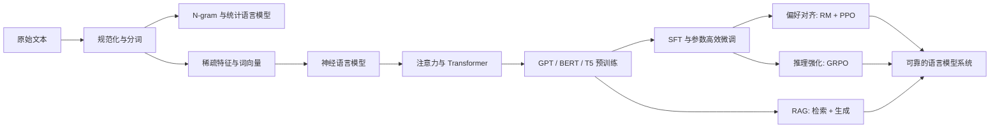

# 自然语言处理与大语言模型课程笔记

本组笔记对应复旦大学 `CS40008.01 NLP and LLMs`（2026 春，周宝健老师）。内容以课程实际发布的 10 讲 slides 与练习为主线，并用课程仓库中的教材章节和经典论文补足定义、推导与实践细节。

> [!NOTE]
> 课程官网早期列出的 16 周日程含占位主题；这里按课程仓库最终发布的 10 个 lecture 目录组织，避免把未实际授课的占位内容误写成课堂笔记。

## 章节导航

| 讲次 | 主题 | 核心问题 |
| --- | --- | --- |
| 1 | [文本预处理与分词](01-文本预处理与分词.md) | 原始文本怎样变成模型可处理的 token？ |
| 2 | [N-gram 语言模型](02-N-gram语言模型.md) | 如何给序列赋概率并处理数据稀疏？ |
| 3 | [文本分类与词向量](03-文本分类与词向量.md) | 如何把离散文本变成可学习的表示？ |
| 4 | [神经语言模型与序列建模](04-神经语言模型与序列建模.md) | 神经网络如何学习长短期上下文？ |
| 5 | [注意力与 Transformer](05-注意力与Transformer.md) | Q/K/V、自注意力和整套架构如何工作？ |
| 6 | [预训练 LLM 与生成](06-预训练LLM与生成.md) | 预训练、解码、扩展和高效适配如何衔接？ |
| 7 | [BERT 与评测基准](07-BERT与评测基准.md) | 双向编码器怎样预训练、微调和评估？ |
| 8 | [SFT、奖励模型与 PPO](08-SFT奖励模型与PPO.md) | 如何把基础模型训练成遵循指令的助手？ |
| 9 | [GRPO 与推理强化学习](09-GRPO与推理强化学习.md) | 不训练 critic，如何用组内相对奖励优化推理？ |
| 10 | [RAG 检索增强生成](10-RAG检索增强生成.md) | 如何用外部知识降低幻觉并给出可追溯回答？ |
| 附录 A | [实验与课程项目指南](附录A-实验与课程项目指南.md) | 如何从 notebook 走向可复现项目？ |
| 附录 B | [Readings 导读](附录B-Readings导读.md) | 经典论文分别解决了什么问题？ |

## 全局知识图谱

## 四条贯穿主线

1. **概率主线**：链式法则 → 最大似然 → 交叉熵 → 困惑度 → 自回归生成。
2. **表示主线**：one-hot → 计数向量 → 静态词向量 → 上下文化表示 → 大模型隐状态。
3. **架构主线**：前馈网络 → RNN/LSTM → 注意力 → Transformer → encoder/decoder/encoder-decoder。
4. **训练主线**：预训练 → SFT/LoRA → 奖励或规则反馈 → PPO/GRPO → 检索增强与系统评测。

## 建议学习方式

- 第一遍按 1–7 讲顺序理解基础，再读 8–10 讲的后训练与系统。
- 每章先看“核心结论”，再独立推一遍公式，最后完成“自检清单”。
- 实现时优先使用课程 notebook：能解释张量形状、损失函数与数据流，比只跑通代码更重要。
- 课程 slides、练习和论文持续以 [课程仓库](https://github.com/baojian/llm-26) 为准。

## 统一符号

| 符号 | 含义 |
| --- | --- |
| $\mathcal V$ | 词表，大小为 $|\mathcal V|$ |
| $w_{1:T}$ | 长度为 $T$ 的 token 序列 |
| $d$ | 隐藏维度，$h$ 为注意力头数，$d_k=d/h$ |
| $\theta$ | 模型参数，$p_\theta$ 为模型分布 |
| $x,y$ | 输入与标签；在偏好数据中也常写 prompt 与 response |
| $\pi_\theta$ | 作为策略的语言模型 |

## 课程来源

- [课程官网](https://baojian.github.io/llm-26/)
- [课程 GitHub 仓库](https://github.com/baojian/llm-26)
- Jurafsky & Martin, [Speech and Language Processing, 3rd ed. draft](https://web.stanford.edu/~jurafsky/slp3/)
