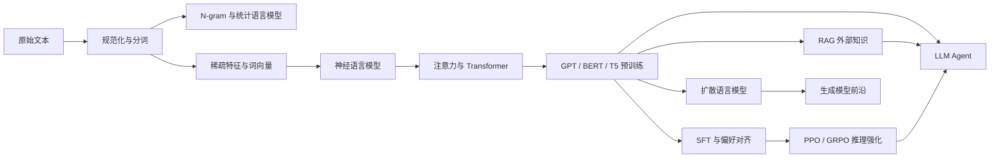

# 自然语言处理与大语言模型笔记

本组笔记对应复旦大学 `CS40008.01 NLP and LLMs`（2026 春，周宝健老师）。内容以 Lecture 01–07 原始 slides 为结构基础，结合指定 readings 与 110 页课堂记录汇总补足推导、课堂例子及后续专题；Week 14–16 的扩散语言模型和大语言模型智能体部分同时核对了课堂原文材料。

## 章节导航

| 讲次 | 主题 | 核心内容 |
| --- | --- | --- |
| 1 | [文本预处理与分词](01-文本预处理与分词.md) | 正则、编辑距离、BPE/WordPiece/Unigram、SentencePiece 与词表权衡 |
| 2 | [N-gram 语言模型](02-N-gram语言模型.md) | MLE、交叉熵/困惑度、Good–Turing、Katz 与 Kneser–Ney |
| 3 | [文本分类与词向量](03-文本分类与词向量.md) | NB/LR、TF-IDF/PMI、Word2Vec、GloVe、fastText 与现代 embedding |
| 4 | [神经语言模型与序列建模](04-神经语言模型与序列建模.md) | NPLM、反向传播、RNN/LSTM/GRU、Seq2Seq 与对齐注意力 |
| 5 | [注意力与 Transformer](05-注意力与Transformer.md) | Q/K/V、多头与交叉注意力、位置编码、参数量与计算复杂度 |
| 6 | [预训练 LLM、生成与推理系统](06-预训练LLM与生成.md) | ELMo/GPT、解码、scaling、KV cache、FlashAttention、量化与 LoRA |
| 7 | [BERT 与评测基准](07-BERT与评测基准.md) | MLM、RoBERTa/ALBERT/T5、GLUE/MMLU、代码与 Agent 评测 |
| 8 | [SFT、奖励模型与 PPO](08-SFT奖励模型与PPO.md) | SFT、Bradley–Terry、策略梯度/GAE、PPO、DPO 与安全对齐 |
| 9 | [GRPO 与推理强化学习](09-GRPO与推理强化学习.md) | 组内相对优势、RLVR、奖励验证、训练稳定性与 ICL 理论 |
| 10 | [RAG 检索增强生成](10-RAG检索增强生成.md) | BM25、DPR/ColBERT、混合检索、索引、grounding 与分层评测 |
| 11 | [扩散语言模型](11-扩散语言模型.md) | DDPM/VAE、变分目标、D3PM、LLaDA/Dream 与并行去噪 |
| 12 | [大语言模型智能体](12-大语言模型智能体.md) | POMDP、action/reasoning、长期记忆、规划、验证、安全与评测 |

## 全局知识图谱

## 贯穿课程的五条主线

1. **概率建模**：链式法则 → 最大似然 → 交叉熵 → 困惑度 → 自回归与扩散生成。
2. **表示学习**：one-hot → 计数向量 → 静态词向量 → 上下文化表示 → 大模型隐状态。
3. **架构演进**：前馈网络 → RNN/LSTM → 注意力 → Transformer → 预训练基础模型。
4. **训练与对齐**：预训练 → SFT/LoRA → 偏好模型 → PPO/GRPO → 安全与可靠性。
5. **系统与交互**：KV cache/量化 → RAG → 工具调用 → 记忆、规划与智能体评测。

## 统一符号

| 符号 | 含义 |
| --- | --- |
| $\mathcal V$ | 词表，大小为 $\lvert\mathcal V\rvert$ |
| $w_{1:T}$ | 长度为 $T$ 的 token 序列 |
| $d$ | 隐藏维度；$h$ 为注意力头数；$d_k=d/h$ |
| $\theta$ | 模型参数；$p_\theta$ 为模型分布 |
| $x,y$ | 输入与标签；偏好学习中也表示 prompt 与 response |
| $\pi_\theta$ | 作为策略的语言模型 |
| $x_t$ | 扩散过程第 $t$ 步的状态，$x_0$ 为干净样本 |

主要资料：[课程官网](https://baojian.github.io/llm-26/)、[课程仓库](https://github.com/baojian/llm-26) 与 Jurafsky & Martin 的 [Speech and Language Processing](https://web.stanford.edu/~jurafsky/slp3/)。
