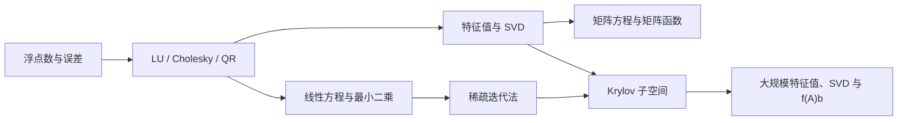

# 数值算法与案例分析Ⅰ：课程总览

数值算法研究的不是“精确公式如何写”，而是“有限精度计算机怎样可靠地得到有用答案”。一套算法至少要同时回答四个问题：

1. **可计算性**：怎样把数学问题改写成有限步骤？
2. **稳定性**：舍入误差会不会在计算中失控？
3. **复杂度**：时间、存储和数据访问成本是多少？
4. **可扩展性**：矩阵大到无法存储或分解时，还能利用什么结构？

课程主线可以画成：

## 三种阅读路线

- **考试复习**：01 → 02 → 04 → 05 → 06 → 07 → 08 → 10 → 11 → 12。
- **工程计算**：01 → 02 → 03 → 04 → 05 → 09 → 10 → 11 → 12。
- **大规模数据**：04 → 11 → 12 → 13，再读 14 的项目案例。

## 章节导航

| 章 | 主题 | 核心问题 |
|---:|---|---|
| [01](01-浮点数与误差分析.md) | 浮点数与误差 | 机器精度怎样进入每一次运算？ |
| [02](02-三角求解与LU分解.md) | 三角求解与 LU | 消元何时稳定，选主元解决什么？ |
| [03](03-Cholesky分解与结构利用.md) | Cholesky 与结构 | 对称、正定、带状和稀疏结构怎样省计算？ |
| [04](04-正交变换与QR分解.md) | Householder、Givens 与 QR | 为什么正交变换是数值线性代数的安全操作？ |
| [05](05-最小二乘与正则化.md) | 最小二乘 | 正规方程、QR、SVD 与正则化怎样取舍？ |
| [06](06-幂法与子空间迭代.md) | 幂法与反迭代 | 怎样只计算所需的少数特征对？ |
| [07](07-Hessenberg化与QR算法.md) | QR 与 Francis 迭代 | 通用稠密矩阵的全部特征值怎样计算？ |
| [08](08-对称特征值与SVD算法.md) | 对称特征问题与 SVD | 特殊结构怎样带来更快、更稳的算法？ |
| [09](09-矩阵方程与矩阵函数.md) | Sylvester、$e^A$ | 如何在不破坏结构的前提下计算矩阵函数？ |
| [10](10-稀疏矩阵与定常迭代.md) | Jacobi、GS、SOR | 大型稀疏方程为何从分解转向迭代？ |
| [11](11-Arnoldi与GMRES.md) | Arnoldi、FOM、GMRES | 如何把大问题投影为小 Hessenberg 问题？ |
| [12](12-最速下降与共轭梯度.md) | SD、CG 与预条件 | 正定系统怎样获得可证明的快速收敛？ |
| [13](13-Rayleigh-Ritz与Lanczos.md) | Lanczos 与大规模计算 | 只靠矩阵-向量乘法能完成哪些任务？ |
| [14](14-Francis-QR项目案例.md) | Francis QR 项目 | 怎样把理论算法落实为可验证的 Schur 分解程序？ |
| [附录 A](附录A-作业主题与复习定位.md) | 作业定位 | 每周作业对应哪一组算法与证明？ |
| [附录 B](附录B-复杂度与稳定性速查.md) | 期末速查 | 常用复杂度、稳定性结论和易错点是什么？ |

## 贯穿全课的判断框架

面对一个数值问题，先依次问：

1. 输入数据本身是否病态？看条件数与扰动理论。
2. 算法是否稳定？看后向误差，而不只看中间步骤。
3. 是否存在可利用结构？对称、正定、带状、Hessenberg、稀疏、低秩。
4. 需要全部信息还是少数特征对/一个矩阵函数作用？后者优先 Krylov 方法。
5. 误差停止准则是否与问题目标一致？残差小不总等于前向误差小。

## 材料说明

本系列以作者自己的 28 页手写笔记、课程大纲、每周作业题面与 Francis QR 课程项目为基础重新编写。文件夹中的教材和参考论文用于核对定义与算法覆盖；正文的叙述、章节结构、例子和复习框架均独立组织。作业附录只标注考查主题与解题入口，不公开逐题答案。
