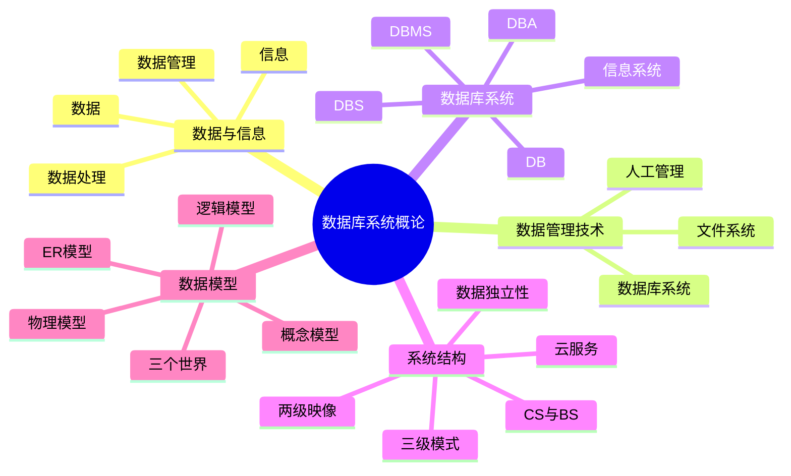

# 第 1 章 数据库系统概论

## 本章知识图谱



## 1.1 数据、信息与数据管理

数据是描述事物的符号记录，是数据库中存储、操纵和交换的基本对象。数据不只是数字，也可以是文字、图形、声音、视频、JSON 文档、日志流等。信息是数据经过解释、加工后包含的意义和价值。

数据与信息的关系可以理解为：

- 数据是信息的符号载体。
- 信息是数据的语义内涵。
- 数据经过收集、存储、加工、解释后，转化为能支持判断和决策的信息。

常见数据类型从管理角度可以分为：

| 类型 | 典型形式 | 管理特点 |
| --- | --- | --- |
| 结构化数据 | 关系表、图数据 | 模式明确，适合 SQL 和约束管理 |
| 半结构化数据 | XML、JSON、日志 | 结构灵活，字段可能不固定 |
| 非结构化数据 | 文本、图片、音频、视频 | 需要全文检索、向量检索或专门模型 |
| 静态数据 | 课程表、用户档案 | 变化较慢，适合批处理和普通事务 |
| 流数据 | 点击流、传感器数据 | 持续到达，关注实时处理和窗口计算 |

数据处理又称信息处理，基本过程是：

```text
原始数据 -> 收集 -> 存储 -> 加工 -> 新信息
```

数据管理是数据处理的中心问题，研究如何在计算机中对数据进行分类、组织、编码、存储、检索、更新、维护和共享。数据库技术的目的就是高效管理和共享大量信息。

## 1.2 数据管理技术的三个阶段

### 人工管理阶段

人工管理阶段大致对应 20 世纪 50 年代中期以前，应用以科学计算为主。程序和数据高度绑定，数据通常由应用程序自己管理。

主要特点：

- 数据不长期保存，或由程序临时组织。
- 程序与数据不可分离。
- 数据共享性差，一个程序的数据不能方便地被另一个程序使用。
- 重复数据多，维护成本高。

### 文件系统阶段

文件系统阶段大致对应 20 世纪 50 年代后期到 60 年代中后期。操作系统提供文件系统，数据可以长期保存在磁盘或磁鼓上。

主要改进：

- 数据以文件形式长期保存。
- 文件系统提供基本的存取方法。
- 支持联机实时处理和批处理。

主要问题：

- 数据仍面向具体应用文件，整体结构化程度低。
- 数据冗余大，不同文件之间一致性难保证。
- 程序依赖文件结构，数据独立性差。
- 文件之间语义联系由程序维护，缺少统一完整性控制。

### 数据库系统阶段

数据库系统阶段从 20 世纪 60 年代末开始，是数据管理技术的飞跃。DBMS 对数据库中的数据进行统一定义、操纵、控制和维护。

数据库系统管理的核心改进：

- 数据面向全组织统一建模，而不只是面向单个程序。
- 数据共享性高，冗余度低。
- 数据结构化，实体、属性、联系、约束被统一描述。
- DBMS 支持安全性、完整性、并发控制和恢复。
- 应用程序与数据之间具有较高独立性。

## 1.3 DB、DBMS、DBS 与 DBA

### 数据库 DB

数据库 Database，DB，是按照一定结构组织并长期存储在计算机内的、可共享的大量数据集合。

数据库的三个基本特点：

- 永久存储：不是临时中间结果，而是长期保存的数据资源。
- 有组织：按照数据模型和模式组织，内部存在结构和约束。
- 可共享：可被多个用户、多个应用共同使用。

数据库还具有较少冗余、较高数据独立性、统一管理和数据字典等特点。数据字典是关于数据库结构的数据，也就是元数据。

### 数据库管理系统 DBMS

数据库管理系统 Database Management System，DBMS，是位于用户和操作系统之间的一层数据管理软件，是用户与数据库交互的接口，也是数据库系统的核心。

DBMS 的主要功能：

| 功能 | 说明 |
| --- | --- |
| 数据定义 | 定义表、视图、索引、约束、模式等结构 |
| 数据操纵 | 查询、插入、删除、修改数据 |
| 数据库运行管理 | 并发控制、安全控制、完整性检查、故障恢复 |
| 数据组织与存储管理 | 决定数据文件、索引、缓冲、存取路径 |
| 数据库建立与维护 | 创建数据库、装载数据、备份恢复、性能监控 |
| 数据字典管理 | 维护表、列、权限、约束等元数据 |

常见 DBMS：MySQL、Oracle、SQL Server、PostgreSQL、SQLite、DB2、openGauss、OceanBase。

### 数据库系统 DBS

数据库系统 Database System，DBS，是在计算机系统中引入数据库后的完整系统。可简化为：

$$
DBS = 计算机系统 + DBMS + DB + 数据库相关人员
$$

数据库系统组成：

- 硬件：主机、存储设备、I/O 设备、网络环境。
- 软件：操作系统、DBMS、应用程序、工具软件。
- 数据库：被统一组织和管理的数据集合。
- 人员：DBA、数据库设计者、应用开发人员、终端用户。

### 数据库管理员 DBA

DBA 负责数据库系统的正常、高效、安全运行。

典型职责：

- 设计、创建和维护数据库。
- 授权数据库访问，管理用户与权限。
- 监控性能，进行调优和重构。
- 负责备份、恢复、容灾。
- 保证数据安全性、完整性和可用性。

## 数据库系统的特点

数据库系统相对于文件系统的关键优势：

| 特点 | 含义 |
| --- | --- |
| 数据结构化 | 数据之间的实体、属性、联系和约束有统一描述 |
| 共享性高 | 多用户、多应用可以共同访问同一数据资源 |
| 冗余度低 | 同一事实尽量只存一份或少量副本 |
| 易扩充 | 可以在统一模式下扩展数据和应用 |
| 数据独立性高 | 应用程序尽量不受数据逻辑结构和物理存储变化影响 |
| 统一管理控制 | DBMS 统一负责安全、完整性、并发和恢复 |

数据独立性分为：

- 物理独立性：数据物理存储结构改变，不影响逻辑结构和应用程序。
- 逻辑独立性：数据库逻辑结构改变时，外模式和应用程序尽量不受影响。

## 1.4 三级模式结构与两级映像

数据库系统通常采用三级模式结构：

```text
外模式/子模式/用户模式
        |
外模式-模式映像
        |
模式/概念模式/逻辑模式
        |
模式-内模式映像
        |
内模式/存储模式
```

### 外模式

外模式是用户看到和使用的局部数据逻辑结构，也称用户模式或子模式。一个数据库可以有多个外模式，不同用户可以看到不同的数据视图。外模式有助于简化用户接口和保护数据安全。

### 模式

模式也称概念模式或逻辑模式，是数据库中全体数据的逻辑结构和特征描述，是所有用户的公用数据库结构。模式描述实体、属性、联系、约束等。

模式是“型”，数据库中具体存储的数据是这个模式的“值”或实例。

### 内模式

内模式也称存储模式，描述数据的物理结构和存储方法，例如记录存储方式、索引、存取路径、文件组织等。一个数据库通常只有一个内模式，它对用户透明，但直接影响性能。

### 两级映像

- 外模式/模式映像：定义各外模式与概念模式之间的对应关系，保证逻辑独立性。
- 模式/内模式映像：定义概念模式与物理存储之间的对应关系，保证物理独立性。

三级模式和两级映像的优点：

- 保证数据独立性。
- 方便不同用户使用。
- 有利于数据安全控制。
- 有利于数据共享。

## 1.5 数据模型

数据模型是对现实世界中数据特征及数据之间联系的抽象，是数据库系统表示信息和提供操作手段的形式化工具。

### 三个世界

| 现实世界 | 信息世界 | 计算机世界 |
| --- | --- | --- |
| 具体事物 | 实体、实例 | 记录 |
| 事物特征 | 属性 | 数据项 |
| 事物集合 | 实体集 | 文件或表 |
| 事物联系 | 对象间联系 | 数据间联系 |
| 业务规则 | 约束 | 完整性规则 |

建模过程：

```text
现实世界 -> 需求分析 -> 信息世界概念模型 -> 逻辑模型 -> 物理模型
```

### 数据模型三要素

| 要素 | 描述 |
| --- | --- |
| 数据结构 | 描述数据库对象及对象间联系，是静态特征 |
| 数据操作 | 描述允许执行的操作及规则，是动态特征 |
| 完整性约束 | 描述数据必须满足的语义、制约和变化规则 |

### 概念模型

概念模型是现实世界到信息世界的第一层抽象，与具体 DBMS 无关，便于用户和设计人员沟通。最常用的是 E-R 模型。

E-R 模型基本概念：

- 实体：客观存在并可相互区分的事物。
- 属性：实体具有的某一特性。
- 码：唯一标识实体的属性或属性组。
- 域：属性的取值范围。
- 实体型：用实体名和属性集合刻画同类实体。
- 实体集：同一实体型的所有实体集合。
- 联系：实体内部或实体之间的关联。

联系的基数：

- 一对一 `1:1`：一个 A 至多对应一个 B，一个 B 也至多对应一个 A。
- 一对多 `1:n`：一个 A 可对应多个 B，一个 B 至多对应一个 A。
- 多对多 `m:n`：一个 A 可对应多个 B，一个 B 也可对应多个 A。

### 逻辑模型

逻辑模型描述数据库中实体及联系的抽象结构，常见类型：

| 模型 | 数据结构 | 特点 |
| --- | --- | --- |
| 层次模型 | 树结构 | 适合一对多层次关系，不易表示多对多 |
| 网状模型 | 图结构 | 能表示复杂联系，但结构和操作较复杂 |
| 关系模型 | 二维表 | 理论基础扎实，数据独立性好，是本课程核心 |
| 面向对象模型 | 对象与引用 | 适合复杂对象，和面向对象程序设计接近 |

## 1.6 常见系统结构与云服务

### C/S 结构

C/S 即 Client/Server。客户端负责部分业务处理和界面，服务器负责数据库服务。优点是交互能力强，缺点是客户端部署和维护成本较高。

### B/S 结构

B/S 即 Browser/Server。用户通过浏览器访问系统，应用逻辑主要部署在服务器端。优点是客户端无需专门安装软件，便于跨平台和集中维护。

### 云服务

常见云服务层次：

- IaaS：基础设施即服务，提供虚拟机、网络、存储。
- PaaS：平台即服务，提供数据库、中间件、运行环境。
- SaaS：软件即服务，用户直接使用完整应用。

数据库云化后，用户常接触到云数据库、数据库托管服务、备份恢复服务和弹性扩展能力。

## 本章易错点

- 数据不等于信息，信息是有语义、有价值的数据。
- DBMS 不等于数据库。数据库是数据集合，DBMS 是管理数据库的软件。
- DBS 比 DBMS 范围更大，包含硬件、软件、数据库、人员。
- 模式是结构定义，数据库是按模式装入数据后的实例。
- 外模式可以有多个，模式通常只有一个，内模式通常只有一个。
- 逻辑独立性靠外模式/模式映像，物理独立性靠模式/内模式映像。

## 自测题

1. 文件系统管理数据相比人工管理有什么进步？仍然有什么问题？
2. 为什么说数据库系统的核心是 DBMS？
3. 画出三级模式结构，并说明每一级面向什么人员。
4. 物理独立性和逻辑独立性分别解决什么问题？
5. 解释“现实世界、信息世界、计算机世界”的映射关系。
6. 数据模型的三个组成要素分别对应系统的什么特征？

