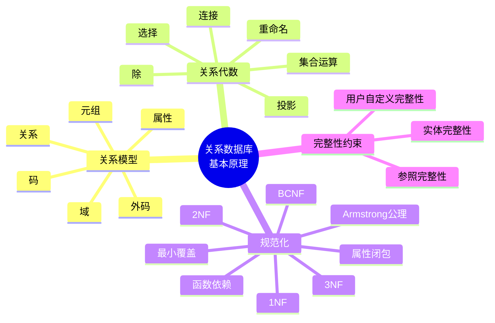

# 第 2 章 关系数据库基本原理

## 本章知识图谱



## 2.1 关系数据库概述

关系数据模型用二维表格描述实体及实体之间的联系。一个关系数据库模式是一组关系模式的集合。

### 基本术语

| 术语 | 含义 |
| --- | --- |
| 关系 | 一张二维表 |
| 元组 | 表中的一行，也称记录 |
| 属性 | 表中的一列 |
| 属性名 | 列名 |
| 属性值 | 某一行在某一列上的取值 |
| 域 | 属性允许取值的集合 |
| 关系模式 | 对关系结构的描述，是“型” |
| 关系 | 符合关系模式的一组元组，是“值” |
| 元数据 | 描述数据库结构的数据，如表名、列名、列类型、约束 |

关系模式可写作：

$$
R(A_1, A_2, ..., A_n)
$$

其中 $R$ 是关系名，$A_i$ 是属性名。

### 码与关键字

| 概念   | 定义                     | 复习要点                      |
| ---- | ---------------------- | ------------------------- |
| 候选码  | 能唯一标识元组的极小属性组          | “唯一”和“极小”缺一不可             |
| 主码   | 从候选码中选定的一个             | 用标识行、建立联系、组织存储和快速检索       |
| 外码   | 一个关系中的属性引用另一个关系的候选码或主码 | 是参照完整性的基础                 |
| 全码   | 关系模式的全部属性构成候选码         | 所有属性都是主属性                 |
| 主属性  | 包含在任一候选码中的属性           | 判断 2NF/3NF/BCNF 时常用       |
| 非主属性 | 不包含在任何候选码中的属性          | 规范化主要关注其依赖情况              |
| 代理键  | 无业务含义、专门用作主键的字段        | MySQL 常用 `AUTO_INCREMENT` |

主码选择建议：

- 优先选择取值简单、稳定、长度短的属性。
- 不建议轻易使用复合主键，维护和引用成本较高。
- 代理键适合业务键复杂或可能变化的场景。
- 主码应避免包含可变业务信息。

### 数据库中关系的类型

| 类型 | 说明 |
| --- | --- |
| 基本表 | 实际存在并存储数据的表 |
| 查询表 | 查询结果或查询过程中产生的临时表 |
| 视图表 | 由基本表或其他视图导出的虚表，不一定实际存储数据 |

### 关系的性质

- 每个关系中的元组表示某类实体或联系的数据。
- 元组顺序无关，表中行的物理顺序不影响关系含义。
- 属性顺序在理论上也不重要，但实现中列顺序会影响显示和部分操作。
- 同一属性的分量必须同质，来自同一域。
- 同一关系中属性名不能重复。
- 每个分量应是不可再分的原子值，这是第一范式的基础。

## 2.2 关系代数

关系代数是一种抽象查询语言，用对关系的运算表达查询。运算对象是关系，运算结果仍然是关系，因此可以嵌套组合。

关系代数的基本运算通常包括：

- 并
- 差
- 笛卡尔积
- 选择
- 投影

交、连接、除等可以由基本运算导出，但它们在表达查询时非常重要。

### 形式化基础

域是具有相同数据类型的一组值。笛卡尔积是多个域所有可能组合的集合：

$$
D_1 \times D_2 \times ... \times D_n =
\{(d_1,d_2,...,d_n) \mid d_i \in D_i\}
$$

关系是若干域的笛卡尔积的有限子集。

### 传统集合运算

并、差、交要求两个关系具有相同的目，并且对应属性来自相同域。

| 运算 | 记号 | 含义 |
| --- | --- | --- |
| 并 | $R \cup S$ | 属于 $R$ 或属于 $S$ 的元组 |
| 差 | $R - S$ | 属于 $R$ 且不属于 $S$ 的元组 |
| 交 | $R \cap S$ | 同时属于 $R$ 和 $S$ 的元组 |
| 笛卡尔积 | $R \times S$ | $R$ 中每个元组与 $S$ 中每个元组拼接 |

交可以由差表示：

$$
R \cap S = R - (R - S)
$$

### 选择

选择从行的角度筛选元组。

$$
\sigma_{\theta}(R)
$$

含义：从关系 $R$ 中选出满足条件 $\theta$ 的元组。

例：查询年龄大于 18 的学生：

$$
\sigma_{Sage > 18}(Student)
$$

SQL 对应：

```sql
SELECT *
FROM student
WHERE sage > 18;
```

### 投影

投影从列的角度选出属性。

$$
\pi_{A_1,A_2,...,A_k}(R)
$$

含义：保留关系 $R$ 中指定属性，去掉其他列。理论关系代数中的投影会去重。

例：查询学生姓名和所在系：

$$
\pi_{Sname,Sdept}(Student)
$$

SQL 对应：

```sql
SELECT DISTINCT sname, sdept
FROM student;
```

如果不希望去重，SQL 使用普通 `SELECT`。

### 重命名

重命名用于给关系或属性换名，常用于自连接和中间表达式。

$$
\rho_{NewName}(R)
$$

### 连接

连接可以理解为“笛卡尔积 + 选择 + 必要的投影”。

#### $\theta$ 连接

$$
R \bowtie_{\theta} S
$$

含义：从 $R \times S$ 中选出满足条件 $\theta$ 的元组。

#### 等值连接

当连接条件中的比较运算符是等号时，称为等值连接。

```sql
SELECT *
FROM student s
JOIN sc ON s.sno = sc.sno;
```

#### 自然连接

自然连接是一种特殊等值连接：

- 自动按同名属性做等值连接。
- 结果中去掉重复的同名属性列。

自然连接同时涉及行筛选和列去重，容易和普通等值连接混淆。

### 除运算

除运算用于表达“全部满足”“对于所有”的查询。若 $R(X,Y)$ 与 $S(Y)$，则：

$$
R \div S
$$

结果是那些 $X$ 值，使得对 $S$ 中每个 $Y$，$(X,Y)$ 都在 $R$ 中出现。

典型问题：查询选修了所有课程的学生。

复习技巧：看到“所有”“全部”“每一门”时，考虑除法、`NOT EXISTS` 双重否定或分组计数。

## 2.3 函数依赖与规范化

规范化是通过分析函数依赖、分解关系模式来减少冗余和异常的过程。

### 操作异常

设计不良的关系模式通常会出现：

- 插入异常：因为缺少某些码值或相关信息，无法插入本应可保存的信息。
- 删除异常：删除某条事实时，意外丢失另一条事实。
- 更新异常：同一事实重复存储，更新时必须多处同步，否则不一致。
- 数据冗余：相同信息重复出现。

### 函数依赖

设 $R(A_1,A_2,...,A_n)$ 是关系模式，$X$ 和 $Y$ 是属性集。如果任意两个元组在 $X$ 上取值相同，则在 $Y$ 上取值也必相同，则称 $X$ 函数决定 $Y$，记为：

$$
X \to Y
$$

注意：

- 函数依赖是语义范畴的概念，不能只从某个当前实例推断。
- 它必须在关系模式的所有合法实例上成立。
- 设计者可以通过业务规则强制某些函数依赖成立。

### 函数依赖类型

| 类型 | 定义 | 判断 |
| --- | --- | --- |
| 平凡依赖 | $X \to Y$ 且 $Y \subseteq X$ | 总是成立 |
| 非平凡依赖 | $X \to Y$ 且 $Y \nsubseteq X$ | 有实际约束意义 |
| 完全函数依赖 | $X \to Y$，但 $X$ 任一真子集都不能决定 $Y$ | 用于判断 2NF |
| 部分函数依赖 | $X \to Y$，且 $X$ 的某个真子集也能决定 $Y$ | 违反 2NF 的常见原因 |
| 传递函数依赖 | $X \to Y$，$Y \to Z$，且 $Y$ 不决定 $X$ | 违反 3NF 的常见原因 |

### 候选码与属性闭包

属性集 $X$ 关于函数依赖集 $F$ 的闭包记作 $X^+$，表示由 $X$ 能推出的所有属性。

求候选码的思路：

1. 从必须出现在码中的属性开始。
2. 根据函数依赖反复扩展闭包。
3. 若 $X^+$ 包含关系模式全部属性，则 $X$ 是超码。
4. 若去掉 $X$ 中任一属性后不再是超码，则 $X$ 是候选码。

### Armstrong 公理

Armstrong 公理是函数依赖推理的基础。

| 规则 | 表达 | 含义 |
| --- | --- | --- |
| 自反律 | 若 $Y \subseteq X$，则 $X \to Y$ | 平凡依赖 |
| 增广律 | 若 $X \to Y$，则 $XZ \to YZ$ | 两边加同一属性集 |
| 传递律 | 若 $X \to Y$ 且 $Y \to Z$，则 $X \to Z$ | 依赖可传递 |

常用推论：

- 合并律：若 $X \to Y$ 且 $X \to Z$，则 $X \to YZ$。
- 分解律：若 $X \to YZ$，则 $X \to Y$ 且 $X \to Z$。
- 伪传递律：若 $X \to Y$ 且 $WY \to Z$，则 $WX \to Z$。

### 最小覆盖

函数依赖集 $F$ 的最小覆盖也称 canonical cover。通常要求：

- 每个函数依赖右部只有一个属性。
- 左部没有多余属性。
- 依赖集中没有多余函数依赖。
- 与原依赖集等价。

最小覆盖常用于 3NF 分解和依赖保持分析。

## 范式

范式按规范化程度由低到高：

$$
5NF \subseteq 4NF \subseteq BCNF \subseteq 3NF \subseteq 2NF \subseteq 1NF
$$

课程重点通常是 1NF、2NF、3NF、BCNF。

### 第一范式 1NF

关系模式 $R$ 的所有属性都不能再分解为更基本的数据单位，则 $R \in 1NF$。

通俗理解：表中无表，每个单元格是原子值。

不满足 1NF 的例子：`工资` 字段内部又包含 `基本工资` 和 `岗位工资`。应拆成两个属性。

### 第二范式 2NF

在满足 1NF 的基础上，每个非主属性都完全函数依赖于每个候选码，则满足 2NF。

2NF 解决：非主属性对复合码的部分依赖。

典型例子：

```text
S-L-C(Sno, Sdept, Sloc, Cno, Grade)
候选码：(Sno, Cno)
依赖：
  (Sno, Cno) -> Grade
  Sno -> Sdept
  Sdept -> Sloc
```

`Sdept`、`Sloc` 只依赖于 `Sno`，不依赖完整复合码 `(Sno, Cno)`，因此不满足 2NF。

分解为：

```text
SC(Sno, Cno, Grade)
S-L(Sno, Sdept, Sloc)
```

### 第三范式 3NF

在满足 2NF 的基础上，所有非主属性都不传递依赖于任何候选码，则满足 3NF。

3NF 解决：非主属性对候选码的传递依赖。

继续上例：

```text
S-L(Sno, Sdept, Sloc)
Sno -> Sdept
Sdept -> Sloc
所以 Sno -> Sloc 是传递依赖
```

分解为：

```text
S-D(Sno, Sdept)
D-L(Sdept, Sloc)
```

### BCNF

若关系模式 $R$ 的每个非平凡函数依赖 $X \to Y$ 中，$X$ 都包含候选码，则 $R$ 满足 BCNF。

BCNF 比 3NF 更严格。3NF 允许某些决定因素不是候选码但右部是主属性，BCNF 不允许。

典型例子：

```text
STJ(S, T, J)
语义：
  每位教师只教一门课：T -> J
  某学生选某门课对应固定教师：(S, J) -> T
  某学生选某教师对应固定课程：(S, T) -> J
候选码：(S,J), (S,T)
```

因为 `T -> J` 的左部 `T` 不是候选码，所以不满足 BCNF；但由于不存在非主属性，它可以满足 3NF。

## 关系模式分解

分解的目标：

- 消除部分依赖。
- 消除传递依赖。
- 尽量减少冗余和异常。
- 尽量保持无损连接和依赖保持。

常见分解策略：

| 问题 | 分解方向 |
| --- | --- |
| 属性非原子 | 拆分属性，使其满足 1NF |
| 非主属性部分依赖复合码 | 将部分依赖的属性拆到新表 |
| 非主属性传递依赖候选码 | 将中间决定因素和被决定属性拆到新表 |
| 决定因素不是候选码 | 分解以逼近或达到 BCNF |

## 2.4 完整性约束

关系模型允许定义三类完整性约束。

### 实体完整性

实体完整性要求基本关系的主码不能取空值，并且主码值能唯一标识元组。

规则：

- 主码中的每个属性都不能为 `NULL`。
- 主码值必须唯一。
- 若主码由多个属性组成，则每个组成属性都不能为 `NULL`。

### 参照完整性

若关系 $R$ 中属性组 $F$ 是外码，对应关系 $S$ 的主码 $K_s$，则 $R$ 中每个元组在 $F$ 上的值必须：

- 为空值，表示暂不引用任何实体；
- 或者等于 $S$ 中某个元组的主码值。

通俗说：外键值要么为空，要么必须在被引用表中存在。

### 用户自定义完整性

用户自定义完整性是具体业务领域要求的数据约束，例如：

- 年龄必须大于 0。
- 成绩必须在 0 到 100 之间。
- 订单金额必须非负。
- 邮箱格式必须合法。

在 MySQL 中可通过 `NOT NULL`、`UNIQUE`、`CHECK`、`DEFAULT`、触发器和应用逻辑共同实现。

## 本章易错点

- 候选码必须是“极小”的，能唯一标识但不极小的是超码。
- 主属性是出现在任一候选码中的属性，不只是主码中的属性。
- 投影在关系代数中默认去重，SQL 普通 `SELECT` 不去重。
- 自然连接会去掉重复同名列，等值连接通常不会自动去重。
- 函数依赖不能只看当前表里的几行数据，必须看业务语义。
- 2NF 针对非主属性对复合候选码的部分依赖。
- 3NF 针对非主属性对候选码的传递依赖。
- BCNF 要求每个非平凡依赖的决定因素都是超码。

## 自测题

1. 什么是候选码？为什么要强调“极小”？
2. 写出选择、投影、连接、除分别解决什么类型的查询。
3. 给定函数依赖集，如何用属性闭包判断候选码？
4. 解释部分函数依赖和传递函数依赖，并各举一个例子。
5. 为什么满足 3NF 的关系模式不一定满足 BCNF？
6. 实体完整性和参照完整性分别约束什么？