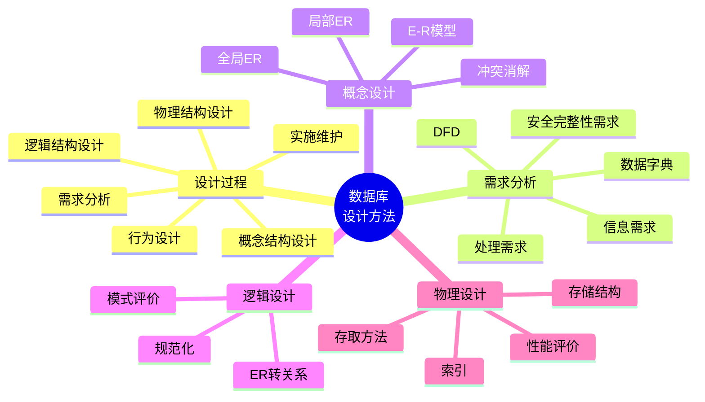

# 第 3 章 数据库设计方法

## 本章知识图谱



## 3.1 数据库设计概述

数据库设计是为某一应用环境构造数据库模式、子模式和应用系统的过程。目标是使数据库能准确表示业务数据，满足查询和更新需求，并具备良好的性能、安全性、完整性和可维护性。

常见设计目标：

- 能准确表示业务对象和业务关系。
- 数据冗余可控，减少插入、删除、更新异常。
- 支持用户常用查询和事务。
- 有合理响应时间和资源开销。
- 易维护、易扩展。
- 有完整的安全和完整性机制。

## 设计阶段

课程采用类似新奥尔良方法的设计思想，常分为六个阶段。

| 阶段 | 主要任务 | 典型产物 |
| --- | --- | --- |
| 需求分析 | 了解用户的数据、处理、安全和完整性需求 | 需求说明书、数据流图、数据字典 |
| 概念结构设计 | 抽象现实世界，建立概念模型 | 局部 E-R 图、全局 E-R 图 |
| 逻辑结构设计 | 将概念模型转换为 DBMS 支持的数据模型 | 关系模式、视图、约束 |
| 物理结构设计 | 设计存储结构、存取路径和索引 | 索引方案、存储安排 |
| 数据库行为设计 | 设计应用功能、事务和操作流程 | 功能模块、事务规范 |
| 实施与运行维护 | 建库、装载数据、调试、备份、恢复、优化 | 可运行数据库系统 |

数据库设计是迭代、逐步求精的过程。物理设计或试运行发现问题后，可能回到逻辑设计甚至需求分析阶段调整。

## 3.2 需求分析

需求分析是数据库设计的起点，也是最困难、最耗时的阶段。它的任务是准确了解用户对系统的需求，弄清系统目标和功能。

### 需求分类

| 需求 | 说明 |
| --- | --- |
| 信息需求 | 未来系统要保存和使用哪些数据，实体、属性、联系是什么 |
| 处理需求 | 需要执行哪些查询、更新、统计、报表、审批等操作 |
| 安全性需求 | 谁可以访问哪些数据，权限边界是什么 |
| 完整性需求 | 数据必须满足哪些业务规则和约束 |

### 需求分析方法

- 跟班作业：观察真实业务流程。
- 开调查会：集中访谈业务人员、管理人员和技术人员。
- 个别访谈：深入了解关键岗位需求。
- 查阅文档：现有表单、报表、制度、手工台账。
- 原型验证：用初步模型与用户反复确认。

### 需求分析步骤

1. 分析用户活动，产生业务流程图。
2. 确定系统范围，形成系统范围图。
3. 分析用户活动涉及的数据，产生数据流图。
4. 分析系统数据，编写数据字典。
5. 撰写需求说明书。

## 数据流图 DFD

数据流图 Data Flow Diagram，DFD，从“数据”和“处理”两个方面描述数据处理过程。

四个基本成分：

| 成分 | 表示 | 含义 |
| --- | --- | --- |
| 数据流 | 箭头 | 数据从哪里来到哪里去 |
| 加工/处理 | 圆圈或圆角矩形 | 对数据执行的处理 |
| 数据存储 | 双线段 | 文件、数据库或数据集合 |
| 外部实体 | 矩形 | 系统之外的数据来源或去向 |

DFD 适合和用户沟通，因为它不要求用户理解数据库内部结构。

## 数据字典

数据字典是系统中各类数据描述的集合，是需求分析的重要成果。通常包括五部分：

| 部分 | 含义 |
| --- | --- |
| 数据项 | 不可再分的数据单位，如学号、姓名、课程号 |
| 数据结构 | 若干数据项的组合关系，如学生基本信息 |
| 数据流 | 处理过程中流动的数据项或数据结构 |
| 数据存储 | 需要保存的数据集合或文件 |
| 处理过程 | 加工逻辑、输入、输出、处理规则 |

数据项描述通常包括：

- 名称和别名。
- 含义说明。
- 数据类型。
- 长度。
- 取值范围。
- 取值含义。
- 与其他数据项的逻辑关系。
- 完整性约束。

## 3.3 概念结构设计

概念结构设计是把需求分析得到的用户需求抽象为信息结构，即概念模型。它是数据库设计的关键阶段。

概念模型特点：

- 独立于具体 DBMS。
- 独立于硬件和物理存储。
- 便于用户、设计人员和开发人员沟通。
- 能较自然地表达实体、属性和联系。

### 概念结构设计方法

| 方法 | 思路 | 适用场景 |
| --- | --- | --- |
| 自顶向下 | 先定义全局框架，再逐步细化 | 全局业务清晰、组织结构稳定 |
| 自底向上 | 先设计各局部视图，再集成全局视图 | 局部应用多、需求来源分散 |
| 逐步扩张 | 从核心概念出发，逐步扩展 | 核心实体明确 |
| 混合策略 | 先建全局骨架，再集成局部模型 | 大多数实际项目 |

### 数据抽象方法

- 分类 classification：把具有共同特征和行为的对象归为一个类型。
- 概括 generalization：抽象类型之间的 “is subset of” 关系。
- 聚集 aggregation：抽象对象内部组成部分之间的 “part of” 关系。

## E-R 模型设计

E-R 图由实体、属性和联系构成：

| 元素 | 图形表示 | 说明 |
| --- | --- | --- |
| 实体型 | 矩形 | 框内写实体名 |
| 属性 | 椭圆 | 用边连接到实体或联系 |
| 联系 | 菱形 | 连接相关实体，标注 `1:1`、`1:n`、`m:n` |

联系本身也可以有属性。例如学生选课的联系可以有 `成绩`。

### 设计局部 E-R 模型

局部 E-R 设计步骤：

1. 确定局部结构范围。
2. 定义实体。
3. 定义实体之间的联系。
4. 分配属性。
5. 标识实体码和联系基数。
6. 检查并评审局部模型。

实体划分依据：

- 采用业务人员习惯的划分。
- 避免冗余，同一对象不要在同一局部结构中重复出现。
- 根据用户的信息处理需求确定实体粒度。

属性分配原则：

- 属性应是不可再分的语义单位。
- 实体与属性之间通常应是 `1:n` 关系。
- 不同实体类型的属性之间不应有直接关联关系。
- 只描述联系性质的属性，应放在联系上，而不是硬塞进某个实体。

### 设计全局 E-R 模型

全局 E-R 模型要支持所有局部 E-R 模型，并形成完整、一致的概念结构。

集成方法：

- 一次集成：适合局部模型简单、数量少的情况。
- 逐步集成：每次合并两个局部模型，降低复杂度。

全局集成步骤：

1. 确定公共实体。
2. 合并局部 E-R 模型。
3. 消除冲突。
4. 消除冗余。
5. 优化全局 E-R 图。

常见冲突：

| 冲突 | 例子 | 处理 |
| --- | --- | --- |
| 属性冲突 | 同一属性类型、长度、单位不同 | 统一类型、单位、取值范围 |
| 命名冲突 | 同名异义、异名同义 | 建立统一命名规范 |
| 结构冲突 | 同一对象在一个模型中是实体，在另一个模型中是属性 | 根据业务语义和查询需求统一结构 |

## 3.4 逻辑结构设计

逻辑结构设计把概念结构转换为 DBMS 支持的数据模型。对于关系数据库，重点是将 E-R 模型转换为关系模式，并进行规范化处理。

逻辑设计步骤：

1. 将概念结构转换为一般的数据模型。
2. 转换为特定 DBMS 支持的数据模型。
3. 数据模型优化。
4. 设计外模式或视图。
5. 进行模式评价和改进。

## E-R 到关系模型的转换

### 独立实体转换

每个实体型转换为一个关系模式：

```text
实体名(属性1, 属性2, ..., 属性n)
```

实体的码转换为关系的主码。

### 多值属性转换

多值属性通常单独转换为一个关系模式，并包含原实体的主码。

例：

```text
学生(学号, 姓名)
学生电话(学号, 电话)
```

### `1:1` 联系转换

方法一：转换为独立关系模式。

```text
办卡(学号, 卡号, 办卡日期)
```

方法二：合并到任一端实体，在该关系中加入另一端主码和联系属性。

选择建议：

- 如果联系本身有重要属性，或后续可能扩展，建独立关系更清晰。
- 如果联系简单且参与度高，合并可减少连接。

### `1:n` 联系转换

方法一：转换为独立关系模式，其主码通常为 `n` 端实体码。

方法二：合并到 `n` 端实体，在 `n` 端关系中加入 `1` 端主码作为外码，并加入联系属性。

常用做法是方法二。

例：

```text
班级(班号, 班名)
学生(学号, 姓名, 班号)
```

### `m:n` 联系转换

必须转换为独立关系模式。该关系包含双方实体的主码和联系属性，主码通常是相关实体主码的组合。

例：

```text
学生(学号, 姓名)
课程(课程号, 课程名)
选课(学号, 课程号, 成绩)
```

### 多元联系转换

涉及两个以上实体的联系转换为独立关系模式，包含参与实体的主码和联系属性。

例：课程表涉及班级、课程、教师、教室。

```text
排课(班号, 课程号, 教师号, 教室号, 时间)
```

### 自联系转换

自联系是同一实体集内部实体之间的联系。转换时要通过角色名区分同一实体的不同参与身份。

例：员工管理关系。

```text
员工(员工号, 姓名, 经理员工号)
```

或：

```text
管理(经理号, 员工号)
```

## 规范化与模式评价

逻辑结构转换后，要检查：

- 是否满足 1NF。
- 是否存在部分依赖和传递依赖。
- 是否满足 2NF、3NF、BCNF 的设计目标。
- 是否保持必要的函数依赖。
- 是否支持常用查询。
- 是否存在过度分解导致的频繁连接。

规范化不是越高越好。设计需要在一致性、冗余、查询性能和维护成本之间平衡。

## 3.5 物理结构设计

数据库物理结构是数据库在物理设备上的存储结构和存取方法。它依赖具体 DBMS 和硬件环境。

物理设计目标：在给定逻辑结构基础上，通过较优的存储结构、存取路径、存储位置和分配策略，提高数据库运行效率。

物理设计两步：

1. 确定物理结构，包括存取方法和存储结构。
2. 对物理结构进行评价，重点看时间和空间效率。

### 存取方法

关系数据库常见存取方法：

- 顺序扫描。
- 索引方法。
- 聚簇方法。
- 哈希方法。

### 索引设计原则

适合建立索引的属性：

- 经常出现在查询条件中的属性。
- 经常用于连接条件的属性。
- 经常用于排序、分组的属性。
- 经常用于最大值、最小值等聚集函数的属性。
- 选择度高的属性。

不适合建立索引的属性：

- 经常更新的属性。
- 取值很少、选择度低的属性，如性别。
- 小表中很少查询的属性。
- 已有索引能覆盖的冗余属性。

索引并非越多越好。索引会占用空间，并增加插入、删除、更新成本。

## 3.6 数据库行为设计

数据库行为设计关注系统功能和事务处理过程，一般包括：

- 功能分析：明确系统目标和业务功能。
- 功能设计：将系统目标分解为模块。
- 事务设计：定义事务的输入、处理、输出、频率、并发要求和完整性要求。

事务设计要为后续事务处理、锁、隔离级别和性能优化提供依据。

## 3.7 实施、运行和维护

数据库实施阶段：

- 根据逻辑设计和物理设计建立数据库模式。
- 装入初始数据。
- 编写、调试应用程序。
- 进行系统测试和试运行。

运行维护阶段：

| 维护任务 | 说明 |
| --- | --- |
| 备份与恢复 | 定期备份，故障后恢复到一致状态 |
| 安全性控制 | 用户、角色、权限、审计 |
| 完整性控制 | 检查约束、触发器、业务规则 |
| 性能监控 | 查询响应时间、锁等待、索引使用情况 |
| 重组织 | 不改变逻辑结构，重新安排物理存储 |
| 重构造 | 修改模式或内模式，如加字段、改类型、增删索引 |

## 本章易错点

- 需求分析不仅收集字段，还要收集处理、安全和完整性需求。
- DFD 描述数据流和处理过程，不是 E-R 图。
- 数据字典是需求分析成果，不是 DBMS 系统表的狭义数据字典。
- `m:n` 联系不能简单放到某一端，通常必须建中间关系。
- `1:n` 联系通常把 `1` 端主码作为外码放入 `n` 端。
- 属性如果能再拆，可能违反 1NF；如果描述联系性质，应放在联系关系中。
- 物理设计依赖 DBMS，逻辑设计应尽量保持 DBMS 无关。

## 自测题

1. 数据库设计的六个阶段分别产出什么？
2. 数据字典通常包括哪五类内容？
3. E-R 图中实体、属性、联系分别如何表示？
4. 如何消除局部 E-R 图合并中的命名冲突和结构冲突？
5. 分别说明 `1:1`、`1:n`、`m:n` 联系转换为关系模式的方法。
6. 为什么索引设计属于物理设计而不是逻辑设计？

