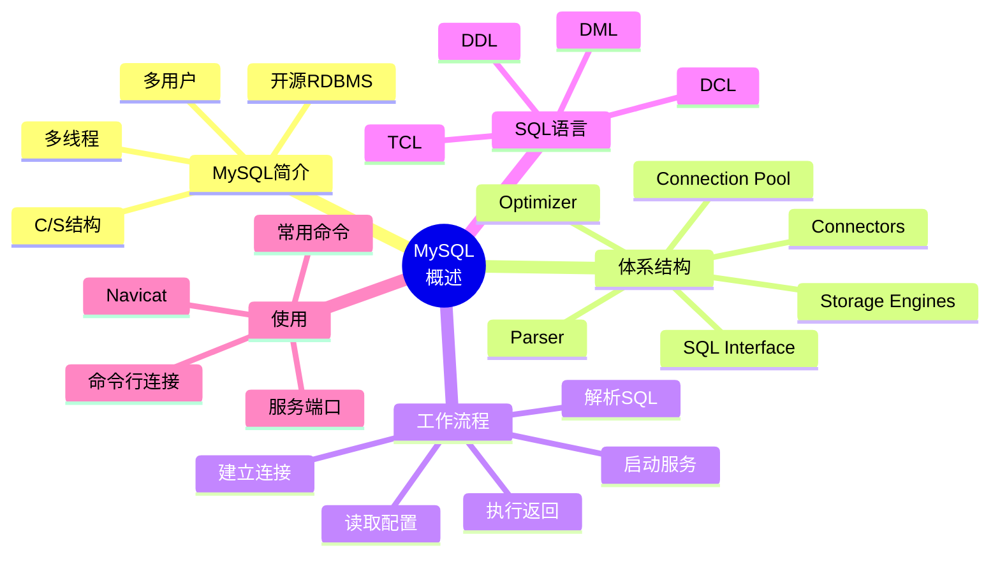

# 第 4 章 MySQL 概述

## 本章知识图谱



## 4.1 MySQL 简介

MySQL 是一款基于客户机/服务器 C/S 架构的关系数据库管理系统，支持多用户、多线程，常用于 Web 应用、企业系统和教学实验。

MySQL 特点：

- 开源生态成熟，安装和使用门槛低。
- 支持多种操作系统，如 Windows、Linux、macOS。
- 支持多种连接方式，如 TCP/IP、ODBC、JDBC。
- 支持标准 SQL 的主要能力，并有 MySQL 自身扩展。
- 支持插件式存储引擎，不同表可以选择不同存储引擎。
- 有命令行客户端和图形化工具，如 MySQL Workbench、Navicat、SQLyog。

## MySQL 体系结构

MySQL 可从上到下理解为“连接层、SQL 层、存储引擎层、文件系统层”。

| 组件 | 作用 |
| --- | --- |
| Connectors | 各种语言和工具与 MySQL 交互的接口，如 JDBC、ODBC、Python 驱动 |
| Management Services & Utilities | 系统管理、备份、恢复、复制、权限等工具 |
| Connection Pool | 管理客户端连接、认证、线程等 |
| SQL Interface | 接收 SQL 命令并返回结果 |
| Parser | 解析 SQL，检查语法和基本语义 |
| Optimizer | 选择较优查询执行计划 |
| Cache & Buffer | 缓冲数据页、索引页或中间结果 |
| Storage Engines | 负责表数据的具体存储、索引、锁和事务支持 |
| File System | 最终在操作系统文件中存储数据 |

复习重点：MySQL 的存储引擎是插件式的。`InnoDB` 支持事务和外键，是常用默认选择；`MyISAM` 偏读多写少，不支持事务。

## 4.2 MySQL 工作流程

典型工作流程：

1. 操作系统用户启动 MySQL 服务。
2. MySQL 服务启动时读取配置文件，如 `my.ini` 或 `my.cnf`。
3. 根据配置和默认参数生成 MySQL 服务实例进程。
4. 服务进程派生多个线程，为多个客户端提供服务。
5. 客户端通过主机、端口、用户名、密码建立连接。
6. 用户通过客户端发送 MySQL 命令或 SQL 语句。
7. 服务器解析、优化并执行请求。
8. 执行结果沿连接返回给客户端。
9. 客户端退出，连接断开。

一个 SQL 查询在服务器内部大致经历：

```text
客户端SQL -> 连接与权限检查 -> 解析器 -> 优化器 -> 执行器 -> 存储引擎 -> 返回结果
```

## 4.3 MySQL 系统构成

### 服务器、实例与数据库

- MySQL 服务器：安装并运行 MySQL 服务的主机系统。
- MySQL 实例：一组 MySQL 后台线程和内存结构，对外监听端口。
- MySQL 数据库：实例中由表、视图、索引、存储过程等对象组成的命名空间。

同一台服务器可以运行多个 MySQL 实例，不同实例通常通过不同端口区分。

### 客户程序与工具

常见命令行工具：

| 工具 | 用途 |
| --- | --- |
| `mysql` | 交互式 SQL 客户端 |
| `mysqladmin` | 管理服务器，如检查状态、修改密码 |
| `mysqldump` | 逻辑备份导出 |
| `mysqlcheck` | 检查、修复、分析表 |
| `mysqlshow` | 查看库、表、列信息 |

## 4.4 SQL 语言

SQL Structured Query Language，是关系数据库的标准语言。用户通过 SQL 向 DBMS 发出请求，DBMS 执行后返回结果。

### SQL 分类

| 类型 | 全称 | 典型语句 | 作用 |
| --- | --- | --- | --- |
| DDL | Data Definition Language | `CREATE`、`ALTER`、`DROP` | 定义数据库对象 |
| DML | Data Manipulation Language | `INSERT`、`UPDATE`、`DELETE`、`SELECT` | 操作数据 |
| DCL | Data Control Language | `GRANT`、`REVOKE` | 控制权限 |
| TCL | Transaction Control Language | `COMMIT`、`ROLLBACK`、`SET TRANSACTION` | 控制事务 |

注意：不同教材会把 `SELECT` 单独称为 DQL，也有教材把它归入 DML。

## 4.5 MySQL 服务器和端口号

端口号用于区分主机上运行的网络服务。MySQL 默认端口号是 `3306`。

同一主机运行多个 MySQL 服务实例时，要使用不同端口。

常见连接参数：

| 参数 | 含义 |
| --- | --- |
| `-h` 或 `--host` | 服务器地址 |
| `-u` 或 `--user` | 用户名 |
| `-p` 或 `--password` | 密码，通常不直接写明密码 |
| `-P` 或 `--port` | 端口号，注意是大写 `P` |
| `-D` 或 `--database` | 登录后默认打开的数据库 |
| `--prompt` | 设置命令行提示符 |
| `--delimiter` | 指定语句分隔符 |

常见登录：

```bash
mysql -u root -p
mysql -u root -p -P 3306
mysql -h 127.0.0.1 -u root -p -P 3306
mysql -h 127.0.0.1 -u root -p -P 3306 -D jxgl
```

退出：

```sql
exit;
quit;
```

## 4.6 启动和停止 MySQL 服务

Windows 服务方式：

```powershell
services.msc
```

在服务列表中找到 MySQL 服务，如 `mysql57`、`mysql80`，右键启动、停止或重启。

命令行方式：

```powershell
net start mysql57
net stop mysql57
```

实际服务名以安装时配置为准。

## 查看 MySQL 配置和状态

登录后查看状态：

```sql
status;
\s
```

查看变量：

```sql
SHOW VARIABLES;
SHOW VARIABLES LIKE 'port';
SHOW VARIABLES LIKE 'character_set%';
SHOW VARIABLES LIKE 'storage_engine';
```

查看版本：

```sql
SELECT VERSION();
```

## 4.7 Navicat 与图形化工具

Navicat 是图形化 MySQL 管理工具，典型操作流程：

1. 新建 MySQL 连接。
2. 填写主机、端口、用户名、密码。
3. 测试连接。
4. 双击连接打开数据库。
5. 新建查询，输入 SQL，点击运行。

图形化工具适合浏览库表结构、执行 SQL、导入导出数据。但考试和上机仍应掌握命令行和 SQL 本身。

## MySQL 语句规范

建议约定：

- SQL 关键字和函数名大写，如 `SELECT`、`CREATE TABLE`、`COUNT`。
- 数据库名、表名、字段名小写，如 `student`、`course_id`。
- 一条语句以分号结尾。
- 字符串使用单引号。
- 表名和字段名避免使用保留字。
- 多表查询时使用别名，提高可读性。

示例：

```sql
SELECT s.sno, s.sname, sc.grade
FROM student AS s
JOIN sc AS sc ON s.sno = sc.sno
WHERE sc.grade >= 60
ORDER BY sc.grade DESC;
```

## 常用命令速查

```sql
-- 查看版本
SELECT VERSION();

-- 查看当前用户
SELECT USER();

-- 查看当前数据库
SELECT DATABASE();

-- 查看数据库
SHOW DATABASES;

-- 切换数据库
USE jxgl;

-- 查看当前库中的表
SHOW TABLES;

-- 查看表结构
DESC student;
DESCRIBE student;

-- 查看建表语句
SHOW CREATE TABLE student;

-- 查看服务器状态
STATUS;
```

## 本章易错点

- `-p` 表示密码，`-P` 表示端口，大小写不能混。
- MySQL 服务器、实例、数据库不是同一个概念。
- SQL 不是某个 DBMS 私有语言，但各 DBMS 都有自己的扩展。
- 图形化工具只是客户端，真正执行 SQL 的仍是 MySQL 服务器。
- 配置文件如 `my.ini` 或 `my.cnf` 会影响实例启动参数。

## 自测题

1. MySQL 的 C/S 架构中，客户端和服务器分别负责什么？
2. SQL 解析器和优化器分别做什么？
3. DDL、DML、DCL、TCL 各举两个语句。
4. 如何指定 IP、端口、用户连接 MySQL？
5. `status`、`SHOW VARIABLES`、`SELECT VERSION()` 分别能查看什么？

