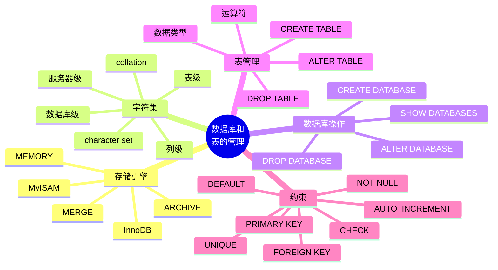

# 第 5 章 数据库和表的管理

## 本章知识图谱



## 5.1 MySQL 存储引擎

存储引擎可以理解为表的“发动机”，决定一张表的数据如何存、如何读、如何加锁、是否支持事务和外键。MySQL 的存储引擎是插件式、表级别选择的。

查看存储引擎：

```sql
SHOW ENGINES;
SHOW ENGINES \G
SHOW VARIABLES LIKE 'have%';
SHOW VARIABLES LIKE 'storage_engine';
SHOW VARIABLES LIKE 'default_storage_engine';
```

指定或修改存储引擎：

```sql
CREATE TABLE emp (
  id INT PRIMARY KEY,
  name VARCHAR(50)
) ENGINE = InnoDB;

ALTER TABLE emp ENGINE = InnoDB;

SHOW TABLE STATUS LIKE 'emp' \G
```

### InnoDB

InnoDB 是 MySQL 常用默认引擎，适合大多数业务系统。

特点：

- 支持事务、提交、回滚和崩溃恢复。
- 支持外键。
- 支持行级锁，适合高并发更新。
- 使用缓冲池缓存数据页和索引页。
- 使用 B+Tree 组织索引。
- 支持 MVCC 多版本并发控制。

适用场景：

- 数据一致性要求高。
- 需要事务。
- 更新频繁。
- 并发访问较多。

### MyISAM

MyISAM 是 MySQL 5.5 之前的默认引擎，不支持事务和外键。

特点：

- 表通常由 `.frm`、`.MYD`、`.MYI` 文件组成。
- 支持全文索引。
- 查询速度较快，空间占用相对小。
- 使用表级锁，写入并发能力差。
- 不支持事务，回滚不具备原子性。

适用场景：

- 读多写少。
- 不需要事务。
- 数据一致性要求不高。
- 历史数据或简单查询系统。

### MEMORY

MEMORY 引擎把数据放在内存中。

特点：

- 速度快。
- 表结构保存在磁盘中，数据保存在内存中。
- 数据库重启或崩溃后数据丢失。
- 适合临时表或对安全性要求低的快速访问数据。

### MERGE、CSV、ARCHIVE、BLACKHOLE

| 引擎 | 特点 | 适用场景 |
| --- | --- | --- |
| MERGE | 一组结构相同 MyISAM 表的逻辑组合 | 分表汇总查询 |
| CSV | 以 CSV 格式保存数据，不支持索引 | 与外部报表交换 |
| ARCHIVE | 压缩存储历史数据，适合少访问 | 日志归档、历史数据 |
| BLACKHOLE | 写入即丢弃，可记录 binlog | 测试、复制中转、性能测量 |

### B-Tree、B+Tree 与 Hash

| 索引结构 | 优点 | 限制 |
| --- | --- | --- |
| Hash | 等值查找快，理论上可接近 $O(1)$ | 不支持范围查询、排序、前缀匹配 |
| B-Tree/B+Tree | 支持等值、范围、排序、前缀匹配 | 更新维护有成本 |

B+Tree 更适合外存索引，因为非叶子节点可以保存更多键，树更矮，叶子节点顺序链接，范围查询效率高。

## 5.2 字符集与校对规则

字符集 character set 定义字符及其编码方式。校对规则 collation 定义字符串比较和排序规则。

二者关系：

- 一个字符集可以对应多个校对规则。
- 每个字符集有默认校对规则。
- 不同字符集不能共享同一个校对规则。

查看字符集：

```sql
SHOW CHARACTER SET;
SHOW CHARACTER SET LIKE 'utf8%';
SHOW CHARACTER SET WHERE Charset = 'utf8';

USE information_schema;
SELECT * FROM CHARACTER_SETS;
```

查看校对规则：

```sql
SHOW COLLATION WHERE Charset = 'utf8';

USE information_schema;
SELECT *
FROM COLLATIONS
WHERE CHARACTER_SET_NAME = 'utf8';
```

查看当前连接和服务器字符集：

```sql
SHOW VARIABLES LIKE 'character_set%';
SHOW VARIABLES LIKE 'collation%';
```

### 字符集选择

选择因素：

- 应用需要支持哪些语言。
- 是否需要兼容已有数据。
- 存储空间和网络传输成本。
- 排序、比较等字符运算性能。
- 客户端编码是否统一。

实践建议：

- 新系统一般使用 `utf8mb4`，能完整支持 Unicode 字符，包括 emoji。
- 历史教材可能写 `utf8`，MySQL 中 `utf8` 常指 `utf8mb3`，生产中更推荐 `utf8mb4`。
- 中文大量文本且只需中文环境时，历史上可考虑 `gbk`，但通用性不如 `utf8mb4`。

### 字符集层级

MySQL 字符集和校对规则可在多个级别设置：

1. 服务器级。
2. 数据库级。
3. 表级。
4. 列级。
5. 连接级。

数据库级设置：

```sql
CREATE DATABASE db_name
  DEFAULT CHARACTER SET utf8mb4
  DEFAULT COLLATE utf8mb4_general_ci;

ALTER DATABASE db_name
  DEFAULT CHARACTER SET utf8mb4
  DEFAULT COLLATE utf8mb4_general_ci;

SHOW CREATE DATABASE db_name;
```

表级设置：

```sql
CREATE TABLE t (
  name VARCHAR(50)
) DEFAULT CHARSET = utf8mb4
  COLLATE = utf8mb4_general_ci;

ALTER TABLE t
  DEFAULT CHARACTER SET utf8mb4
  COLLATE utf8mb4_general_ci;

SHOW CREATE TABLE t;
```

注意：修改数据库或表的默认字符集，不会自动把已有数据转换为新字符集。

## 5.3 数据库操作管理

创建数据库：

```sql
CREATE DATABASE db_name;

CREATE DATABASE IF NOT EXISTS jxgl
  DEFAULT CHARACTER SET utf8mb4
  DEFAULT COLLATE utf8mb4_general_ci;
```

查看数据库：

```sql
SHOW DATABASES;
SHOW CREATE DATABASE jxgl;
SELECT DATABASE();
```

选择数据库：

```sql
USE jxgl;
```

修改数据库默认字符集：

```sql
ALTER DATABASE jxgl
  DEFAULT CHARACTER SET utf8mb4
  DEFAULT COLLATE utf8mb4_general_ci;
```

删除数据库：

```sql
DROP DATABASE jxgl;
DROP DATABASE IF EXISTS jxgl;
```

删除数据库会删除其中所有对象和数据，复习时要特别注意。

## 5.4 表的基本概念

表是数据库中存储数据的基本单位，由字段组成。每个字段需要指定数据类型，并可以附加约束。

设计表时要考虑：

- 表表达的是实体还是联系。
- 字段是否原子。
- 字段类型是否合适。
- 是否需要主键、唯一约束、外键。
- 是否需要默认值、非空、检查约束。
- 是否需要索引。

## 5.5 数据类型

选择合适的数据类型可以节省存储空间、提升计算和检索性能，并增强约束表达能力。

### 数值类型

整数类型：

| 类型 | 说明 |
| --- | --- |
| `TINYINT` | 很小整数，常用于状态、布尔标志 |
| `SMALLINT` | 小整数 |
| `MEDIUMINT` | 中等整数 |
| `INT` / `INTEGER` | 普通整数 |
| `BIGINT` | 大整数 |

小数类型：

| 类型 | 说明 | 使用建议 |
| --- | --- | --- |
| `FLOAT` | 单精度浮点数 | 科学计算近似值 |
| `DOUBLE` | 双精度浮点数 | 更高精度近似值 |
| `DECIMAL(M,D)` | 定点数 | 金额、财务、要求精确的小数 |

`M` 表示总位数，`D` 表示小数位数。例如：

```sql
CREATE TABLE t_temp (
  c1 FLOAT(10,2),
  c2 DECIMAL(10,2)
);
```

选择原则：

- 能用小类型就不用大类型，如年龄可用 `TINYINT UNSIGNED`。
- 金额优先使用 `DECIMAL`，不要用 `FLOAT`。
- 纯整数不要用字符串保存。

### 日期时间类型

| 类型 | 默认格式 | 说明 |
| --- | --- | --- |
| `DATE` | `YYYY-MM-DD` | 日期 |
| `TIME` | `HH:MM:SS` | 时间 |
| `YEAR` | `YYYY` | 年份 |
| `DATETIME` | `YYYY-MM-DD HH:MM:SS` | 日期和时间 |
| `TIMESTAMP` | `YYYY-MM-DD HH:MM:SS` | 时间戳，受时区和范围影响 |

常见用途：

- 出生日期：`DATE`。
- 记录创建时间、修改时间：`DATETIME` 或 `TIMESTAMP`。
- 只保存年份：`YEAR`。

### 字符串类型

| 类型 | 说明 | 注意 |
| --- | --- | --- |
| `CHAR(n)` | 定长字符串 | 速度快，可能浪费空间，尾部空格处理特殊 |
| `VARCHAR(n)` | 变长字符串 | 节省空间，适合大多数字段 |
| `TEXT` | 大文本 | 不能有普通默认值，检索效率低于短字符串 |
| `BLOB` | 二进制大对象 | 存图片、文件等二进制数据 |
| `ENUM` | 枚举，单选 | 底层以整数序号保存 |
| `SET` | 集合，多选 | 可选多个预定义值 |

`CHAR(n)` 和 `VARCHAR(n)` 中的 `n` 表示字符数，不是字节数。

`CHAR` 与 `VARCHAR`：

| 对比 | `CHAR` | `VARCHAR` |
| --- | --- | --- |
| 长度 | 固定 | 可变 |
| 空间 | 可能浪费 | 更省 |
| 速度 | 通常较快 | 通常稍慢 |
| 适合 | 固定长度，如性别码、状态码 | 变长文本，如姓名、邮箱 |

`ENUM` 示例：

```sql
CREATE TABLE t_sex (
  sex ENUM('男', '女', '保密')
);
```

`SET` 示例：

```sql
CREATE TABLE hobby (
  fav SET('唱歌', '跳舞', '下棋', '玩游戏')
);
```

## 5.6 运算符

常见运算符：

| 类型 | 运算符 |
| --- | --- |
| 算术 | `+`、`-`、`*`、`/`、`DIV`、`%`、`MOD` |
| 比较 | `=`、`<>`、`!=`、`>`、`>=`、`<`、`<=`、`<=>` |
| 逻辑 | `AND`、`OR`、`NOT`、`XOR` |
| 范围 | `BETWEEN ... AND ...` |
| 集合 | `IN`、`NOT IN` |
| 空值 | `IS NULL`、`IS NOT NULL` |
| 模式匹配 | `LIKE`、`REGEXP` |

空值比较要用 `IS NULL`，不能写 `= NULL`。

## 5.7 表的操作

### 创建表

基本语法：

```sql
CREATE TABLE [IF NOT EXISTS] table_name (
  column_name data_type [column_constraint],
  ...
  [table_constraint]
) ENGINE = InnoDB
  DEFAULT CHARSET = utf8mb4;
```

示例：

```sql
CREATE TABLE IF NOT EXISTS employee (
  id SMALLINT UNSIGNED PRIMARY KEY AUTO_INCREMENT,
  username VARCHAR(20) NOT NULL UNIQUE,
  age TINYINT UNSIGNED,
  sex ENUM('男', '女', '保密') DEFAULT '保密',
  email VARCHAR(50),
  addr VARCHAR(200),
  birth YEAR,
  salary DECIMAL(8,2),
  tel VARCHAR(20),
  married TINYINT(1) COMMENT '0代表未结婚，1代表结婚'
) ENGINE = InnoDB
  DEFAULT CHARSET = utf8mb4;
```

### 查看表

```sql
SHOW TABLES;
DESC employee;
DESCRIBE employee;
SHOW CREATE TABLE employee;
```

### 修改表

重命名表：

```sql
ALTER TABLE employee RENAME TO reg_user;
RENAME TABLE reg_user TO employee;
```

添加字段：

```sql
ALTER TABLE employee ADD card CHAR(18);

ALTER TABLE employee
  ADD testcol1 VARCHAR(100) NOT NULL UNIQUE;

ALTER TABLE employee
  ADD testcol3 INT NOT NULL DEFAULT 100 AFTER username;

ALTER TABLE employee
  ADD col_a INT FIRST,
  ADD col_b VARCHAR(30) AFTER username;
```

删除字段：

```sql
ALTER TABLE employee DROP card;

ALTER TABLE employee
  DROP col_a,
  DROP col_b;
```

修改字段类型或约束：

```sql
ALTER TABLE employee MODIFY email VARCHAR(200);

ALTER TABLE employee
  MODIFY testcol CHAR(32) NOT NULL DEFAULT '123' FIRST;
```

修改字段名称：

```sql
ALTER TABLE employee
  CHANGE old_name new_name VARCHAR(50) NOT NULL;
```

添加和删除默认值：

```sql
ALTER TABLE employee ALTER age SET DEFAULT 18;
ALTER TABLE employee ALTER age DROP DEFAULT;
```

修改存储引擎：

```sql
ALTER TABLE employee ENGINE = InnoDB;
```

设置自增长起始值：

```sql
ALTER TABLE employee AUTO_INCREMENT = 1000;
```

复制表：

```sql
-- 只复制结构
CREATE TABLE employee_copy LIKE employee;

-- 复制查询结果形成新表
CREATE TABLE employee_backup AS
SELECT * FROM employee;
```

删除表：

```sql
DROP TABLE employee;
DROP TABLE IF EXISTS employee;
```

清空表：

```sql
TRUNCATE TABLE employee;
```

## 5.8 MySQL 约束控制

约束用于保证数据完整性。

| 约束 | 作用 |
| --- | --- |
| `NOT NULL` | 字段不能为空 |
| `DEFAULT` | 指定默认值 |
| `PRIMARY KEY` | 主键，唯一且非空 |
| `UNIQUE` | 唯一约束，可保证字段值不重复 |
| `FOREIGN KEY` | 外键，保证参照完整性 |
| `CHECK` | 检查约束，限制取值范围 |
| `AUTO_INCREMENT` | 自动增长，常与整数主键配合 |

主键示例：

```sql
CREATE TABLE student (
  sno CHAR(10) PRIMARY KEY,
  sname VARCHAR(30) NOT NULL
);
```

复合主键示例：

```sql
CREATE TABLE sc (
  sno CHAR(10),
  cno CHAR(10),
  grade DECIMAL(5,2),
  PRIMARY KEY (sno, cno)
);
```

唯一约束示例：

```sql
CREATE TABLE user_account (
  id INT PRIMARY KEY AUTO_INCREMENT,
  username VARCHAR(50) NOT NULL UNIQUE,
  email VARCHAR(100) UNIQUE
);
```

外键示例：

```sql
CREATE TABLE class (
  class_id INT PRIMARY KEY,
  class_name VARCHAR(50) NOT NULL
);

CREATE TABLE student (
  sno CHAR(10) PRIMARY KEY,
  sname VARCHAR(30) NOT NULL,
  class_id INT,
  CONSTRAINT fk_student_class
    FOREIGN KEY (class_id)
    REFERENCES class(class_id)
);
```

外键动作：

```sql
ON DELETE CASCADE
ON UPDATE CASCADE
ON DELETE SET NULL
ON UPDATE RESTRICT
```

## 本章易错点

- 存储引擎是表级别的，不是只能全库统一。
- `InnoDB` 支持事务和外键，`MyISAM` 不支持。
- 修改默认字符集不会自动转换已有数据。
- `DECIMAL` 适合金额，`FLOAT`/`DOUBLE` 是近似值。
- `CHAR(n)` 和 `VARCHAR(n)` 的 `n` 是字符数，不是字节数。
- `DROP TABLE` 删除表结构和数据，`TRUNCATE` 保留表结构但清空数据。
- 外键字段类型和被引用字段类型应一致或兼容。

## 自测题

1. InnoDB 和 MyISAM 的核心区别是什么？
2. 字符集和校对规则分别解决什么问题？
3. 为什么金额字段不建议用 `FLOAT`？
4. `CHAR` 和 `VARCHAR` 如何选择？
5. `ALTER TABLE ... MODIFY` 和 `CHANGE` 有什么区别？
6. 主键、唯一约束、外键分别保证哪类完整性？

