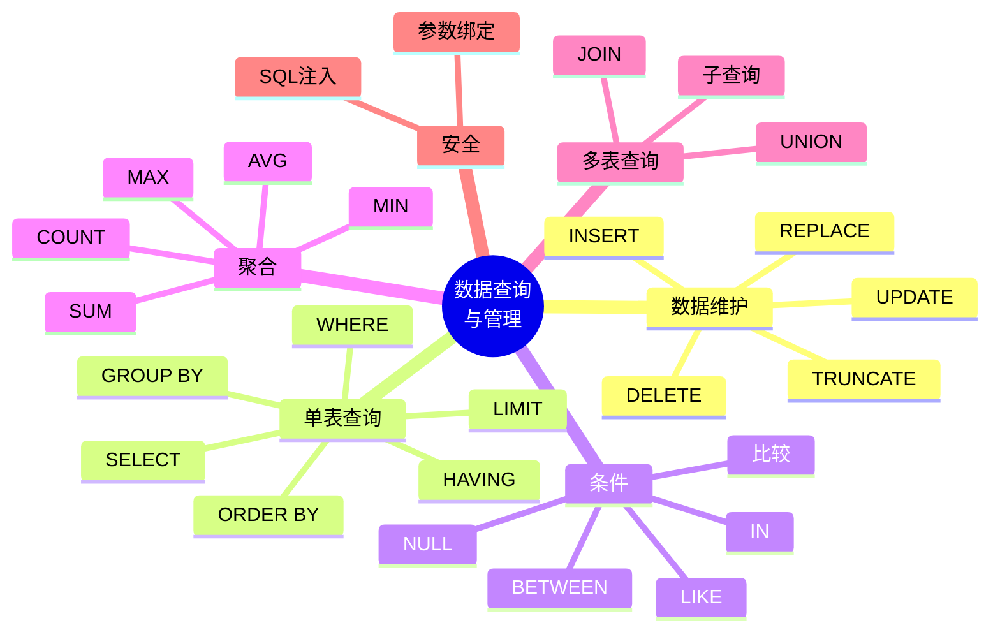

# 第 6 章 数据查询与管理

## 本章知识图谱



## 6.1 插入数据

插入数据使用 `INSERT`。课件中的示例表：

```sql
CREATE TABLE IF NOT EXISTS vipuser (
  id TINYINT UNSIGNED AUTO_INCREMENT PRIMARY KEY,
  username VARCHAR(20) NOT NULL UNIQUE,
  password CHAR(32) NOT NULL,
  email VARCHAR(50) NOT NULL DEFAULT 'lisan@xxu.edu.cn',
  age TINYINT UNSIGNED DEFAULT 18
);
```

### 不指定字段名插入

```sql
INSERT INTO vipuser
VALUES (1, 'CAUE', '123', 'CAUE@QQ.COM', 20);

INSERT vipuser
VALUE (2, 'CAUW', '456', 'CAUW@QQ.COM', 30);
```

要求：

- 值的数量和表字段数量一致。
- 值的顺序和表定义字段顺序一致。
- 不推荐在真实项目中依赖字段顺序，表结构变化后容易出错。

### 指定字段名插入

```sql
INSERT INTO vipuser(username, password)
VALUES ('A', 'AAA');

INSERT INTO vipuser(password, username)
VALUES ('BBB', 'B');
```

优点：

- 字段顺序可自定义。
- 没有赋值的字段使用默认值或自动增长值。
- 可读性和稳定性更好。

### 一次插入多条记录

```sql
INSERT INTO vipuser
VALUES
  (6, 'D', 'DDD', 'D@QQ.COM', 35),
  (8, 'E', 'EEE', 'E@QQ.COM', 9),
  (18, 'F', 'FFF', 'F@QQ.COM', 32);
```

批量插入通常比多次单行插入快。

### 使用 SET 形式插入

```sql
INSERT INTO vipuser
SET id = 98,
    username = 'test',
    password = 'abcd',
    email = '123@qq.com',
    age = 48;
```

这种写法是 MySQL 扩展，可读性强，但可移植性不如标准 `VALUES`。

### 插入查询结果

```sql
CREATE TABLE IF NOT EXISTS t_testuser (
  id TINYINT UNSIGNED AUTO_INCREMENT PRIMARY KEY,
  username VARCHAR(20) NOT NULL UNIQUE
);

INSERT INTO t_testuser(id, username)
SELECT id, username
FROM vipuser
WHERE age >= 18;
```

要求：

- 查询结果字段数与目标字段数一致。
- 数据类型要兼容。
- `INSERT INTO t_testuser SELECT * FROM vipuser` 会因列数不匹配报错。

### REPLACE

```sql
REPLACE INTO vipuser
VALUES (99, '贾玲', '123', 'jialing@qq.com', 20);
```

`REPLACE` 的逻辑：

- 如果新行不存在，插入新行。
- 如果主键或唯一键冲突，先删除旧行，再插入新行。

注意：`REPLACE` 不是普通更新，它可能触发删除和插入相关影响。

## 6.2 修改数据

修改数据使用 `UPDATE`。

```sql
UPDATE 表名
SET 字段名1 = 取值1,
    字段名2 = 取值2
WHERE 条件表达式;
```

示例：

```sql
UPDATE vipuser
SET password = 'caue123',
    email = '123@qq.com',
    age = 99
WHERE id = 1;

UPDATE vipuser
SET age = DEFAULT
WHERE username = 'E';
```

重要警告：不写 `WHERE` 会更新全表。

```sql
-- 危险：更新所有记录
UPDATE vipuser SET age = 18;
```

## 6.3 删除数据

### DELETE

```sql
DELETE FROM t_testuser
WHERE id = 1;
```

不写 `WHERE` 会删除表中所有数据。

### TRUNCATE

```sql
TRUNCATE TABLE t_testuser;
```

### DELETE、TRUNCATE、DROP 对比

| 语句 | 删除数据 | 删除表结构 | 是否释放空间 | 常见用途 |
| --- | --- | --- | --- | --- |
| `DELETE` | 是 | 否 | 通常不立即释放 | 按条件删除 |
| `TRUNCATE` | 是，整表 | 否 | 通常释放 | 快速清空表 |
| `DROP TABLE` | 是 | 是 | 是 | 删除表对象 |

## 6.4 SELECT 单表查询

基本语法：

```sql
SELECT [ALL | DISTINCT] select_expr [, select_expr ...]
FROM table_references
[WHERE 条件]
[GROUP BY col_name [, col_name ...]]
[HAVING 分组条件]
[ORDER BY col_name [ASC | DESC] [, col_name [ASC | DESC] ...]]
[LIMIT {[offset,] row_count | row_count OFFSET offset_value}];
```

### 子句执行逻辑

复习时要区分书写顺序和逻辑执行顺序。

```text
FROM -> WHERE -> GROUP BY -> HAVING -> SELECT -> DISTINCT -> ORDER BY -> LIMIT
```

### SELECT 子句

```sql
SELECT * FROM student;

SELECT sno, sname, sdept
FROM student;

SELECT sname AS '姓名', sdept AS '所在系'
FROM student;

SELECT DISTINCT sdept
FROM student;
```

`DISTINCT` 用于消除重复行。

### WHERE 条件查询

比较运算：

```sql
SELECT *
FROM student
WHERE sage >= 18;
```

逻辑运算：

```sql
SELECT *
FROM student
WHERE sdept = 'CS' AND sage >= 18;
```

范围：

```sql
SELECT *
FROM student
WHERE sage BETWEEN 18 AND 22;
```

集合：

```sql
SELECT *
FROM student
WHERE sdept IN ('CS', 'IS', 'MA');
```

空值：

```sql
SELECT *
FROM student
WHERE email IS NULL;
```

模糊匹配：

```sql
SELECT *
FROM student
WHERE sname LIKE '张%';
```

`LIKE` 通配符：

| 通配符 | 含义 |
| --- | --- |
| `%` | 任意长度字符串 |
| `_` | 任意单个字符 |

### GROUP BY 与 HAVING

`GROUP BY` 按字段分组，通常与聚合函数一起使用。

```sql
SELECT sdept, COUNT(*) AS student_count
FROM student
GROUP BY sdept;
```

`HAVING` 对分组结果筛选：

```sql
SELECT sdept, COUNT(*) AS student_count
FROM student
GROUP BY sdept
HAVING COUNT(*) >= 10;
```

`WHERE` 与 `HAVING`：

| 子句 | 作用对象 | 是否可用聚合函数 |
| --- | --- | --- |
| `WHERE` | 分组前的行 | 通常不能直接使用聚合函数 |
| `HAVING` | 分组后的组 | 可以使用聚合函数 |

### ORDER BY

```sql
SELECT *
FROM student
ORDER BY zno ASC, sno DESC;
```

`ASC` 升序，默认；`DESC` 降序。

### LIMIT

```sql
-- 从第 3 行开始取 3 行，偏移量从 0 开始
SELECT *
FROM student
ORDER BY sno
LIMIT 2, 3;

SELECT *
FROM student
ORDER BY sno
LIMIT 3 OFFSET 2;
```

## 聚合函数

| 函数 | 功能 | NULL 处理 |
| --- | --- | --- |
| `COUNT(*)` | 统计行数 | 包括含 NULL 的行 |
| `COUNT(col)` | 统计该列非 NULL 值数量 | 忽略 NULL |
| `SUM(col)` | 求和 | 忽略 NULL，全 NULL 返回 NULL |
| `AVG(col)` | 平均值 | 忽略 NULL |
| `MAX(col)` | 最大值 | 忽略 NULL |
| `MIN(col)` | 最小值 | 忽略 NULL |

示例：

```sql
SELECT zno, COUNT(*) AS '专业人数'
FROM student
GROUP BY zno;

SELECT sno, SUM(grade) AS total_grade
FROM sc
GROUP BY sno;

SELECT cno, AVG(grade) AS avg_grade
FROM sc
GROUP BY cno;
```

## 多表查询

### 内连接

```sql
SELECT s.sno, s.sname, sc.cno, sc.grade
FROM student AS s
INNER JOIN sc AS sc ON s.sno = sc.sno;
```

### 左外连接

```sql
SELECT s.sno, s.sname, sc.cno, sc.grade
FROM student AS s
LEFT JOIN sc AS sc ON s.sno = sc.sno;
```

左连接保留左表所有行，右表无匹配时以 `NULL` 填充。

### 自连接

自连接用于同一张表内部比较。

```sql
SELECT e.name AS employee_name, m.name AS manager_name
FROM employee AS e
LEFT JOIN employee AS m ON e.manager_id = m.id;
```

## 子查询

### IN 子查询

```sql
SELECT *
FROM student
WHERE sno IN (
  SELECT sno
  FROM sc
  WHERE cno = 'C001'
);
```

### EXISTS 子查询

```sql
SELECT *
FROM student AS s
WHERE EXISTS (
  SELECT 1
  FROM sc
  WHERE sc.sno = s.sno
);
```

### ANY 与 ALL

```sql
SELECT *
FROM sc
WHERE grade > ANY (
  SELECT grade FROM sc WHERE cno = 'C001'
);

SELECT *
FROM sc
WHERE grade > ALL (
  SELECT grade FROM sc WHERE cno = 'C001'
);
```

`ANY` 表示至少满足一个，`ALL` 表示满足所有。

## UNION

```sql
SELECT sno FROM student WHERE sdept = 'CS'
UNION
SELECT sno FROM student WHERE sdept = 'IS';
```

`UNION` 默认去重，`UNION ALL` 不去重。

两个查询的列数和类型需要兼容。

## 参数与 SQL 注入

课件中提到类似：

```sql
SELECT * FROM user WHERE name = '$aa' AND password = '$bb';
```

如果直接拼接用户输入，可能产生 SQL 注入。

危险示例：

```text
table_name = user; delete user; --
```

拼接后可能变成：

```sql
SELECT * FROM user; DELETE user; -- WHERE name = ?;
```

安全做法：

- 使用预编译语句。
- 使用参数绑定。
- 表名、排序字段等无法参数化的位置必须白名单校验。

在 MyBatis 中：

- `#{name}` 通常是参数绑定，安全性较好。
- `${table_name}` 是字符串替换，必须白名单校验。

## 本章易错点

- `UPDATE` 和 `DELETE` 忘记 `WHERE` 会影响全表。
- `TRUNCATE` 是清空整表，不支持按条件删除。
- `COUNT(*)` 和 `COUNT(col)` 对 NULL 的处理不同。
- `WHERE` 在分组前筛选，`HAVING` 在分组后筛选。
- `LIMIT` 偏移量从 0 开始。
- `UNION` 默认去重，`UNION ALL` 不去重。
- 动态 SQL 中 `${}` 形式容易引入 SQL 注入。

## 自测题

1. `INSERT INTO ... SELECT ...` 需要满足什么条件？
2. `REPLACE` 与 `INSERT` 有什么区别？
3. `DELETE`、`TRUNCATE`、`DROP TABLE` 的区别是什么？
4. 写出 SQL 查询的逻辑执行顺序。
5. `WHERE` 与 `HAVING` 的区别是什么？
6. 为什么 `COUNT(col)` 可能小于 `COUNT(*)`？
7. 如何防止 SQL 注入？

