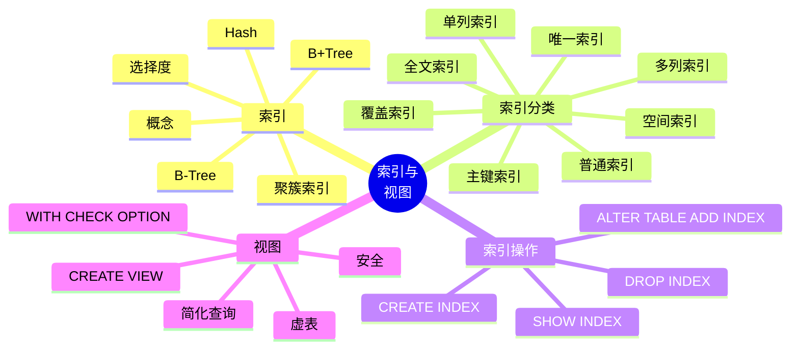

# 第 7 章 索引与视图

## 本章知识图谱



## 7.1 索引概述

索引是对数据库表中一个或多个字段的值进行排序或组织而创建的数据结构，用于加速数据检索。

通俗理解：

```text
没有索引：一行一行全表扫描
有索引：先按索引定位候选行，再访问数据行
```

建立索引的目的：

- 加速数据检索。
- 加速连接、排序、分组。
- 帮助查询优化器选择更好的执行计划。
- 通过唯一索引强制数据唯一性。
- 减少 `ORDER BY`、`GROUP BY` 的排序代价。

## 索引结构

### Hash 索引

Hash 索引结构类似：

```text
Key: 列值
Value: 指向数据行的位置
```

优点：等值查找快。

缺点：

- 无序，不适合范围查询。
- 不适合排序。
- 不支持最左前缀匹配。
- 冲突处理会影响性能。

适合：

```sql
WHERE id = 1001
```

不适合：

```sql
WHERE id BETWEEN 1000 AND 2000
ORDER BY id
```

### B-Tree 与 B+Tree

B-Tree 和 B+Tree 都是多路平衡搜索树。数据库索引更常用 B+Tree。

B+Tree 适合数据库索引的原因：

- 树高低，磁盘 I/O 次数少。
- 非叶子节点只保存键和指针，能容纳更多键。
- 数据项集中在叶子节点。
- 叶子节点按键顺序连接，适合范围扫描。

磁盘访问时间大致由寻道时间、旋转延迟和传输时间组成，减少随机 I/O 是索引设计的重要目标。

### 聚簇索引与非聚簇索引

| 类型 | 含义 |
| --- | --- |
| 聚簇索引 | 数据行按索引键顺序存储，叶子节点通常就是数据页 |
| 非聚簇索引 | 索引结构与数据行分离，叶子节点保存行定位信息或主键 |

InnoDB 中主键索引是聚簇索引，二级索引叶子节点通常保存主键值。

### 索引的代价

索引不是越多越好。

缺点：

- 创建和维护索引需要时间。
- 索引占用额外物理空间。
- 插入、删除、更新时索引也要维护，降低写入速度。
- 不合适的索引可能被优化器忽略。

## 索引分类

| 类型 | 说明 |
| --- | --- |
| 普通索引 | 不附加唯一性限制，只加速查询 |
| 唯一索引 | 要求索引列值唯一 |
| 主键索引 | 特殊唯一索引，唯一且非空，一个表只能有一个 |
| 全文索引 | 用于文本全文检索 |
| 单列索引 | 只基于一个字段建立 |
| 多列索引 | 基于多个字段建立，也称复合索引 |
| 空间索引 | 用于空间数据类型，如 `GEOMETRY`、`POINT` |

唯一索引与主键索引：

- 一个表可以有多个唯一索引。
- 一个表只能有一个主键索引。
- 主键不能为 `NULL`，唯一索引列是否可为 `NULL` 取决于 DBMS 规则和字段定义。

## 7.2 索引操作

### 创建表时创建索引

```sql
CREATE TABLE t_test (
  id TINYINT UNSIGNED,
  username VARCHAR(20),
  INDEX idx_username(username)
);
```

唯一索引：

```sql
CREATE TABLE t_user (
  id TINYINT UNSIGNED AUTO_INCREMENT PRIMARY KEY,
  username VARCHAR(20) NOT NULL UNIQUE,
  card CHAR(18) NOT NULL,
  UNIQUE INDEX uni_card(card)
);
```

多列索引：

```sql
CREATE TABLE t_score (
  id INT PRIMARY KEY AUTO_INCREMENT,
  sno CHAR(10) NOT NULL,
  cno CHAR(10) NOT NULL,
  grade DECIMAL(5,2),
  INDEX idx_sno_cno(sno, cno)
);
```

全文索引：

```sql
CREATE TABLE article (
  id INT PRIMARY KEY AUTO_INCREMENT,
  title VARCHAR(100),
  content TEXT,
  FULLTEXT INDEX ft_content(content)
);
```

空间索引：

```sql
CREATE TABLE t_geo (
  id INT PRIMARY KEY AUTO_INCREMENT,
  location GEOMETRY NOT NULL,
  SPATIAL INDEX spa_location(location)
);
```

### 已有表上创建索引

```sql
CREATE INDEX idx_id ON t_test(id);

CREATE UNIQUE INDEX uni_username ON t_user(username);
```

### 使用 ALTER TABLE 创建索引

```sql
ALTER TABLE t_test
  ADD INDEX idx_username(username);

ALTER TABLE t_user
  ADD UNIQUE INDEX uni_card(card);

ALTER TABLE t_score
  ADD INDEX idx_sno_cno(sno, cno);
```

通过约束间接创建索引：

```sql
ALTER TABLE t_user
  ADD CONSTRAINT uni_card UNIQUE KEY (card);
```

### 查看索引

```sql
SHOW INDEX FROM t_user;
SHOW KEYS FROM t_user;
SHOW INDEX FROM db_name.t_user;
```

### 删除索引

```sql
DROP INDEX idx_username ON t_test;

ALTER TABLE t_test DROP INDEX idx_username;

ALTER TABLE t_user DROP PRIMARY KEY;
```

删除主键索引时不需要指定索引名，因为一个表最多只有一个主键。

## B+Tree 支持与限制

假设有复合索引：

```sql
INDEX idx_student(sname, ssex, sage)
```

### 最左匹配原则

可以使用索引：

```sql
WHERE sname = 'Elsa'

WHERE sname = 'Elsa' AND ssex = 'F'

WHERE sname = 'Elsa' AND ssex = 'F' AND sage = 19
```

不能充分使用索引：

```sql
WHERE sage = 19;

WHERE ssex = 'F';
```

原因：没有从 B+Tree 的最左属性开始匹配。

### 不能跳过中间属性

```sql
WHERE sname = 'Elsa' AND sage = 19;
```

通常只能利用 `sname` 部分，无法跳过 `ssex` 直接利用 `sage`。

### 函数或表达式可能破坏索引使用

```sql
WHERE 2026 - sage = 2003;
```

这种条件通常无法直接按 `sage` 索引查找，只能先按其他可用条件定位，再验证表达式。

更好的写法：

```sql
WHERE sage = 23;
```

### 范围条件之后的列

复合索引中，如果某列使用范围条件，其右侧列往往不能继续用于精确定位。

```sql
WHERE sname = 'Elsa'
  AND sage BETWEEN 18 AND 22
  AND ssex = 'F';
```

索引列顺序要结合等值、范围、排序和选择度设计。

## 覆盖索引

如果一个索引包含查询需要的全部属性，则称为覆盖索引。

```sql
-- 索引
INDEX idx_sno_cno_grade(sno, cno, grade)

-- 查询只用到索引中的列
SELECT cno, grade
FROM sc
WHERE sno = '20240001';
```

优势：

- 不需要回表。
- 索引项通常比完整元组小，访问量更少。
- 索引有序，可能减少排序。

## 7.3 索引设计原则

适合建立索引：

- 主键和外键。
- 经常作为查询条件的列。
- 经常参与连接的列。
- 经常排序或分组的列。
- 高选择度列。
- 可以形成覆盖索引的列组合。

不适合建立索引：

- 表很小。
- 列取值重复度很高，如只有男女。
- 经常更新的列。
- 很少用于查询条件的列。
- 已有复合索引可覆盖的冗余单列索引。

复合索引列顺序建议：

1. 常用于等值匹配的列靠前。
2. 选择度高的列靠前。
3. 范围查询列通常放在等值查询列之后。
4. 考虑 `ORDER BY` 和 `GROUP BY` 的列顺序。
5. 考虑覆盖查询所需字段。

## 7.4 视图概述

视图是由一个或多个基本表或其他视图导出的虚表。视图保存的是查询定义，通常不保存实际数据。

视图的作用：

- 简化复杂查询。
- 屏蔽底层表结构。
- 提供逻辑数据独立性。
- 限制用户只能看到部分行或部分列，提高安全性。
- 为不同用户提供不同数据视角。

视图与基本表：

| 对比 | 基本表 | 视图 |
| --- | --- | --- |
| 是否存储数据 | 是 | 通常否 |
| 来源 | 实际定义 | 查询结果定义 |
| 用途 | 存储事实 | 简化查询和控制访问 |
| 更新限制 | 直接更新 | 取决于视图定义 |

## 7.5 视图操作

### 创建视图

```sql
CREATE VIEW v_student_cs AS
SELECT sno, sname, sdept
FROM student
WHERE sdept = 'CS';
```

指定列名：

```sql
CREATE VIEW v_score(sno, course_no, score) AS
SELECT sno, cno, grade
FROM sc;
```

带检查选项：

```sql
CREATE VIEW v_student_cs AS
SELECT sno, sname, sdept
FROM student
WHERE sdept = 'CS'
WITH CHECK OPTION;
```

`WITH CHECK OPTION` 要求通过视图插入或更新的数据仍满足视图条件。

### 查询视图

```sql
SELECT *
FROM v_student_cs
WHERE sname LIKE '张%';
```

### 查看视图定义

```sql
SHOW CREATE VIEW v_student_cs;
```

### 修改视图

```sql
CREATE OR REPLACE VIEW v_student_cs AS
SELECT sno, sname
FROM student
WHERE sdept = 'CS';

ALTER VIEW v_student_cs AS
SELECT sno, sname, sdept
FROM student
WHERE sdept = 'CS';
```

### 删除视图

```sql
DROP VIEW v_student_cs;
DROP VIEW IF EXISTS v_student_cs;
```

## 可更新视图

简单视图可能可更新，复杂视图通常不可更新。

不可更新或受限的常见情况：

- 包含聚合函数。
- 包含 `DISTINCT`。
- 包含 `GROUP BY`。
- 包含 `UNION`。
- 包含复杂连接。
- 包含计算列，且更新涉及该列。

## 本章易错点

- 索引能加速查询，但会降低写操作速度。
- 复合索引要从最左列开始使用，不能随便跳列。
- 对索引列使用函数或表达式可能使索引失效。
- 低选择度列单独建索引收益不一定高。
- 覆盖索引的关键是查询所需列都在索引里。
- 视图通常是虚表，不等于复制一份数据。
- 复杂视图不一定可更新。

## 自测题

1. 索引为什么能加速查询？为什么会拖慢更新？
2. Hash 索引和 B+Tree 索引适合的查询有什么不同？
3. 什么是复合索引的最左匹配？
4. 什么是覆盖索引？为什么能减少 I/O？
5. 视图有哪些作用？
6. 哪些视图通常不可更新？
