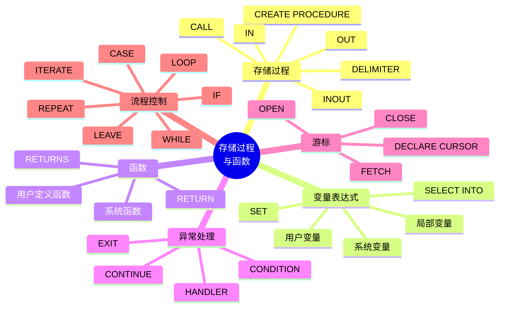

# 第 8 章 存储过程与函数

## 本章知识图谱



## 8.1 存储过程概述

存储过程 stored procedure 是一组为了完成特定功能的 SQL 语句集，经过编译后存储在数据库中，用户通过过程名和参数调用执行。

存储过程可以被程序、触发器或另一个存储过程调用。

优点：

- 模块化编程：创建一次，多次调用。
- 执行效率较高：创建时经过分析和优化，减少重复解析成本。
- 减少网络通信：客户端只发一次调用，而不是发送大量 SQL。
- 安全控制：可以授权用户执行过程，而不直接授权底层表操作。
- 保证操作一致性：统一封装复杂业务逻辑。

局限：

- 业务逻辑放入数据库后，版本管理和调试可能更复杂。
- 过度依赖存储过程会降低系统可移植性。
- 大量过程可能增加数据库服务器压力。

## 存储过程与函数区别

| 对比      | 存储过程                     | 函数                  |
| ------- | ------------------------ | ------------------- |
| 调用方式    | `CALL proc(...)`         | 可在 `SELECT` 等表达式中调用 |
| 返回值     | 可通过多个 `OUT`/`INOUT` 参数返回 | 必须通过 `RETURN` 返回一个值 |
| 返回类型声明  | 不需要整体返回类型                | 必须声明 `RETURNS type` |
| 适合任务    | 复杂业务流程、批处理、事务操作          | 计算值、封装表达式           |
| SQL 中使用 | 一般不能作为表达式                | 可作为表达式一部分           |

## 8.2 存储过程的创建与使用

基本语法：

```sql
CREATE PROCEDURE sp_name ([proc_parameter [, ...]])
[characteristic ...]
routine_body;
```

参数格式：

```sql
[IN | OUT | INOUT] param_name type
```

三种参数：

| 参数类型 | 含义 |
| --- | --- |
| `IN` | 输入参数，调用者向过程传入值 |
| `OUT` | 输出参数，过程向调用者传出值 |
| `INOUT` | 输入输出参数，既传入又传出 |

调用语法：

```sql
CALL sp_name([parameter [, ...]]);
```

### DELIMITER

过程体内部有多条 SQL，分号不能再表示整个 `CREATE PROCEDURE` 的结束，因此要临时修改语句结束符。

```sql
DELIMITER $$

CREATE PROCEDURE goods_info()
BEGIN
  SELECT goods_name, classification_name, unit_price
  FROM goods AS g
  INNER JOIN goods_classification AS gc
    ON g.classification_id = gc.classification_id;
END $$

DELIMITER ;
```

### IN 参数示例

```sql
DELIMITER $$

CREATE PROCEDURE delete_matches(IN p_playerno INT)
BEGIN
  DELETE FROM matches
  WHERE playerno = p_playerno;
END $$

DELIMITER ;

CALL delete_matches(55);
```

### OUT 参数示例

```sql
DELIMITER $$

CREATE PROCEDURE count_students(OUT p_count INT)
BEGIN
  SELECT COUNT(*) INTO p_count
  FROM student;
END $$

DELIMITER ;

CALL count_students(@total);
SELECT @total;
```

### INOUT 参数示例

```sql
DELIMITER $$

CREATE PROCEDURE add_one(INOUT p_num INT)
BEGIN
  SET p_num = p_num + 1;
END $$

DELIMITER ;

SET @x = 1;
CALL add_one(@x);
SELECT @x;
```

## 8.3 数据、表达式与变量

### 变量类型

| 类型 | 形式 | 作用域 |
| --- | --- | --- |
| 局部变量 | `DECLARE v_name type` | `BEGIN ... END` 块内 |
| 用户变量 | `@var_name` | 当前连接会话 |
| 会话系统变量 | `@@session.var_name` | 当前会话 |
| 全局系统变量 | `@@global.var_name` | 整个服务器 |

局部变量：

```sql
DECLARE v_title VARCHAR(30);
DECLARE v_count INT DEFAULT 0;
```

用户变量：

```sql
SET @t1 = 0, @t2 = 1;
SELECT @t1, @t2;
```

系统变量：

```sql
SHOW SESSION VARIABLES;
SHOW GLOBAL VARIABLES;
SHOW GLOBAL VARIABLES LIKE 'wait_timeout';

SET SESSION sort_buffer_size = 40000;
SET GLOBAL sort_buffer_size = 40000;

SELECT @@session.sort_buffer_size;
SELECT @@global.sort_buffer_size;
```

注意：修改全局变量通常需要较高权限。

### 变量赋值

使用 `SET`：

```sql
SET @name = 'David';
SET @a = 15, @b = 30;
```

使用 `SELECT ... INTO`：

```sql
DELIMITER $$

CREATE PROCEDURE get_msg()
BEGIN
  DECLARE v_title VARCHAR(30);
  DECLARE v_content VARCHAR(100);

  SELECT title, content
  INTO v_title, v_content
  FROM news
  WHERE artId = 333;
END $$

DELIMITER ;
```

`SELECT ... INTO` 返回多行时会出错或行为不符合预期，应保证只返回一行。

## 8.4 系统函数

MySQL 提供大量内置函数，可简化查询和计算。

### 字符串函数

| 函数 | 作用 |
| --- | --- |
| `ASCII(s)` | 返回字符串首字符 ASCII 码 |
| `CHAR_LENGTH(s)` | 返回字符数 |
| `LENGTH(s)` | 返回字节长度 |
| `CONCAT(s1,s2,...)` | 拼接字符串 |
| `LOWER(s)` / `LCASE(s)` | 转小写 |
| `UPPER(s)` / `UCASE(s)` | 转大写 |
| `LEFT(s,n)` | 返回左侧 n 个字符 |
| `RIGHT(s,n)` | 返回右侧 n 个字符 |
| `SUBSTRING(s,i,len)` | 截取子串 |
| `POSITION(substr IN str)` | 查找子串位置 |
| `REPEAT(s,n)` | 重复字符串 |
| `REVERSE(s)` | 反转字符串 |
| `TRIM(s)` | 去除首尾空格或指定字符 |
| `FIELD(s,s1,s2,...)` | 返回 s 在列表中的位置 |

示例：

```sql
SELECT CHAR_LENGTH('Happy New Year') AS len_of_str;
SELECT LENGTH('你好') AS byte_len;
SELECT LOWER('SQL Course');
SELECT SUBSTRING('hello world', -5);
SELECT TRIM('  mysql  ');
```

注意：`LENGTH('你好')` 的结果依赖字符集，`utf8` 中通常为 6 字节，`gbk` 中通常为 4 字节。

### 数学函数

| 函数 | 作用 |
| --- | --- |
| `ABS(x)` | 绝对值 |
| `FLOOR(x)` | 不大于 x 的最大整数 |
| `CEIL(x)` / `CEILING(x)` | 不小于 x 的最小整数 |
| `ROUND(x,d)` | 四舍五入 |
| `RAND()` | 随机数 |
| `MOD(x,y)` | 取模 |
| `POW(x,y)` | 幂 |
| `SQRT(x)` | 平方根 |

### 日期时间函数

| 函数 | 作用 |
| --- | --- |
| `CURDATE()` / `CURRENT_DATE()` | 当前日期 |
| `CURTIME()` / `CURRENT_TIME()` | 当前时间 |
| `NOW()` | 当前日期时间 |
| `DATE(expr)` | 提取日期部分 |
| `DATEDIFF(d1,d2)` | 日期相差天数 |
| `DATE_FORMAT(d,f)` | 格式化日期 |
| `DATE_ADD(date, INTERVAL expr type)` | 日期加时间间隔 |
| `DATE_SUB(date, INTERVAL expr type)` | 日期减时间间隔 |
| `DAYNAME(d)` | 星期名称 |
| `WEEKDAY(d)` | 星期几，0 表示星期一 |
| `HOUR(t)` | 小时 |
| `MINUTE(t)` | 分钟 |

示例：

```sql
SELECT CURDATE(), CURRENT_DATE();
SELECT CURTIME(), CURRENT_TIME();
SELECT DAYNAME(NOW());
SELECT DATEDIFF(CURRENT_DATE(), '2000-01-01');
```

### 系统信息函数

```sql
SELECT VERSION();
SELECT USER();
SELECT SESSION_USER();
SELECT DATABASE();
SELECT LAST_INSERT_ID();
SELECT COLLATION('AAA');
```

### 加密函数

```sql
SELECT MD5('ADMIN');
SELECT LENGTH(MD5('ADMIN'));
```

`MD5` 返回 32 位字符串。课件提到 `PASSWORD(str)`，但它不应作为普通应用密码加密方案使用。

### 条件判断函数

```sql
SELECT id, username, score,
       IF(score >= 60, '及格', '不及格') AS result
FROM student;

SELECT id, username, IFNULL(age, 100) AS age
FROM cms_user;

SELECT id, username, score,
       CASE
         WHEN score > 60 THEN '不错'
         WHEN score = 60 THEN '刚及格'
         ELSE '没及格'
       END AS comment
FROM student;
```

常用函数：

- `IF(expr,v1,v2)`：条件成立返回 `v1`，否则返回 `v2`。
- `IFNULL(v1,v2)`：`v1` 非空返回 `v1`，否则返回 `v2`。
- `ISNULL(expr)`：判断是否为 `NULL`。
- `NULLIF(expr1,expr2)`：相等返回 `NULL`，否则返回 `expr1`。

## 8.5 用户定义函数

创建函数语法：

```sql
CREATE FUNCTION func_name ([param_name type [, ...]])
RETURNS type
[characteristic ...]
routine_body;
```

函数体必须有 `RETURN`。

示例：

```sql
DELIMITER $$

CREATE FUNCTION myselect3(p_name VARCHAR(15))
RETURNS INT
READS SQL DATA
BEGIN
  DECLARE v_id INT;
  SELECT id INTO v_id
  FROM class
  WHERE cname = p_name;
  RETURN v_id;
END $$

DELIMITER ;

SELECT myselect3('java');
SELECT * FROM class WHERE id = myselect3('java');
```

求和函数示例：

```sql
DELIMITER $$

CREATE FUNCTION my_sum2(x INT)
RETURNS INT
DETERMINISTIC
BEGIN
  DECLARE i INT DEFAULT 1;
  DECLARE total INT DEFAULT 0;

  sumwhile: WHILE i <= x DO
    IF i % 5 = 0 THEN
      SET i = i + 1;
      ITERATE sumwhile;
    END IF;

    SET total = total + i;
    SET i = i + 1;
  END WHILE;

  RETURN total;
END $$

DELIMITER ;
```

查看和删除函数：

```sql
SHOW CREATE FUNCTION my_sum2;
SHOW FUNCTION STATUS LIKE 'my_%';
DROP FUNCTION IF EXISTS my_sum2;
```

## 8.6 条件与处理程序

MySQL 可以用 `DECLARE CONDITION` 定义错误条件，用 `DECLARE HANDLER` 定义处理程序。

定义条件：

```sql
DECLARE can_not_find CONDITION FOR SQLSTATE '42S02';
DECLARE can_not_find CONDITION FOR 1146;
```

定义处理程序：

```sql
DECLARE handler_type HANDLER
FOR condition_value [, ...]
statement;
```

`handler_type`：

- `CONTINUE`：处理后继续执行。
- `EXIT`：处理后退出当前 `BEGIN ... END` 块。
- `UNDO`：MySQL 中通常不支持。

示例：

```sql
DECLARE CONTINUE HANDLER FOR SQLSTATE '42S02'
  SET @info = 'CAN NOT FIND';

DECLARE CONTINUE HANDLER FOR 1146
  SET @info = 'CAN NOT FIND';

DECLARE can_not_find CONDITION FOR 1146;
DECLARE CONTINUE HANDLER FOR can_not_find
  SET @info = 'CAN NOT FIND';
```

## 8.7 游标

关系数据库更擅长集合操作，但有时过程逻辑需要逐行处理结果集，游标 Cursor 提供这种机制。

游标使用流程：

1. 声明游标。
2. 打开游标。
3. 读取数据。
4. 关闭游标。

语法：

```sql
DECLARE cursor_name CURSOR FOR select_statement;
OPEN cursor_name;
FETCH cursor_name INTO var_name [, var_name] ...;
CLOSE cursor_name;
```

示例：

```sql
DELIMITER $$

CREATE PROCEDURE p_goods()
BEGIN
  DECLARE row_gid INT;
  DECLARE row_name VARCHAR(20);
  DECLARE row_num INT;
  DECLARE done BOOLEAN DEFAULT FALSE;

  DECLARE goods_cursor CURSOR FOR
    SELECT gid, name, num FROM goods;

  DECLARE CONTINUE HANDLER FOR NOT FOUND
    SET done = TRUE;

  OPEN goods_cursor;

  read_loop: LOOP
    FETCH goods_cursor INTO row_gid, row_name, row_num;
    IF done THEN
      LEAVE read_loop;
    END IF;

    SELECT row_gid, row_name, row_num;
  END LOOP;

  CLOSE goods_cursor;
END $$

DELIMITER ;
```

注意：

- `FETCH ... INTO` 中变量数必须等于游标查询列数。
- 游标使用后要关闭。
- 能用集合 SQL 解决时，优先使用集合 SQL，少用逐行游标。

## 8.8 流程控制

### IF

```sql
IF search_condition THEN
  statement_list;
ELSEIF search_condition THEN
  statement_list;
ELSE
  statement_list;
END IF;
```

### CASE

```sql
CASE case_value
  WHEN when_value THEN statement_list;
  WHEN when_value THEN statement_list;
  ELSE statement_list;
END CASE;
```

或：

```sql
CASE
  WHEN condition THEN statement_list;
  WHEN condition THEN statement_list;
  ELSE statement_list;
END CASE;
```

### LOOP、LEAVE、ITERATE

```sql
label_name: LOOP
  statement_list;

  IF condition THEN
    LEAVE label_name;
  END IF;

  IF other_condition THEN
    ITERATE label_name;
  END IF;
END LOOP label_name;
```

`LEAVE` 类似退出循环，`ITERATE` 类似进入下一轮循环。

### REPEAT

```sql
label_name: REPEAT
  statement_list;
UNTIL search_condition
END REPEAT label_name;
```

`REPEAT` 至少执行一次，条件满足时退出。

### WHILE

```sql
label_name: WHILE search_condition DO
  statement_list;
END WHILE label_name;
```

`WHILE` 先判断条件，条件满足才执行。

## 8.9 查看、修改和删除过程或函数

查看状态：

```sql
SHOW PROCEDURE STATUS LIKE 'pattern';
SHOW FUNCTION STATUS LIKE 'pattern';
```

查看定义：

```sql
SHOW CREATE PROCEDURE sp_name;
SHOW CREATE FUNCTION func_name;
```

修改特性：

```sql
ALTER PROCEDURE sp_name
  SQL SECURITY INVOKER
  COMMENT 'comment';
```

删除：

```sql
DROP PROCEDURE IF EXISTS sp_name;
DROP FUNCTION IF EXISTS func_name;
```

## 本章易错点

- 创建过程或函数时要处理分隔符，常用 `DELIMITER $$`。
- 存储函数必须声明返回类型并执行 `RETURN`。
- `DECLARE` 定义局部变量，不带 `@`；`SET @x` 定义用户变量。
- `OUT` 和 `INOUT` 参数调用时通常要传变量。
- 游标声明、处理程序声明在过程体中的位置有要求，通常先声明变量，再声明游标，再声明 handler。
- 能用集合 SQL 时不要滥用游标。
- `CONTINUE HANDLER` 处理后继续执行，`EXIT HANDLER` 处理后退出块。

## 自测题

1. 存储过程和存储函数的核心区别是什么？
2. 为什么创建存储过程时要修改 `DELIMITER`？
3. `IN`、`OUT`、`INOUT` 参数分别如何传值？
4. 局部变量、用户变量、系统变量的作用域有什么区别？
5. 游标的四个基本步骤是什么？
6. `LEAVE` 和 `ITERATE` 分别对应什么控制语义？

