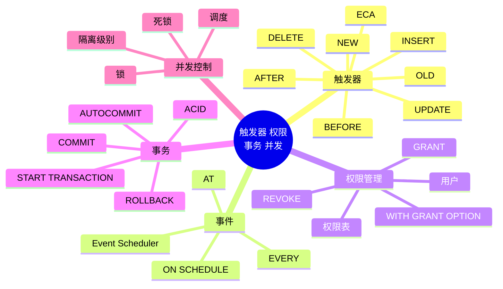

# 第 9 章 触发器、权限管理、事务与并发控制

## 本章知识图谱



## 9.1 触发器概述

触发器 Trigger 本质上是一种特殊的存储过程，它在指定表发生插入、更新或删除事件时自动触发执行。

触发器符合 ECA 规则：

```text
Event 事件 -> Condition 条件 -> Action 动作
```

在 MySQL 中，触发器事件包括：

- `INSERT`
- `UPDATE`
- `DELETE`

触发时间包括：

- `BEFORE`
- `AFTER`

触发器作用：

- 强化约束，表达主键、外键、检查约束难以表达的复杂规则。
- 跟踪变化，记录审计日志。
- 级联运行，在一张表变化时维护另一张表。
- 调用或封装业务逻辑。

## 9.2 触发器创建与使用

基本语法：

```sql
CREATE TRIGGER trigger_name
trigger_time trigger_event
ON tbl_name
FOR EACH ROW
trigger_stmt;
```

参数：

| 参数 | 说明 |
| --- | --- |
| `trigger_name` | 触发器名称 |
| `trigger_time` | `BEFORE` 或 `AFTER` |
| `trigger_event` | `INSERT`、`UPDATE`、`DELETE` |
| `tbl_name` | 触发器绑定的表 |
| `FOR EACH ROW` | MySQL 触发器按行触发 |
| `trigger_stmt` | 被触发执行的语句或语句块 |

示例：统计插入次数。

```sql
CREATE TABLE test (a INT);
SET @count = 0;

DELIMITER $$

CREATE TRIGGER insert_test
AFTER INSERT ON test
FOR EACH ROW
BEGIN
  SET @count = @count + 1;
END $$

DELIMITER ;

INSERT INTO test VALUES (11);
SELECT @count;
```

### OLD 与 NEW

MySQL 触发器中可使用 `OLD` 和 `NEW` 访问变化前后的行。

| 事件 | 可用对象 | 说明 |
| --- | --- | --- |
| `INSERT` | `NEW` | 新插入的行 |
| `DELETE` | `OLD` | 被删除的旧行 |
| `UPDATE` | `OLD`、`NEW` | 更新前和更新后的行 |

使用方式：

```sql
NEW.column_name
OLD.column_name
```

`OLD` 是只读的；在 `BEFORE` 触发器中，某些情况下可修改 `NEW` 的值。

示例：插入学生后维护班级人数。

```sql
DELIMITER $$

CREATE TRIGGER tri_stu_insert
AFTER INSERT ON student
FOR EACH ROW
BEGIN
  UPDATE class
  SET stuCount = stuCount + 1
  WHERE classID = NEW.classID;
END $$

DELIMITER ;
```

### 查看和删除触发器

```sql
SHOW TRIGGERS;
SHOW TRIGGERS FROM db_name;

SELECT *
FROM information_schema.TRIGGERS
WHERE TRIGGER_SCHEMA = 'db_name';

DROP TRIGGER IF EXISTS tri_stu_insert;
```

### 触发器限制

- MySQL 触发器按行触发，批量操作可能触发很多次，性能需关注。
- 触发器不能使用显式或隐式开始/结束事务的语句，如 `START TRANSACTION`、`COMMIT`、`ROLLBACK`。
- 触发器不适合写复杂、不可控、隐蔽的业务逻辑，否则调试困难。
- MyISAM 不支持事务，触发器失败时不能保证相关操作原子回滚。

## 9.3 事件

事件调度器 Event Scheduler 可按时间触发任务，也可理解为“时间触发器”。它适合定期清理、汇总、归档等任务。

触发器与事件区别：

| 对比 | 触发器 | 事件 |
| --- | --- | --- |
| 触发条件 | 表上的 `INSERT`、`UPDATE`、`DELETE` | 指定时间或周期 |
| 绑定对象 | 表 | 数据库事件调度器 |
| 典型用途 | 审计、级联维护、复杂约束 | 定期清理、定时报表、汇总 |

开启事件调度器：

```sql
SET GLOBAL event_scheduler = ON;
SELECT @@global.event_scheduler;
```

创建事件：

```sql
CREATE EVENT [IF NOT EXISTS] event_name
ON SCHEDULE schedule
[ON COMPLETION [NOT] PRESERVE]
[ENABLE | DISABLE | DISABLE ON SLAVE]
[COMMENT 'comment']
DO event_body;
```

周期执行：

```sql
CREATE EVENT IF NOT EXISTS e_t
ON SCHEDULE EVERY 5 SECOND
ON COMPLETION PRESERVE
DO
  INSERT INTO tb_etest(user, createtime)
  VALUES ('MySQL', NOW());
```

指定时间执行：

```sql
CREATE EVENT demo_event1
ON SCHEDULE AT TIMESTAMP '2026-06-23 15:29:47'
DO
  INSERT INTO demo(name, createtime)
  VALUES ('hello', NOW());
```

延迟执行：

```sql
CREATE EVENT demo_event2
ON SCHEDULE AT CURRENT_TIMESTAMP + INTERVAL 5 HOUR
DO
  INSERT INTO demo(name, createtime)
  VALUES ('hello', NOW());
```

修改事件：

```sql
ALTER EVENT event_name DISABLE;
ALTER EVENT event_name ENABLE;
ALTER EVENT event_name RENAME TO new_event_name;
```

删除事件：

```sql
DROP EVENT IF EXISTS event_name;
```

## 9.4 权限管理

权限管理用于控制哪些用户可以访问哪些数据库对象，以及可以执行哪些操作。

### 访问控制相关表

MySQL 系统库 `mysql` 中维护权限相关表：

| 表 | 作用 |
| --- | --- |
| `user` | 用户级权限和账户信息 |
| `db` | 数据库级权限 |
| `host` | 主机相关权限，旧版本中常见 |
| `tables_priv` | 表级权限 |
| `columns_priv` | 列级权限 |
| `procs_priv` | 存储过程和函数权限 |

常见权限字段：

- `select_priv`
- `insert_priv`
- `update_priv`
- `delete_priv`
- `create_priv`
- `drop_priv`
- `grant_priv`
- `references_priv`
- `index_priv`

### 用户管理

创建用户：

```sql
CREATE USER 'lily'@'localhost' IDENTIFIED BY '123456';
```

查看用户：

```sql
SELECT host, user
FROM mysql.user;
```

修改用户名：

```sql
RENAME USER 'lily'@'localhost' TO 'lucy'@'localhost';
```

修改密码：

```sql
ALTER USER 'lucy'@'localhost' IDENTIFIED BY 'new_password';
```

旧式或命令行方式：

```bash
mysqladmin -u username -p password
```

删除用户：

```sql
DROP USER 'lucy'@'localhost';
```

注意：`'user'@'localhost'` 和 `'user'@'%'` 是不同账户。

### 授权 GRANT

基本语法：

```sql
GRANT priv_type [(column_list)] [, priv_type [(column_list)] ...]
ON [object_type] priv_level
TO 'user'@'host'
[WITH GRANT OPTION];
```

权限级别：

| 写法 | 含义 |
| --- | --- |
| `*.*` | 所有数据库所有表 |
| `db_name.*` | 某数据库所有表 |
| `db_name.table_name` | 某数据库某表 |
| `table_name` | 当前数据库中的某表 |

示例：

```sql
GRANT SELECT, INSERT
ON jxgl.student
TO 'lily'@'localhost';

GRANT ALL PRIVILEGES
ON jxgl.*
TO 'dba_user'@'localhost'
WITH GRANT OPTION;
```

`WITH GRANT OPTION` 表示被授权者可以把自己拥有的权限再授予别人，应谨慎使用。

### 撤销权限 REVOKE

```sql
REVOKE INSERT
ON jxgl.student
FROM 'lily'@'localhost';

REVOKE ALL PRIVILEGES, GRANT OPTION
FROM 'lily'@'localhost';
```

旧版本直接修改权限表后需要：

```sql
FLUSH PRIVILEGES;
```

使用 `CREATE USER`、`GRANT`、`REVOKE` 通常会自动处理权限缓存。

### 资源限制

授权时可限制资源：

```sql
GRANT SELECT
ON jxgl.*
TO 'lily'@'localhost'
WITH MAX_QUERIES_PER_HOUR 100
     MAX_UPDATES_PER_HOUR 20
     MAX_CONNECTIONS_PER_HOUR 10
     MAX_USER_CONNECTIONS 2;
```

## 9.5 事务处理

事务是用户定义的一个数据库操作序列，这些操作要么全部执行，要么全不执行。事务是不可分割的逻辑工作单元。

### ACID

| 特性 | 含义 |
| --- | --- |
| Atomicity 原子性 | 事务中的操作要么全做，要么全不做 |
| Consistency 一致性 | 事务执行前后数据库从一个一致状态到另一个一致状态 |
| Isolation 隔离性 | 并发事务之间互相隔离，未完成结果不应随意暴露 |
| Durability 持久性 | 事务提交后，其影响应永久保存 |

### 事务控制语句

```sql
START TRANSACTION;
-- 或
BEGIN;

COMMIT;
ROLLBACK;

SET autocommit = 0;
SET autocommit = 1;
```

MySQL 默认通常是自动提交。若需要显式提交和回滚，可：

```sql
SET autocommit = 0;

UPDATE account SET balance = balance - 100 WHERE id = 1;
UPDATE account SET balance = balance + 100 WHERE id = 2;

COMMIT;
```

回滚示例：

```sql
START TRANSACTION;
DELETE FROM ordertotals;
ROLLBACK;
```

提交示例：

```sql
START TRANSACTION;
DELETE FROM t_orderitems WHERE order_num = 2021;
DELETE FROM t_orders WHERE order_num = 2021;
COMMIT;
```

注意：某些 DDL 语句如 `CREATE`、`DROP` 可能隐式提交，不能简单依赖 `ROLLBACK` 撤销。

## 调度与正确性

调度是一个或多个事务的重要操作序列。

- 串行调度：不同事务的操作不交叉。
- 非串行调度：不同事务的操作交叉执行。

并发执行可以提高吞吐量，但可能导致一致性问题。目标是让并发调度在效果上等价于某个串行调度，即可串行化。

## 并发异常

| 异常 | 含义 |
| --- | --- |
| 丢失更新 | 两个事务更新同一数据，一个更新覆盖另一个更新 |
| 脏写 | 一个事务覆盖了另一个未提交事务写入的数据 |
| 脏读 | 一个事务读取到另一个未提交事务的数据 |
| 不可重复读 | 同一事务两次读取同一行，结果不同 |
| 幻读 | 同一事务两次读取同一范围，出现新增或消失的行 |

### 隔离级别

MySQL 提供四种标准隔离级别：

```sql
SET [SESSION | GLOBAL] TRANSACTION ISOLATION LEVEL
  READ UNCOMMITTED;

SET [SESSION | GLOBAL] TRANSACTION ISOLATION LEVEL
  READ COMMITTED;

SET [SESSION | GLOBAL] TRANSACTION ISOLATION LEVEL
  REPEATABLE READ;

SET [SESSION | GLOBAL] TRANSACTION ISOLATION LEVEL
  SERIALIZABLE;
```

查看隔离级别：

```sql
SELECT @@transaction_isolation;
-- 旧版本也可能使用
SELECT @@tx_isolation;
```

| 隔离级别 | 脏读 | 不可重复读 | 幻读 | 说明 |
| --- | --- | --- | --- | --- |
| `READ UNCOMMITTED` | 可能 | 可能 | 可能 | 隔离性最低 |
| `READ COMMITTED` | 避免 | 可能 | 可能 | 只能读已提交数据 |
| `REPEATABLE READ` | 避免 | 避免 | 可能或由 InnoDB 机制处理 | MySQL InnoDB 默认 |
| `SERIALIZABLE` | 避免 | 避免 | 避免 | 最强隔离，并发最低 |

InnoDB 默认 `REPEATABLE READ`，结合 MVCC 和锁机制处理很多并发问题。

## 9.6 并发控制与锁

并发控制用于在多事务同时访问数据库时保证正确性。

### 锁粒度

| 锁粒度 | 优点 | 缺点 |
| --- | --- | --- |
| 表级锁 | 开销小，加锁快，不易死锁 | 粒度大，并发低 |
| 行级锁 | 粒度小，并发高 | 开销大，可能死锁 |

MyISAM 主要使用表级锁。InnoDB 支持事务和行级锁。

### MyISAM 表级锁

MyISAM 在执行查询前自动加读锁，在执行 `UPDATE`、`DELETE`、`INSERT` 前自动加写锁。

表锁模式：

- 表共享读锁 `table read lock`。
- 表独占写锁 `table write lock`。

### InnoDB 行级锁

InnoDB 行锁通过给索引项加锁实现。若查询没有使用索引，可能退化为锁住大量记录。

行锁模式：

| 锁 | 含义 | 语法 |
| --- | --- | --- |
| 共享锁 S | 允许读，阻止其他事务获取排他锁 | `LOCK IN SHARE MODE` |
| 排他锁 X | 允许更新，阻止其他事务获取共享锁和排他锁 | `FOR UPDATE` |

示例：

```sql
SELECT *
FROM student
WHERE sno = '20240001'
LOCK IN SHARE MODE;

SELECT *
FROM student
WHERE sno = '20240001'
FOR UPDATE;
```

### 死锁

死锁是多个事务互相等待对方持有的资源，导致都无法继续执行。

典型场景：

```text
T1 锁住 R1，等待 R2
T2 锁住 R2，等待 R1
T1 等 T2，T2 等 T1，形成死锁
```

避免死锁建议：

- 不同程序按相同顺序访问表和记录。
- 批量处理前先排序，使线程按固定顺序处理记录。
- 事务尽量短，减少持锁时间。
- 需要更新时尽早申请足够级别的锁。
- 减少交互式长事务。
- 为高频更新条件建立合适索引，避免锁范围扩大。

## 本章易错点

- 触发器是自动执行的，存储过程通常需要显式调用。
- MySQL 触发器是 `FOR EACH ROW`，批量操作会触发多次。
- 触发器里不要写 `COMMIT`、`ROLLBACK`。
- `'user'@'localhost'` 与 `'user'@'%'` 是不同用户。
- `WITH GRANT OPTION` 是权限再授权能力，不是普通权限。
- MySQL 默认自动提交，事务前要明确 `START TRANSACTION` 或关闭 `autocommit`。
- `READ COMMITTED` 不能保证可重复读。
- 行锁依赖索引，没用好索引可能锁范围很大。

## 自测题

1. 触发器的 ECA 分别指什么？
2. `OLD` 和 `NEW` 在三类触发事件中如何使用？
3. 事件调度器和触发器的触发条件有什么区别？
4. `GRANT ... WITH GRANT OPTION` 的含义是什么？
5. ACID 四个特性分别解决什么问题？
6. 脏读、不可重复读、幻读如何区分？
7. 为什么 InnoDB 行锁依赖索引？
8. 死锁产生的必要直观条件是什么？如何降低概率？

