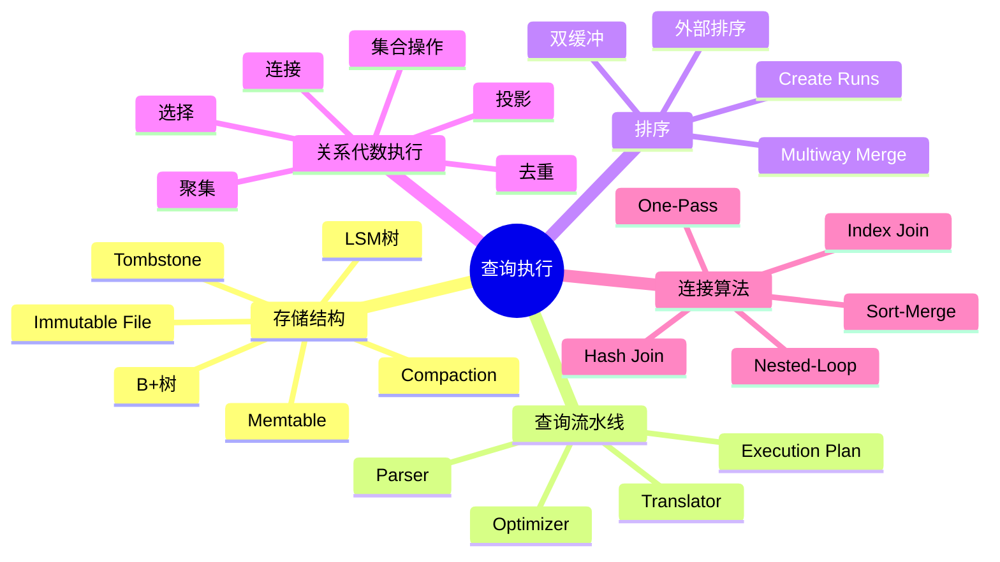

# 第 10 章 查询执行

## 本章知识图谱



## 10.1 B+树与 LSM 树

### B+树原地更新

B+树通常采用原地更新 In-Place Updates：

- 新数据直接覆盖旧数据。
- 对点查找和范围查询友好。
- 更新可能产生大量随机磁盘 I/O。

当写入非常频繁、随机更新很多时，B+树维护成本会变高。

### LSM 树

LSM 树 Log-Structured Merge Tree 是日志结构合并树，广泛用于 NoSQL 和现代存储系统，例如 LevelDB、RocksDB、HBase、Cassandra、TiDB 等。

LSM 树采用异地更新 Out-of-Place Updates：

- 写操作先进入内存结构。
- 内存写满后刷写为磁盘上的不可变有序文件。
- 后台把多个不可变文件合并 compaction。
- 写入主要是顺序 I/O，适合写密集场景。

### LSM 基本结构

| 组件 | 说明 |
| --- | --- |
| Memtable | 内存中的 B+树、跳表或哈希表，保存最新写入 |
| Immutable file | 磁盘上不可更新的有序文件 |
| Level 0 | Memtable 刷到磁盘后的文件 |
| Level i | 更低层、更大、更旧的有序文件 |

分层 LSM 中，通常第 $i+1$ 层文件比第 $i$ 层大 $T$ 倍，且更低层数据更旧。

### 查找

查找键为 $K$：

1. 先查 Memtable。
2. 若找到最新值，返回。
3. 若找到墓碑 tombstone，返回“不存在”。
4. 否则从 Level 0 到更低层逐层查找。
5. 所有层都没有，返回“不存在”。

### 插入

```text
插入(K,V)
  -> 写入 Memtable
  -> Memtable 未满则结束
  -> Memtable 满则刷到 Level 0
  -> 某层溢出则与下一层合并
```

### 删除

LSM 删除通常不是立即从所有文件中删除旧值，而是插入墓碑：

1. 在 Memtable 为键 $K$ 插入 tombstone。
2. 查询时看到 tombstone 即认为不存在。
3. 后续 compaction 时清理旧版本和墓碑。

### B+树与 LSM 树对比

| 对比 | B+树 | LSM 树 |
| --- | --- | --- |
| 更新方式 | 原地更新 | 异地更新 |
| 写入 I/O | 随机 I/O 较多 | 顺序 I/O 为主 |
| 点查找 | 通常较快 | 可能查多层，可用 Bloom Filter 优化 |
| 范围查询 | 很强 | 需要合并多层结果 |
| 写放大 | 较低或中等 | compaction 带来写放大 |
| 适用 | 读多、范围查询多 | 写多、大规模日志式写入 |

## 查询执行总流程

一个 SQL 查询从文本到结果通常经过：

```text
SQL 文本
  -> Parser 语法解析
  -> Translator 转换为关系代数表达式
  -> Optimizer 生成优化后的逻辑计划和物理计划
  -> Executor 执行物理算子
  -> Storage Engine 访问数据
  -> 返回结果
```

Parser & Translator 将 SQL 转换为关系代数表达式。Optimizer 将初始关系代数表达式转换为优化后的表达式，并进一步生成物理查询执行计划。

## 10.2 排序

排序是 DBMS 中非常重要的操作：

- 用户使用 `ORDER BY` 对结果排序。
- 批量加载 B+树前需要对索引项排序。
- 去重、分组、集合操作、排序归并连接都可能依赖排序。

### 外部排序

当数据规模大到不能全部放入内存时，需要外部排序 External Sorting。外部排序的主要成本是磁盘 I/O，CPU 时间通常不是瓶颈。

设：

- $B(R)$：关系 $R$ 的块数。
- $M$：可用内存缓冲块数。

### 两趟多路外存归并排序

第一阶段：创建归并段 runs。

```text
每次读入 M 个块 -> 内存排序 -> 写出一个 run
```

归并段数量：

$$
\lceil B(R) / M \rceil
$$

第二阶段：多路归并。

```text
每个 run 分配输入缓冲区
保留一个输出缓冲区
反复选出最小元组写出
```

两趟排序要求初始 run 数量不超过可同时归并的路数：

$$
\lceil B(R)/M \rceil \le M - 1
$$

等价近似条件：

$$
B(R) \le M(M-1)
$$

典型 I/O 成本若最终结果写回磁盘，约为：

$$
4B(R)
$$

即第一趟读写 $2B(R)$，第二趟读写 $2B(R)$。

### 多趟多路归并排序

若 run 数太多，不能两趟完成，就需要多趟归并。每一趟把多个 run 合并成更大的 run，直到只剩一个有序结果。

优化：

- 增大可用内存 $M$。
- 使用双缓冲 double buffering，减少 I/O 等待。
- 若后续算子可以流水线消费结果，避免把最终结果完全物化。

## 10.3 关系代数操作的执行

关系代数操作最终会被实现为物理算子。

### 选择操作

选择操作对应 `WHERE` 筛选。

| 算法 | 适用条件 | 特点 |
| --- | --- | --- |
| 扫描选择 | 无索引或条件选择度低 | 顺序扫描所有块 |
| 哈希选择 | 条件形如 $K = v$，且文件按 $K$ 哈希组织 | 不支持范围查询 |
| 索引选择 | 条件形如 $K = v$ 或 $l \le K \le u$，且 $K$ 上有索引 | 选择度高时有效 |

### 投影操作

不带去重的投影只需要扫描输入并输出指定列，访问模式类似扫描。

带去重的投影需要消除重复元组，可用：

- 一趟去重。
- 基于排序的去重。
- 基于哈希的去重。

### 去重

基于排序的去重：

1. 按整个元组排序。
2. 归并时相同元组只输出一个。

基于哈希的去重：

1. 对元组哈希分桶。
2. 重复元组一定落入同一桶。
3. 在桶内去重。

### 聚集操作

聚集操作包括 `COUNT`、`SUM`、`AVG`、`MAX`、`MIN` 以及 `GROUP BY`。

聚集与去重本质类似：

- 基于排序：相同分组键相邻，顺序聚集。
- 基于哈希：相同分组键进入同一哈希桶，在桶中维护聚集值。

### 集合操作

集合差、并、交的执行方法类似：

| 操作 | 可用方法 |
| --- | --- |
| 差 $R-S$ | 一趟、排序、哈希 |
| 并 $R \cup S$ | 一趟、排序、哈希 |
| 交 $R \cap S$ | 一趟、排序、哈希 |

基本思想：

- 一趟算法适合较小关系可放入内存。
- 排序算法通过有序扫描比较。
- 哈希算法通过分桶使候选匹配落入同一桶。

## 连接操作执行

连接是查询执行中最重要、最昂贵的操作之一。

常见连接算法：

1. 一趟连接 One-Pass Join。
2. 嵌套循环连接 Nested-Loop Join。
3. 排序归并连接 Sort-Merge Join。
4. 哈希连接 Grace Hash-Join。
5. 基于索引的连接 Index-based Join。

### 一趟连接

适用：至少一个输入关系足够小，可以放入内存。

思路：

1. 将较小关系读入内存。
2. 扫描较大关系。
3. 对每个元组在内存中查找可连接元组并输出。

### 嵌套循环连接

基于元组的嵌套循环：

```text
for r in R:
  for s in S:
    if join_condition(r, s):
      output(r, s)
```

简单但可能非常慢。

基于块的嵌套循环：

```text
for block group of R:
  read as many R blocks as memory allows
  for block of S:
    compare tuples
```

块嵌套循环利用内存缓冲多个块，减少重复扫描。

### 排序归并连接

适用：

- 两个输入已按连接键排序。
- 或排序成本可接受。
- 等值连接或自然连接。

思路：

1. 按连接键排序两个关系。
2. 同步扫描两个有序输入。
3. 连接键相等时输出匹配组合。

优点：适合大关系，且输出可保持有序。

### 哈希连接

Grace Hash-Join 思路：

1. 用同一哈希函数将 $R$ 和 $S$ 分桶。
2. 可连接元组必落入相同编号桶。
3. 对每对对应桶执行内存哈希连接。

适用：

- 等值连接。
- 输入较大但可分桶。
- 内存能容纳单个桶或分桶后的小关系。

### 基于索引的连接

适用：内表连接属性上有索引。

思路：

```text
for r in R:
  用 r 的连接键在 S 的索引中查找匹配元组
  输出连接结果
```

若索引是聚簇索引，匹配元组在磁盘上更可能连续，I/O 更友好。

## 10.4 查询计划执行方式

### 物化执行

物化 materialization 会把中间结果写成临时关系，再供下一个算子读取。

缺点：

- 写临时结果增加 I/O。
- 中间结果可能很大。
- 延迟后续算子开始执行。

优点：

- 实现简单。
- 中间结果可重复使用。

### 流水线执行

流水线 pipelining 让上一个算子边产生结果，边传给下一个算子。

优点：

- 减少临时结果物化。
- 更早返回结果。
- 降低 I/O。

限制：

- 某些阻塞算子必须先读完整输入才能输出，如全排序、全局聚集。

## 本章易错点

- B+树偏读和范围查询，LSM 树偏写入吞吐。
- LSM 删除常用 tombstone，不是立即物理删除全部旧版本。
- 外部排序的核心成本是磁盘 I/O。
- 两趟外排序需要 $B(R) \le M(M-1)$。
- 投影在关系代数中需要去重，实际 SQL 是否去重要看是否使用 `DISTINCT`。
- 哈希选择和哈希连接主要适合等值条件。
- 排序归并连接要求输入按连接键有序。
- 基于索引的连接是否高效取决于内表索引和外表规模。

## 自测题

1. B+树和 LSM 树的更新方式有什么根本差异？
2. LSM 树为什么适合写密集场景？
3. 两趟外排序的 run 数是多少？需要满足什么条件？
4. 选择操作有哪些物理执行算法？
5. 去重、聚集为什么都可以用排序或哈希实现？
6. 比较嵌套循环连接、排序归并连接、哈希连接、索引连接的适用条件。
7. 物化执行和流水线执行各有什么优缺点？

