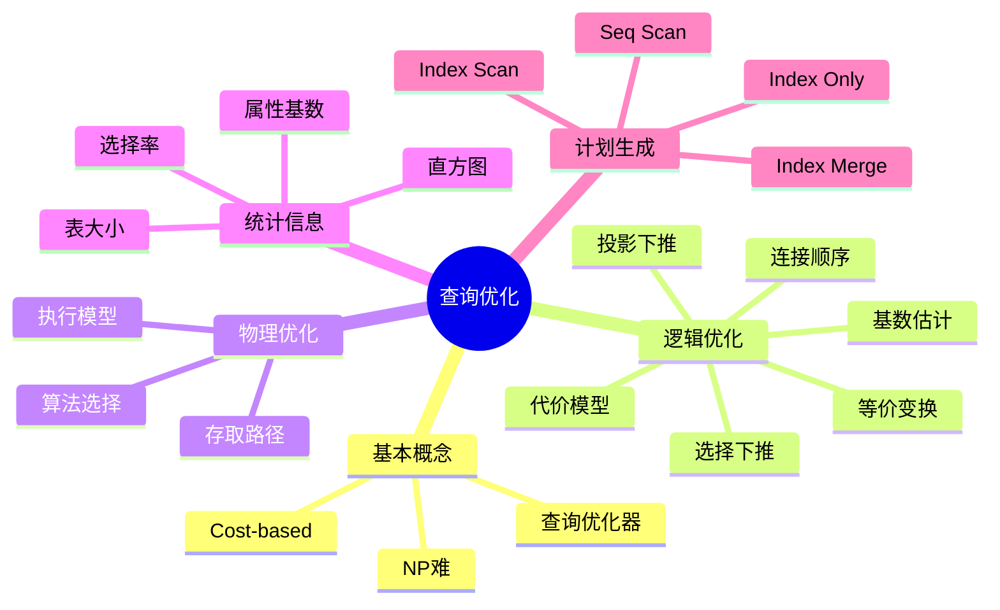

# 第 11 章 查询优化

## 本章知识图谱



## 11.1 查询优化概述

查询优化 Query Optimization 是将一个关系代数表达式转换成可以快速执行的查询执行计划 Query Execution Plan 的过程。

查询优化是 DBMS 中最复杂的组件之一，原因：

- 等价查询计划数量巨大。
- 连接顺序组合爆炸。
- 需要估计中间结果大小。
- 代价模型只是近似。
- 数据分布可能不均匀。
- 优化时间本身不能太长。

查询优化通常是 NP 难问题，实际系统使用启发式规则、代价模型和搜索剪枝来得到足够好的计划。

### 两个阶段

| 阶段 | 输入 | 输出 | 目标 |
| --- | --- | --- | --- |
| 逻辑查询优化 | 初始关系代数表达式 | 更优的等价关系代数表达式 | 减少中间结果和无用操作 |
| 物理查询优化 | 逻辑查询计划 | 物理查询计划 | 选择具体算法、索引和执行方式 |

逻辑查询计划：关系代数表达式，说明“做什么”。

物理查询计划：带执行算法和存取路径的计划，说明“怎么做”。

## 11.2 逻辑查询优化

逻辑查询优化把关系代数表达式转换为更快执行的等价表达式。

### 基于代价的优化

Cost-Based Query Optimization 包括两个核心任务：

1. 计划枚举：从初始计划 $P$ 出发，生成等价计划 $P'$。
2. 代价计算：估计每个计划的执行代价，选择代价较小者。

计划代价通常是所有物理操作执行代价之和：

$$
Cost(P) = \sum_i Cost(op_i)
$$

代价可综合考虑：

- 磁盘 I/O。
- CPU 计算。
- 内存使用。
- 网络传输。
- 临时结果大小。

课程中重点可把代价理解为反映执行时间长短的数。

### 关系代数等价变换

等价变换是逻辑优化的基础。常见规则：

#### 选择串接

$$
\sigma_{\theta_1 \land \theta_2}(R)
=
\sigma_{\theta_1}(\sigma_{\theta_2}(R))
$$

#### 选择下推

尽早执行选择，减少后续操作输入规模。

原始：

```text
σ_condition(R ⋈ S)
```

若条件只涉及 $R$，可变为：

```text
(σ_condition(R)) ⋈ S
```

意义：先过滤 $R$，再连接，减少连接输入。

#### 投影下推

尽早去掉不需要的列，减少元组宽度和 I/O。

但投影下推要保留：

- 最终输出需要的属性。
- 后续连接条件需要的属性。
- 后续选择、分组、排序需要的属性。

#### 连接交换律与结合律

内连接通常满足交换和结合：

$$
R \bowtie S = S \bowtie R
$$

$$
(R \bowtie S) \bowtie T = R \bowtie (S \bowtie T)
$$

这使连接顺序优化成为可能。

### 基数估计

基数 Cardinality 是关系或中间结果的元组数。基数估计决定代价估计是否准确。

需要的统计信息：

- 表的元组数。
- 表的块数。
- 属性不同值个数。
- 最大值、最小值。
- NULL 数量。
- 索引高度和聚簇性。
- 值分布信息，如直方图。

常见估计：

#### 笛卡尔积

若 $|R|$ 和 $|S|$ 分别是两个关系的元组数：

$$
|R \times S| = |R| \cdot |S|
$$

#### 选择

若选择条件选择率为 $sel(\theta)$：

$$
|\sigma_{\theta}(R)| = |R| \cdot sel(\theta)
$$

#### 投影

投影后元组数不超过原关系元组数，也不超过投影属性组合的可能不同值个数。

#### 连接

二路自然连接基数估计依赖连接属性不同值个数。若 $R$ 和 $S$ 在属性 $A$ 上连接，可近似：

$$
|R \bowtie S| \approx \frac{|R| \cdot |S|}{\max(V(R,A), V(S,A))}
$$

其中 $V(R,A)$ 表示 $R$ 中属性 $A$ 的不同值数量。

### 统计信息误差

实际数据常不满足均匀分布假设，例如热点值、偏斜分布、相关属性。统计信息不准会导致：

- 错误估计选择率。
- 错误选择连接顺序。
- 错误选择索引或扫描方式。
- 中间结果远大于预期。

直方图等技术用于更精确近似属性值分布。

## 连接顺序优化

连接顺序对性能影响巨大。即使逻辑结果相同，不同连接顺序的中间结果大小可能差很多。

### 连接树

连接计划可表示为连接树：

- 叶子节点是基本关系。
- 内部节点是连接操作。

常见类型：

| 类型 | 说明 |
| --- | --- |
| 左深树 | 每次连接的右输入是基本关系 |
| 右深树 | 每次连接的左输入是基本关系 |
| 灌木树 | 两边都可能是中间结果 |

System R 倾向选择左深连接树，原因：

- 搜索空间较小。
- 便于流水线执行。
- 中间结果可作为外关系，右侧基本关系可利用索引。

### 连接关系角色

在嵌套循环或索引连接中，外表和内表角色会影响成本：

- 外表被扫描。
- 内表被反复查找，若有索引可能更高效。

优化器会综合表大小、索引、选择率和连接条件选择连接顺序。

## 11.3 物理查询优化

物理查询优化要基于逻辑计划生成具体可执行的物理计划。

主要任务：

1. 为逻辑计划中的每个操作选择物理执行算法。
2. 为操作之间的数据传递选择执行模型，如物化或流水线。
3. 选择存取路径，如顺序扫描、索引扫描、索引合并、仅用索引。

### 选择操作的存取路径

#### 顺序扫描 Sequential Scan

扫描整张表，适合：

- 表很小。
- 大部分行都满足条件。
- 没有合适索引。

#### 索引扫描 + 过滤

先用一个索引定位候选行，再验证其他条件。

适合：

- 索引是聚簇索引。
- 非聚簇索引但满足条件的元组很少。

示意：

```sql
SELECT *
FROM student
WHERE sdept = 'CS'
  AND sage > 18;
```

如果只有 `sdept` 上有索引，可以先用索引找 `CS`，再过滤 `sage > 18`。

#### 多索引扫描 + 求交集

MySQL 中称为 Index Merge。

```sql
SELECT *
FROM student
WHERE sdept = 'CS'
  AND sage = 20;
```

若 `sdept` 和 `sage` 各有单列索引，优化器可能分别扫描两个索引，再求交集。

#### 仅用索引 Index Only

如果查询所需字段都在索引中，可以只访问索引，不访问表数据。

```sql
SELECT sno, grade
FROM sc
WHERE cno = 'C001';
```

若有索引 `(cno, sno, grade)`，可能形成覆盖索引。

## 11.4 物理查询计划生成

物理计划生成的典型思路：

1. 从逻辑计划根节点开始。
2. 为每个关系选择访问方式。
3. 为选择、投影、连接、分组等算子选择算法。
4. 估计每一步输出基数和代价。
5. 选择总代价较小的计划。

简单例子：

```sql
SELECT s.sname, sc.grade
FROM student AS s
JOIN sc AS sc ON s.sno = sc.sno
WHERE s.sdept = 'CS'
  AND sc.cno = 'C001';
```

可能优化：

1. 将 `s.sdept = 'CS'` 下推到 `student`。
2. 将 `sc.cno = 'C001'` 下推到 `sc`。
3. 只保留连接和输出所需列：`sno`、`sname`、`grade`。
4. 根据索引选择访问路径。
5. 根据过滤后大小选择连接算法。

若 `student(sdept, sno, sname)` 和 `sc(cno, sno, grade)` 都有合适索引，可能使用覆盖索引和较小中间结果进行连接。

## 逻辑优化与物理优化对照

| 问题 | 逻辑优化回答 | 物理优化回答 |
| --- | --- | --- |
| 先过滤还是先连接？ | 选择下推，先过滤 | 用哪个索引过滤 |
| 保留哪些列？ | 投影下推 | 是否形成覆盖索引 |
| 多表如何连接？ | 连接顺序 | 连接算法 |
| 是否产生中间结果？ | 逻辑表达式结构 | 物化或流水线 |
| 怎样估计好坏？ | 逻辑计划代价 | 物理算子 I/O 和 CPU 代价 |

## 本章易错点

- 查询优化不是改变查询语义，而是找等价但更快的执行方式。
- 逻辑优化处理关系代数表达式，物理优化处理具体算法和索引。
- 选择下推减少行数，投影下推减少列宽。
- 投影下推不能丢掉后续连接、过滤、排序所需属性。
- 基数估计错误会导致优化器选错计划。
- 索引扫描不一定比顺序扫描快，取决于选择率和聚簇性。
- `Index Merge` 不等于复合索引；复合索引通常更能匹配多列有序访问。

## 自测题

1. 查询优化为什么是困难问题？
2. 逻辑查询优化和物理查询优化有什么区别？
3. 什么是选择下推？为什么能减少代价？
4. 投影下推时必须保留哪些属性？
5. 基数估计为什么重要？常用哪些统计信息？
6. 左深连接树有什么优点？
7. 顺序扫描什么时候可能比索引扫描更好？

