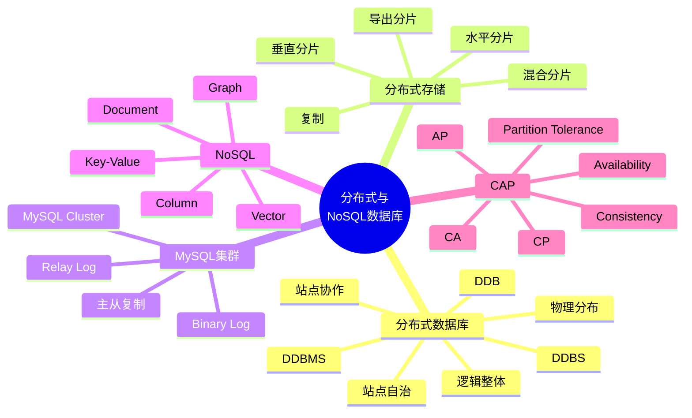

# 第 12 章 分布式与 NoSQL 数据库

## 本章知识图谱



## 12.1 分布式数据库系统

分布式数据库系统 Distributed Database System，DDBS，是地理上分散而逻辑上集中的数据库系统。它通过计算机网络把不同局域节点连接起来，对用户呈现一个逻辑统一的数据库。

分布式数据库是数据库技术与网络技术结合的产物。

### 集中式数据库的问题

集中式结构把数据集中存放在一处，可能面临：

- 通信开销大，远程用户访问集中节点成本高。
- 单点故障影响整个系统。
- 扩展灵活性不足。
- 难以贴近各地业务数据和局部自治需求。

### 分布计算演进

分布计算可理解为三个层次：

| 层次 | 含义 |
| --- | --- |
| 处理分布 | 数据集中，处理分散 |
| 功能分布 | 不同功能部署在不同计算机上 |
| 数据分布 | 数据物理分布在不同节点，逻辑上构成整体 |

数据分布导入了分布式数据库概念。

## DDB、DDBMS、DDBS

| 概念 | 含义 |
| --- | --- |
| DDB | Distributed Database，分布式数据库，物理分布但逻辑相关的数据集合 |
| DDBMS | Distributed DBMS，管理分布式数据库的软件系统 |
| DDBS | Distributed Database System，由 DDB、DDBMS、网络、站点、用户等组成 |

DDBS 要点：

- 数据物理上分布在多个网络连接的站点。
- 数据逻辑上是一个整体。
- 系统统一管理并被用户共享。
- 每个站点有自治能力，可完成局部应用。
- 站点也参与至少一种全局应用。

### 基本特征

| 特征 | 说明 |
| --- | --- |
| 物理分布性 | 数据存储在不同地理站点 |
| 逻辑整体性 | 用户看到的是统一数据库 |
| 站点自治性 | 每个站点可独立处理局部事务 |
| 站点协作 | 多站点协同完成全局应用 |

### 分层模式与数据独立性

分布式数据库通常把全局模式、分片模式、分配模式、局部模式等分开。这样有几个好处：

- 数据分片与数据分配分离，形成数据分布独立性。
- 数据冗余可显式控制。
- 分配情况清晰，便于管理。
- 局部 DBMS 独立性更好，支持异构环境。

### 同构与异构

| 类型 | 说明 |
| --- | --- |
| 同构同质 | 各站点采用同一数据模型和同一型号 DBMS |
| 同构异质 | 各站点采用同一数据模型，但 DBMS 型号不同 |
| 异构系统 | 不同站点有不同模式和不同 DBMS |

异构系统的难点：

- 模式差异导致查询处理困难。
- 软件差异导致全局应用难以统一。
- 事务协调、数据转换和语义映射复杂。

### DDBS 基本性质

- 数据分布透明性：用户不需要知道数据在哪个站点、是否分片、是否有副本。
- 集中与自治结合：全局系统统一协调，同时局部站点保持自治。
- 复制透明性：用户不关心副本位置和数量。
- 分片透明性：用户不关心关系如何被分割。
- 位置透明性：用户不关心数据存放位置。

## 12.2 数据复制与数据分片

分布式数据库中，一个关系 $R$ 通常通过复制和分片来存储。

### 数据复制

数据复制 Data Replication 是把关系 $R$ 的若干完全相同副本存储在不同站点。

类型：

- 部分复制：只在某些站点存储副本。
- 全部复制：每个站点都存储副本。

优势：

- 提高连续操作性和可用性。
- 提高局部访问性能。
- 支持站点自治。
- 某个副本不可用时可访问其他副本。

问题：

- 更新传播：一个副本改变后，如何同步所有副本。
- 冗余控制：完全冗余、部分冗余和非冗余如何选择。
- 复制透明：用户应感觉不到副本存在。
- 一致性成本：强一致复制会降低写性能。

### 数据分片

数据分片 Data Fragmentation 是把关系 $R$ 分成若干片段，分别存储在不同站点。用户仍看到完整关系。

分片目的：

- 把常用数据放在本地，减少网络开销。
- 降低单站点数据规模。
- 提高并行处理能力。
- 满足组织和地理分布需求。

### 分片条件

| 条件 | 含义 |
| --- | --- |
| 完备性 | 全局关系所有数据都必须映射到某个分片 |
| 不相交性 | 分片之间不能重叠，垂直分片主键除外 |
| 可重构性 | 能通过关系操作重构原始全局关系 |

水平分片可通过并操作重构：

$$
R = R_1 \cup R_2 \cup ... \cup R_n
$$

垂直分片可通过连接重构：

$$
R = R_1 \bowtie R_2 \bowtie ... \bowtie R_n
$$

### 分片类型

| 类型 | 含义 | 重构方式 |
| --- | --- | --- |
| 水平分片 | 按行拆分，如按地区拆订单 | 并 |
| 垂直分片 | 按列拆分，每片保留主键 | 连接 |
| 导出分片 | 按其他关系的分片派生 | 依赖主关系 |
| 混合分片 | 水平和垂直组合 | 并与连接组合 |

示例：

```text
订单按地区水平分片：
Order_North = σ_region='North'(Order)
Order_South = σ_region='South'(Order)

用户表按属性垂直分片：
User_Public(user_id, name, city)
User_Private(user_id, id_card, phone)
```

## 12.3 MySQL 复制与集群

### MySQL 主从复制

MySQL 复制技术通过二进制日志 binary log 和中继日志 relay log 让从服务器重做主服务器上的变更。

基本步骤：

1. 主服务器将数据改变记录到 binary log。
2. 从服务器读取主服务器的 binary log events，写入自己的 relay log。
3. 从服务器重做 relay log 中的事件，使数据与主服务器同步。

复制用途：

- 读写分离。
- 备份。
- 容灾。
- 报表查询。
- 数据分发。

注意：

- 异步复制可能有延迟。
- 主从切换需要处理一致性。
- 写操作通常仍以主库为准。

### MySQL Cluster

MySQL Cluster 是一组计算机构成的集群技术，可包含：

- SQL 节点。
- 数据节点。
- 管理节点。
- 专门的数据访问程序。

目标：

- 高性能。
- 高可用。
- 可扩展。

访问过程一般是应用通过负载均衡访问 SQL 节点，SQL 节点再访问数据节点并返回结果。管理节点负责管理和协调，不直接承担普通数据访问。

## 12.4 NoSQL 数据库

NoSQL 不是 “No SQL”，而是 “Not Only SQL”。含义是：适合关系数据库时使用关系数据库，不适合时可以使用其他数据模型。

NoSQL 的产生背景：

- Web 2.0 和互联网应用带来超大规模数据。
- 高并发读写。
- 数据类型多样。
- 模式变化快。
- 分布式扩展需求强。

### 关系数据库优势与局限

关系数据库优势：

- 强事务和一致性。
- 标准 SQL。
- 规范化减少冗余。
- 完整性约束成熟。
- 适合复杂查询和结构化数据。

关系数据库局限：

- 水平扩展成本较高。
- 固定模式对快速变化的数据不够灵活。
- 超大规模高并发写入压力大。
- 对非结构化、半结构化、多媒体、图关系、向量数据支持不一定直接。

### NoSQL 优势

- 灵活可扩展。
- 更容易分布到多个服务器。
- 适合海量数据。
- 模式灵活，便于快速迭代。
- 针对特定访问模式优化，性能高。
- 维护相对简单。

局限：

- 不一定支持强事务。
- 查询能力可能不如 SQL 通用。
- 标准化程度较低。
- 数据冗余和一致性需要应用或系统额外处理。

## NoSQL 类型

### 键值数据库

键值 Key/Value 存储以键和值保存数据，是最常见的 NoSQL 类型之一。

特点：

- 通过键快速获取值。
- 查询方式简单。
- 速度快。
- 适合缓存、会话、计数器。

类型：

| 类型 | 例子 | 特点 |
| --- | --- | --- |
| 临时性键值 | Memcached | 数据主要在内存中，可能丢失 |
| 永久性键值 | Tokyo Tyrant、ROMA | 数据保存在磁盘 |
| 两者兼具 | Redis | 内存速度快，也可持久化 |

Redis 通常先写内存，再根据策略持久化到磁盘。

### 文档数据库

文档数据库 Document-oriented Database 存储、检索和管理文档信息，如 JSON/BSON。

例子：MongoDB、CouchDB。

特点：

- 不需要预先固定表结构。
- 一个文档可有嵌套结构。
- 支持比键值数据库更复杂的查询条件。
- 适合内容管理、用户画像、日志、配置。

### 列族数据库

面向列的数据库以列族方式组织数据。例子：Cassandra、HBase、HyperTable。

特点：

- 适合海量稀疏数据。
- 适合按列读取和分析。
- 水平扩展能力强。
- 常用于大数据、时序数据、日志分析。

注意：列族数据库与传统分析型列式数据库概念相关但实现和语义不完全相同。

### 图数据库

图数据库用顶点表示实体，用边表示实体关系。

例子：Neo4j、TigerGraph、Amazon Neptune、JanusGraph、ArangoDB。

适合：

- 社交网络。
- 推荐系统。
- 知识图谱。
- 路径查询。
- 关系密集型数据。

图查询常关注图同构、子图同构、路径遍历、邻居扩展等问题。

### 向量数据库

向量数据库用于存储和检索高维向量，支持相似性搜索。

常见相似度：

- Cosine similarity。
- Euclidean distance。
- Dot product。
- Jaccard similarity。
- Hamming distance。
- Manhattan distance。

常见检索：

- kNN：精确最近邻。
- ANN：近似最近邻，允许以更高速度返回近似最优结果。

常见索引：

- FLAT 暴力索引。
- LSH 哈希索引。
- Annoy 树索引。
- Product Quantization 量化索引。
- HNSW 图索引。
- IVF_FLAT、IVF_PQ、IVF_HNSW 组合索引。

应用：

- ChatPDF。
- 向量检索增强生成 RAG。
- 图片、文本、音频相似检索。
- 推荐系统。

## 12.5 NoSQL 系统与 CAP

NoSQL 系统通常是分布式系统。用户通过 API 访问系统，不需要知道内部由多少机器协同完成。

分布式系统透明性：

- 用户看不出数据是本地还是远程。
- 用户不需要知道关系是否分割。
- 用户不需要知道是否有副本。
- 用户不需要知道操作在哪台机器执行。

### CAP 理论

CAP 三个特征：

| 字母 | 含义 | 说明 |
| --- | --- | --- |
| C | Consistency 一致性 | 更新成功后，所有用户都能读到最新值 |
| A | Availability 可用性 | 每个请求都能在有限时间内得到响应 |
| P | Partition Tolerance 分区容错性 | 网络分区或消息丢失时系统仍能继续运行 |

CAP 核心结论：

一个分布式系统不可能同时很好满足 C、A、P 三个需求，最多只能较好满足两个。

| 类型 | 特点 | 典型取舍 |
| --- | --- | --- |
| CA | 一致性 + 可用性 | 通常不考虑网络分区，扩展性弱 |
| CP | 一致性 + 分区容错性 | 分区时牺牲部分可用性 |
| AP | 可用性 + 分区容错性 | 分区时牺牲强一致性，追求最终一致 |

实际分布式系统中，网络分区必须考虑，因此常在 CP 与 AP 之间取舍。

## 选型速查

| 场景 | 更适合的数据库 |
| --- | --- |
| 强事务、复杂 SQL、结构化业务 | 关系数据库 |
| 缓存、会话、排行榜 | 键值数据库 |
| JSON 文档、字段变化快 | 文档数据库 |
| 海量稀疏数据、日志、时序 | 列族数据库 |
| 社交关系、路径、知识图谱 | 图数据库 |
| 语义检索、RAG、相似搜索 | 向量数据库 |
| 跨地域高可用 | 分布式数据库或分布式 NoSQL |

## 本章易错点

- 分布式数据库是物理分布、逻辑统一，不是简单把多个数据库放在不同机器上。
- 复制提高读性能和可用性，但带来一致性和更新传播问题。
- 水平分片按行拆，垂直分片按列拆。
- 分片必须满足完备性、不相交性和可重构性。
- NoSQL 是 Not Only SQL，不是完全不要 SQL。
- CAP 中分区容错性在真实分布式系统中通常不能放弃。
- CP 和 AP 的核心差异是分区发生时牺牲可用性还是强一致性。
- 向量数据库解决的是相似性检索，不是替代关系数据库的所有功能。

## 自测题

1. DDB、DDBMS、DDBS 分别是什么？
2. 分布式数据库的四个基本特征是什么？
3. 数据复制有什么优点和问题？
4. 水平分片和垂直分片如何重构原关系？
5. MySQL 主从复制的三个基本步骤是什么？
6. NoSQL 的主要类型及适用场景分别是什么？
7. CAP 中 C、A、P 分别代表什么？为什么三者不能同时很好满足？

