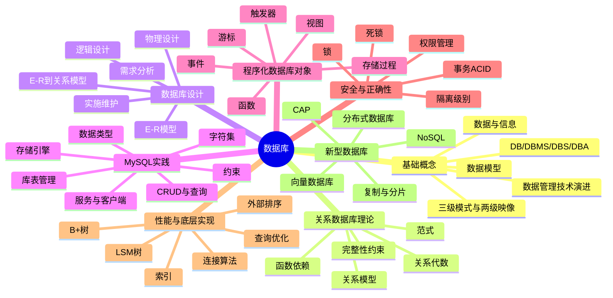

# 数据库课程学习笔记

这组笔记按 `课件` 的章节整理，把每章的概念、规则、语法和易错点整理成便于复习的知识图谱。建议先看本文件的总览，再按章节文件逐个复习。

## 文件导航

| 章节 | 学习笔记 |
| --- | --- |
| 第 1 章 | [01-数据库系统概论.md](01-数据库系统概论.md) |
| 第 2 章 | [02-关系数据库基本原理.md](02-关系数据库基本原理.md) |
| 第 3 章 | [03-数据库设计方法.md](03-数据库设计方法.md) |
| 第 4 章 | [04-MySQL概述.md](04-MySQL概述.md) |
| 第 5 章 | [05-数据库和表的管理.md](05-数据库和表的管理.md) |
| 第 6 章 | [06-数据查询与管理.md](06-数据查询与管理.md) |
| 第 7 章 | [07-索引与视图.md](07-索引与视图.md) |
| 第 8 章 | [08-存储过程与函数.md](08-存储过程与函数.md) |
| 第 9 章 | [09-触发器权限事务并发.md](09-触发器权限事务并发.md) |
| 第 10 章 | [10-查询执行.md](10-查询执行.md) |
| 第 11 章 | [11-查询优化.md](11-查询优化.md) |
| 第 12 章 | [12-分布式与NoSQL数据库.md](12-分布式与NoSQL数据库.md) |

## 全局知识图谱

## 复习路线

1. 先用第 1 章建立语言体系：数据、信息、数据库、DBMS、三级模式、数据模型。
2. 再用第 2 章掌握关系模型理论：关系代数、函数依赖、范式、完整性。这是数据库设计和 SQL 查询的理论根。
3. 第 3 章把理论变成设计流程：需求分析、E-R 图、E-R 到关系表、物理设计。
4.  4 到 6 章进入 MySQL 实操：服务、库表、数据类型、约束、增删改查。
5.  7 到 9 章复习数据库对象与正确性：索引、视图、存储过程、函数、触发器、权限、事务、锁。
6.  10 和 11 章理解 DBMS 为什么能跑得快：执行算法、外排序、连接、查询优化。
7. 第 12 章把单机关系数据库扩展到分布式与 NoSQL，重点抓复制、分片、CAP 和不同 NoSQL 类型的适用场景。

## 高频主线

| 主线 | 关键问题 | 关联章节 |
| --- | --- | --- |
| 数据抽象 | 现实世界如何变成表？ | 1, 3 |
| 关系理论 | 表的形式化基础是什么？ | 2 |
| 设计质量 | 如何减少冗余和异常？ | 2, 3 |
| SQL 实操 | 如何定义结构并操作数据？ | 4, 5, 6 |
| 性能 | 为什么索引、排序、连接会影响速度？ | 7, 10, 11 |
| 正确性 | 并发和故障下如何保证数据可信？ | 9 |
| 扩展性 | 单机不够时怎样扩展？ | 12 |

## 考前检查清单

- 能区分 DB、DBMS、DBS、DBA。
- 能画出三级模式、两级映像，并说明逻辑独立性与物理独立性。
- 能写出关系代数中选择、投影、连接、除的含义。
- 能根据函数依赖求候选码、判断 1NF/2NF/3NF/BCNF。
- 能把常见 E-R 联系转换为关系模式。
- 能熟练写 `CREATE DATABASE`、`CREATE TABLE`、`ALTER TABLE`、`INSERT`、`UPDATE`、`DELETE`、`SELECT`。
- 能解释 `WHERE` 与 `HAVING`、`DELETE` 与 `TRUNCATE`、`CHAR` 与 `VARCHAR`、`FLOAT` 与 `DECIMAL`。
- 能说明 B+树复合索引最左匹配和覆盖索引。
- 能写出存储过程、函数、触发器、事件的基本语法。
- 能解释 ACID、四种隔离级别、脏读、不可重复读、幻读、死锁。
- 能说明外部排序、嵌套循环连接、排序归并连接、哈希连接、索引连接的适用条件。
- 能说明逻辑优化与物理优化的区别。
- 能用 CAP 解释分布式数据库在一致性、可用性、分区容错性之间的取舍。

# 我们的project
- [PJ的仓库](https://github.com/Loong-C/FDU-Database)