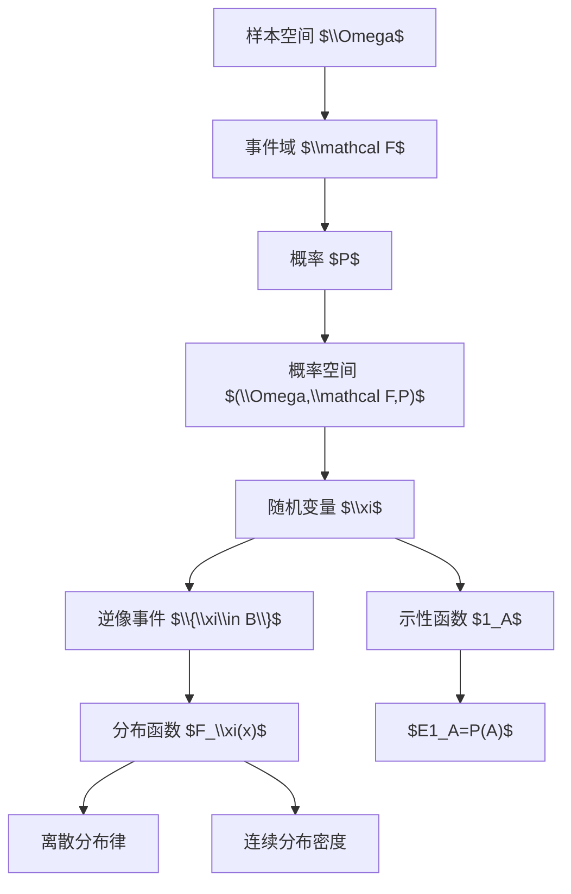

# 02 概率空间与随机变量

本章把第 1 章的初等概率提升为公理化框架。核心对象从“有限样本空间上的等可能事件”变成一般概率空间 $(\Omega,\mathcal F,P)$，随后引入随机变量和分布函数。

## 1. 为什么需要概率空间

在有限古典概型中，可以把 $\Omega$ 的所有子集都看作事件。但在无限样本空间中，尤其是 $\Omega=\mathbb R$ 或 $\mathbb R^n$ 时，并非所有子集都适合赋予概率。为避免集合论病态问题，需要指定一个事件集合族 $\mathcal F$。

概率空间由三部分组成：

$$
(\Omega,\mathcal F,P).
$$

- $\Omega$：样本空间。
- $\mathcal F$：事件域，规定哪些集合是事件。
- $P$：概率测度，给每个事件赋概率。

## 2. $\sigma$-域

集合族 $\mathcal F$ 称为 $\Omega$ 上的 $\sigma$-域，如果满足：

1. $\Omega\in\mathcal F$。
2. 若 $A\in\mathcal F$，则 $A^c\in\mathcal F$。
3. 若 $A_1,A_2,\ldots\in\mathcal F$，则 $\bigcup_{n=1}^{\infty}A_n\in\mathcal F$。

由这些条件可以推出：

$$
\varnothing\in\mathcal F,\qquad
\bigcap_{n=1}^{\infty}A_n\in\mathcal F.
$$

若 $A,B\in\mathcal F$，则：

$$
A\cup B,\quad A\cap B,\quad A-B,\quad A\triangle B
\in\mathcal F.
$$

$\sigma$-域的作用是保证我们关心的事件经过可数次并、交、补之后仍然是事件。

## 3. 生成的 $\sigma$-域

给定一个集合族 $\mathcal A$，包含 $\mathcal A$ 的最小 $\sigma$-域记为：

$$
\sigma(\mathcal A).
$$

它可以理解为“由 $\mathcal A$ 中集合通过可数并、交、补所能生成的全部事件”。

实数上的 Borel $\sigma$-域：

$$
\mathcal B(\mathbb R)=\sigma\{(a,b):a<b\}.
$$

等价地，也可由开集、闭集、半开区间或形如 $(-\infty,x]$ 的集合生成。

## 4. 概率测度

定义在 $\mathcal F$ 上的函数 $P:\mathcal F\to[0,1]$ 称为概率，如果：

$$
P(\Omega)=1.
$$

并且对两两互不相容的事件列 $A_1,A_2,\ldots$ 有可列可加性：

$$
P\left(\bigcup_{n=1}^{\infty}A_n\right)
=\sum_{n=1}^{\infty}P(A_n).
$$

概率的常用性质：

$$
P(\varnothing)=0.
$$

若 $A\subset B$，则：

$$
P(B-A)=P(B)-P(A),\qquad P(A)\le P(B).
$$

有限可加性：

$$
A\cap B=\varnothing
\Rightarrow P(A\cup B)=P(A)+P(B).
$$

连续性：

若 $A_n\uparrow A$，即 $A_1\subset A_2\subset\cdots$ 且 $A=\bigcup_n A_n$，则：

$$
P(A_n)\uparrow P(A).
$$

若 $A_n\downarrow A$，即 $A_1\supset A_2\supset\cdots$ 且 $A=\bigcap_n A_n$，则：

$$
P(A_n)\downarrow P(A).
$$

这些连续性是后面极限定理的基础。

## 5. 离散概率空间

若样本空间可数：

$$
\Omega=\{\omega_1,\omega_2,\ldots\},
$$

且给定非负数 $p_i$ 满足：

$$
p_i\ge 0,\qquad \sum_i p_i=1,
$$

则可定义：

$$
P(A)=\sum_{\omega_i\in A}p_i.
$$

这就是离散概率空间。若 $\Omega$ 有限且 $p_i=1/|\Omega|$，就回到古典概型。

## 6. 随机变量

随机变量不是“随机的变量”，而是定义在样本空间上的可测函数。

设 $(\Omega,\mathcal F,P)$ 是概率空间。函数 $\xi:\Omega\to\mathbb R$ 称为随机变量，如果对任意 $x\in\mathbb R$：

$$
\{\omega:\xi(\omega)\le x\}\in\mathcal F.
$$

等价地，要求对任意 Borel 集 $B\in\mathcal B(\mathbb R)$：

$$
\{\omega:\xi(\omega)\in B\}\in\mathcal F.
$$

记作：

$$
\{\xi\in B\}=\xi^{-1}(B).
$$

随机变量的意义：

- 它把抽象样本点映成数值。
- 它把实数轴上的集合拉回为样本空间中的事件。
- 因此可以谈 $P(\xi\le x)$、$P(a<\xi\le b)$ 等概率。

常用事实：

若 $\xi,\eta$ 是随机变量，$a,b\in\mathbb R$，则 $a\xi+b\eta$、$\xi\eta$、$\max(\xi,\eta)$、$\min(\xi,\eta)$ 在通常条件下仍是随机变量。

## 7. 示性函数

事件 $A$ 的示性函数定义为：

$$
1_A(\omega)=
\begin{cases}
1,& \omega\in A,\\
0,& \omega\notin A.
\end{cases}
$$

它是最简单的随机变量。

事件运算和示性函数的对应关系：

$$
1_{A^c}=1-1_A.
$$

$$
1_{A\cap B}=1_A1_B.
$$

$$
1_{A\cup B}=1_A+1_B-1_A1_B.
$$

若 $A\cap B=\varnothing$，则：

$$
1_{A\cup B}=1_A+1_B.
$$

示性函数把事件问题转化为随机变量问题。后面用期望时有：

$$
E1_A=P(A).
$$

这是概率和期望之间最重要的桥梁之一。

## 8. 分布函数

随机变量 $\xi$ 的分布函数定义为：

$$
F_\xi(x)=P(\xi\le x),\qquad x\in\mathbb R.
$$

分布函数完全刻画一维随机变量的分布。

分布函数的基本性质：

1. 单调不减：若 $x\le y$，则 $F(x)\le F(y)$。
2. 右连续：$F(x+)=F(x)$。
3. 左极限存在：$F(x-)$ 存在。
4. 边界：

$$
\lim_{x\to-\infty}F(x)=0,\qquad
\lim_{x\to+\infty}F(x)=1.
$$

区间概率：

$$
P(a<\xi\le b)=F(b)-F(a).
$$

点概率：

$$
P(\xi=a)=F(a)-F(a-).
$$

因此，分布函数的跳跃大小就是随机变量在该点的概率质量。

## 9. 离散随机变量的分布律

若 $\xi$ 只取有限或可数个值 $x_1,x_2,\ldots$，称为离散随机变量。它的分布律为：

$$
P(\xi=x_k)=p_k,\qquad p_k\ge 0,\qquad \sum_k p_k=1.
$$

分布函数为：

$$
F(x)=\sum_{x_k\le x}p_k.
$$

离散随机变量的分布函数是阶梯函数。

## 10. 常见离散分布

单点分布：

$$
P(\xi=a)=1.
$$

Bernoulli 分布：

$$
P(\xi=1)=p,\qquad P(\xi=0)=1-p.
$$

二项分布：

$$
P(\xi=k)=\binom nk p^k(1-p)^{n-k},\qquad k=0,\ldots,n.
$$

超几何分布：

$$
P(\xi=k)=\frac{\binom Mk\binom{N-M}{n-k}}{\binom Nn}.
$$

Poisson 分布：

$$
P(\xi=k)=e^{-\lambda}\frac{\lambda^k}{k!},\qquad k=0,1,2,\ldots.
$$

几何分布，以首次成功所需试验次数为定义：

$$
P(\xi=k)=(1-p)^{k-1}p,\qquad k=1,2,\ldots.
$$

离散均匀分布：

$$
P(\xi=k)=\frac{1}{n},\qquad k=1,2,\ldots,n.
$$

## 11. 随机变量和分布的关系

同一个随机变量一定有唯一分布函数，但不同概率空间上的随机变量可能有相同分布。

例如抛硬币空间上 $\xi$ 表示是否正面，另一个抽球空间上 $\eta$ 表示是否抽到红球。只要：

$$
P(\xi=1)=P(\eta=1)=p,
$$

它们就有相同 Bernoulli 分布。概率论中很多定理只依赖分布，而不依赖样本空间的具体样子。

## 12. 本章知识图谱

## 13. 解题要点

判断一个表达是否合法：

- 是否是事件，即是否属于 $\mathcal F$。
- 是否是随机变量，即形如 $\{\xi\le x\}$ 的集合是否可测。
- 是否是分布函数，即是否单调、右连续、边界为 $0$ 和 $1$。

从分布函数求概率：

$$
P(a<\xi\le b)=F(b)-F(a).
$$

从点概率看跳跃：

$$
P(\xi=a)=F(a)-F(a-).
$$

从分布律写分布函数：

$$
F(x)=\sum_{x_k\le x}p_k.
$$

## 14. 本章易错点

- 把随机变量当成样本点。随机变量是函数，样本点是函数的输入。
- 忘记可测性条件。不是任意函数都能当随机变量。
- 把 $F(a)$ 当成 $P(\xi<a)$。分布函数定义是 $P(\xi\le a)$。
- 忽略分布函数右连续。
- 混淆 $P(\xi=a)$ 与 $P(\xi\le a)$。

## 15. 本章小结

第 2 章完成概率论语言的升级：概率空间给出严格的事件框架，随机变量把样本点转成数值，分布函数把随机变量的概率规律压缩成一个函数。后续的条件概率、期望、密度、随机向量和极限定理都建立在这一章的语言上。

