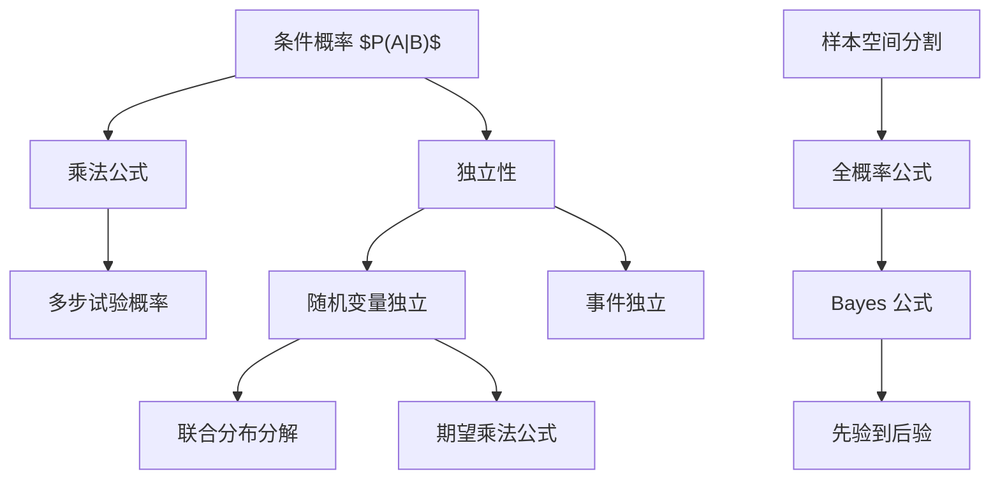

# 03 条件概率、全概率公式与独立性

本章研究“知道一部分信息之后，概率如何改变”。条件概率、全概率公式、Bayes 公式和独立性是一组概念：前三者处理信息更新，独立性描述信息不更新。

## 1. 条件概率

设 $P(B)>0$。在事件 $B$ 已经发生的条件下，事件 $A$ 发生的条件概率定义为：

$$
P(A\mid B)=\frac{P(A\cap B)}{P(B)}.
$$

直观上，原来的样本空间 $\Omega$ 被缩小为 $B$，概率重新归一化。

固定 $B$ 后，$P(\cdot\mid B)$ 仍然是概率：

$$
P(\Omega\mid B)=1.
$$

若 $A_1,A_2,\ldots$ 两两互不相容，则：

$$
P\left(\bigcup_{n=1}^{\infty}A_n\mid B\right)
=\sum_{n=1}^{\infty}P(A_n\mid B).
$$

乘法公式：

$$
P(A\cap B)=P(B)P(A\mid B)=P(A)P(B\mid A).
$$

多事件乘法公式：

$$
P(A_1\cap\cdots\cap A_n)
=P(A_1)P(A_2\mid A_1)\cdots
P(A_n\mid A_1\cap\cdots\cap A_{n-1}).
$$

## 2. 条件概率的常见误区

条件概率不是因果关系。$P(A\mid B)$ 大不代表 $B$ 导致 $A$，只表示在 $B$ 发生的子样本空间中 $A$ 的比例大。

一般情况下：

$$
P(A\mid B)\ne P(B\mid A).
$$

二者通过 Bayes 公式联系，而不是直接相等。

条件概率也不是简单的“把概率相乘”。只有通过交事件才能连接：

$$
P(A\cap B)=P(A)P(B\mid A).
$$

## 3. Pólya urn 模型

Pólya 模型是条件概率的典型例子。设盒中初始有 $r$ 个红球、$b$ 个黑球。每次抽出一个球后放回，并额外放入 $c$ 个同色球。这样后续抽球概率取决于之前结果。

若前 $n$ 次中有 $k$ 次红球、$n-k$ 次黑球，则某一具体顺序的概率为：

$$
\frac{r(r+c)\cdots(r+(k-1)c)\,b(b+c)\cdots(b+(n-k-1)c)}
{(r+b)(r+b+c)\cdots(r+b+(n-1)c)}.
$$

它只依赖红球次数 $k$，不依赖红黑出现的具体顺序。因此：

$$
P(\text{前 }n\text{ 次有 }k\text{ 次红球})
=\binom nk
\frac{\prod_{i=0}^{k-1}(r+ic)\prod_{j=0}^{n-k-1}(b+jc)}
{\prod_{\ell=0}^{n-1}(r+b+\ell c)}.
$$

当 $c=0$ 时退化为有放回独立抽样，对应二项分布。当 $c>0$ 时，抽样之间不独立。

## 4. 有效分割

事件列 $B_1,B_2,\ldots$ 称为样本空间的一个分割，如果：

1. $B_i\cap B_j=\varnothing$，$i\ne j$。
2. $\bigcup_i B_i=\Omega$。
3. $P(B_i)>0$，用于条件概率公式时通常要求正概率。

它把样本空间拆成互不重叠的情形。全概率公式和 Bayes 公式都建立在分割上。

## 5. 全概率公式

若 $\{B_i\}$ 是 $\Omega$ 的一个可数分割，且 $P(B_i)>0$，则对任意事件 $A$：

$$
P(A)=\sum_i P(B_i)P(A\mid B_i).
$$

证明思路：

$$
A=A\cap\Omega
=A\cap\left(\bigcup_i B_i\right)
=\bigcup_i(A\cap B_i),
$$

且 $A\cap B_i$ 两两互不相容，所以：

$$
P(A)=\sum_i P(A\cap B_i)
=\sum_i P(B_i)P(A\mid B_i).
$$

使用全概率公式的信号：

- 总体概率难求。
- 可以按原因、来源、类型、阶段拆分。
- 每个条件下的概率容易求。

## 6. Bayes 公式

若 $\{B_i\}$ 是一个分割，且 $P(A)>0$，则：

$$
P(B_j\mid A)
=\frac{P(B_j)P(A\mid B_j)}
{\sum_i P(B_i)P(A\mid B_i)}.
$$

Bayes 公式把“由原因推结果”的概率反过来，变成“看到结果后判断原因”的概率。

术语：

- $P(B_j)$：先验概率。
- $P(A\mid B_j)$：似然。
- $P(B_j\mid A)$：后验概率。
- 分母 $P(A)$：证据概率或归一化常数。

两原因情形中：

$$
P(B\mid A)=
\frac{P(B)P(A\mid B)}
{P(B)P(A\mid B)+P(B^c)P(A\mid B^c)}.
$$

后验赔率形式：

$$
\frac{P(B\mid A)}{P(B^c\mid A)}
=\frac{P(B)}{P(B^c)}
\cdot
\frac{P(A\mid B)}{P(A\mid B^c)}.
$$

这说明 Bayes 更新是“先验赔率乘以似然比”。

## 7. 两个事件的独立性

事件 $A$ 与 $B$ 独立，如果：

$$
P(A\cap B)=P(A)P(B).
$$

若 $P(B)>0$，这等价于：

$$
P(A\mid B)=P(A).
$$

也就是说，知道 $B$ 发生并不改变 $A$ 的概率。

若 $A$ 与 $B$ 独立，则以下事件对也独立：

$$
A^c\text{ 与 }B,\qquad A\text{ 与 }B^c,\qquad A^c\text{ 与 }B^c.
$$

互不相容和独立不能混淆：

- 若 $A\cap B=\varnothing$ 且 $P(A),P(B)>0$，则 $A,B$ 不独立。
- 互不相容表示不能同时发生。
- 独立表示互不影响概率。

## 8. 多个事件的独立性

事件 $A_1,\ldots,A_n$ 相互独立，如果对任意非空指标集 $I\subset\{1,\ldots,n\}$：

$$
P\left(\bigcap_{i\in I}A_i\right)
=\prod_{i\in I}P(A_i).
$$

注意：两两独立不一定推出相互独立。

典型反例：抛两枚公平硬币。设：

- $A$：第一枚为正面。
- $B$：第二枚为正面。
- $C$：两枚结果相同。

则 $A,B,C$ 两两独立，但：

$$
P(A\cap B\cap C)=\frac14
\ne
\frac12\cdot\frac12\cdot\frac12
=\frac18.
$$

## 9. 随机变量的独立性

随机变量 $\xi,\eta$ 独立，如果对任意 Borel 集 $A,B$：

$$
P(\xi\in A,\eta\in B)=P(\xi\in A)P(\eta\in B).
$$

用分布函数表示，$\xi,\eta$ 独立等价于：

$$
F_{\xi,\eta}(x,y)=F_\xi(x)F_\eta(y),\qquad \forall x,y.
$$

若是离散随机变量，等价于：

$$
P(\xi=x_i,\eta=y_j)
=P(\xi=x_i)P(\eta=y_j)
\quad\text{对所有 }i,j.
$$

若有联合密度，独立等价于：

$$
f_{\xi,\eta}(x,y)=f_\xi(x)f_\eta(y)
\quad\text{几乎处处成立}.
$$

若 $\xi,\eta$ 独立，且 $g,h$ 为可测函数，则：

$$
g(\xi)\text{ 与 }h(\eta)\text{ 独立}.
$$

## 10. 独立性和乘法

独立事件：

$$
P(A\cap B)=P(A)P(B).
$$

独立随机变量的函数期望：

$$
E[g(\xi)h(\eta)]
=E[g(\xi)]E[h(\eta)]
$$

在期望存在时成立。特别地：

$$
E(\xi\eta)=E\xi\,E\eta.
$$

这会在第 4 章用于方差和协方差。

## 11. 本章知识图谱

## 12. 解题套路

条件概率题：

1. 明确条件事件 $B$。
2. 写 $P(A\mid B)=P(A\cap B)/P(B)$。
3. 若有多步过程，用乘法公式展开交事件。

全概率题：

1. 找分割 $\{B_i\}$。
2. 写出每个 $P(B_i)$ 和 $P(A\mid B_i)$。
3. 求和得到 $P(A)$。

Bayes 题：

1. 明确原因类 $B_i$ 和观察结果 $A$。
2. 用全概率公式求分母 $P(A)$。
3. 计算 $P(B_j\mid A)$。

独立性题：

1. 写出定义式。
2. 事件题检查 $P(A\cap B)$ 是否等于 $P(A)P(B)$。
3. 随机变量题检查联合分布是否分解。
4. 多事件题必须检查所有非空子集，不要只查两两。

## 13. 易错点

- 把 $P(A\mid B)$ 和 $P(B\mid A)$ 混为一谈。
- 分割事件没有覆盖整个样本空间。
- Bayes 公式分母漏掉某些原因。
- 把互不相容当成独立。
- 用两两独立替代相互独立。
- 判断随机变量独立时只看相关系数为 $0$。相关系数为 $0$ 只是“不相关”，不是独立。

## 14. 本章小结

条件概率将概率限制到已知信息下的子样本空间。全概率公式把复杂概率拆到若干条件情形中，Bayes 公式则完成从结果到原因的反推。独立性是条件概率不改变原概率的特殊情形，也是后续期望乘法、卷积、特征函数和极限定理的核心条件。

