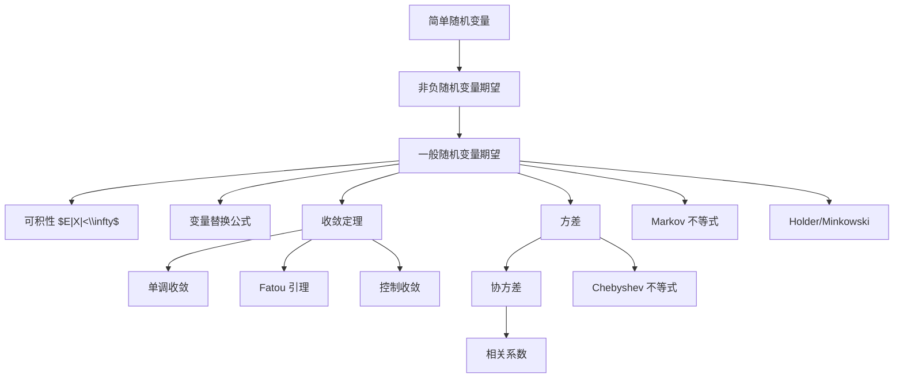

# 04 数学期望、方差与不等式

本章把随机变量的分布压缩成数值特征。期望描述平均水平，方差描述波动，不等式给出尾概率估计。讲义采用从简单随机变量到非负随机变量、再到一般随机变量的路线，这是概率论中测度积分思想的入口。

## 1. 简单随机变量

设 $(\Omega,\mathcal F,P)$ 是概率空间。若随机变量 $\xi$ 只取有限个值，可以写成：

$$
\xi=\sum_{i=1}^{n}x_i1_{A_i},
$$

其中 $A_i\in\mathcal F$ 两两互不相容，且 $\bigcup_i A_i=\Omega$。

简单随机变量的数学期望定义为：

$$
E\xi=\sum_{i=1}^{n}x_iP(A_i).
$$

若同一个简单随机变量有不同表示，期望定义不依赖表示方式。原因是可以把不同划分共同细化到交集划分上。

基本性质：

$$
E(c)=c.
$$

$$
E(a\xi+b\eta)=aE\xi+bE\eta.
$$

若 $\xi\ge 0$，则 $E\xi\ge 0$。

若 $\xi\le \eta$，则 $E\xi\le E\eta$。

示性函数的期望：

$$
E1_A=P(A).
$$

这条公式把事件概率纳入期望框架。

## 2. 非负随机变量的期望

若 $\xi\ge 0$，定义：

$$
E\xi=\sup\{E\eta:0\le \eta\le \xi,\ \eta\text{ 是简单随机变量}\}.
$$

这个定义允许 $E\xi=+\infty$。

它的思想是用一列递增的简单随机变量从下方逼近 $\xi$。若 $\eta_n\uparrow \xi$，则：

$$
E\xi=\lim_{n\to\infty}E\eta_n.
$$

对非负随机变量，线性仍成立：

$$
E(a\xi+b\eta)=aE\xi+bE\eta,\qquad a,b\ge 0.
$$

单调性也成立：

$$
0\le \xi\le \eta\Rightarrow E\xi\le E\eta.
$$

## 3. 一般随机变量的期望

对一般随机变量 $\xi$，定义正负部分：

$$
\xi^+=\max(\xi,0),\qquad
\xi^-=\max(-\xi,0).
$$

于是：

$$
\xi=\xi^+-\xi^-,\qquad |\xi|=\xi^+ + \xi^-.
$$

如果 $E\xi^+$ 与 $E\xi^-$ 不同时为 $+\infty$，定义：

$$
E\xi=E\xi^+-E\xi^-.
$$

若：

$$
E|\xi|<\infty,
$$

称 $\xi$ 可积。此时 $E\xi$ 必为有限实数，并且：

$$
|E\xi|\le E|\xi|.
$$

## 4. 期望的基本性质

线性性：

$$
E(a\xi+b\eta)=aE\xi+bE\eta.
$$

单调性：

$$
\xi\le\eta \Rightarrow E\xi\le E\eta.
$$

严格正性的一种常用形式：

$$
\xi\ge 0,\ E\xi=0\Rightarrow \xi=0\ \text{a.s.}
$$

独立乘法公式：

若 $\xi,\eta$ 独立，且期望存在，则：

$$
E(\xi\eta)=E\xi\,E\eta.
$$

更一般地，若 $g(\xi)$ 与 $h(\eta)$ 可积，则：

$$
E[g(\xi)h(\eta)]
=E[g(\xi)]E[h(\eta)].
$$

## 5. 不相关

若 $\xi,\eta$ 二阶可积，即 $E\xi^2,E\eta^2<\infty$，定义协方差：

$$
Cov(\xi,\eta)=E[(\xi-E\xi)(\eta-E\eta)].
$$

等价公式：

$$
Cov(\xi,\eta)=E(\xi\eta)-E\xi\,E\eta.
$$

若：

$$
Cov(\xi,\eta)=0,
$$

称 $\xi,\eta$ 不相关。

独立且二阶可积推出不相关，但不相关一般不推出独立。

## 6. 单调收敛定理

若：

$$
0\le \xi_1\le \xi_2\le\cdots,\qquad \xi_n\uparrow \xi,
$$

则：

$$
E\xi_n\uparrow E\xi.
$$

也就是：

$$
E\left(\lim_{n\to\infty}\xi_n\right)
=\lim_{n\to\infty}E\xi_n.
$$

单调收敛定理适合处理非负项级数、逐步逼近和截断。

典型用法：

$$
E\left(\sum_{n=1}^{\infty}\xi_n\right)
=\sum_{n=1}^{\infty}E\xi_n,
\qquad \xi_n\ge 0.
$$

## 7. Fatou 引理与控制收敛

Fatou 引理：

若 $\xi_n\ge 0$，则：

$$
E\left(\liminf_{n\to\infty}\xi_n\right)
\le
\liminf_{n\to\infty}E\xi_n.
$$

它的常见作用是把极限放进期望时给出下界。

控制收敛定理：

若 $\xi_n\to \xi$ a.s.，且存在可积随机变量 $\eta$ 使得：

$$
|\xi_n|\le \eta,\qquad E\eta<\infty,
$$

则：

$$
E|\xi_n-\xi|\to 0,\qquad E\xi_n\to E\xi.
$$

它的作用是说明在“有统一可积控制”的情况下，极限和期望可以交换。

## 8. 几乎处处收敛

随机变量列 $\xi_n$ 几乎处处收敛到 $\xi$，记为：

$$
\xi_n\xrightarrow{a.s.}\xi,
$$

如果：

$$
P\left(\omega:\lim_{n\to\infty}\xi_n(\omega)=\xi(\omega)\right)=1.
$$

如果某个性质在概率为 $1$ 的集合上成立，称它几乎处处成立，记为 a.s.。

常用原则：

- 概率为 $0$ 的异常集合可以忽略。
- 若 $\xi=\eta$ a.s.，则它们有相同分布。
- 若 $\xi=\eta$ a.s. 且可积，则 $E\xi=E\eta$。

## 9. 离散随机变量的期望计算

若 $\xi$ 取值 $x_k$，分布律为 $P(\xi=x_k)=p_k$，则：

$$
E\xi=\sum_k x_kp_k,
$$

当且仅当：

$$
\sum_k |x_k|p_k<\infty
$$

时 $\xi$ 可积。

变量替换公式，也称 LOTUS：

$$
E\varphi(\xi)=\sum_k \varphi(x_k)P(\xi=x_k),
$$

前提是右端绝对收敛或 $\varphi(\xi)\ge 0$。

尾和公式。若 $\xi$ 是非负整数值随机变量，则：

$$
E\xi=\sum_{k=1}^{\infty}P(\xi\ge k).
$$

证明思路：

$$
\xi=\sum_{k=1}^{\infty}1_{\{\xi\ge k\}},
$$

再用单调收敛定理。

## 10. 连续随机变量的期望计算

若 $\xi$ 有密度 $f$，则：

$$
E\xi=\int_{-\infty}^{\infty}x f(x)\,dx,
$$

前提是：

$$
\int_{-\infty}^{\infty}|x|f(x)\,dx<\infty.
$$

变量替换公式：

$$
E\varphi(\xi)
=\int_{-\infty}^{\infty}\varphi(x)f(x)\,dx.
$$

非负连续随机变量的尾积分公式：

$$
E\xi=\int_0^\infty P(\xi>x)\,dx.
$$

一般随机变量也有：

$$
E\xi^+=\int_0^\infty P(\xi>x)\,dx,
$$

$$
E\xi^-=\int_0^\infty P(\xi<-x)\,dx.
$$

若两者有限，则：

$$
E\xi=\int_0^\infty P(\xi>x)\,dx
-\int_0^\infty P(\xi<-x)\,dx.
$$

## 11. 方差

若 $E\xi^2<\infty$，定义：

$$
Var(\xi)=E[(\xi-E\xi)^2].
$$

常用计算公式：

$$
Var(\xi)=E\xi^2-(E\xi)^2.
$$

性质：

$$
Var(\xi)\ge 0.
$$

$$
Var(c)=0.
$$

$$
Var(a\xi+b)=a^2Var(\xi).
$$

若 $\xi,\eta$ 二阶可积，则：

$$
Var(\xi+\eta)=Var(\xi)+Var(\eta)+2Cov(\xi,\eta).
$$

若 $\xi,\eta$ 不相关，特别是独立，则：

$$
Var(\xi+\eta)=Var(\xi)+Var(\eta).
$$

对有限和：

$$
Var\left(\sum_{i=1}^{n}\xi_i\right)
=\sum_{i=1}^{n}Var(\xi_i)
+2\sum_{i<j}Cov(\xi_i,\xi_j).
$$

若两两不相关：

$$
Var\left(\sum_{i=1}^{n}\xi_i\right)
=\sum_{i=1}^{n}Var(\xi_i).
$$

## 12. 常见分布的期望和方差

Bernoulli 分布 $\xi\sim Bernoulli(p)$：

$$
E\xi=p,\qquad Var(\xi)=p(1-p).
$$

二项分布 $\xi\sim B(n,p)$：

$$
E\xi=np,\qquad Var(\xi)=np(1-p).
$$

证明思路：写成独立 Bernoulli 和：

$$
\xi=\sum_{i=1}^{n}\xi_i.
$$

Poisson 分布 $\xi\sim P(\lambda)$：

$$
E\xi=\lambda,\qquad Var(\xi)=\lambda.
$$

几何分布，若 $P(\xi=k)=(1-p)^{k-1}p$，$k\ge 1$，则：

$$
E\xi=\frac1p,\qquad Var(\xi)=\frac{1-p}{p^2}.
$$

超几何分布 $\xi\sim H(N,M,n)$：

$$
E\xi=n\frac{M}{N}.
$$

$$
Var(\xi)=n\frac{M}{N}\left(1-\frac{M}{N}\right)\frac{N-n}{N-1}.
$$

最后一个因子 $\frac{N-n}{N-1}$ 是不放回抽样带来的有限总体修正。

## 13. Cauchy-Schwarz 不等式

若 $E\xi^2<\infty$，$E\eta^2<\infty$，则：

$$
|E(\xi\eta)|\le \sqrt{E\xi^2}\sqrt{E\eta^2}.
$$

特别地：

$$
|Cov(\xi,\eta)|
\le
\sqrt{Var(\xi)}\sqrt{Var(\eta)}.
$$

因此相关系数：

$$
r(\xi,\eta)=\frac{Cov(\xi,\eta)}
{\sqrt{Var(\xi)}\sqrt{Var(\eta)}}
$$

满足：

$$
-1\le r(\xi,\eta)\le 1.
$$

等号通常对应线性关系。

## 14. Markov 与 Chebyshev 不等式

Markov 不等式：

若 $\xi\ge 0$，则对 $a>0$：

$$
P(\xi\ge a)\le \frac{E\xi}{a}.
$$

证明只需：

$$
\xi\ge a1_{\{\xi\ge a\}}.
$$

Chebyshev 不等式：

若 $E\xi=\mu$，$Var(\xi)=\sigma^2<\infty$，则：

$$
P(|\xi-\mu|\ge \varepsilon)
\le
\frac{\sigma^2}{\varepsilon^2}.
$$

它是 Markov 不等式用于 $(\xi-\mu)^2$ 的结果：

$$
P(|\xi-\mu|\ge \varepsilon)
=P((\xi-\mu)^2\ge \varepsilon^2)
\le \frac{E(\xi-\mu)^2}{\varepsilon^2}.
$$

Chebyshev 不等式是大数定律的基本工具。

## 15. Holder 与 Minkowski 不等式

设 $p>1$，$q>1$，且：

$$
\frac1p+\frac1q=1.
$$

Holder 不等式：

$$
E|\xi\eta|
\le
(E|\xi|^p)^{1/p}(E|\eta|^q)^{1/q}.
$$

Cauchy-Schwarz 是 $p=q=2$ 的特例。

Minkowski 不等式：

$$
(E|\xi+\eta|^p)^{1/p}
\le
(E|\xi|^p)^{1/p}
+
(E|\eta|^p)^{1/p}.
$$

因此：

$$
\|\xi\|_p=(E|\xi|^p)^{1/p}
$$

在合适的等价类空间上是范数。

## 16. 本章知识图谱

## 17. 解题模板

求期望：

1. 判断离散还是连续。
2. 写分布律或密度。
3. 用 $E\varphi(\xi)$ 公式。
4. 检查绝对收敛或非负性。

求方差：

1. 先求 $E\xi$。
2. 再求 $E\xi^2$。
3. 用 $Var(\xi)=E\xi^2-(E\xi)^2$。

处理随机和：

1. 能否写成示性函数和或独立变量和。
2. 期望直接线性相加。
3. 方差必须检查协方差或独立性。

用不等式估计尾概率：

1. 非负变量用 Markov。
2. 偏离均值用 Chebyshev。
3. 乘积期望用 Cauchy-Schwarz 或 Holder。
4. $L^p$ 距离用 Minkowski。

## 18. 易错点

- 期望存在不等于绝对期望有限。一般课程中谈线性运算时通常需要可积。
- $E(\xi\eta)=E\xi E\eta$ 需要独立或其他特殊条件。
- 方差不满足线性性，除非有不相关条件。
- 不相关不等于独立。
- 使用控制收敛定理时，控制函数必须可积，不能只要求逐点有界。
- Chebyshev 不等式通常很粗，不能把它当作精确概率。

## 19. 本章小结

数学期望是概率论从“事件”走向“积分”的关键。简单随机变量、非负随机变量、一般随机变量的定义路线保证了期望的严谨性。变量替换公式负责计算，收敛定理负责交换极限与期望，方差和协方差负责描述波动与关系，不等式负责在分布未知时估计概率。
