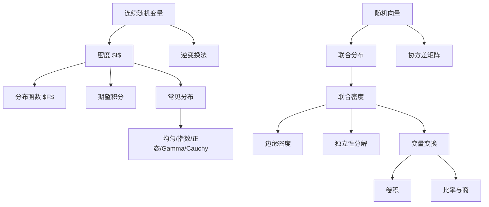

# 05 连续型随机变量与随机向量

本章从一维连续随机变量进入多维随机向量。核心工具是密度函数、分布函数、联合分布、边缘化、独立性和变量变换。讲义中还讨论了和的分布、商的分布以及若干由正态和 Gamma 分布导出的统计分布。

## 1. 连续型随机变量

随机变量 $\xi$ 称为连续型，如果存在非负函数 $f$，使得对任意 $x$：

$$
F(x)=P(\xi\le x)=\int_{-\infty}^{x}f(t)\,dt.
$$

函数 $f$ 称为 $\xi$ 的概率密度函数。

密度的基本性质：

$$
f(x)\ge 0.
$$

$$
\int_{-\infty}^{\infty}f(x)\,dx=1.
$$

区间概率：

$$
P(a\le \xi\le b)=P(a<\xi<b)
=\int_a^b f(x)\,dx.
$$

点概率：

$$
P(\xi=c)=0.
$$

注意：$P(\xi=c)=0$ 不表示事件 $\{\xi=c\}$ 不可能，只表示概率为 $0$。

## 2. 分布函数与密度

若 $F(x)=\int_{-\infty}^x f(t)\,dt$，则 $F$ 连续，且在 $f$ 连续点有：

$$
F'(x)=f(x).
$$

反过来，如果分布函数 $F$ 绝对连续，则存在密度 $f$ 使上式成立。

计算概率时：

$$
P(a<\xi\le b)=F(b)-F(a).
$$

若已知密度，常先积分得到分布函数；若已知分布函数，常对其可导部分求导得到密度。

## 3. 连续变量的函数期望

若 $\xi$ 有密度 $f$，则：

$$
E\varphi(\xi)=\int_{-\infty}^{\infty}\varphi(x)f(x)\,dx.
$$

特别地：

$$
E\xi=\int_{-\infty}^{\infty}x f(x)\,dx.
$$

$$
E\xi^2=\int_{-\infty}^{\infty}x^2 f(x)\,dx.
$$

$$
Var(\xi)=\int_{-\infty}^{\infty}x^2 f(x)\,dx
-\left(\int_{-\infty}^{\infty}x f(x)\,dx\right)^2.
$$

## 4. 均匀分布

若 $\xi$ 在区间 $(a,b)$ 上均匀分布，记作 $\xi\sim U(a,b)$，密度为：

$$
f(x)=
\begin{cases}
\frac{1}{b-a},& a<x<b,\\
0,& \text{其他}.
\end{cases}
$$

分布函数：

$$
F(x)=
\begin{cases}
0,& x\le a,\\
\frac{x-a}{b-a},& a<x<b,\\
1,& x\ge b.
\end{cases}
$$

期望和方差：

$$
E\xi=\frac{a+b}{2},\qquad
Var(\xi)=\frac{(b-a)^2}{12}.
$$

## 5. 指数分布

若 $\xi\sim Exp(\lambda)$，$\lambda>0$，密度为：

$$
f(x)=
\begin{cases}
\lambda e^{-\lambda x},& x>0,\\
0,& x\le 0.
\end{cases}
$$

分布函数：

$$
F(x)=
\begin{cases}
0,& x\le 0,\\
1-e^{-\lambda x},& x>0.
\end{cases}
$$

期望和方差：

$$
E\xi=\frac1\lambda,\qquad
Var(\xi)=\frac1{\lambda^2}.
$$

无记忆性：

$$
P(\xi>s+t\mid \xi>s)=P(\xi>t),\qquad s,t\ge 0.
$$

证明：

$$
P(\xi>s+t\mid \xi>s)
=\frac{e^{-\lambda(s+t)}}{e^{-\lambda s}}
=e^{-\lambda t}.
$$

在连续非负分布中，无记忆性刻画指数分布。

## 6. 正态分布

标准正态分布 $N(0,1)$ 的密度为：

$$
\phi(x)=\frac{1}{\sqrt{2\pi}}e^{-x^2/2}.
$$

一般正态分布 $\xi\sim N(\mu,\sigma^2)$，$\sigma>0$，密度为：

$$
f(x)=\frac{1}{\sqrt{2\pi}\sigma}
\exp\left(-\frac{(x-\mu)^2}{2\sigma^2}\right).
$$

标准化：

$$
Z=\frac{\xi-\mu}{\sigma}\sim N(0,1).
$$

所以：

$$
P(a<\xi\le b)
=\Phi\left(\frac{b-\mu}{\sigma}\right)
-\Phi\left(\frac{a-\mu}{\sigma}\right),
$$

其中：

$$
\Phi(x)=\int_{-\infty}^{x}\frac{1}{\sqrt{2\pi}}e^{-t^2/2}\,dt.
$$

期望和方差：

$$
E\xi=\mu,\qquad Var(\xi)=\sigma^2.
$$

## 7. Gamma 分布与 $\chi^2$ 分布

若 $\xi\sim \Gamma(r,\lambda)$，其中 $r>0,\lambda>0$，密度为：

$$
f(x)=
\begin{cases}
\frac{\lambda^r}{\Gamma(r)}x^{r-1}e^{-\lambda x},& x>0,\\
0,& x\le 0.
\end{cases}
$$

Gamma 函数：

$$
\Gamma(r)=\int_0^\infty x^{r-1}e^{-x}\,dx.
$$

性质：

$$
\Gamma(r+1)=r\Gamma(r),\qquad
\Gamma(n)=(n-1)!.
$$

期望和方差：

$$
E\xi=\frac r\lambda,\qquad Var(\xi)=\frac r{\lambda^2}.
$$

指数分布是 Gamma 分布的特例：

$$
Exp(\lambda)=\Gamma(1,\lambda).
$$

$\chi^2$ 分布：

若 $Z_1,\ldots,Z_n$ 独立且都服从 $N(0,1)$，则：

$$
\sum_{i=1}^{n}Z_i^2\sim \chi_n^2.
$$

并且：

$$
\chi_n^2\sim \Gamma\left(\frac n2,\frac12\right).
$$

因此：

$$
E\chi_n^2=n,\qquad Var(\chi_n^2)=2n.
$$

## 8. Cauchy 分布

标准 Cauchy 分布密度为：

$$
f(x)=\frac{1}{\pi(1+x^2)},\qquad x\in\mathbb R.
$$

分布函数：

$$
F(x)=\frac12+\frac1\pi\arctan x.
$$

Cauchy 分布没有数学期望，因为：

$$
\int_{-\infty}^{\infty}|x|\frac{1}{\pi(1+x^2)}\,dx=\infty.
$$

典型来源：若 $\xi,\eta$ 独立且均为 $N(0,1)$，则：

$$
\frac{\xi}{\eta}
$$

服从标准 Cauchy 分布。

## 9. 分布函数的实现与逆变换法

给定分布函数 $F$，定义广义逆：

$$
F^{-1}(u)=\inf\{x:F(x)\ge u\},\qquad 0<u<1.
$$

若 $U\sim U(0,1)$，则：

$$
F^{-1}(U)
$$

的分布函数为 $F$。

这就是逆变换抽样法。它说明任意分布函数都可以由一个 $U(0,1)$ 随机变量实现。

常见例子：指数分布。若 $U\sim U(0,1)$，则：

$$
\xi=-\frac1\lambda\ln(1-U)\sim Exp(\lambda).
$$

由于 $1-U$ 与 $U$ 同分布，也常写：

$$
\xi=-\frac1\lambda\ln U.
$$

## 10. 随机向量与联合分布

$n$ 维随机向量：

$$
\xi=(\xi_1,\ldots,\xi_n).
$$

联合分布函数：

$$
F(x_1,\ldots,x_n)
=P(\xi_1\le x_1,\ldots,\xi_n\le x_n).
$$

二维情形中，矩形概率为：

$$
P(a<\xi\le b,\ c<\eta\le d)
=F(b,d)-F(a,d)-F(b,c)+F(a,c).
$$

边缘分布函数：

$$
F_\xi(x)=\lim_{y\to\infty}F_{\xi,\eta}(x,y).
$$

$$
F_\eta(y)=\lim_{x\to\infty}F_{\xi,\eta}(x,y).
$$

## 11. 联合密度与边缘密度

若存在非负函数 $f(x,y)$，使得：

$$
F(x,y)=\int_{-\infty}^{x}\int_{-\infty}^{y}f(u,v)\,dv\,du,
$$

则 $f$ 是 $(\xi,\eta)$ 的联合密度。

边缘密度：

$$
f_\xi(x)=\int_{-\infty}^{\infty}f(x,y)\,dy.
$$

$$
f_\eta(y)=\int_{-\infty}^{\infty}f(x,y)\,dx.
$$

区域概率：

$$
P((\xi,\eta)\in D)=\iint_D f(x,y)\,dx\,dy.
$$

多维连续题最重要的一步通常是画出积分区域 $D$。

## 12. 随机向量的独立性

随机变量 $\xi,\eta$ 独立等价于：

$$
F_{\xi,\eta}(x,y)=F_\xi(x)F_\eta(y).
$$

若存在联合密度，则等价于：

$$
f_{\xi,\eta}(x,y)=f_\xi(x)f_\eta(y)
$$

几乎处处成立。

判断密度分解时要注意支撑区域。如果联合密度表面上可以写成 $g(x)h(y)$，但支撑区域不是直积区域，通常不独立。

例如支撑为三角形：

$$
0<x<y<1
$$

就不是直积区域，通常不能分解为独立变量。

## 13. 多维期望与变量函数

若 $(\xi_1,\ldots,\xi_n)$ 有联合密度 $f$，则：

$$
E\varphi(\xi_1,\ldots,\xi_n)
=
\int_{\mathbb R^n}\varphi(x_1,\ldots,x_n)
f(x_1,\ldots,x_n)\,dx_1\cdots dx_n.
$$

这比先求 $\varphi(\xi)$ 的分布再求期望更直接。

## 14. 变量变换定理

设随机向量 $X=(X_1,\ldots,X_n)$ 有密度 $f_X$。若变换：

$$
Y=g(X)
$$

是一一可微变换，逆变换为 $X=h(Y)$，Jacobian 行列式非零，则 $Y$ 的密度为：

$$
f_Y(y)=f_X(h(y))\left|\det\frac{\partial h}{\partial y}\right|.
$$

二维常见形式：

$$
f_{U,V}(u,v)=f_{X,Y}(x(u,v),y(u,v))
\left|
\frac{\partial(x,y)}{\partial(u,v)}
\right|.
$$

如果只关心 $U=g(X,Y)$ 的分布，常添加辅助变量 $V$，先求 $(U,V)$ 的联合密度，再对 $v$ 积分。

## 15. 协方差、相关系数与协方差矩阵

随机向量 $\xi=(\xi_1,\ldots,\xi_n)$ 的方差向量：

$$
Var(\xi)=(Var(\xi_1),\ldots,Var(\xi_n)).
$$

两个随机变量的协方差：

$$
Cov(\xi,\eta)=E[(\xi-E\xi)(\eta-E\eta)].
$$

相关系数：

$$
r(\xi,\eta)=\frac{Cov(\xi,\eta)}
{\sqrt{Var(\xi)}\sqrt{Var(\eta)}}.
$$

协方差矩阵：

$$
\Sigma=(\sigma_{ij})_{n\times n},\qquad
\sigma_{ij}=Cov(\xi_i,\xi_j).
$$

性质：

$$
\Sigma^\mathsf T=\Sigma.
$$

对任意向量 $a\in\mathbb R^n$：

$$
a^\mathsf T\Sigma a=Var(a^\mathsf T\xi)\ge 0.
$$

所以协方差矩阵是半正定矩阵。

## 16. 二维正态分布

二维正态分布常写为：

$$
f(x,y)=
\frac{1}{2\pi\sigma_1\sigma_2\sqrt{1-\rho^2}}
\exp\left\{
-\frac{1}{2(1-\rho^2)}
\left[
\frac{(x-\mu_1)^2}{\sigma_1^2}
-\frac{2\rho(x-\mu_1)(y-\mu_2)}{\sigma_1\sigma_2}
+\frac{(y-\mu_2)^2}{\sigma_2^2}
\right]
\right\}.
$$

其中：

$$
E\xi=\mu_1,\quad E\eta=\mu_2,\quad
Var(\xi)=\sigma_1^2,\quad Var(\eta)=\sigma_2^2,
$$

并且：

$$
Cov(\xi,\eta)=\rho\sigma_1\sigma_2.
$$

所以相关系数就是 $\rho$。

在联合正态情形中：

$$
\rho=0
\quad\Longleftrightarrow\quad
\xi,\eta\text{ 独立}.
$$

这是正态分布的特殊性质，不能随意推广到一般分布。

## 17. 和的分布与卷积

若 $\xi,\eta$ 独立，密度分别为 $f_\xi,f_\eta$，则：

$$
\zeta=\xi+\eta
$$

的密度为卷积：

$$
f_\zeta(z)=\int_{-\infty}^{\infty}f_\xi(x)f_\eta(z-x)\,dx.
$$

如果不独立，但有联合密度 $f(x,y)$，则：

$$
f_\zeta(z)
=\int_{-\infty}^{\infty}f(x,z-x)\,dx.
$$

常见结论：

- 独立正态之和仍为正态：

$$
N(\mu_1,\sigma_1^2)+N(\mu_2,\sigma_2^2)
=N(\mu_1+\mu_2,\sigma_1^2+\sigma_2^2).
$$

- 相同参数 $\lambda$ 的独立 Gamma 变量之和仍为 Gamma：

$$
\Gamma(r_1,\lambda)+\Gamma(r_2,\lambda)
=\Gamma(r_1+r_2,\lambda).
$$

## 18. Beta 分布与比率

若 $\xi\sim \Gamma(\alpha,\lambda)$，$\eta\sim\Gamma(\beta,\lambda)$ 独立，则：

$$
\frac{\xi}{\xi+\eta}\sim Beta(\alpha,\beta),
$$

其密度为：

$$
f(x)=
\frac{\Gamma(\alpha+\beta)}{\Gamma(\alpha)\Gamma(\beta)}
x^{\alpha-1}(1-x)^{\beta-1},
\qquad 0<x<1.
$$

并且：

$$
\xi+\eta
$$

与：

$$
\frac{\xi}{\xi+\eta}
$$

独立。

特别地，若 $\xi,\eta$ 独立标准正态，则：

$$
\frac{\xi^2}{\xi^2+\eta^2}\sim Beta\left(\frac12,\frac12\right),
$$

密度为：

$$
f(x)=\frac{1}{\pi\sqrt{x(1-x)}},\qquad 0<x<1.
$$

## 19. 商的分布

若 $(\xi,\eta)$ 有联合密度 $f(x,y)$，且 $P(\eta=0)=0$，令：

$$
\zeta=\frac{\xi}{\eta}.
$$

用变换：

$$
u=\frac{x}{y},\qquad v=y,
$$

则：

$$
x=uv,\qquad y=v,
$$

Jacobian 为：

$$
\left|\frac{\partial(x,y)}{\partial(u,v)}\right|=|v|.
$$

因此商的密度为：

$$
f_\zeta(u)=\int_{-\infty}^{\infty} f(uv,v)|v|\,dv.
$$

若 $\xi,\eta$ 独立标准正态，则得到标准 Cauchy 分布：

$$
\frac{\xi}{\eta}\sim Cauchy(0,1).
$$

若 $Z\sim N(0,1)$，$V\sim\chi_n^2$ 且独立，则：

$$
T=\frac{Z}{\sqrt{V/n}}
$$

服从自由度为 $n$ 的 $t$ 分布，密度为：

$$
f_T(t)=
\frac{\Gamma((n+1)/2)}
{\sqrt{n\pi}\Gamma(n/2)}
\left(1+\frac{t^2}{n}\right)^{-(n+1)/2}.
$$

## 20. 本章知识图谱

## 21. 解题模板

一维连续题：

1. 确定密度支撑。
2. 检查密度积分是否为 $1$。
3. 求概率用积分，求期望用 $E\varphi(\xi)$。
4. 求分布函数时分段积分。

二维密度题：

1. 画出支撑区域。
2. 求边缘密度时沿另一个变量积分。
3. 判断独立性时同时检查密度分解和支撑区域是否为直积。
4. 求区域概率时先定积分区域，再定积分次序。

变量变换题：

1. 选新变量并补充辅助变量。
2. 写出逆变换。
3. 求 Jacobian 绝对值。
4. 写联合密度。
5. 对辅助变量积分。

## 22. 易错点

- 连续型随机变量点概率为 $0$，但不能说点事件不可能。
- 密度值可以大于 $1$，概率才必须在 $[0,1]$。
- 联合密度能分解还不够，支撑区域也必须分解为直积。
- 变量变换时忘记 Jacobian。
- 求和的密度时积分限由支撑决定，不能机械写 $-\infty$ 到 $\infty$ 后不处理。
- 正态中“不相关等价独立”只在联合正态条件下成立。

## 23. 本章小结

连续随机变量用密度替代分布律，用积分替代求和。随机向量引入联合分布和联合密度，边缘化负责从整体看局部，独立性负责把整体拆成乘积，变量变换负责构造新分布。卷积、Beta 分布、Cauchy 分布和 $t$ 分布都可以统一放在变量变换框架中理解。

