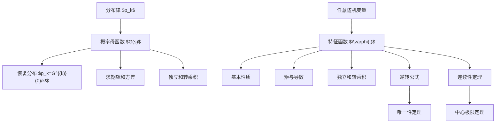

# 06 母函数与特征函数

母函数和特征函数都是“用函数编码分布”的工具。母函数主要适合非负整数值随机变量，特征函数适合一般随机变量。它们的共同优势是：独立和的分布会转化为函数乘积。

## 1. 数列的母函数

给定数列 $a=\{a_n\}_{n\ge 0}$，若幂级数：

$$
G_a(t)=\sum_{n=0}^{\infty}a_nt^n
$$

在 $0$ 的某个邻域内收敛，则称 $G_a$ 为数列 $a$ 的母函数。

母函数把数列编码成函数。通过函数运算，可以研究数列的递推、卷积和求和。

卷积对应乘法：

若：

$$
c_n=\sum_{k=0}^{n}a_kb_{n-k},
$$

则：

$$
G_c(t)=G_a(t)G_b(t).
$$

## 2. 概率母函数

若 $\xi$ 是非负整数值随机变量：

$$
P(\xi=k)=p_k,\qquad k=0,1,2,\ldots,
$$

定义概率母函数：

$$
G_\xi(s)=E(s^\xi)=\sum_{k=0}^{\infty}p_ks^k.
$$

由于 $\sum_kp_k=1$，至少在 $|s|\le 1$ 上有意义，并且：

$$
G_\xi(1)=1.
$$

概率母函数和分布律一一对应：

$$
p_k=\frac{G_\xi^{(k)}(0)}{k!}.
$$

因此，知道 $G_\xi$ 就知道 $\xi$ 的分布。

## 3. 用母函数求矩

一阶导数：

$$
G_\xi'(s)=\sum_{k=1}^{\infty}kp_ks^{k-1}.
$$

所以：

$$
G_\xi'(1)=E\xi,
$$

如果期望有限。

二阶导数：

$$
G_\xi''(1)=E[\xi(\xi-1)].
$$

因此：

$$
E\xi^2=G_\xi''(1)+G_\xi'(1).
$$

方差：

$$
Var(\xi)=G_\xi''(1)+G_\xi'(1)-[G_\xi'(1)]^2.
$$

## 4. 常见离散分布的母函数

Bernoulli 分布：

$$
G(s)=1-p+ps.
$$

二项分布 $\xi\sim B(n,p)$：

$$
G(s)=(1-p+ps)^n.
$$

Poisson 分布 $\xi\sim P(\lambda)$：

$$
G(s)=e^{\lambda(s-1)}.
$$

几何分布，若 $P(\xi=k)=(1-p)^{k-1}p$，$k\ge 1$：

$$
G(s)=\frac{ps}{1-(1-p)s},\qquad |s|<\frac1{1-p}.
$$

若采用从 $0$ 开始的几何分布 $P(\xi=k)=(1-p)^kp$， $k\ge 0$，则：

$$
G(s)=\frac{p}{1-(1-p)s}.
$$

## 5. 独立和与母函数

若 $\xi,\eta$ 独立且均为非负整数值随机变量，则：

$$
G_{\xi+\eta}(s)
=E(s^{\xi+\eta})
=E(s^\xi s^\eta)
=E(s^\xi)E(s^\eta)
=G_\xi(s)G_\eta(s).
$$

推广到 $n$ 个独立变量：

$$
G_{\xi_1+\cdots+\xi_n}(s)
=\prod_{i=1}^{n}G_{\xi_i}(s).
$$

例：若 $\xi_i\sim Bernoulli(p)$ 独立，则：

$$
G_{\sum_i\xi_i}(s)=(1-p+ps)^n,
$$

所以：

$$
\sum_{i=1}^{n}\xi_i\sim B(n,p).
$$

例：若 $\xi_i\sim P(\lambda_i)$ 独立，则：

$$
G_{\sum_i\xi_i}(s)=\prod_i e^{\lambda_i(s-1)}
=e^{(\sum_i\lambda_i)(s-1)}.
$$

所以：

$$
\sum_i\xi_i\sim P\left(\sum_i\lambda_i\right).
$$

## 6. 特征函数

随机变量 $\xi$ 的特征函数定义为：

$$
\varphi_\xi(t)=E(e^{it\xi}),\qquad t\in\mathbb R.
$$

由于：

$$
|e^{it\xi}|=1,
$$

特征函数对任意随机变量都存在。

若 $\xi$ 离散：

$$
\varphi_\xi(t)=\sum_k e^{itx_k}P(\xi=x_k).
$$

若 $\xi$ 有密度 $f$：

$$
\varphi_\xi(t)=\int_{-\infty}^{\infty}e^{itx}f(x)\,dx.
$$

特征函数本质上是分布的 Fourier 变换。

## 7. 特征函数的基本性质

归一性：

$$
\varphi_\xi(0)=1.
$$

有界性：

$$
|\varphi_\xi(t)|\le 1.
$$

共轭对称：

$$
\varphi_\xi(-t)=\overline{\varphi_\xi(t)}.
$$

连续性：

$$
\varphi_\xi(t)
$$

在 $t=0$ 连续，并且在全实轴上一致连续。

线性变换：

若 $\eta=a\xi+b$，则：

$$
\varphi_\eta(t)=e^{itb}\varphi_\xi(at).
$$

独立和：

若 $\xi,\eta$ 独立，则：

$$
\varphi_{\xi+\eta}(t)=\varphi_\xi(t)\varphi_\eta(t).
$$

推广到独立和：

$$
\varphi_{\sum_{k=1}^{n}\xi_k}(t)
=\prod_{k=1}^{n}\varphi_{\xi_k}(t).
$$

## 8. 特征函数与矩

若 $E|\xi|^n<\infty$，则 $\varphi_\xi$ 在 $0$ 附近可求到 $n$ 阶导数，并且：

$$
\varphi_\xi^{(k)}(0)=i^kE\xi^k,\qquad k=1,\ldots,n.
$$

特别地：

$$
\varphi_\xi'(0)=iE\xi.
$$

$$
\varphi_\xi''(0)=-E\xi^2.
$$

因此：

$$
E\xi=\frac{\varphi_\xi'(0)}{i},
\qquad
E\xi^2=-\varphi_\xi''(0).
$$

注意：特征函数总存在，但矩不一定存在。只有在矩存在时，才可以用导数求矩。

## 9. 常见分布的特征函数

单点分布 $\xi=a$：

$$
\varphi(t)=e^{ita}.
$$

Bernoulli 分布：

$$
\varphi(t)=1-p+pe^{it}.
$$

二项分布 $B(n,p)$：

$$
\varphi(t)=(1-p+pe^{it})^n.
$$

Poisson 分布 $P(\lambda)$：

$$
\varphi(t)=\exp\{\lambda(e^{it}-1)\}.
$$

均匀分布 $U(a,b)$：

$$
\varphi(t)=\frac{e^{itb}-e^{ita}}{it(b-a)},\qquad t\ne 0,
$$

并且 $\varphi(0)=1$。

指数分布 $Exp(\lambda)$：

$$
\varphi(t)=\frac{\lambda}{\lambda-it}.
$$

Gamma 分布 $\Gamma(r,\lambda)$：

$$
\varphi(t)=\left(\frac{\lambda}{\lambda-it}\right)^r.
$$

标准正态分布 $N(0,1)$：

$$
\varphi(t)=e^{-t^2/2}.
$$

一般正态分布 $N(\mu,\sigma^2)$：

$$
\varphi(t)=\exp\left(i\mu t-\frac12\sigma^2t^2\right).
$$

标准 Cauchy 分布：

$$
\varphi(t)=e^{-|t|}.
$$

## 10. 逆转公式

特征函数可以反推出分布。一个常用形式是：若 $a<b$ 且 $a,b$ 都是分布函数 $F$ 的连续点，则：

$$
P(a<\xi<b)
=\lim_{T\to\infty}
\frac{1}{2\pi}
\int_{-T}^{T}
\frac{e^{-ita}-e^{-itb}}{it}
\varphi_\xi(t)\,dt.
$$

如果 $\varphi_\xi$ 可积，则 $\xi$ 有连续有界密度：

$$
f(x)=\frac{1}{2\pi}
\int_{-\infty}^{\infty}e^{-itx}\varphi_\xi(t)\,dt.
$$

逆转公式说明特征函数不是只保留部分信息，而是完整编码分布。

## 11. 唯一性定理

若两个随机变量 $\xi,\eta$ 的特征函数相同：

$$
\varphi_\xi(t)=\varphi_\eta(t),\qquad \forall t\in\mathbb R,
$$

则它们同分布：

$$
\xi\stackrel{d}{=}\eta.
$$

反之，若同分布，则特征函数必相同。

唯一性定理是用特征函数证明分布相等的基础。

## 12. 特征函数的局部展开

若 $E\xi=a$， $Var(\xi)=\sigma^2<\infty$，则在 $t\to 0$ 时：

$$
\varphi_\xi(t)
=1+iat-\frac12E\xi^2t^2+o(t^2).
$$

对中心化变量 $\xi-a$：

$$
\varphi_{\xi-a}(t)
=1-\frac12\sigma^2t^2+o(t^2).
$$

这个展开是 $Lindeberg-Levy$ 中心极限定理的证明核心。

若 $\xi_1,\ldots,\xi_n$ 独立同分布， $E\xi_i=a$， $Var(\xi_i)=\sigma^2$，则标准化和：

$$
\eta_n=\frac{\sum_{k=1}^{n}\xi_k-na}{\sigma\sqrt n}
$$

的特征函数为：

$$
\varphi_{\eta_n}(t)
=\left[
\varphi_{\frac{\xi_1-a}{\sigma}}\left(\frac{t}{\sqrt n}\right)
\right]^n.
$$

使用展开：

$$
\varphi_{\frac{\xi_1-a}{\sigma}}(u)
=1-\frac{u^2}{2}+o(u^2),
$$

得到：

$$
\varphi_{\eta_n}(t)
\to e^{-t^2/2}.
$$

再由连续性定理得到中心极限定理。

## 13. 母函数与特征函数的比较

| 工具 | 适用对象 | 定义 | 优势 |
|---|---|---|---|
| 概率母函数 | 非负整数值随机变量 | $G(s)=E(s^\xi)$ | 提取分布律和阶乘矩方便 |
| 矩母函数 | 有指数矩时 | $M(t)=E(e^{t\xi})$ | 求矩方便，但不总存在 |
| 特征函数 | 任意随机变量 | $\varphi(t)=E(e^{it\xi})$ | 总存在，可唯一决定分布 |

母函数偏计算，特征函数偏理论。中心极限定理通常使用特征函数证明，因为特征函数总存在。

## 14. 本章知识图谱

## 15. 解题模板

用母函数：

1. 确认变量是非负整数值。
2. 写出 $G(s)=E(s^\xi)$。
3. 独立和用乘积。
4. 通过识别母函数确定分布，或通过导数求矩。

用特征函数：

1. 写 $\varphi(t)=E(e^{it\xi})$。
2. 线性变换用 $e^{itb}\varphi(at)$。
3. 独立和用乘积。
4. 分布相等用唯一性。
5. 极限分布用连续性定理。

## 16. 易错点

- 概率母函数只适合非负整数值变量。
- 特征函数一定存在，但矩母函数不一定存在。
- 用导数求矩前必须确认相应矩存在。
- 独立和的函数乘积需要独立性。
- 特征函数点态极限要成为某个分布的特征函数，才可推出弱收敛；连续性定理会处理这个条件。

## 17. 本章小结

母函数和特征函数把分布问题转化为函数问题。母函数适合离散计数型随机变量，特征函数适合一般随机变量。二者最重要的共同点是把独立随机变量之和变成函数乘积。特征函数的逆转公式和唯一性定理保证了它完整保存分布信息，连续性定理则把它变成证明极限定理的核心工具。

