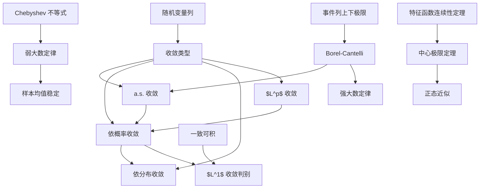

# 07 极限定理

本章研究随机变量列的极限。前半部分建立不同收敛概念及其关系，后半部分给出大数定律和中心极限定理。大数定律说明样本平均稳定，中心极限定理说明标准化误差趋向正态。

## 1. 四种常见收敛

设 $\{\xi_n\}$ 是随机变量列， $\xi$ 是随机变量。

### 1.1 依分布收敛

若 $\xi_n$ 的分布函数 $F_n$ 在 $\xi$ 的分布函数 $F$ 的每个连续点 $x$ 上满足：

$$
F_n(x)\to F(x),
$$

则称 $\xi_n$ 依分布收敛到 $\xi$，记为：

$$
\xi_n\xrightarrow{d}\xi.
$$

依分布收敛只看分布，不要求变量定义在同一个概率空间上。

### 1.2 依概率收敛

若对任意 $\varepsilon>0$：

$$
P(|\xi_n-\xi|\ge \varepsilon)\to 0,
$$

则称 $\xi_n$ 依概率收敛到 $\xi$，记为：

$$
\xi_n\xrightarrow{P}\xi.
$$

依概率收敛表示偏离 $\xi$ 固定幅度的概率趋于 $0$。

### 1.3 几乎处处收敛

若：

$$
P\left(\lim_{n\to\infty}\xi_n=\xi\right)=1,
$$

则称 $\xi_n$ 几乎处处收敛到 $\xi$，记为：

$$
\xi_n\xrightarrow{a.s.}\xi.
$$

它要求除一个概率为 $0$ 的集合外，每条样本路径都收敛。

### 1.4 $L^p$ 收敛

若 $p>0$，且：

$$
E|\xi_n-\xi|^p\to 0,
$$

则称 $\xi_n$ 在 $L^p$ 中收敛到 $\xi$，记为：

$$
\xi_n\xrightarrow{L^p}\xi.
$$

常见的是 $L^1$ 和 $L^2$ 收敛。

## 2. 收敛关系

基本关系：

$$
\xi_n\xrightarrow{a.s.}\xi
\Rightarrow
\xi_n\xrightarrow{P}\xi
\Rightarrow
\xi_n\xrightarrow{d}\xi.
$$

若：

$$
\xi_n\xrightarrow{L^p}\xi,
$$

则：

$$
\xi_n\xrightarrow{P}\xi.
$$

证明用 Markov 不等式：

$$
P(|\xi_n-\xi|\ge \varepsilon)
\le
\frac{E|\xi_n-\xi|^p}{\varepsilon^p}.
$$

若极限是常数 $c$，则：

$$
\xi_n\xrightarrow{d}c
\Longleftrightarrow
\xi_n\xrightarrow{P}c.
$$

## 3. 集合列的上下极限

事件列 $\{A_n\}$ 的上极限：

$$
\limsup_{n\to\infty}A_n
=\bigcap_{n=1}^{\infty}\bigcup_{k=n}^{\infty}A_k.
$$

它表示“ $A_n$ 发生无穷多次”。

下极限：

$$
\liminf_{n\to\infty}A_n
=\bigcup_{n=1}^{\infty}\bigcap_{k=n}^{\infty}A_k.
$$

它表示“从某一项开始 $A_n$ 总发生”。

若：

$$
\limsup A_n=\liminf A_n,
$$

则称事件列极限存在。

## 4. Borel-Cantelli 引理

第一 $Borel-Cantelli$ 引理：

若：

$$
\sum_{n=1}^{\infty}P(A_n)<\infty,
$$

则：

$$
P(A_n\ \text{发生无穷多次})=0.
$$

即：

$$
P(\limsup A_n)=0.
$$

第二 $Borel-Cantelli$ 引理：

若事件 $A_n$ 相互独立，且：

$$
\sum_{n=1}^{\infty}P(A_n)=\infty,
$$

则：

$$
P(\limsup A_n)=1.
$$

第一引理常用于证明几乎处处收敛。常见套路是令：

$$
A_n(\varepsilon)=\{|\xi_n-\xi|\ge \varepsilon\}.
$$

如果：

$$
\sum_{n=1}^{\infty}P(A_n(\varepsilon))<\infty
$$

对足够多的 $\varepsilon$ 成立，则可推出 $\xi_n\to \xi$ a.s.。

## 5. 由概率和推出几乎处处收敛

若对任意 $\varepsilon>0$：

$$
\sum_{n=1}^{\infty}P(|\xi_n-\xi|\ge \varepsilon)<\infty,
$$

则：

$$
\xi_n\xrightarrow{a.s.}\xi.
$$

证明思路：

对固定 $\varepsilon>0$，由 Borel-Cantelli：

$$
P(|\xi_n-\xi|\ge \varepsilon\ \text{无穷多次})=0.
$$

于是几乎必然存在 $N$，当 $n\ge N$ 时：

$$
|\xi_n-\xi|<\varepsilon.
$$

再取 $\varepsilon=1,1/2,1/3,\ldots$ 即可。

## 6. 弱收敛与连续性定理

分布函数 $F_n$ 弱收敛到 $F$，记为：

$$
F_n\Rightarrow F,
$$

如果在 $F$ 的每个连续点 $x$：

$$
F_n(x)\to F(x).
$$

这就是随机变量依分布收敛的分布函数表达。

特征函数连续性定理：

设 $\varphi_n$ 是 $F_n$ 的特征函数。

若：

$$
F_n\Rightarrow F,
$$

则：

$$
\varphi_n(t)\to\varphi(t)
$$

对所有 $t$ 成立，其中 $\varphi$ 是 $F$ 的特征函数。

反过来，若：

$$
\varphi_n(t)\to \varphi(t)
$$

对所有 $t$ 成立，且 $\varphi$ 在 $0$ 连续，则 $\varphi$ 是某个分布 $F$ 的特征函数，并且：

$$
F_n\Rightarrow F.
$$

这一定理是用特征函数证明中心极限定理的关键。

## 7. Helly 选择思想

分布函数列具有紧性结构。粗略地说，任意分布函数列都可以抽出在连续点上收敛的子列，其极限是某个非降、右连续函数，可能质量不足 $1$。若能排除质量逃到无穷远，就得到真正的分布函数。

这个思想的用途：

- 处理弱收敛的存在性。
- 证明连续性定理。
- 理解为什么只需要在连续点检查分布函数收敛。

对一般做题而言，记住结论和用途即可，证明中需要利用分布函数的单调性和有界性。

## 8. 一致可积性

随机变量族 $\{\xi_\alpha\}$ 一致可积，如果：

$$
\lim_{K\to\infty}
\sup_\alpha E\left(|\xi_\alpha|1_{\{|\xi_\alpha|>K\}}\right)=0.
$$

直观含义：所有随机变量的尾部贡献可以被统一控制。

若某个 $p>1$ 满足：

$$
\sup_\alpha E|\xi_\alpha|^p<\infty,
$$

则 $\{\xi_\alpha\}$ 一致可积。

若单个随机变量 $\xi$ 可积，则截断尾部满足：

$$
E(|\xi|1_{\{|\xi|>K\}})\to 0.
$$

这是“一致可积”概念的原型。

## 9. $L^1$ 收敛与一致可积

重要定理：

$$
\xi_n\xrightarrow{L^1}\xi
$$

等价于：

$$
\xi_n\xrightarrow{P}\xi
\quad\text{且}\quad
\{\xi_n\}\text{ 一致可积}.
$$

这个结果说明：依概率收敛只控制“主体”，一致可积控制“尾部”。两者合起来才足以控制期望差：

$$
E|\xi_n-\xi|\to 0.
$$

常见应用：要证明期望收敛，不能只证明依概率收敛，还需要尾部控制。

## 10. 大数定律的目标

设 $\xi_1,\xi_2,\ldots$ 是随机变量列。样本均值：

$$
\bar \xi_n=\frac1n\sum_{k=1}^{n}\xi_k.
$$

若：

$$
\bar \xi_n-\frac1n\sum_{k=1}^{n}E\xi_k\xrightarrow{P}0,
$$

称服从弱大数定律。

若：

$$
\bar \xi_n-\frac1n\sum_{k=1}^{n}E\xi_k\xrightarrow{a.s.}0,
$$

称服从强大数定律。

对独立同分布变量，若 $E\xi_1=\mu$，目标变成：

$$
\bar \xi_n\xrightarrow{P}\mu
$$

或：

$$
\bar \xi_n\xrightarrow{a.s.}\mu.
$$

## 11. Bernoulli 大数定律

设 $\xi_i$ 独立同分布，且：

$$
P(\xi_i=1)=p,\qquad P(\xi_i=0)=1-p.
$$

令：

$$
S_n=\sum_{i=1}^{n}\xi_i.
$$

则：

$$
\frac{S_n}{n}\xrightarrow{P}p.
$$

证明用 Chebyshev 不等式：

$$
E\frac{S_n}{n}=p,\qquad
Var\left(\frac{S_n}{n}\right)=\frac{p(1-p)}{n}.
$$

所以：

$$
P\left(\left|\frac{S_n}{n}-p\right|\ge \varepsilon\right)
\le
\frac{p(1-p)}{n\varepsilon^2}\to 0.
$$

这解释了频率稳定到概率。

## 12. Chebyshev 弱大数定律

设 $\xi_1,\ldots,\xi_n$ 两两不相关，且方差有统一上界：

$$
Var(\xi_i)\le C.
$$

则：

$$
\frac1n\sum_{i=1}^{n}(\xi_i-E\xi_i)
\xrightarrow{P}0.
$$

证明：

$$
Var\left(\frac1n\sum_{i=1}^{n}\xi_i\right)
=\frac1{n^2}\sum_{i=1}^{n}Var(\xi_i)
\le \frac{C}{n}.
$$

由 Chebyshev：

$$
P\left(
\left|\frac1n\sum_{i=1}^{n}(\xi_i-E\xi_i)\right|
\ge\varepsilon
\right)
\le
\frac{C}{n\varepsilon^2}\to 0.
$$

## 13. Khinchin 弱大数定律

设 $\xi_1,\xi_2,\ldots$ 独立同分布，且：

$$
E|\xi_1|<\infty,\qquad E\xi_1=\mu.
$$

则：

$$
\frac1n\sum_{i=1}^{n}\xi_i\xrightarrow{P}\mu.
$$

这个定理不要求方差有限。证明通常使用截断或特征函数。

## 14. 强大数定律

强大数定律给出几乎处处收敛。典型版本：

设 $\xi_1,\xi_2,\ldots$ 独立同分布，且：

$$
E|\xi_1|<\infty,\qquad E\xi_1=\mu.
$$

则：

$$
\frac1n\sum_{i=1}^{n}\xi_i\xrightarrow{a.s.}\mu.
$$

证明思想通常包括：

- 截断大值，控制尾部。
- 对截断变量证明几乎处处收敛。
- 用 Borel-Cantelli 证明原变量和截断变量差异只发生有限多次或影响可忽略。

讲义中还强调了 Borel 型强大数定律和 Kolmogorov 强大数定律的思想：独立性、截断、方差控制和 Borel-Cantelli 是强收敛证明的核心组件。

## 15. 大数定律的意义

若 $\xi_i$ 是独立同分布样本， $E\xi_i=\mu$，则：

$$
\bar\xi_n=\frac1n\sum_{i=1}^{n}\xi_i
$$

会稳定到 $\mu$。

这为用样本均值估计总体期望提供理论基础。比如 Monte Carlo 积分：

$$
\int_0^1 g(x)\,dx
=E[g(U)],\qquad U\sim U(0,1).
$$

取独立样本 $U_1,\ldots,U_n$ 后：

$$
\frac1n\sum_{i=1}^{n}g(U_i)
$$

依大数定律收敛到积分值。

## 16. 中心极限定理的目标

大数定律说明：

$$
\frac1n\sum_{i=1}^{n}\xi_i-\mu\to 0.
$$

中心极限定理进一步研究误差的尺度。若 $Var(\xi_i)=\sigma^2$，则和的波动量级是 $\sqrt n$，所以考察：

$$
\frac{\sum_{i=1}^{n}\xi_i-n\mu}{\sigma\sqrt n}.
$$

中心极限定理说明它趋向标准正态分布。

## 17. De Moivre-Laplace 中心极限定理

设 $\xi_n\sim B(n,p)$， $0<p<1$， $q=1-p$。则对任意 $x$：

$$
P\left(\frac{\xi_n-np}{\sqrt{npq}}\le x\right)
\to
\Phi(x),
$$

其中：

$$
\Phi(x)=\frac1{\sqrt{2\pi}}
\int_{-\infty}^{x}e^{-t^2/2}\,dt.
$$

它说明二项分布在 $n$ 大时可用正态近似：

$$
B(n,p)\approx N(np,npq).
$$

实际计算常加连续性修正：$P(a\le \xi_n\le b)\approx\Phi\left(\frac{b+0.5-np}{\sqrt{npq}}\right)-\Phi\left(\frac{a-0.5-np}{\sqrt{npq}}\right).$

## 18. Lindeberg-Levy 中心极限定理

设 $\xi_1,\xi_2,\ldots$ 独立同分布，且：

$$
E\xi_i=\mu,\qquad Var(\xi_i)=\sigma^2>0.
$$

则：

$$
\frac{\sum_{i=1}^{n}\xi_i-n\mu}{\sigma\sqrt n}
\xrightarrow{d}
N(0,1).
$$

即：

$$
P\left(
\frac{\sum_{i=1}^{n}\xi_i-n\mu}{\sigma\sqrt n}
\le x
\right)
\to \Phi(x).
$$

证明主线：

1. 标准化变量：

$$
\eta_i=\frac{\xi_i-\mu}{\sigma}.
$$

2. 其特征函数在 $0$ 附近满足：

$$
\varphi_\eta(t)=1-\frac{t^2}{2}+o(t^2).
$$

3. 标准化和的特征函数为：

$$
\left[\varphi_\eta\left(\frac t{\sqrt n}\right)\right]^n.
$$

4. 极限为：

$$
\left(1-\frac{t^2}{2n}+o\left(\frac1n\right)\right)^n
\to e^{-t^2/2}.
$$

5. 由特征函数连续性定理得到依分布收敛到 $N(0,1)$。

## 19. 独立不同分布的中心极限定理

设 $\xi_1,\ldots,\xi_n$ 独立，但不一定同分布。记：

$$
a_k=E\xi_k,\qquad
\sigma_k^2=Var(\xi_k),\qquad
B_n^2=\sum_{k=1}^{n}\sigma_k^2.
$$

考虑：

$$
\eta_n=\frac{\sum_{k=1}^{n}(\xi_k-a_k)}{B_n}.
$$

若满足适当的 Lindeberg 条件，则：

$$
\eta_n\xrightarrow{d}N(0,1).
$$

Lindeberg 条件的一种形式：

对任意 $\varepsilon>0$，

$$
\frac1{B_n^2}
\sum_{k=1}^{n}
E\left[
(\xi_k-a_k)^2
1_{\{|\xi_k-a_k|>\varepsilon B_n\}}
\right]\to 0.
$$

直观含义：任何单个变量的大偏差都不能主导总和。

## 20. Lyapunov 中心极限定理

Lyapunov 条件是比 Lindeberg 更容易检查的充分条件。

若存在 $\delta>0$，使：

$$
\frac1{B_n^{2+\delta}}
\sum_{k=1}^{n}
E|\xi_k-a_k|^{2+\delta}
\to 0,
$$

则：

$$
\frac{\sum_{k=1}^{n}(\xi_k-a_k)}{B_n}
\xrightarrow{d}N(0,1).
$$

证明思路：Lyapunov 条件推出 Lindeberg 条件。因为在集合 $|\xi_k-a_k|>\varepsilon B_n$ 上：

$$
|\xi_k-a_k|^2
\le
\frac{|\xi_k-a_k|^{2+\delta}}{(\varepsilon B_n)^\delta}.
$$

代回 Lindeberg 条件即可。

## 21. 本章知识图谱

## 22. 解题模板

判断收敛：

1. 如果能估计 $P(|\xi_n-\xi|\ge\varepsilon)$，优先判依概率收敛。
2. 如果概率和可求，尝试 Borel-Cantelli 判几乎处处收敛。
3. 如果是分布函数或特征函数极限，判依分布收敛。
4. 如果要推出期望收敛，检查 $L^1$ 或一致可积。

用大数定律：

1. 确认独立性。
2. 判断是否同分布。
3. 检查期望是否存在，或方差是否有界。
4. 写样本均值和目标期望。

用中心极限定理：

1. 写出和 $S_n$。
2. 求均值和方差。
3. 标准化：

$$
\frac{S_n-ES_n}{\sqrt{Var(S_n)}}.
$$

4. 检查独立同分布、Lindeberg 或 Lyapunov 条件。
5. 用标准正态分布近似概率。

## 23. 易错点

- 依分布收敛只在极限分布函数连续点检查。
- 依概率收敛不要求逐点收敛。
- 几乎处处收敛推出依概率收敛，反向一般不成立。
- 大数定律的标准化是除以 $n$，中心极限定理的标准化是除以 $\sqrt n$。
- 中心极限定理必须中心化并除以标准差。
- 正态近似二项分布时，$p$ 不能太靠近 $0$ 或 $1$，且 $np,n(1-p)$ 应足够大。
- Lindeberg 条件是在排除单个变量主导总和。

## 24. 本章小结

极限定理把前面所有工具汇总起来。收敛概念给出随机变量列趋近的不同强度，Borel-Cantelli 连接事件列和几乎处处收敛，一致可积补足依概率收敛对尾部的控制。大数定律解释频率和样本均值的稳定性，中心极限定理解释标准化误差的正态近似。特征函数是后者最重要的证明工具。

