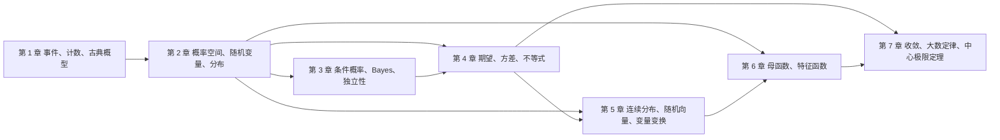
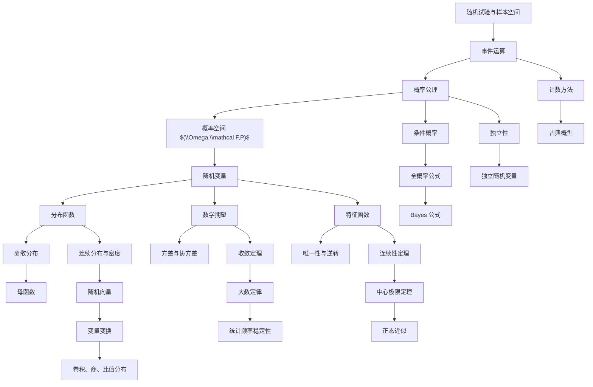

# 课程总览与知识图谱

概率论的主线可以概括为三句话：

1. 用集合语言描述随机事件。
2. 用函数语言描述随机变量及其分布。
3. 用极限语言描述大量随机现象的稳定规律。

这三句话对应本课程的三层结构。

## 第一层：事件层

事件层回答“哪些结果发生了”。基本对象是：

- 样本空间 $\Omega$：随机试验所有可能结果组成的集合。
- 事件 $A\subset \Omega$：某些结果组成的集合。
- 事件域 $\mathcal F$：允许谈概率的事件集合族。
- 概率 $P$：把事件映到 $[0,1]$ 的集合函数。

最早的题目通常是古典概型：

$$
P(A)=\frac{|A|}{|\Omega|}.
$$

它的难点不在概率公理，而在计数。配对问题、生日问题、二项分布和超几何分布都属于这一层。

## 第二层：随机变量层

随机变量把样本点变成数：

$$
\xi:\Omega\to \mathbb R.
$$

真正重要的是 $\xi$ 诱导出来的分布：

$$
F_\xi(x)=P(\xi\le x).
$$

于是概率问题从“事件集合”变成“函数和积分”。本课程在这一层建立：

- 离散随机变量：用分布律 $P(\xi=x_k)=p_k$ 描述。
- 连续随机变量：用密度 $f$ 描述，$F(x)=\int_{-\infty}^x f(t)\,dt$。
- 随机向量：用联合分布、边缘分布、联合密度描述。
- 独立随机变量：联合分布分解为边缘分布的乘积。
- 数学期望：用积分概括“平均值”。
- 方差、协方差、相关系数：刻画波动和线性关系。

## 第三层：极限层

极限层回答“大量重复随机试验会怎样”。核心对象是一列随机变量 $\{\xi_n\}$，常见问题是：

- $\xi_n$ 是否依概率收敛到 $\xi$。
- $\xi_n$ 是否几乎处处收敛到 $\xi$。
- $\xi_n$ 的分布是否弱收敛到某个分布。
- 样本均值是否收敛到期望。
- 标准化和是否趋向正态分布。

两类核心定理：

- 大数定律：样本平均稳定到期望。
- 中心极限定理：标准化和趋向正态分布。

## 章节依赖图

## 全课程知识图谱

## 概念之间的最短路径

从事件到分布：

$$
\Omega \supset A \xrightarrow{P} P(A),\qquad
\Omega \xrightarrow{\xi} \mathbb R,\qquad
F_\xi(x)=P(\{\omega:\xi(\omega)\le x\}).
$$

从分布到数值特征：

$$
F_\xi \Rightarrow E\xi,\quad Var(\xi),\quad E\varphi(\xi).
$$

从多个随机变量到独立性：

$$
F_{\xi,\eta}(x,y)=F_\xi(x)F_\eta(y)
\quad\Longleftrightarrow\quad
\xi,\eta\ \text{独立}.
$$

从独立性到和的分布：

$$
f_{\xi+\eta}(z)=\int_{-\infty}^{\infty} f_\xi(x)f_\eta(z-x)\,dx.
$$

从和的分布到特征函数：

$$
\varphi_{\xi+\eta}(t)=\varphi_\xi(t)\varphi_\eta(t)
\quad\text{当 $\xi,\eta$ 独立}.
$$

从特征函数到极限定理：

$$
\varphi_{\eta_n}(t)\to e^{-t^2/2}
\quad\Longrightarrow\quad
\eta_n \xrightarrow{d} N(0,1).
$$

## 课程中的四种“等价语言”

同一个随机对象可以用不同语言表达：

| 语言 | 典型表达 | 适合做什么 |
|---|---|---|
| 事件语言 | $A\cap B$, $A^c$, $P(A)$ | 古典概型、条件概率、独立性 |
| 分布语言 | $F(x)$, $p_k$, $f(x)$ | 求概率、比较随机变量、弱收敛 |
| 积分语言 | $E\xi$, $\int g\,dF$ | 期望、方差、变量替换、不等式 |
| 函数变换语言 | $G(s)$, $\varphi(t)$ | 卷积、唯一性、极限定理 |

## 解题总流程

1. 识别对象：事件、随机变量、随机向量、随机序列。
2. 判断类型：离散、连续、混合，独立或不独立。
3. 选择表达：计数、分布函数、密度、期望、特征函数。
4. 计算核心量：概率、分布、期望方差、极限。
5. 检查条件：等可能性、可积性、独立性、方差有限、连续点。
6. 做边界验证：概率是否在 $[0,1]$，密度积分是否为 $1$，极限是否合理。

## 容易混淆的主线

条件概率和独立性：

- 条件概率是信息更新 $P(A\mid B)=P(A\cap B)/P(B)$。
- 独立性是信息无效 $P(A\mid B)=P(A)$。

互不相关和独立：

- 独立通常推出不相关。
- 不相关只说明 $Cov(\xi,\eta)=0$，一般不能推出独立。
- 在联合正态分布下，不相关等价于独立。

依概率收敛和依分布收敛：

- 依概率收敛比依分布收敛强。
- 若极限是常数，依分布收敛到该常数等价于依概率收敛到该常数。

大数定律和中心极限定理：

- 大数定律看 $\frac{1}{n}\sum \xi_i$，尺度是 $n$。
- 中心极限定理看 $\frac{\sum \xi_i-n\mu}{\sigma\sqrt n}$，尺度是 $\sqrt n$。

## 文件导航

| 文件 | 对应讲义范围 | 核心问题 |
|---|---:|---|
| [01-事件与概率.md](01-事件与概率.md) | 第 0 到 1 章 | 如何把随机现象转成事件并计数 |
| [02-概率空间与随机变量.md](02-概率空间与随机变量.md) | 第 2 章 | 如何用概率空间和分布描述随机变量 |
| [03-条件概率全概率与独立性.md](03-条件概率全概率与独立性.md) | 第 3 章 | 信息更新、拆分样本空间、独立性判断 |
| [04-数学期望方差与不等式.md](04-数学期望方差与不等式.md) | 第 4 章 | 如何定义、计算和估计随机变量的平均行为 |
| [05-连续型随机变量与随机向量.md](05-连续型随机变量与随机向量.md) | 第 5 章 | 密度、常见连续分布、多维分布与变量变换 |
| [06-母函数与特征函数.md](06-母函数与特征函数.md) | 第 6 章 | 用函数编码分布、卷积和极限 |
| [07-极限定理.md](07-极限定理.md) | 第 7 章 | 随机序列如何收敛、大数定律和中心极限定理 |
| [附录A-常见分布速查表.md](附录A-常见分布速查表.md) | 全书 | 分布、期望、方差、母函数、特征函数 |
| [附录B-题型图谱与作业定位.md](附录B-题型图谱与作业定位.md) | 作业参考 | 每章常见题型、解法入口和易错点 |