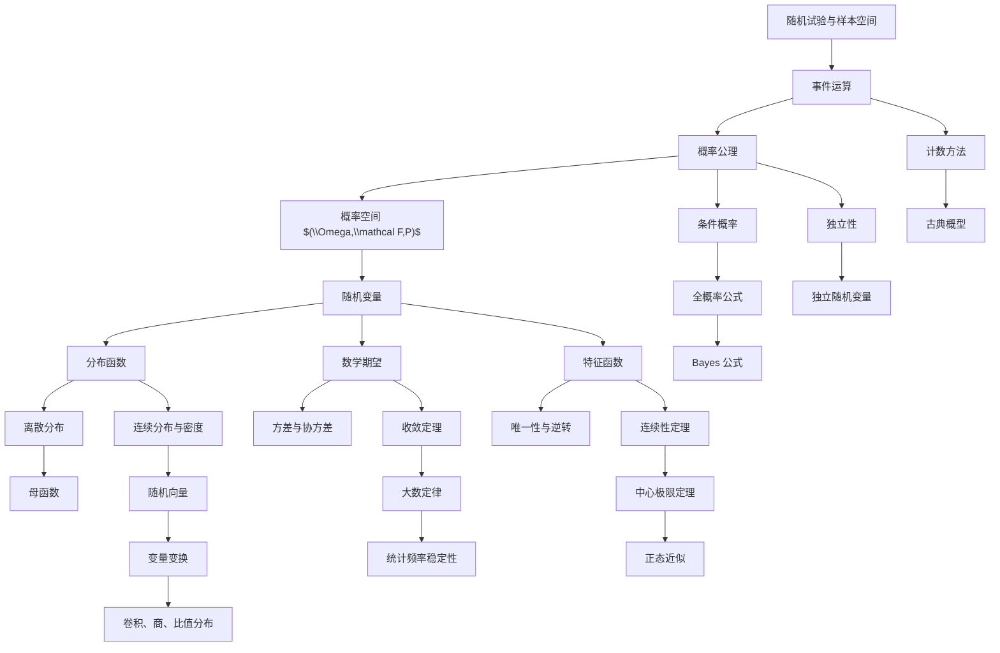

# 概率论学习笔记

这组笔记按 `概率论讲义.pdf` 的书签和页码结构重写，目标是保留讲义的知识覆盖，同时把概念依赖、定理用途、计算套路和题型入口整理清楚。

资料使用说明：

- 主线内容来自 `概率论讲义.pdf`。
- `作业/` 中的文件多为扫描答案，无法可靠抽取文字；本笔记只把它们作为课程进度和题型参考，不逐题转录。
- `概率论.pdf` 和 `概率论笔记（仅到数学期望）.pdf` 也是扫描型材料，主要用于章节对应和可选校对。

## 文件导航

| 文件 | 对应讲义范围 | 核心问题 |
|---|---:|---|
| [00-课程总览与知识图谱.md](00-课程总览与知识图谱.md) | 全书 | 学什么、概念如何相互依赖 |
| [01-事件与概率.md](01-事件与概率.md) | 第 0 到 1 章 | 如何把随机现象转成事件并计数 |
| [02-概率空间与随机变量.md](02-概率空间与随机变量.md) | 第 2 章 | 如何用概率空间和分布描述随机变量 |
| [03-条件概率全概率与独立性.md](03-条件概率全概率与独立性.md) | 第 3 章 | 信息更新、拆分样本空间、独立性判断 |
| [04-数学期望方差与不等式.md](04-数学期望方差与不等式.md) | 第 4 章 | 如何定义、计算和估计随机变量的平均行为 |
| [05-连续型随机变量与随机向量.md](05-连续型随机变量与随机向量.md) | 第 5 章 | 密度、常见连续分布、多维分布与变量变换 |
| [06-母函数与特征函数.md](06-母函数与特征函数.md) | 第 6 章 | 用函数编码分布、卷积和极限 |
| [07-极限定理.md](07-极限定理.md) | 第 7 章 | 随机序列如何收敛、大数定律和中心极限定理 |
| [附录A-常见分布速查表.md](附录A-常见分布速查表.md) | 全书 | 分布、期望、方差、母函数、特征函数 |
| [附录B-题型图谱与作业定位.md](附录B-题型图谱与作业定位.md) | 作业参考 | 每章常见题型、解法入口和易错点 |

## 全课程知识图谱

## 学习顺序建议

1. 先读第 1 到 3 章，建立事件、概率空间、随机变量、条件概率和独立性的语言。
2. 再读第 4 到 5 章，把“分布”转化为“可计算的数值特征”，重点掌握期望、方差、密度、联合分布和变量变换。
3. 第 6 章把分布编码成函数，是第 7 章证明极限定理的工具。
4. 第 7 章把前面的概念汇总到随机序列，核心是判断收敛类型、套用大数定律或中心极限定理。

## 复习抓手

- 遇到概率题，先问：样本空间是什么，事件如何表达，是否等可能。
- 遇到随机变量题，先问：求的是分布、期望、方差，还是极限。
- 遇到条件概率题，先问：给定信息改变了哪个样本空间。
- 遇到独立性题，先问：是两个事件独立、多个事件相互独立，还是随机变量独立。
- 遇到多维连续题，先画积分区域，再决定用边缘化、卷积还是变量变换。
- 遇到极限定理题，先分清收敛目标：常数、随机变量、分布函数，还是正态近似。

