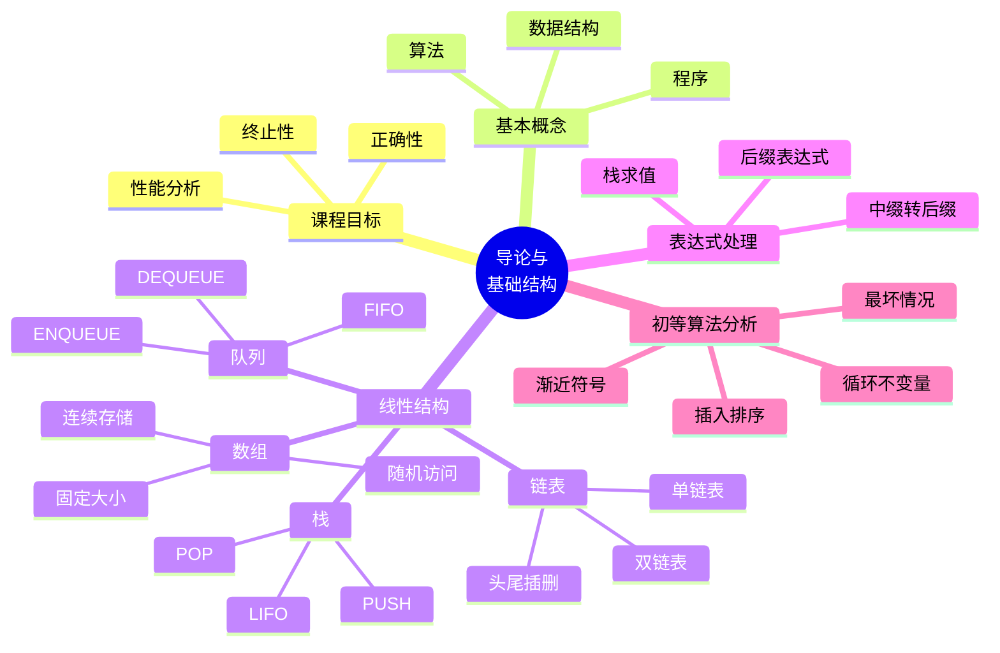

# 第 1 讲 导论、基本数据结构与复杂度

## 本讲知识图谱



## 1.1 课程研究什么

数据结构是为了让访问和修改更高效而组织数据的方式。算法是解决计算问题的步骤描述。程序是用具体语言实现算法和数据结构后的可执行形式。

三者的关系可以概括为：

```text
问题需求 -> 数据组织方式 -> 算法策略 -> 程序实现
```

本课程不是单纯的编程课，而是研究数据结构与算法的设计和分析。设计回答“怎样做”，分析回答“代价是多少”。一个算法至少要满足：

- 正确性：对所有合法输入都输出正确结果，或在随机算法中以规定概率正确。
- 终止性：不会无限执行。
- 性能可预测：能用输入规模描述时间、空间等资源消耗。

课件中的 range sum 例子说明了数据结构选择的意义。给定数组 $A$，若频繁查询区间和 $s(i,j)=A[i]+\cdots+A[j]$，直接求和一次要 $O(j-i+1)$。如果预处理前缀和 $P[k]=A[0]+\cdots+A[k-1]$，则静态查询可变成：

$$
s(i,j)=P[j+1]-P[i]
$$

一次查询只需 $O(1)$。但若还要支持更新，就需要树状数组、线段树等动态数据结构。这个例子体现了“操作集合”决定数据结构。

## 1.2 数组

数组把相同类型的元素连续存放在内存中。设每个元素占 $w$ 字节，数组首地址为 $base$，则第 $i$ 个元素地址为：

$$
base+i\cdot w
$$

因此数组支持随机访问，读取或修改 $A[i]$ 的时间是 $O(1)$。

数组的优势：

- 地址计算直接，缓存友好。
- 支持下标访问。
- 适合固定长度或追加为主的顺序数据。

数组的限制：

- 固定大小时需要提前知道容量上界。
- 在头部或中间插入/删除会搬移大量元素，最坏 $O(n)$。
- 动态数组可扩容，但扩容时需要整体复制；若倍增扩容，单次扩容 $O(n)$，追加的摊还代价为 $O(1)$。

## 1.3 链表

链表用节点和指针表达线性顺序。单链表节点包含元素和指向下一个节点的指针：

```text
head -> [key | next] -> [key | next] -> ... -> nil
```

单链表头插、头删很快：

```text
LIST-INSERT-HEAD(L, x):
    x.next = L.head
    L.head = x
```

```text
LIST-DELETE-HEAD(L):
    if L.head == nil:
        error
    L.head = L.head.next
```

若维护尾指针，尾插也是 $O(1)$。但单链表尾删不是 $O(1)$，因为删除尾节点后必须找到新的尾节点，也就是原尾节点的前驱，需要从头扫描。

双链表节点额外维护 `prev` 指针：

```text
[prev | key | next]
```

它支持在已知节点位置处 $O(1)$ 删除，因为能直接访问前驱和后继。实际实现中常用哨兵节点减少空表、删头、删尾的特殊分支。

数组与链表对比：

| 操作/性质 | 数组 | 链表 |
| --- | --- | --- |
| 随机访问 | $O(1)$ | $O(n)$ |
| 已知位置插入删除 | 需要搬移， $O(n)$ | 改指针， $O(1)$ |
| 缓存局部性 | 好 | 较差 |
| 额外空间 | 少 | 每个节点有指针开销 |
| 容量变化 | 固定或扩容复制 | 动态申请节点 |

## 1.4 栈

栈是后进先出 LIFO 的线性结构。只允许在栈顶进行插入和删除。

基本操作：

| 操作 | 含义 | 时间 |
|:---:|:---:|:---:|
| `PUSH(S, x)` | 把 $x$ 放到栈顶 | $O(1)$ |
| `POP(S)` | 删除并返回栈顶元素 | $O(1)$ |
| `TOP(S)` | 查看栈顶 | $O(1)$ |
| `IS-EMPTY(S)` | 判断是否为空 | $O(1)$ |

数组实现时可用 `S.top` 表示当前栈顶元素个数：

```text
PUSH(S, x):
    S.top = S.top + 1
    S[S.top] = x

POP(S):
    if S.top == 0:
        error "underflow"
    x = S[S.top]
    S.top = S.top - 1
    return x
```

链表实现时通常把链表头当栈顶，头插头删即可。

典型应用：

- 括号匹配。
- 后缀表达式求值。
- 中缀表达式转后缀表达式。
- 递归调用栈。
- DFS 的显式栈实现。

### 括号匹配模板

LeetCode 20 对应的核心不变量是：扫描到当前位置时，栈中保存所有尚未被匹配的左括号，且顺序必须与未来右括号的嵌套顺序相反。

```python
def is_valid(s):
    pair = {')': '(', ']': '[', '}': '{'}
    st = []
    for ch in s:
        if ch in pair.values():
            st.append(ch)
        else:
            if not st or st[-1] != pair[ch]:
                return False
            st.pop()
    return not st
```

## 1.5 队列

队列是先进先出 FIFO 的线性结构。元素从队尾进入，从队头离开。

基本操作：

| 操作 | 含义 | 时间 |
|:---:|:---:|:---:|
| `ENQUEUE(Q, x)` | 入队 | $O(1)$ |
| `DEQUEUE(Q)` | 出队 | $O(1)$ |
| `FRONT(Q)` | 查看队头 | $O(1)$ |
| `IS-EMPTY(Q)` | 判断空 | $O(1)$ |

数组实现队列时常用循环数组。设容量为 $m$，`head` 指向队头，`tail` 指向下一个可写位置，则更新时取模：

```text
ENQUEUE(Q, x):
    if queue is full:
        error "overflow"
    Q[tail] = x
    tail = (tail + 1) mod m

DEQUEUE(Q):
    if queue is empty:
        error "underflow"
    x = Q[head]
    head = (head + 1) mod m
    return x
```

LeetCode 232 用两个栈实现队列。一个输入栈负责 `push`，一个输出栈负责 `pop/peek`。当输出栈为空时，把输入栈全部倒过去。每个元素最多进出每个栈一次，所以每次操作摊还 $O(1)$。

## 1.6 后缀表达式与中缀转后缀

后缀表达式又称逆波兰表达式。运算符写在操作数之后，例如：

```text
中缀: 9 + 3 * 7
后缀: 9 3 7 * +
```

后缀表达式求值只需要一个栈：

```text
EVAL-RPN(tokens):
    S = empty stack
    for token in tokens:
        if token is number:
            PUSH(S, token)
        else:
            b = POP(S)
            a = POP(S)
            PUSH(S, a token b)
    return POP(S)
```

中缀转后缀的核心是运算符栈：

- 数字直接输出。
- 左括号入栈。
- 右括号触发弹栈，直到弹出左括号。
- 遇到运算符时，先弹出栈顶优先级不低于当前运算符的运算符，再把当前运算符入栈。
- 扫描结束后弹出剩余运算符。

这个过程的栈不变量是：栈中保存尚未输出、且等待右侧操作数或右括号确认的运算符。

## 1.7 插入排序

插入排序维护一个已排序前缀。第 $i$ 轮开始时，$A[0..i-1]$ 已经排好序，把 $A[i]$ 插入到前缀中的正确位置。

```text
INSERTION-SORT(A):
    for i = 1 to n-1:
        key = A[i]
        j = i - 1
        while j >= 0 and A[j] > key:
            A[j+1] = A[j]
            j = j - 1
        A[j+1] = key
```

循环不变量：

- 初始化： $i=1$ 前， $A[0]$ 是有序的。
- 保持：第 $i$ 轮把 `key` 插入有序前缀，得到 $A[0..i]$ 有序。
- 终止：当 $i=n$ 时，整个数组有序。

复杂度：

| 情况 | 比较/移动 | 时间 |
|:---:|:---:|:---:|
| 最好，数组已有序 | 每轮比较一次 | $O(n)$ |
| 最坏，数组逆序 | 第 $i$ 轮移动 $i$ 个元素 | $O(n^2)$ |
| 平均，随机排列 | 期望约移动一半前缀 | $O(n^2)$ |

插入排序适合小规模数组或近乎有序的数组，也是许多工业排序在小分区上的基线算法。

## 1.8 渐近分析

算法分析通常不关心某台机器上的具体秒数，而关心输入规模 $n$ 增大时运行时间的增长趋势。

常用符号：

| 符号 | 含义 | 直觉 |
|:---:|:---:|:---:|
| $O(g(n))$ | 存在 $c,n_0$，使 $0\le f(n)\le c g(n)$ | 渐近上界 |
| $\Omega(g(n))$ | 存在 $c,n_0$，使 $0\le c g(n)\le f(n)$ | 渐近下界 |
| $\Theta(g(n))$ | 同时是 $O(g(n))$ 和 $\Omega(g(n))$ | 渐近紧确界 |
| $o(g(n))$ | 对任意 $c>0$，最终 $f(n)<c g(n)$ | 严格小阶 |
| $\omega(g(n))$ | 对任意 $c>0$，最终 $c g(n)<f(n)$ | 严格大阶 |

常见增长率从慢到快：

$$
1 < \log n < n < n\log n < n^2 < n^3 < 2^n < n!
$$

分析算法时要说明是哪种输入情形：

- 最坏情况：所有规模为 $n$ 的输入中的最大运行时间，最常用。
- 最好情况：最容易的输入，不足以说明算法整体性能。
- 平均情况：对输入分布取期望，需要明确概率模型。
- 期望时间：随机算法对内部随机性的期望，和平均情况不是一回事。

## 作业定位

- LeetCode 20：用栈保存未匹配左括号，重点是空栈检查和括号类型匹配。
- LeetCode 150：后缀表达式求值，遇到运算符时注意操作数顺序，减法和除法不能交换。
- LeetCode 232：两个栈模拟队列，重点是只在输出栈为空时搬运，得到摊还 $O(1)$。

## 本讲易错点

- 数组随机访问是 $O(1)$，但中间插入删除不是 $O(1)$。
- 单链表已知尾指针可以尾插 $O(1)$，但尾删仍需找前驱，通常是 $O(n)$。
- 栈和队列的差别不是“用数组还是链表”，而是允许操作的位置不同。
- 循环队列要区分空和满，常见做法是牺牲一个槽位或额外维护元素个数。
- 插入排序的 `while` 条件应允许 `j >= 0`，否则会漏比较第一个元素。
- $O(g(n))$ 是上界，不等于精确复杂度；能说 $\Theta(g(n))$ 时更强。

## 自测题

1. 为什么前缀和能把静态区间和查询变成 $O(1)$？为什么有更新时还不够？
2. 说明单链表删除尾节点为什么通常不是 $O(1)$。
3. 用栈写出括号匹配算法，并给出扫描过程中的不变量。
4. 给出中缀表达式 `9 + 3 * 7 + (4 * 5 + 6) * 2` 的后缀表达式。
5. 用循环不变量证明插入排序正确。
6. 判断下列说法是否正确：若算法 A 是 $O(n^2)$，算法 B 是 $O(n^3)$，则 A 对所有输入规模都更快。

