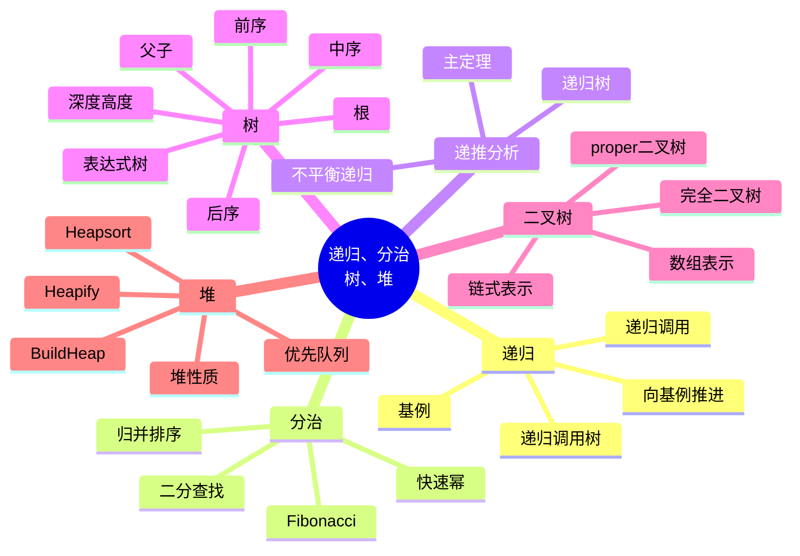

# 第 2 讲 递归、分治、树与堆

## 本讲知识图谱



## 2.1 递归方法的结构

递归是方法调用自身。一个正确的递归算法必须包含：

- 基例：不再递归、能直接返回的输入。
- 递归调用：把原问题转化成更小或更接近基例的问题。
- 进展度量：每次调用都让某个规模指标下降，保证最终到达基例。

以阶乘为例：

$$
f(n)=
\begin{cases}
1, & n=0 \\
n\cdot f(n-1), & n>0
\end{cases}
$$

递归调用会形成调用栈。每一层保存当前参数、局部变量和返回地址。分析递归时常画递归树或调用树：节点表示一次调用，边表示调用关系。

递归的常见错误：

- 没有覆盖所有基例。
- 递归参数没有变小。
- 在指数级递归中重复计算同一子问题。
- 把递归返回值和副作用混在一起导致状态污染。

## 2.2 二分查找

二分查找在有序数组中查找目标值。每轮比较中点，把搜索区间缩小一半。

```text
BINARY-SEARCH(A, target):
    low = 0
    high = len(A) - 1
    while low <= high:
        mid = floor((low + high) / 2)
        if A[mid] == target:
            return mid
        else if target < A[mid]:
            high = mid - 1
        else:
            low = mid + 1
    return NOT_FOUND
```

区间长度每轮至少减半，所以最多执行 $\lceil\log_2 n\rceil+1$ 轮，时间复杂度为 $O(\log n)$。

循环不变量：若目标存在，则它始终位于当前闭区间 $[low, high]$ 中。每次比较后删除不可能含有目标的一半区间。

## 2.3 快速幂

直接递归计算 $x^n$：

$$
p(x,n)=x\cdot p(x,n-1)
$$

需要 $O(n)$ 次乘法。利用平方可以把规模减半：

$$
p(x,n)=
\begin{cases}
1, & n=0 \\
p(x,n/2)^2, & n>0 \text{ 且 } n \text{ 为偶数} \\
x\cdot p(x,(n-1)/2)^2, & n>0 \text{ 且 } n \text{ 为奇数}
\end{cases}
$$

伪代码：

```text
POWER(x, n):
    if n == 0:
        return 1
    if n is odd:
        y = POWER(x, (n-1)/2)
        return x * y * y
    else:
        y = POWER(x, n/2)
        return y * y
```

递推式为 $T(n)=T(n/2)+O(1)$，所以时间复杂度为 $O(\log n)$。

## 2.4 Fibonacci：指数递归与线性递归

朴素递归：

```text
BINARY-FIB(k):
    if k <= 1:
        return k
    return BINARY-FIB(k-1) + BINARY-FIB(k-2)
```

该算法不断重复计算相同子问题。例如 $F_{k-2}$ 同时出现在 $F_{k-1}$ 和 $F_{k-2}$ 的分支中。调用次数满足类似：

$$
n_k=n_{k-1}+n_{k-2}+1
$$

因此是指数级。

更好的线性递归可以一次返回一对值：

```text
LINEAR-FIB(k):
    if k == 0:
        return (0, 0)
    if k == 1:
        return (1, 0)
    (a, b) = LINEAR-FIB(k-1)
    return (a+b, a)
```

也可以自底向上迭代：

```python
def fib(n):
    a, b = 0, 1
    for _ in range(n):
        a, b = b, a + b
    return a
```

这为动态规划埋下伏笔：当递归子问题大量重叠时，应记录已经算过的答案。

## 2.5 归并排序与分治模式

分治算法通常有三步：

1. 分解：把规模为 $n$ 的问题拆成若干子问题。
2. 解决：递归求解子问题。
3. 合并：把子问题答案合成原问题答案。

归并排序：

```text
MERGE-SORT(A, l, r):
    if l >= r:
        return
    m = floor((l+r)/2)
    MERGE-SORT(A, l, m)
    MERGE-SORT(A, m+1, r)
    MERGE(A, l, m, r)
```

合并两个有序数组：

```text
MERGE(L, R):
    i = 0
    j = 0
    C = empty array
    while i < len(L) and j < len(R):
        if L[i] <= R[j]:
            append L[i] to C
            i = i + 1
        else:
            append R[j] to C
            j = j + 1
    append remaining elements
    return C
```

递推式：

$$
T(n)=2T(n/2)+cn
$$

递归树中每层总代价为 $cn$，层数为 $\log_2 n+1$，所以：

$$
T(n)=\Theta(n\log n)
$$

归并排序稳定，但需要 $O(n)$ 额外空间。

## 2.6 递推式与主定理

分治递推的标准形式：

$$
T(n)=aT(n/b)+f(n)
$$

其中 $a$ 是子问题个数，$n/b$ 是子问题规模，$f(n)$ 是分解与合并成本。比较 $f(n)$ 与 $n^{\log_b a}$：

| 情形 | 条件 | 结论 |
|:---:|:---:|:---:|
| 叶子主导 | $f(n)=O(n^{\log_b a-\epsilon})$ | $T(n)=\Theta(n^{\log_b a})$ |
| 各层相当 | $f(n)=\Theta(n^{\log_b a}\log^k n)$ | $T(n)=\Theta(n^{\log_b a}\log^{k+1} n)$ |
| 根部主导 | $f(n)=\Omega(n^{\log_b a+\epsilon})$ 且满足正则条件 | $T(n)=\Theta(f(n))$ |

例子：

- $T(n)=2T(n/2)+n$，$n^{\log_2 2}=n$，所以 $T(n)=\Theta(n\log n)$。
- $T(n)=T(n/2)+1$，$n^{\log_2 1}=1$，所以 $T(n)=\Theta(\log n)$。
- $T(n)=2T(n/2)+n^2$，根部主导，所以 $T(n)=\Theta(n^2)$。

不平衡递归如 $T(n)=T(n/3)+T(2n/3)+cn$ 不直接套主定理。递归树中每层总代价仍为 $O(n)$，高度由最大分支 $2n/3$ 决定，为 $O(\log n)$，所以总时间为 $O(n\log n)$；同时每层在相当长范围内有 $\Omega(n)$ 代价，可得 $\Theta(n\log n)$。

## 2.7 树的基本概念

树是连通无环图，也可递归定义为一个根节点和若干子树。常用术语：

| 术语 | 含义 |
|:---:|:---:|
| root | 没有父节点的节点 |
| parent/child | 父子关系 |
| sibling | 有同一父节点的节点 |
| leaf | 没有孩子的节点 |
| depth | 从根到该节点的边数 |
| height | 从该节点到最深叶子的边数 |
| subtree | 某节点及其后代构成的树 |

遍历方式：

- 前序 preorder：先访问节点，再访问子树。
- 后序 postorder：先访问子树，再访问节点。
- 中序 inorder：只对二叉树自然定义，先左子树、再节点、再右子树。

二叉树节点最多有两个孩子。proper binary tree 指每个内部节点都有两个孩子。完全二叉树从上到下、从左到右填充，适合数组表示。

二叉树性质：

- 第 $d$ 层最多有 $2^d$ 个节点。
- 高度为 $h$ 的二叉树最多有 $2^{h+1}-1$ 个节点。
- 含 $n$ 个节点的完全二叉树高度为 $\lfloor\log_2 n\rfloor$。

## 2.8 树遍历与表达式树

递归前序遍历：

```text
PREORDER(v):
    if v == nil:
        return
    visit(v)
    PREORDER(v.left)
    PREORDER(v.right)
```

迭代前序遍历用栈，先压右子树再压左子树：

```python
def preorder(root):
    if not root:
        return []
    st = [root]
    ans = []
    while st:
        x = st.pop()
        ans.append(x.val)
        if x.right:
            st.append(x.right)
        if x.left:
            st.append(x.left)
    return ans
```

表达式树把操作符放在内部节点，把操作数放在叶子。后序遍历可求值，因为求一个操作符前必须先求出左右子表达式。

从先序和中序构造二叉树的思路：

- 先序第一个元素是根。
- 在中序中找到根，左边是左子树，右边是右子树。
- 左子树大小决定先序中左、右子树的切分。

若直接用 `inorder.index(root)`，每层查找 $O(n)$，最坏 $O(n^2)$。用哈希表预处理值到位置的映射，可降为 $O(n)$。

## 2.9 堆

最大堆是一棵满足堆性质的完全二叉树：

$$
A[parent(i)]\ge A[i]
$$

数组下标从 1 开始时：

$$
parent(i)=\lfloor i/2\rfloor,\quad left(i)=2i,\quad right(i)=2i+1
$$

最大堆的根是最大元素，但除了祖先大于后代之外，同层节点之间无序。

### Heapify

`MAX-HEAPIFY(A, i)` 假设左右子树已经是最大堆，只有 $A[i]$ 可能违反堆性质。它把 $A[i]$ 与较大的孩子交换，并递归向下修复。

```text
MAX-HEAPIFY(A, i):
    l = LEFT(i)
    r = RIGHT(i)
    largest = i
    if l <= heap_size and A[l] > A[largest]:
        largest = l
    if r <= heap_size and A[r] > A[largest]:
        largest = r
    if largest != i:
        exchange A[i], A[largest]
        MAX-HEAPIFY(A, largest)
```

堆高为 $O(\log n)$，所以 `Heapify` 时间为 $O(\log n)$。

### BuildHeap

从最后一个非叶子节点向前调用 `Heapify`：

```text
BUILD-MAX-HEAP(A):
    heap_size = len(A)
    for i = floor(n/2) downto 1:
        MAX-HEAPIFY(A, i)
```

粗略看有 $O(n)$ 次 `Heapify`，每次 $O(\log n)$，得到 $O(n\log n)$ 上界。但紧分析为 $O(n)$：高度为 $h$ 的节点数至多 $n/2^{h+1}$，总代价：

$$
\sum_{h=0}^{\lfloor\log n\rfloor}\frac{n}{2^{h+1}}O(h)=O(n)
$$

### Heapsort

```text
HEAPSORT(A):
    BUILD-MAX-HEAP(A)
    for i = n downto 2:
        exchange A[1], A[i]
        heap_size = heap_size - 1
        MAX-HEAPIFY(A, 1)
```

时间复杂度 $O(n\log n)$，原地排序，但不稳定。

## 2.10 优先队列

优先队列维护带优先级的元素集合，常用堆实现。

最大优先队列操作：

| 操作 | 含义 | 堆实现时间 |
|:---:|:---:|:---:|
| `INSERT(S, x)` | 插入元素 | $O(\log n)$ |
| `MAXIMUM(S)` | 返回最大元素 | $O(1)$ |
| `EXTRACT-MAX(S)` | 删除并返回最大元素 | $O(\log n)$ |
| `INCREASE-KEY(S, x, k)` | 增大关键字并上浮 | $O(\log n)$ |

LeetCode 215 可用大小为 $k$ 的最小堆维护前 $k$ 大元素，时间 $O(n\log k)$；也可用快速选择得到期望 $O(n)$。

## 作业定位

- `书面作业1/hw1.py` Q5：先序 + 中序构造二叉树，建议用哈希表优化查找根的位置。
- `书面作业1/hw1.py` Q7：合并 $k$ 个有序数组，可两两归并，也可用最小堆做 $O(N\log k)$ 合并。
- LeetCode 144：前序遍历递归版最直接，迭代版需要注意压栈顺序。
- LeetCode 215：可以从堆和快速选择两个角度理解，第 4 讲会给出快速选择。

## 本讲易错点

- 递归算法不只要写基例，还要说明每步如何接近基例。
- 二分查找要保持区间定义一致，闭区间和半开区间不要混用。
- 朴素 Fibonacci 慢不是因为递归本身，而是因为重复子问题。
- 主定理只适用于 $aT(n/b)+f(n)$ 的平衡形式，不平衡递归要用递归树等方法。
- 完全二叉树适合数组表示，普通二叉树用数组可能浪费空间。
- `BuildHeap` 的紧复杂度是 $O(n)$，不是 $O(n\log n)$。
- 堆只保证父子局部顺序，不保证数组整体有序。

## 自测题

1. 写出快速幂递归式，并解释为什么是 $O(\log n)$。
2. 画出 $T(n)=2T(n/2)+cn$ 的递归树并求和。
3. 用主定理分析 $T(n)=3T(n/2)+n$。
4. 给定先序 `A B D E C` 和中序 `D B E A C`，构造二叉树。
5. 为什么 `BuildHeap` 是 $O(n)$？
6. 说明用堆求第 $k$ 大元素的两种做法及复杂度。

