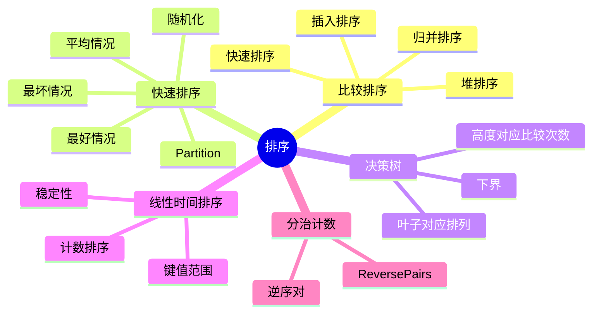

# 第 3 讲 排序算法与比较下界

## 本讲知识图谱



## 3.1 排序问题

排序输入为序列 $a_1,a_2,\ldots,a_n$，输出为同一组元素的重排 $a'_1,a'_2,\ldots,a'_n$，满足：

$$
a'_1\le a'_2\le \cdots \le a'_n
$$

排序算法的评价维度：

- 时间复杂度：最好、最坏、平均或期望。
- 空间复杂度：是否原地。
- 稳定性：相等关键字的相对顺序是否保持。
- 是否基于比较：只通过元素之间的大小比较获得顺序信息。

前两讲已经出现：

| 算法 | 最坏时间 | 平均/期望 | 额外空间 | 稳定性 |
|:---:|:---:|:---:|:---:|:---:|
| 插入排序 | $O(n^2)$ | $O(n^2)$ | $O(1)$ | 稳定 |
| 归并排序 | $O(n\log n)$ | $O(n\log n)$ | $O(n)$ | 稳定 |
| 堆排序 | $O(n\log n)$ | $O(n\log n)$ | $O(1)$ | 不稳定 |

本讲重点是快速排序、比较排序下界和计数排序。

## 3.2 快速排序

快速排序也是分治算法，但它先 partition，再递归排序两侧。

```text
QUICKSORT(A, p, r):
    if p < r:
        q = PARTITION(A, p, r)
        QUICKSORT(A, p, q-1)
        QUICKSORT(A, q+1, r)
```

`PARTITION` 选择一个 pivot，把小于等于 pivot 的元素放左边，大于 pivot 的元素放右边，并返回 pivot 的最终位置。

一种以首元素为 pivot 的写法：

```text
PARTITION(A, p, r):
    x = A[p]
    i = p
    for j = p+1 to r:
        if A[j] <= x:
            i = i + 1
            exchange A[i], A[j]
    exchange A[p], A[i]
    return i
```

循环不变量：

- $A[p+1..i]$ 中元素都 $\le x$。
- $A[i+1..j-1]$ 中元素都 $>x$。
- $A[j..r]$ 尚未处理。

最后交换 $A[p]$ 与 $A[i]$，pivot 左边不大于它，右边大于它。

## 3.3 快速排序复杂度

Partition 本身是线性时间 $\Theta(n)$。总复杂度取决于 pivot 划分是否平衡。

最坏情况：每次划分成 $0$ 和 $n-1$。

$$
T(n)=T(n-1)+\Theta(n)=\Theta(n^2)
$$

若总是选择首元素作 pivot，已排序或逆序数组就是坏例。

最好情况：每次平分。

$$
T(n)=2T(n/2)+\Theta(n)=\Theta(n\log n)
$$

平均情况或随机化快速排序的期望时间为 $O(n\log n)$。随机化方式包括：

- 随机选择 pivot。
- 先随机打乱数组，再用固定位置 pivot。

随机化的意义是把“坏输入”转化为“极低概率出现的坏随机选择序列”。

## 3.4 快速排序平均分析思路

一种直接分析方式是看任意一对元素是否被比较。设排序后元素为 $z_1<z_2<\cdots<z_n$，定义指示变量：

$$
X_{ij}=
\begin{cases}
1, & z_i \text{ 与 } z_j \text{ 被比较} \\
0, & 否则
\end{cases}
$$

总比较次数： $X=\sum_{1\le i<j\le n}X_{ij}$

$z_i$ 和 $z_j$ 会被比较，当且仅当集合 $\{z_i,\ldots,z_j\}$ 中第一个被选为 pivot 的元素是 $z_i$ 或 $z_j$。概率为：

$$
Pr(X_{ij}=1)=\frac{2}{j-i+1}
$$

所以： $E[X]=\sum_{i<j}\frac{2}{j-i+1}=O(n\log n)$

这说明随机快速排序期望比较次数为 $O(n\log n)$。

## 3.5 与归并排序、堆排序的比较

| 算法 | 核心动作 | 优点 | 缺点 |
|:---:|:---:|:---:|:---:|
| 归并排序 | 递归排序两半后合并 | 稳定，最坏 $O(n\log n)$ | 需要额外数组 |
| 堆排序 | 维护最大堆后反复取最大 | 原地，最坏 $O(n\log n)$ | 缓存局部性较差，不稳定 |
| 快速排序 | partition 后排序两侧 | 实践中常数小，缓存友好 | 最坏 $O(n^2)$，不稳定 |

实际库排序常混合多种策略：快速排序处理大规模分区，小数组改用插入排序，递归太深时切换堆排序，或对对象排序使用稳定归并/TimSort。

## 3.6 比较排序下界

比较排序只能通过“元素 $a_i$ 是否小于 $a_j$”这样的比较获得信息。对 $n$ 个互异元素，一共有 $n!$ 种可能输入排列。排序算法必须区分这些排列。

可以用决策树建模比较排序：

- 内部节点表示一次比较。
- 左右分支表示比较结果。
- 叶子表示一个确定的输入排列对应的输出顺序。

若决策树高度为 $h$，最多有 $2^h$ 个叶子。为了能排序所有排列，必须有：

$$
2^h\ge n!
$$

因此：

$$
h\ge \log_2(n!)
$$

由 Stirling 估计可得：

$$
\log(n!)=\Omega(n\log n)
$$

所以任何比较排序在最坏情况下都需要 $\Omega(n\log n)$ 次比较。归并排序和堆排序达到 $O(n\log n)$，因此在比较排序模型下是渐近最优的。

这个下界不适用于非比较排序，如计数排序、基数排序、桶排序，因为它们使用了关键字范围、数字位等额外结构信息。

## 3.7 计数排序

计数排序适用于关键字为整数且范围不大，设所有元素取值在 $0..k$。

基本思想：

1. 统计每个关键字出现次数。
2. 对计数数组做前缀和，得到每个关键字在输出数组中的结束位置。
3. 从右向左扫描原数组，把元素放到输出数组对应位置，从而保持稳定性。

```text
COUNTING-SORT(A, k):
    C[0..k] = 0
    for x in A:
        C[x] = C[x] + 1
    for i = 1 to k:
        C[i] = C[i] + C[i-1]
    for j = n downto 1:
        B[C[A[j]]] = A[j]
        C[A[j]] = C[A[j]] - 1
    return B
```

复杂度：

$$
T(n,k)=\Theta(n+k)
$$

当 $k=O(n)$ 时，计数排序是线性时间。若 $k$ 远大于 $n$，计数数组会浪费大量空间和时间。

稳定性来自“从右向左扫描”。如果从左向右放置，相等元素的相对顺序会反转。

## 3.8 分治计数：逆序对与 Reverse Pairs

归并排序不仅能排序，还能在合并阶段统计跨左右区间的关系。

普通逆序对定义为 $i<j$ 且 $A[i]>A[j]$。在归并时，左右两半已经有序。当右半元素 $R[j]$ 小于左半当前元素 $L[i]$ 时，$L[i..end]$ 都大于 $R[j]$，一次可累加多个逆序对。

LeetCode 493 Reverse Pairs 统计的是：

$$
i<j,\quad A[i]>2A[j]
$$

仍可用归并排序。对每个左半元素 $L[i]$，用指针在右半中找到满足 $L[i]>2R[j]$ 的最大范围。因为左右半都有序，右指针只前进不后退，计数阶段线性。

模板：

```python
def reverse_pairs(nums):
    def sort_count(a):
        if len(a) <= 1:
            return a, 0
        mid = len(a) // 2
        left, c1 = sort_count(a[:mid])
        right, c2 = sort_count(a[mid:])

        j = 0
        cnt = c1 + c2
        for x in left:
            while j < len(right) and x > 2 * right[j]:
                j += 1
            cnt += j

        merged = []
        i = j2 = 0
        while i < len(left) and j2 < len(right):
            if left[i] <= right[j2]:
                merged.append(left[i])
                i += 1
            else:
                merged.append(right[j2])
                j2 += 1
        merged.extend(left[i:])
        merged.extend(right[j2:])
        return merged, cnt

    return sort_count(nums)[1]
```

复杂度同归并排序，为 $O(n\log n)$。

## 作业定位

- `书面作业1/hw1.py` Q6：插入排序实现里 `while j > 0` 会漏掉下标 0，应改为 `while j >= 0`。
- `书面作业1/hw1.py` Q8：通过归并阶段统计跨左右数组的“左元素大于右元素”关系，是逆序对计数模板。
- LeetCode 493：条件变成 $A[i]>2A[j]$，需要先计数再合并，并注意整数溢出问题；Python 无溢出，C++/Java 要转长整型。

## 本讲易错点

- 快速排序的 partition 正确性依赖清晰的不变量。
- 快速排序最坏 $O(n^2)$，随机化只能保证期望好，不是绝对不出现坏情况。
- 比较排序下界是模型下界，不代表所有排序都不能线性。
- 计数排序的 $O(n+k)$ 只有在 $k$ 不大时才有优势。
- 计数排序稳定版要从右往左扫描输入数组。
- 在归并计数题中，计数指针和合并指针最好分开，避免互相干扰。

## 自测题

1. 写出 `PARTITION` 的循环不变量。
2. 为什么已排序数组可能让固定首元素 pivot 的快排退化？
3. 用决策树证明比较排序下界。
4. 计数排序为什么可以突破 $\Omega(n\log n)$？
5. 给定数组 `[1,3,2,3,1]`，手算 Reverse Pairs 的计数过程。
6. 比较归并排序、堆排序、快速排序的稳定性、空间和最坏复杂度。

