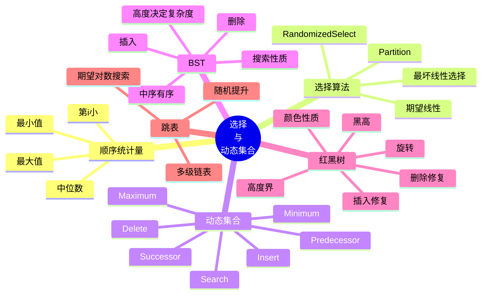

# 第 4 讲 选择问题、搜索树、红黑树与跳表

## 本讲知识图谱



## 4.1 顺序统计量与选择问题

第 $i$ 个顺序统计量是集合中第 $i$ 小的元素。特殊情况：

- $i=1$：最小值。
- $i=n$：最大值。
- $i=\lceil n/2\rceil$：中位数的一种定义。

如果先排序，再取第 $i$ 个元素，时间为 $O(n\log n)$。选择问题要求不完整排序，直接找到第 $i$ 小元素。

最小值只需 $n-1$ 次比较，因为每个非最小元素至少要输掉一次比较。最大值同理。若同时找最小和最大，可以两两配对比较，约需要 $3n/2$ 次比较。

## 4.2 RandomizedSelect

快速选择使用快速排序中的 `PARTITION`。Partition 后 pivot 已处在最终排名位置，只需递归进入包含目标排名的一侧。

```text
RANDOMIZED-SELECT(A, p, r, i):
    if p == r:
        return A[p]
    q = RANDOMIZED-PARTITION(A, p, r)
    k = q - p + 1
    if i == k:
        return A[q]
    else if i < k:
        return RANDOMIZED-SELECT(A, p, q-1, i)
    else:
        return RANDOMIZED-SELECT(A, q+1, r, i-k)
```

与快速排序不同，快速选择每层只递归一个子问题。最坏情况下每次只排除一个元素：

$$
T(n)=T(n-1)+\Theta(n)=\Theta(n^2)
$$

随机 pivot 下期望时间为 $O(n)$。直觉是：有常数概率 pivot 落在中间一半排名中，此时问题规模至少缩小到 $3n/4$。若把若干次坏 pivot 的代价摊到一次好 pivot 上，总期望仍为线性。

LeetCode 215 求第 $k$ 大，可转化为第 $n-k+1$ 小。

## 4.3 最坏线性时间选择

最坏线性选择也叫 median of medians。

算法步骤：

1. 把 $n$ 个元素分成每组 5 个。
2. 每组内部排序，取中位数。
3. 递归地在这些中位数中找中位数 $x$。
4. 用 $x$ 作为 pivot 做 partition。
5. 只递归进入目标所在一侧。

关键性质：以 $x$ 为 pivot，至少有约 $3n/10$ 个元素不大于 $x$，也至少有约 $3n/10$ 个元素不小于 $x$。因此递归子问题规模至多 $7n/10$。

递推式为：

$$
T(n)\le T(n/5)+T(7n/10)+cn
$$

该递推解为 $T(n)=O(n)$。这个算法常数较大，实践中随机选择更常用，但它说明选择问题在比较模型下可以做到最坏线性。

## 4.4 动态集合

动态集合维护一组随时间变化的元素。常见操作：

| 操作 | 含义 |
|:---:|:---:|
| `SEARCH(S, k)` | 找关键字为 $k$ 的元素 |
| `INSERT(S, x)` | 插入元素 |
| `DELETE(S, x)` | 删除元素 |
| `MINIMUM(S)` | 返回最小元素 |
| `MAXIMUM(S)` | 返回最大元素 |
| `SUCCESSOR(S, x)` | 返回大于 $x$ 的最小元素 |
| `PREDECESSOR(S, x)` | 返回小于 $x$ 的最大元素 |

不同数据结构适合不同操作组合。哈希表擅长等值查询，但不擅长有序操作；搜索树牺牲一些常数，换来顺序相关操作。

## 4.5 二叉搜索树

二叉搜索树 BST 满足：

$$
\text{left subtree keys}\le x.key\le \text{right subtree keys}
$$

中序遍历 BST 会得到非降序序列。

搜索：

```text
TREE-SEARCH(x, k):
    if x == nil or k == x.key:
        return x
    if k < x.key:
        return TREE-SEARCH(x.left, k)
    else:
        return TREE-SEARCH(x.right, k)
```

插入：

```text
TREE-INSERT(T, z):
    y = nil
    x = T.root
    while x != nil:
        y = x
        if z.key < x.key:
            x = x.left
        else:
            x = x.right
    z.parent = y
    if y == nil:
        T.root = z
    else if z.key < y.key:
        y.left = z
    else:
        y.right = z
```

搜索和插入的时间都是 $O(h)$，其中 $h$ 是树高。若树接近平衡，$h=O(\log n)$；若退化为链，$h=O(n)$。

## 4.6 Successor、Predecessor 与删除

后继 `SUCCESSOR(x)` 是大于 $x$ 的最小节点：

- 若 $x$ 有右子树，后继是右子树中的最小节点。
- 若没有右子树，向上找第一个“从左孩子走上来的祖先”。

删除节点 $z$ 分三类：

1. $z$ 没有孩子：直接删除。
2. $z$ 只有一个孩子：用孩子替代 $z$。
3. $z$ 有两个孩子：找 $z$ 的后继 $y$，用 $y$ 替代 $z$，再处理 $y$ 原位置。

CLRS 中常用 `TRANSPLANT(T, u, v)` 表示“用子树 $v$ 替换子树 $u$”：

```text
TRANSPLANT(T, u, v):
    if u.parent == nil:
        T.root = v
    else if u == u.parent.left:
        u.parent.left = v
    else:
        u.parent.right = v
    if v != nil:
        v.parent = u.parent
```

删除操作本身也是 $O(h)$。

## 4.7 用 BST 排序与快速排序的联系

若把数组元素依次插入 BST，再中序遍历输出，就得到排序结果。

运行时间等于每次插入路径长度之和。若输入随机，BST 形状和快速排序递归树有相同分布，因此期望 $O(n\log n)$。若输入有序，BST 退化成链，时间 $O(n^2)$。

这说明“树高”就是 BST 性能的核心。因此需要平衡搜索树。

## 4.8 红黑树

红黑树是一种近似平衡的 BST。每个节点有红或黑两种颜色，并满足：

1. 每个节点是红色或黑色。
2. 根节点是黑色。
3. 所有叶子 `nil` 是黑色。
4. 红节点的孩子都是黑色，也就是不能有连续红节点。
5. 对任意节点，从该节点到所有后代叶子的简单路径包含相同数量的黑节点。

定义黑高 $bh(x)$ 为从 $x$ 到后代叶子的任一路径上的黑节点数，不含 $x$ 本身或按教材约定处理，关键是所有路径相同。

高度界：

含 $n$ 个内部节点的红黑树高度满足：

$$
h\le 2\log_2(n+1)
$$

证明思路：

- 由性质 4，任一路径上红节点不能相邻，所以至少一半节点是黑节点，$bh(root)\ge h/2$。
- 归纳证明以节点 $x$ 为根、黑高为 $bh(x)$ 的子树至少有 $2^{bh(x)}-1$ 个内部节点。
- 因此 $n\ge 2^{h/2}-1$，推出 $h\le 2\log_2(n+1)$。

所以红黑树的搜索、插入、删除都是 $O(\log n)$。

## 4.9 旋转与插入修复

旋转是局部改变树形而保持 BST 中序顺序不变的操作。

左旋：

```text
LEFT-ROTATE(T, x):
    y = x.right
    x.right = y.left
    if y.left != nil:
        y.left.parent = x
    y.parent = x.parent
    if x.parent == nil:
        T.root = y
    else if x == x.parent.left:
        x.parent.left = y
    else:
        x.parent.right = y
    y.left = x
    x.parent = y
```

红黑树插入先按 BST 插入，并把新节点染红。这样不会增加任何路径黑高，但可能违反“红节点不能有红孩子”。修复过程围绕新节点、父节点、叔节点和祖父节点分情况：

- 叔节点红：父和叔变黑，祖父变红，把问题上移。
- 叔节点黑且新节点是“内侧孩子”：先旋转转成外侧情况。
- 叔节点黑且新节点是“外侧孩子”：父变黑、祖父变红，对祖父旋转。

删除修复更复杂，本课程重点通常是理解为什么红黑树能保持 $O(\log n)$，以及旋转不破坏搜索树顺序。

## 4.10 跳表

课件后半部分从“多条 express line 的有序链表”引出跳表。跳表是一组分层有序链表：

- 最底层包含所有元素。
- 上层是下层的随机抽样。
- 搜索时从最高层开始，能向右就向右，否则向下。

若每个节点以概率 $1/2$ 被提升到上一层，则：

- 层数期望 $O(\log n)$。
- 搜索、插入、删除期望 $O(\log n)$。

跳表和红黑树都提供有序动态集合操作。红黑树靠确定性旋转维持平衡，跳表靠随机化维持期望平衡。

## 作业定位

- LeetCode 215：快速选择是最贴近本讲的做法。若求第 $k$ 大，目标排名是第 $n-k+1$ 小。
- 堆做法来自第 2 讲，维护大小为 $k$ 的最小堆；快速选择期望更快，但实现时要小心 partition 边界。

## 本讲易错点

- 快速选择和快速排序都用 partition，但快速选择只递归一边。
- 第 $k$ 大和第 $k$ 小转换时容易出现 $n-k$ 与 $n-k+1$ 的 off-by-one。
- BST 中序有序是搜索树性质的直接结果。
- BST 删除两个孩子的节点时，后继最多只有一个右孩子。
- 红黑树不是严格平衡树；它保证最长路径不超过最短路径的约两倍。
- 旋转不会改变中序序列，只改变树高和局部父子关系。
- 跳表的复杂度是期望复杂度，依赖随机提升。

## 自测题

1. 写出 `RANDOMIZED-SELECT`，并说明它和快速排序的递归差别。
2. 为什么 median of medians 能保证最坏 $O(n)$？
3. 证明 BST 中序遍历输出有序序列。
4. 描述 BST 删除有两个孩子节点的过程。
5. 写出红黑树五条性质，并说明它们如何推出高度 $O(\log n)$。
6. 比较红黑树和跳表的平衡机制。

