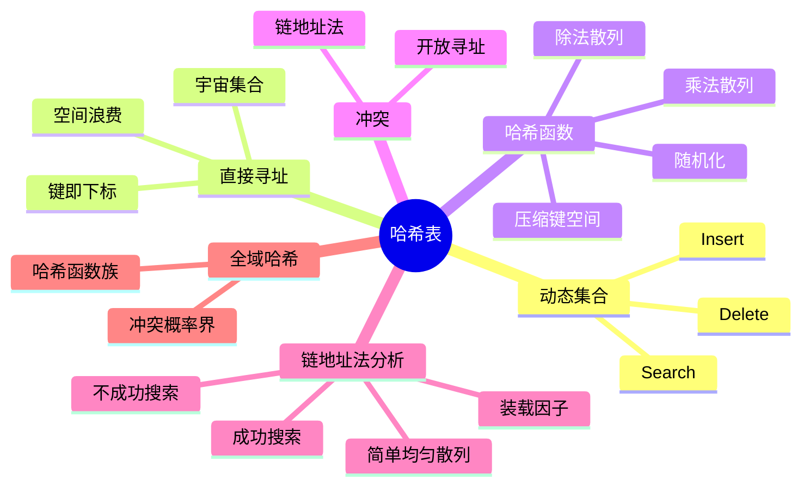

# 第 5 讲 哈希表

## 本讲知识图谱



## 5.1 从动态集合到符号表

哈希表主要用于实现字典、集合、符号表等动态集合。典型操作是：

- `INSERT(k, v)`：插入键值对。
- `SEARCH(k)`：按键查询。
- `DELETE(k)`：按键删除。

如果只需要等值查询，哈希表通常比平衡搜索树更快，期望时间接近 $O(1)$。但哈希表不自然支持有序遍历、前驱后继、区间查询等操作。

## 5.2 直接寻址

若键来自较小宇宙集合 $U=\{0,1,\ldots,m-1\}$，可以直接用数组 $T$：

```text
DIRECT-ADDRESS-SEARCH(T, k):
    return T[k]

DIRECT-ADDRESS-INSERT(T, x):
    T[x.key] = x

DIRECT-ADDRESS-DELETE(T, x):
    T[x.key] = nil
```

直接寻址时间 $O(1)$，但要求键空间不大。若学号、字符串、对象地址等键空间巨大，而实际存储元素数 $n$ 很小，直接开 $|U|$ 大小数组会严重浪费。

哈希表用哈希函数把大键空间压缩到较小表长：

$$
h: U\to \{0,1,\ldots,m-1\}
$$

问题随之出现：不同键可能映射到同一槽位，即冲突。

## 5.3 冲突与链地址法

冲突不可避免，因为通常 $|U|>m$。链地址法把映射到同一槽位的元素放在一个链表中：

```text
CHAINED-HASH-INSERT(T, x):
    insert x at head of list T[h(x.key)]

CHAINED-HASH-SEARCH(T, k):
    search key k in list T[h(k)]

CHAINED-HASH-DELETE(T, x):
    delete x from list T[h(x.key)]
```

若链表是双链表且删除时已持有节点指针，删除可为 $O(1)$。若只给键，需要先搜索。

装载因子：

$$
\alpha=\frac{n}{m}
$$

其中 $n$ 是元素数，$m$ 是槽位数。$\alpha$ 表示平均每个槽位的链长。

## 5.4 链地址法分析

简单均匀散列假设：每个键等概率映射到 $m$ 个槽位，且各键映射相互独立。

在该假设下，不成功搜索的期望时间为：

$$
O(1+\alpha)
$$

因为先计算哈希值 $O(1)$，再扫描对应链表，期望链长为 $\alpha$。

成功搜索也为 $O(1+\alpha)$。如果元素插入到链表头，并假设被查询元素等可能是表中任意元素，则平均扫描长度与所在链表长度同阶，期望仍由装载因子控制。

若保持 $\alpha=O(1)$，哈希表的基本操作期望为 $O(1)$。实际实现通常在装载因子超过阈值时扩容并重新哈希。

## 5.5 哈希函数选择

好的哈希函数应尽量把真实数据分布均匀打散，避免规律键集中到少数槽位。

除法散列：

$$
h(k)=k\bmod m
$$

表长 $m$ 不宜取 $2^p$，否则只取低位信息。常取不接近 $2$ 的幂的素数。

乘法散列：

$$
h(k)=\lfloor m(kA\bmod 1)\rfloor
$$

其中 $0<A<1$。该方法对 $m$ 的选择不如除法法敏感。

字符串哈希常把字符串看成多项式：

$$
h(s)=\left(\sum_{i=0}^{L-1}s_i b^i\right)\bmod m
$$

实际中需要注意溢出、字符编码、攻击性输入和随机种子。

## 5.6 全域哈希

固定哈希函数总可能被构造出坏输入，使所有键冲突。全域哈希通过随机选择哈希函数来避免对抗性坏例。

设 $H$ 是从 $U$ 到 $\{0,\ldots,m-1\}$ 的哈希函数族。若对任意不同键 $x,y\in U$：

$$
Pr_{h\in H}[h(x)=h(y)]\le \frac{1}{m}
$$

则 $H$ 是全域哈希函数族。

结论：若从全域哈希族中随机选 $h$，链地址法中任意键的期望冲突数至多 $\alpha$，因此操作期望时间为 $O(1+\alpha)$。

一种经典构造：

- 取素数 $p>|U|$。
- 随机选择 $a\in\{1,\ldots,p-1\}$，$b\in\{0,\ldots,p-1\}$。
- 定义：

$$
h_{a,b}(k)=((ak+b)\bmod p)\bmod m
$$

函数族 $H=\{h_{a,b}\}$ 是全域的。

## 5.7 最长连续子序列

书面作业 2 Q1 要求在线性期望时间内求数组中最长连续整数子序列长度。关键是用哈希集合支持 $O(1)$ 期望查询。

算法：

1. 把所有元素放入集合 $S$。
2. 对每个数 $x$，只有当 $x-1\notin S$ 时，才把 $x$ 当作一个连续段的起点。
3. 从 $x$ 开始不断查 $x+1,x+2,\ldots$ 是否存在，更新最长长度。

```python
def longest_consecutive(nums):
    s = set(nums)
    best = 0
    for x in s:
        if x - 1 not in s:
            y = x
            while y + 1 in s:
                y += 1
            best = max(best, y - x + 1)
    return best
```

为什么是期望 $O(n)$：每个连续段只从最小元素开始向右扫描一次，每个元素最多被扫描为某个段的一部分一次。哈希查询期望 $O(1)$，总期望 $O(n)$。

## 5.8 哈希表与搜索树对比

| 需求 | 哈希表 | 平衡搜索树 |
|:---:|:---:|:---:|
| 等值查询 | 期望 $O(1)$ | $O(\log n)$ |
| 插入删除 | 期望 $O(1)$ | $O(\log n)$ |
| 有序遍历 | 不自然 | 支持 |
| 最小/最大 | 需额外维护 | 支持 |
| 前驱/后继 | 不支持或很难 | 支持 |
| 最坏保证 | 需随机化或特殊设计 | 确定 $O(\log n)$ |
| 空间 | 依赖装载因子 | 每节点指针和颜色等 |

## 作业定位

- 书面作业 2 Q1：最长连续子序列，使用哈希集合识别每个连续段的起点。
- 该题的“expected linear running time”来自哈希表的期望 $O(1)$ 查询，不是比较排序。若先排序，复杂度为 $O(n\log n)$，不能拿满分。

## 本讲易错点

- 哈希表不是不会冲突；它通过冲突处理和好的哈希函数控制冲突代价。
- $O(1)$ 是期望或摊还意义下的常见结论，坏哈希函数下可能退化。
- 装载因子 $\alpha$ 可以大于 1，尤其在链地址法中。
- 直接寻址的键必须能直接作为数组下标，且宇宙集合不能太大。
- 除法散列中表长选择会影响分布。
- 全域哈希随机的是哈希函数，而不是每次查询结果。

## 自测题

1. 直接寻址和哈希表的根本区别是什么？
2. 写出链地址法的插入、查询、删除操作。
3. 解释装载因子 $\alpha=n/m$ 对期望查询时间的影响。
4. 为什么固定哈希函数可能被对抗性输入击穿？
5. 写出全域哈希的定义。
6. 证明最长连续子序列算法中每个元素最多被连续扫描一次。

