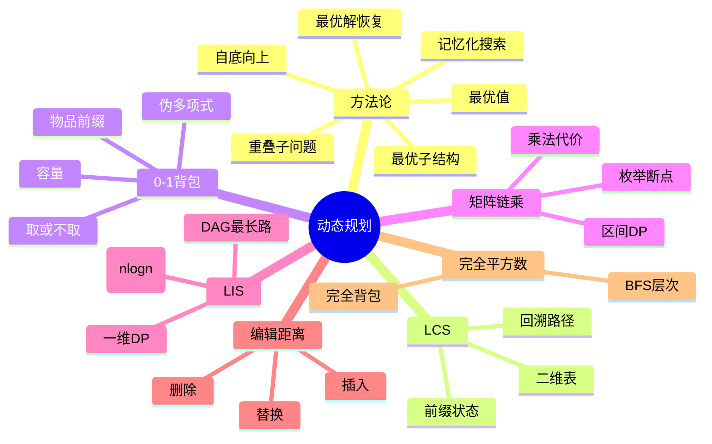

# 第 6 讲 动态规划

## 本讲知识图谱



## 6.1 动态规划的适用条件

动态规划是一种算法设计元技术，常用于优化问题。它适合满足以下特征的问题：

- 最优子结构：原问题的最优解可以由子问题的最优解组合得到。
- 重叠子问题：递归求解时会反复遇到相同子问题。

与分治相比，分治的子问题通常相互独立，例如归并排序左右两半；动态规划的子问题大量重叠，例如 Fibonacci、LCS、背包。

两种实现方式：

| 方式 | 思路 | 优点 |
|:---:|:---:|:---:|
| 记忆化搜索 | 自顶向下递归，遇到状态先查缓存 | 写法贴近递归定义 |
| 自底向上 | 按依赖顺序填表 | 无递归开销，便于压缩空间 |

DP 解题五件事：

1. 状态：`dp[...]` 表示什么。
2. 转移：如何由更小状态得到当前状态。
3. 边界：最小状态是什么。
4. 顺序：按什么顺序计算能保证依赖已知。
5. 答案：最终返回哪个状态，若要解本身如何回溯。

## 6.2 LCS 最长公共子序列

给定序列 $X$ 和 $Y$，最长公共子序列 LCS 是同时作为二者子序列的最长序列。子序列不要求连续，但相对顺序不变。

设 $X_i$ 是 $X$ 的前 $i$ 个字符，$Y_j$ 是 $Y$ 的前 $j$ 个字符。定义：

$$
c[i,j]=LCS(X_i,Y_j) \text{ 的长度}
$$

边界：

$$
c[i,0]=0,\quad c[0,j]=0
$$

转移：

$$
c[i,j]=
\begin{cases}
c[i-1,j-1]+1, & X[i]=Y[j] \\
\max(c[i-1,j],c[i,j-1]), & X[i]\ne Y[j]
\end{cases}
$$

伪代码：

```text
LCS-LENGTH(X, Y):
    m = len(X)
    n = len(Y)
    for i = 0 to m:
        c[i,0] = 0
    for j = 0 to n:
        c[0,j] = 0
    for i = 1 to m:
        for j = 1 to n:
            if X[i] == Y[j]:
                c[i,j] = c[i-1,j-1] + 1
            else:
                c[i,j] = max(c[i-1,j], c[i,j-1])
    return c[m,n]
```

时间复杂度 $O(mn)$，空间复杂度 $O(mn)$。若只求长度，可用滚动数组降到 $O(n)$。

恢复实际 LCS：从 $c[m,n]$ 倒推。若 $X[i]=Y[j]$ 且 $c[i,j]=c[i-1,j-1]+1$，记录该字符并走向 $(i-1,j-1)$；否则走向较大的相邻状态。

## 6.3 0-1 背包

给定容量 $W$， $n$ 个物品，每个物品有重量 $w_i$ 和价值 $b_i$。每个物品只能选或不选，目标：

$$
\max\sum_{i\in T}b_i,\quad \text{s.t.}\quad \sum_{i\in T}w_i\le W
$$

定义：

$$
B[i,w]=\text{只考虑前 }i\text{ 个物品，容量为 }w\text{ 时的最大价值}
$$

边界：

$$
B[0,w]=0,\quad B[i,0]=0
$$

转移：

$$
B[i,w]=
\begin{cases}
B[i-1,w], & w_i>w \\
\max(B[i-1,w],B[i-1,w-w_i]+b_i), & w_i\le w
\end{cases}
$$

时间复杂度 $O(nW)$，空间复杂度 $O(nW)$。注意这不是严格多项式时间，因为 $W$ 是数值大小，不是输入二进制长度；它是伪多项式时间。

一维压缩：

```python
def knapsack01(items, W):
    dp = [0] * (W + 1)
    for w, val in items:
        for cap in range(W, w - 1, -1):
            dp[cap] = max(dp[cap], dp[cap - w] + val)
    return dp[W]
```

容量必须倒序遍历，否则同一物品会被重复使用，变成完全背包。

## 6.4 矩阵链乘

矩阵乘法满足结合律，但不同加括号方式代价不同。若矩阵 $B_i$ 维度为 $a_i\times a_{i+1}$，计算 $B_i\cdots B_j$ 的最小乘法次数定义为：

$$
K[i,j]=\text{计算 }B_i\cdots B_j\text{ 的最小代价}
$$

边界：

$$
K[i,i]=0
$$

若最后一次乘法在 $w$ 处分开：

$$
(B_i\cdots B_w)(B_{w+1}\cdots B_j)
$$

转移： $K[i,j]=\min_{i\le w<j}\{K[i,w]+K[w+1,j]+a_i a_{w+1}a_{j+1}\}$

这是典型区间 DP：按区间长度从短到长填表。时间 $O(n^3)$，空间 $O(n^2)$。若记录最优断点 $s[i,j]$，可递归输出最优括号化方案。

## 6.5 LIS 最长递增子序列

给定序列 $a_1,\ldots,a_n$，最长递增子序列要求选择下标递增且数值递增的最长子序列。

一维 DP： $L[j]=1+\max\{L[i]:i<j \text{ 且 } a_i<a_j\}$

若不存在这样的 $i$，则 $L[j]=1$。答案为 $\max_j L[j]$。时间复杂度 $O(n^2)$。

也可把每个元素看作 DAG 的一个点，若 $i<j$ 且 $a_i<a_j$，连边 $i\to j$。LIS 就是这个 DAG 上的最长路径。

$O(n\log n)$ 方法维护 `best[k]`：长度为 $k$ 的递增子序列的最小可能结尾值。扫描每个 $x$，用二分找到它能成为哪个长度的结尾并更新。`best` 越小，未来可扩展性越强。

```python
from bisect import bisect_left

def lis_length(a):
    best = []
    for x in a:
        i = bisect_left(best, x)
        if i == len(best):
            best.append(x)
        else:
            best[i] = x
    return len(best)
```

这个方法直接给长度；若要恢复序列，需要额外记录前驱和每个长度对应的末尾下标。

## 6.6 编辑距离

书面作业 2 Q3 和 LeetCode 72 都是编辑距离。允许操作：

- 插入一个字符。
- 删除一个字符。
- 替换一个字符。

定义：

$$
dp[i][j]=s[0..i-1]\text{ 变成 }t[0..j-1]\text{ 的最少编辑次数}
$$

边界：

$$
dp[i][0]=i,\quad dp[0][j]=j
$$

转移：

若 $s[i-1]=t[j-1]$：

$$
dp[i][j]=dp[i-1][j-1]
$$

否则：

$$
dp[i][j]=1+\min(dp[i-1][j],dp[i][j-1],dp[i-1][j-1])
$$

三项分别对应删除、插入、替换。时间 $O(mn)$，空间 $O(mn)$，只求距离可滚动到 $O(n)$。

## 6.7 完全平方数

LeetCode 279 要求用最少完全平方数表示 $n$。这是完全背包或最短路问题。

DP 定义：

$$
dp[x]=\text{表示 }x\text{ 所需的最少平方数个数}
$$

边界 $dp[0]=0$，转移：

$$
dp[x]=1+\min_{q\in Squares,\ q\le x}dp[x-q]
$$

```python
def num_squares(n):
    squares = [i*i for i in range(1, int(n**0.5)+1)]
    dp = [0] + [10**9] * n
    for x in range(1, n+1):
        for q in squares:
            if q > x:
                break
            dp[x] = min(dp[x], dp[x-q] + 1)
    return dp[n]
```

也可把 $0..n$ 看成图，若 $x+q\le n$ 就有边 $x\to x+q$，每条边权为 1。求从 0 到 $n$ 的最短边数，用 BFS。

## 6.8 最优值与最优解

课件强调：DP 表常先给出最优值，而不是最优解本身。

要恢复最优解，通常需要：

- 在转移时记录选择来源，例如 LCS 的方向、矩阵链乘的断点。
- 或在填表后根据数值关系反向推断来源。

背包恢复选中物品：从 $(n,W)$ 倒推，若 $B[i,W]=B[i-1,W]$，说明第 $i$ 个物品可不选；否则选第 $i$ 个物品并转到 $(i-1,W-w_i)$。

## 作业定位

- 书面作业 2 Q3：编辑距离二维 DP，边界为把非空串变空串或空串变非空串。
- LeetCode 72：同一问题，注意 Python 字符串下标与 DP 下标偏移。
- LeetCode 279：可用完全背包 DP，也可用 BFS；若按背包写，平方数可重复使用。

## 本讲易错点

- 最优子结构不是“能递归”这么简单，还要保证子问题最优能拼成全局最优。
- 0-1 背包一维压缩必须倒序容量；完全背包才正序。
- LCS 是子序列，不要求连续；最长公共子串才要求连续。
- 编辑距离中插入和删除的方向容易混淆，写状态定义后按定义推转移。
- 矩阵链乘的断点枚举是最后一次乘法位置，不是第一个乘法位置。
- LIS 的 `best` 数组元素不是某个真实最优序列本身，只是各长度的最小结尾值。

## 自测题

1. 说明动态规划和分治的区别。
2. 写出 LCS 的状态定义和转移方程。
3. 为什么 0-1 背包一维压缩要倒序遍历容量？
4. 推导矩阵链乘的区间 DP 转移。
5. 用 DP 求 `horse` 到 `ros` 的编辑距离。
6. 对序列 `5,2,8,6,3,6,9,7` 手算 LIS 长度。

