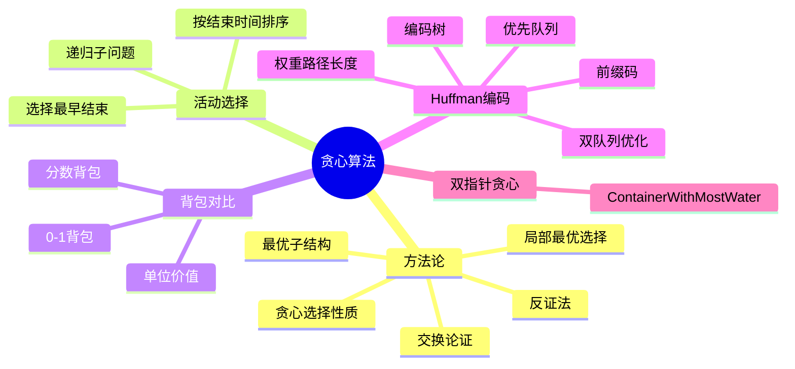

# 第 7 讲 贪心算法

## 本讲知识图谱



## 7.1 贪心算法的基本形态

贪心算法每一步都做当前看起来最好的选择，并且不回头修改。它比动态规划更“冒险”：DP 会比较多个子问题选择，贪心只保留一个局部选择。

要证明贪心正确，通常需要两部分：

- 贪心选择性质：存在某个最优解包含当前贪心选择。
- 最优子结构：做出贪心选择后，剩余问题的最优解能与该选择组合成原问题最优解。

常用证明方法：

- 交换论证：把任意最优解中的第一步替换成贪心选择，证明不变差。
- cut property：在图算法中证明某条安全边可加入某个最优结构。
- 反证法：假设贪心选择不在任何最优解中，推出矛盾。

## 7.2 活动选择问题

给定 $n$ 个活动，每个活动 $a_i$ 有开始时间 $s_i$ 和结束时间 $f_i$。选择最多数量的互不重叠活动。

贪心策略：每次选择结束时间最早的活动，然后删除与它冲突的活动。

若活动已按结束时间排序：

```text
GREEDY-ACTIVITY-SELECTOR(s, f):
    A = {1}
    k = 1
    for m = 2 to n:
        if s[m] >= f[k]:
            A = A union {m}
            k = m
    return A
```

正确性证明：

设 $a_1$ 是结束时间最早的活动。任取一个最优解，其第一个活动为 $a_j$。因为 $f_1\le f_j$，用 $a_1$ 替换 $a_j$ 后，不会与后续活动冲突，活动数量不变。因此存在包含 $a_1$ 的最优解。选择 $a_1$ 后，剩余问题是所有开始时间不早于 $f_1$ 的活动选择问题，具有最优子结构。

## 7.3 0-1 背包与分数背包

0-1 背包不能简单按价值、重量或单位价值贪心。一个局部看似最好的物品可能占用容量，使全局最优组合不可达。因此 0-1 背包用 DP。

分数背包允许取物品的一部分。此时按单位价值 $b_i/w_i$ 从高到低取就是最优的。

交换论证：若某个解中还有单位价值更高的物品未取满，却取了单位价值更低的物品，则把一小部分容量从低单位价值物品换给高单位价值物品，价值不下降且通常上升。因此最优解必须优先填满高单位价值物品。

这个对比说明：是否能贪心取决于问题结构，不取决于题面是否像“最大化价值”。

## 7.4 前缀码与编码树

Huffman 编码用于根据字符频率构造最短平均长度的二进制前缀码。

前缀码要求没有任何字符编码是另一个字符编码的前缀。这样解码时从左到右读比特，一旦到达叶子就确定一个字符，不会歧义。

前缀码可表示为二叉树：

- 叶子对应字符。
- 左边边可记为 0，右边边记为 1。
- 字符编码是从根到叶子的路径。

编码总代价为加权路径长度：

$$
Cost(T)=\sum_{\sigma} f_\sigma d_\sigma
$$

其中 $f_\sigma$ 是字符频率，$d_\sigma$ 是该字符叶子深度。

## 7.5 Huffman 算法

Huffman 贪心选择：每次选择频率最低的两个节点合并为一个新节点，新节点频率为二者之和。

```text
HUFFMAN(C):
    Q = priority queue containing all symbols in C
    for i = 1 to n-1:
        x = EXTRACT-MIN(Q)
        y = EXTRACT-MIN(Q)
        z = new internal node
        z.left = x
        z.right = y
        z.freq = x.freq + y.freq
        INSERT(Q, z)
    return EXTRACT-MIN(Q)
```

若用二叉堆实现优先队列，每次合并做两次 `extract-min` 和一次 `insert`，总时间 $O(n\log n)$。

## 7.6 Huffman 正确性

贪心选择性质：存在一棵最优前缀码树，使得频率最低的两个字符是最深层的一对兄弟叶子。

证明思路：

1. 在任意最优树中，最深层存在一对兄弟叶子。
2. 若这两个叶子的频率不是最低的两个，可以把最低频字符与它们交换到最深位置。
3. 因为低频字符放得更深不会增加总代价，高频字符放得更浅只会降低或不变，所以得到不差的最优树。

最优子结构：把频率最低的两个字符 $a,b$ 合并为新字符 $z$，频率 $f_z=f_a+f_b$。若 $T'$ 是合并后字符集的最优树，把 $z$ 展开成 $a,b$ 两个孩子，就得到原问题的最优树。

因此反复合并最低频率节点是正确的。

## 7.7 已排序频率下的线性 Huffman

书面作业 2 Q2 给定所有字符频率一开始已经有序。可以用两个队列在线性时间构造 Huffman 树：

- `Q1`：初始叶子节点队列，按频率从小到大排列。
- `Q2`：合并产生的内部节点队列，也会按频率从小到大产生。

每次从 `Q1` 和 `Q2` 的队头中取出频率最小的节点，重复两次后合并并放入 `Q2`。

```text
FIND-MIN(Q1, Q2):
    if Q1 is empty:
        return DEQUEUE(Q2)
    if Q2 is empty:
        return DEQUEUE(Q1)
    if Q1.front.freq <= Q2.front.freq:
        return DEQUEUE(Q1)
    else:
        return DEQUEUE(Q2)

SORTED-HUFFMAN(A):
    Q1 = queue of leaves in sorted order
    Q2 = empty queue
    while size(Q1) + size(Q2) > 1:
        left = FIND-MIN(Q1, Q2)
        right = FIND-MIN(Q1, Q2)
        z = new node with freq left.freq + right.freq
        z.left = left
        z.right = right
        ENQUEUE(Q2, z)
    return FIND-MIN(Q1, Q2)
```

为什么 `Q2` 有序：每次合并取出的两个节点是当前全局最小的两个，之后产生的新频率不小于先前产生并仍在 `Q2` 中的节点频率。因此新节点可追加到 `Q2` 队尾。

每个节点入队出队常数次，总时间 $O(n)$。

## 7.8 Container With Most Water

LeetCode 11 是双指针贪心。给定高度数组，选择两条线 $i<j$，面积：

$$
Area(i,j)=(j-i)\cdot \min(h_i,h_j)
$$

策略：左右指针从两端开始，每次移动较矮的一侧。

```python
def max_area(height):
    l, r = 0, len(height) - 1
    ans = 0
    while l < r:
        ans = max(ans, (r-l) * min(height[l], height[r]))
        if height[l] <= height[r]:
            l += 1
        else:
            r -= 1
    return ans
```

证明直觉：若 $h_l\le h_r$，固定左端 $l$ 时，向内移动右端只会让宽度变小，而高度上界仍不超过 $h_l$，所以不可能得到比当前更大的面积。于是所有以 $l$ 为左端的候选都可以被安全丢弃，只能移动左指针。

时间 $O(n)$，空间 $O(1)$。

## 作业定位

- 书面作业 2 Q2：已排序频率的 Huffman 用两个队列，不需要堆。
- LeetCode 11：双指针每次移动短板，证明重点是被丢弃端点不可能再形成更优解。

## 本讲易错点

- 贪心算法不能只靠“看起来合理”，必须证明贪心选择性质。
- 0-1 背包不能按单位价值贪心，分数背包可以。
- Huffman 合并的是两个最小频率节点，不是编码长度最短的节点。
- Huffman 树中字符在叶子，内部节点不是字符。
- 双队列 Huffman 的前提是初始频率已经排序；否则排序本身要 $O(n\log n)$ 或另行线性排序。
- Container With Most Water 移动长板没有意义，因为面积受短板限制。

## 自测题

1. 写出贪心算法正确性证明的两个核心部分。
2. 证明活动选择中“最早结束”活动可以出现在某个最优解中。
3. 给一个 0-1 背包中按单位价值贪心失败的例子。
4. 写出 Huffman 算法并分析复杂度。
5. 说明已排序频率下双队列 Huffman 为什么是 $O(n)$。
6. 证明 Container With Most Water 中移动较矮指针的合理性。

