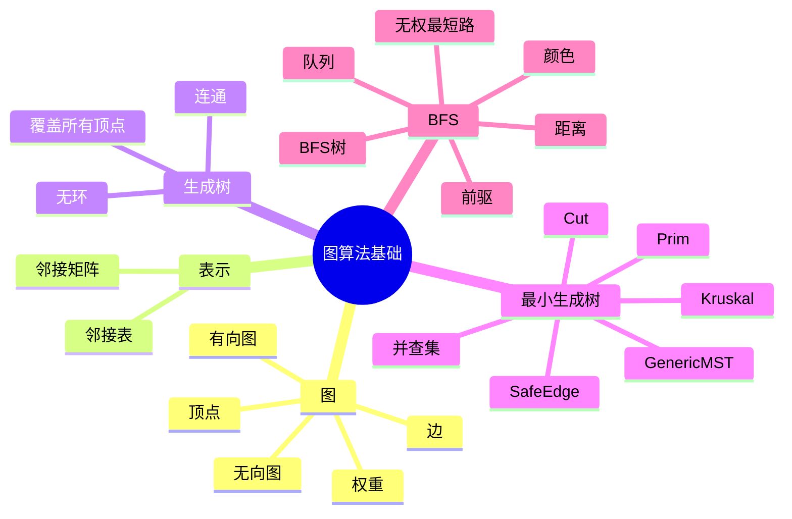

# 第 8 讲 图基础、最小生成树与 BFS

## 本讲知识图谱



## 8.1 图的定义与表示

图 $G=(V,E)$ 由顶点集合 $V$ 和边集合 $E$ 组成。边可以有方向，也可以无方向；可以有权重，也可以无权。

邻接矩阵：

- 用 $n\times n$ 矩阵 $A$ 表示。
- 若存在边 $(i,j)$，则 $A[i][j]=1$ 或权重 $w(i,j)$。
- 查询两点是否相邻为 $O(1)$。
- 空间 $O(V^2)$，适合稠密图。

邻接表：

- 每个顶点维护一个相邻顶点列表。
- 空间 $O(V+E)$。
- 遍历所有边为 $O(V+E)$。
- 适合稀疏图，是图搜索常用表示。

在无向图中，一条边通常在邻接表中出现两次；在邻接矩阵中矩阵对称。

## 8.2 生成树与最小生成树

无向连通图的生成树是包含所有顶点且无环的连通子图。若图有 $|V|$ 个顶点，则任意生成树都有 $|V|-1$ 条边。

最小生成树 MST 是总权重最小的生成树：

$$
T=\arg\min_{T'\text{ is spanning tree}}\sum_{e\in T'}w(e)
$$

MST 问题只对无向连通图自然定义。若图不连通，得到的是每个连通分量的最小生成森林。

## 8.3 Cut Property

一个 cut $(S,V-S)$ 把顶点集合分成两部分。跨越该 cut 的边是一个端点在 $S$、另一个端点在 $V-S$ 的边。

安全边定理：

设 $A$ 是某棵 MST 的子集，cut $(S,V-S)$ 不穿过 $A$ 中任何边。若 $e$ 是跨越该 cut 的最轻边，则 $e$ 对 $A$ 是安全的，也就是 $A\cup\{e\}$ 仍是某棵 MST 的子集。

证明思路：

1. 取一棵包含 $A$ 的 MST $T$。
2. 若 $e\in T$，结论显然。
3. 若 $e\notin T$，把 $e$ 加入 $T$ 会形成一个环。
4. 该环中必有另一条跨越同一 cut 的边 $f$。
5. 因为 $e$ 是最轻跨 cut 边，$w(e)\le w(f)$。
6. 用 $e$ 替换 $f$ 得到的仍是生成树，权重不增，因此也是 MST，并且包含 $A\cup\{e\}$。

Prim 和 Kruskal 都是在不同方式下反复选择安全边。

## 8.4 Generic MST

通用框架：

```text
GENERIC-MST(G, w):
    A = empty set
    while A does not form a spanning tree:
        find an edge (u, v) that is safe for A
        A = A union {(u, v)}
    return A
```

算法差异在于如何维护 $A$，以及如何快速找到安全边。

## 8.5 Prim 算法

Prim 算法从一个起点出发，维护一棵正在生长的树。每次选择连接“树内顶点”和“树外顶点”的最轻边。

伪代码：

```text
MST-PRIM(G, w, r):
    for each u in V:
        key[u] = infinity
        parent[u] = nil
    key[r] = 0
    Q = all vertices as min-priority queue keyed by key
    while Q is not empty:
        u = EXTRACT-MIN(Q)
        for each v in Adj[u]:
            if v in Q and w(u,v) < key[v]:
                parent[v] = u
                key[v] = w(u,v)
                DECREASE-KEY(Q, v, key[v])
```

`key[v]` 表示把树外顶点 $v$ 接入当前树的最小边权。每次 `EXTRACT-MIN` 选择一条跨越当前 cut 的最轻边，由 cut property 可知安全。

复杂度：

| 实现 | 时间 |
|:---:|:---:|
| 邻接矩阵，不用优先队列 | $O(V^2)$ |
| 邻接表 + 二叉堆 | $O(E\log V)$ |
| Fibonacci 堆 | $O(E+V\log V)$ |

稠密图中 $O(V^2)$ 实现反而简单有效。

## 8.6 Kruskal 算法

Kruskal 算法按边权从小到大扫描，每次加入不会产生环的边。它维护的是森林，而不是单棵树。

```text
MST-KRUSKAL(G, w):
    A = empty set
    for each v in V:
        MAKE-SET(v)
    sort edges E by nondecreasing weight
    for each edge (u, v) in sorted E:
        if FIND-SET(u) != FIND-SET(v):
            A = A union {(u, v)}
            UNION(u, v)
    return A
```

并查集用于判断加入边是否形成环：

- `MAKE-SET(x)`：创建单元素集合。
- `FIND-SET(x)`：找到集合代表。
- `UNION(x,y)`：合并两个集合。

带路径压缩和按秩合并的并查集几乎是常数时间。总复杂度主要来自排序：

$$
O(E\log E)=O(E\log V)
$$

Kruskal 对稀疏图很自然，也适合边列表输入。

LeetCode 1584 `Min Cost to Connect Points` 可以把每对点之间的曼哈顿距离当作完全图边权，再跑 Kruskal。若点数为 $n$，完全图边数 $O(n^2)$，排序代价 $O(n^2\log n)$。也可用 Prim 避免显式存储所有边，做到 $O(n^2)$。

## 8.7 BFS

BFS 广度优先搜索从源点 $s$ 出发，按距离层次探索图。它使用队列维护已经发现但尚未扩展的顶点。

每个顶点维护：

- `color[u]`：white 未发现，gray 已发现未完成，black 已完成。
- `d[u]`：从源点到 $u$ 的边数距离估计。
- `parent[u]`：BFS 树中的前驱。

```text
BFS(G, s):
    for each u in V - {s}:
        color[u] = WHITE
        d[u] = infinity
        parent[u] = nil
    color[s] = GRAY
    d[s] = 0
    parent[s] = nil
    Q = empty queue
    ENQUEUE(Q, s)
    while Q is not empty:
        u = DEQUEUE(Q)
        for each v in Adj[u]:
            if color[v] == WHITE:
                color[v] = GRAY
                d[v] = d[u] + 1
                parent[v] = u
                ENQUEUE(Q, v)
        color[u] = BLACK
```

邻接表下时间复杂度 $O(V+E)$。

## 8.8 BFS 正确性

定义 $\delta(s,v)$ 为从 $s$ 到 $v$ 的最短路径边数。BFS 的核心结论：

$$
d[v]=\delta(s,v)
$$

对所有从 $s$ 可达的顶点成立。

关键性质：

- 对任意边 $(u,v)$，有 $\delta(s,v)\le \delta(s,u)+1$。
- 队列中的顶点距离值单调不降，且最多只相差 1。
- 当一个顶点第一次被发现时，给它的距离已经是最短距离。

BFS 生成的前驱子图是一棵 BFS tree。树中从 $s$ 到任意顶点 $v$ 的路径就是原图中的无权最短路径。

## 8.9 BFS 与 Perfect Squares

LeetCode 279 也可看成 BFS。把数字 $0..n$ 当作顶点，若 $x+q\le n$ 且 $q$ 是完全平方数，就连边 $x\to x+q$。每条边代表使用一个平方数。求最少平方数个数就是求从 0 到 $n$ 的最短边数。

这和第 6 讲 DP 是同一问题的两种视角：

- DP 按数值从小到大填表。
- BFS 按使用平方数个数分层。

## 作业定位

- LeetCode 1584：最小连接所有点，直接是 MST。Kruskal 实现简单，Prim 在完全图上空间更省。
- LeetCode 279：可用 BFS 分层，第一次到达 $n$ 的层数就是答案。

## 本讲易错点

- MST 是无向图问题；有向图中对应问题不是普通 MST。
- Prim 每次选的是连接当前树到外部的最轻边，不是全图最轻边。
- Kruskal 每次选全局剩余最轻边，但必须跳过成环边。
- cut property 要求 cut 不穿过当前边集 $A$。
- BFS 只在无权图中直接给最短路径；有权图需要最短路算法。
- 邻接矩阵遍历邻居通常要 $O(V)$，邻接表遍历所有邻居总计 $O(E)$。

## 自测题

1. 比较邻接矩阵和邻接表的空间与适用场景。
2. 证明 MST cut property。
3. 写出 Prim 算法中 `key[v]` 的含义。
4. Kruskal 为什么需要并查集？
5. 用 BFS 求无权最短路径时，为什么第一次发现顶点就是最短距离？
6. LeetCode 1584 用 Kruskal 和 Prim 的复杂度分别是多少？

