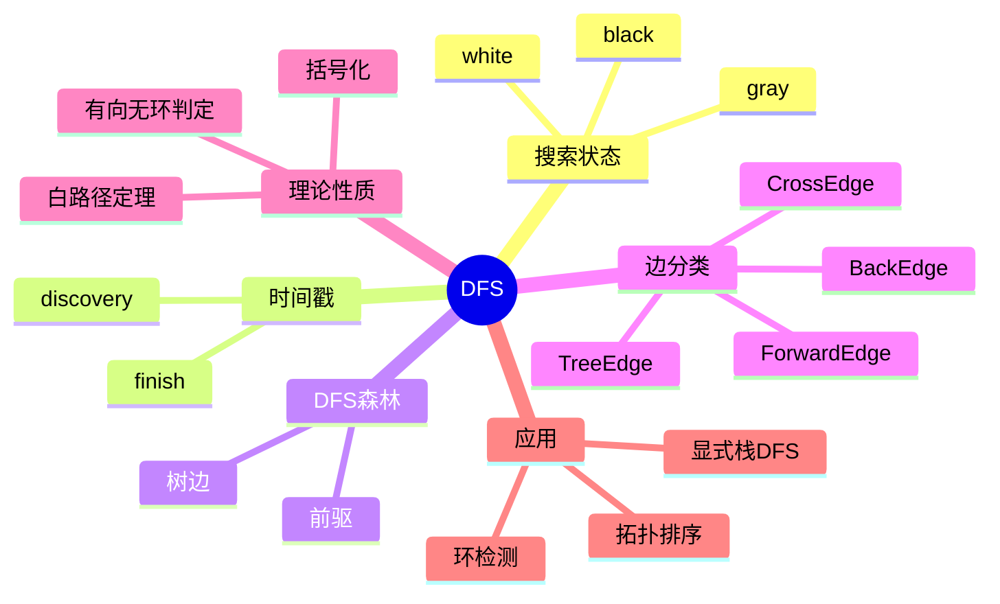

# 第 9 讲 DFS、边分类与拓扑排序

## 本讲知识图谱



## 9.1 DFS 的基本思想

DFS 深度优先搜索从一个顶点出发，沿着尚未访问的边尽可能深入；走不下去时回溯。若图不连通或有多个源，需要对所有白色顶点启动 DFS，得到 DFS forest。

每个顶点维护：

- `color[u]`：white 未发现，gray 已发现但未完成，black 已完成。
- `d[u]`：发现时间。
- `f[u]`：完成时间。
- `parent[u]`：DFS forest 中的父节点。

```text
DFS(G):
    for each u in V:
        color[u] = WHITE
        parent[u] = nil
    time = 0
    for each u in V:
        if color[u] == WHITE:
            DFS-VISIT(G, u)

DFS-VISIT(G, u):
    time = time + 1
    d[u] = time
    color[u] = GRAY
    for each v in Adj[u]:
        if color[v] == WHITE:
            parent[v] = u
            DFS-VISIT(G, v)
    color[u] = BLACK
    time = time + 1
    f[u] = time
```

邻接表下时间为 $O(V+E)$。

## 9.2 时间戳与括号化性质

DFS 的发现和完成时间具有括号化性质。对任意两个顶点 $u,v$，区间 $[d[u],f[u]]$ 与 $[d[v],f[v]]$ 只有三种关系：

- 完全不相交。
- $[d[u],f[u]]$ 包含 $[d[v],f[v]]$，此时 $v$ 是 $u$ 在 DFS forest 中的后代。
- $[d[v],f[v]]$ 包含 $[d[u],f[u]]$，此时 $u$ 是 $v$ 的后代。

直觉：递归调用形成严格嵌套的活动区间。一个调用未结束前，它的后代调用必须全部结束。

## 9.3 DFS 边分类

在有向图中，DFS 可把边分为四类：

| 边类型 | 含义 |
|:---:|:---:|
| tree edge | 发现白色顶点时使用的边 |
| back edge | 指向某个灰色祖先的边 |
| forward edge | 指向某个黑色后代的非树边 |
| cross edge | 连接不同 DFS 子树或无祖先后代关系的边 |

根据颜色判断：

- 遇到 white：tree edge。
- 遇到 gray：back edge。
- 遇到 black：可能是 forward 或 cross，需要看时间戳关系。

在无向图中，DFS 只会产生 tree edge 和 back edge。因为无向边会双向出现，指向已完成非祖先的 cross 情况会被 DFS 过程的发现顺序排除。

## 9.4 白路径定理与环检测

白路径定理：

在 DFS forest 中，顶点 $v$ 是顶点 $u$ 的后代，当且仅当在发现 $u$ 的时刻，存在一条从 $u$ 到 $v$ 的路径，路径上所有顶点都是白色。

该定理解释了 DFS 为什么能“一口气”深入并覆盖某个可达白色区域。

有向图无环判定：

$$
G \text{ 是 DAG} \iff DFS(G) \text{ 不产生 back edge}
$$

若存在 back edge $u\to v$，其中 $v$ 是 $u$ 的祖先，则从 $v$ 沿 DFS tree 到 $u$，再走 $u\to v$，形成环。

反过来，若图中有环，设环上最早被发现的顶点为 $v$，DFS 会沿环上的白色路径到达某个顶点并遇到指向灰色祖先的边，从而产生 back edge。

## 9.5 拓扑排序

DAG 的拓扑排序是顶点的线性序，使得每条有向边 $u\to v$ 中 $u$ 都排在 $v$ 前面。

DFS 拓扑排序：

```text
TOPOLOGICAL-SORT(G):
    call DFS(G), and when each vertex finishes, put it onto the front of a list
    return the list
```

等价地，按完成时间 $f[u]$ 从大到小排列。

正确性：对 DAG 中任意边 $u\to v$，DFS 完成后有 $f[u]>f[v]$。若 $v$ 是白色，会成为 $u$ 的后代，先完成 $v$ 后完成 $u$；若 $v$ 已完成，则也有 $f[v]<d[u]<f[u]$。DAG 中不存在指向灰色祖先的 back edge。因此按完成时间递减排列满足所有边方向。

拓扑排序应用：

- 课程先修关系。
- 编译依赖。
- DAG 上动态规划。
- DAG shortest path。

## 9.6 用显式栈消除递归

书面作业 2 Q4 要求用栈重写 DFS。关键是递归 DFS 的调用栈不仅保存顶点，还保存“当前遍历到哪个邻居”。若只把邻居全部压栈，可以得到 DFS 访问顺序，但时间戳和完成时间不一定和递归版一致。

一种保留迭代器位置的写法：

```text
STACK-DFS(G, s):
    for each u in V:
        color[u] = WHITE
        parent[u] = nil
    time = 0
    S = empty stack
    push (s, iterator over Adj[s]) onto S
    color[s] = GRAY
    time = time + 1
    d[s] = time
    while S is not empty:
        (u, it) = top(S)
        if it has next vertex v:
            advance it
            if color[v] == WHITE:
                parent[v] = u
                color[v] = GRAY
                time = time + 1
                d[v] = time
                push (v, iterator over Adj[v]) onto S
        else:
            pop(S)
            color[u] = BLACK
            time = time + 1
            f[u] = time
```

若要覆盖整个图，需要像递归 `DFS(G)` 一样对所有白色顶点启动 `STACK-DFS`。

## 9.7 DFS 与 BFS 对比

| 维度 | BFS | DFS |
|:---:|:---:|:---:|
| 数据结构 | 队列 | 递归栈或显式栈 |
| 搜索方式 | 按距离分层 | 尽可能深入 |
| 无权最短路 | 支持 | 不保证 |
| 时间复杂度 | $O(V+E)$ | $O(V+E)$ |
| 典型产物 | BFS tree、距离 | DFS forest、时间戳 |
| 典型应用 | 无权最短路、层次图 | 拓扑排序、环检测、连通性结构 |

## 作业定位

- 书面作业 2 Q4：显式栈 DFS。若题目要求与递归过程一致，需要栈帧保存邻居迭代状态。
- 图中环检测和拓扑排序都依赖 back edge 判断。

## 本讲易错点

- DFS 的 gray 表示“递归栈中”，black 表示“所有邻居处理完成”。
- 完成时间不是访问完某个顶点本身，而是它的所有后代都处理完之后。
- 有向图才有 tree/back/forward/cross 四类；无向图只有 tree/back。
- 拓扑排序只对 DAG 存在。
- 简单地把所有邻居压栈可能改变遍历顺序和完成时间，写证明时要说明具体栈策略。
- DFS 不是无权最短路算法。

## 自测题

1. 写出递归 DFS 并标注颜色变化。
2. 解释 DFS 时间戳的括号化性质。
3. 如何用 back edge 判断有向图是否有环？
4. 为什么拓扑排序按完成时间递减排列？
5. 写出显式栈 DFS，并说明栈帧中为什么要保存邻居迭代器。
6. 比较 DFS 和 BFS 的应用场景。

