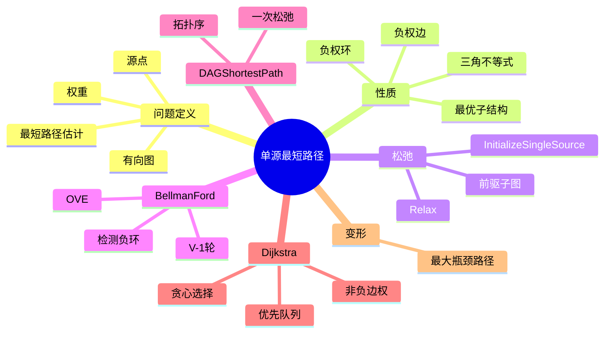

# 第 10 讲 单源最短路径

## 本讲知识图谱



## 10.1 问题定义

给定有向加权图 $G=(V,E)$，边权函数 $w:E\to \mathbb{R}$，源点 $s$。单源最短路径问题要求对所有顶点 $v$ 求：

$$
\delta(s,v)=\min_{p:s\leadsto v} w(p)
$$

其中路径权重是边权之和。若 $v$ 不可达，则 $\delta(s,v)=\infty$。

常见变体：

- 单源最短路径：固定源点 $s$ 到所有点。
- 单目的地最短路径：所有点到固定终点，可反向边后做单源。
- 单对最短路径：固定 $s,t$。
- 全源最短路径：所有点对，见第 11 讲。

## 10.2 最短路径性质

最优子结构：最短路径的子路径仍是最短路径。若 $p=s\leadsto u\leadsto v$ 是从 $s$ 到 $v$ 的最短路径，则其中 $s\leadsto u$ 必须是从 $s$ 到 $u$ 的最短路径。否则替换成更短子路径会使总路径更短。

三角不等式：对任意边 $(u,v)$：

$$
\delta(s,v)\le \delta(s,u)+w(u,v)
$$

负权边本身不一定有问题；问题是从源点可达的负权环。如果存在可达负权环，则可以绕环无限次让路径权重趋向 $-\infty$，最短路径没有良定义。

## 10.3 松弛

所有最短路算法都围绕松弛。

初始化：

```text
INITIALIZE-SINGLE-SOURCE(G, s):
    for each v in V:
        d[v] = infinity
        parent[v] = nil
    d[s] = 0
```

松弛边 $(u,v)$：

```text
RELAX(u, v, w):
    if d[v] > d[u] + w(u,v):
        d[v] = d[u] + w(u,v)
        parent[v] = u
```

`d[v]` 是当前最短路径估计。松弛不会让估计低于真实最短距离；它只是在发现更短路径时降低估计。

不同算法的差别是：按什么顺序、松弛哪些边、松弛多少次。

## 10.4 Bellman-Ford

Bellman-Ford 可处理负权边，并能检测从源点可达的负权环。

```text
BELLMAN-FORD(G, w, s):
    INITIALIZE-SINGLE-SOURCE(G, s)
    for i = 1 to |V|-1:
        for each edge (u, v) in E:
            RELAX(u, v, w)
    for each edge (u, v) in E:
        if d[v] > d[u] + w(u,v):
            return FALSE
    return TRUE
```

为什么 $|V|-1$ 轮足够：若没有负权环，任意最短路径可以取为简单路径，最多包含 $|V|-1$ 条边。每一轮遍历所有边，可以保证长度为 $i$ 的最短路径逐步传播。

正确性核心：设最短路径为 $s=v_0\to v_1\to\cdots\to v_k=v$。第 1 轮后 $d[v_1]$ 正确，第 2 轮后 $d[v_2]$ 正确，依此类推。$k\le |V|-1$。

负环检测：若 $|V|-1$ 轮后仍能松弛某条边，说明存在可达负权环。

时间复杂度：

$$
O(VE)
$$

## 10.5 DAG 最短路径

若图是 DAG，可按拓扑序松弛每条边一次。即使有负权边也没问题，因为 DAG 无环，不可能有负权环。

```text
DAG-SHORTEST-PATHS(G, w, s):
    topologically sort vertices of G
    INITIALIZE-SINGLE-SOURCE(G, s)
    for each u in topological order:
        for each v in Adj[u]:
            RELAX(u, v, w)
```

拓扑序保证当处理 $u$ 时，所有可能到达 $u$ 的前驱已经处理完。时间复杂度：

$$
O(V+E)
$$

## 10.6 Dijkstra

Dijkstra 适用于所有边权非负的图。它维护一个已确定最短距离的集合 $S$，每次从 $V-S$ 中选取 $d$ 值最小的顶点加入 $S$，再松弛它的出边。

```text
DIJKSTRA(G, w, s):
    INITIALIZE-SINGLE-SOURCE(G, s)
    S = empty set
    Q = V as min-priority queue keyed by d
    while Q is not empty:
        u = EXTRACT-MIN(Q)
        S = S union {u}
        for each v in Adj[u]:
            RELAX(u, v, w)
```

正确性直觉：边权非负时，当前 $d$ 最小的未确定顶点 $u$ 不可能再通过其他未确定顶点获得更短路径。因为任何绕路都至少先到某个未确定顶点 $x$，而 $d[x]\ge d[u]$，再加非负边权不会更小。

复杂度：

| 实现 | 时间 |
|:---:|:---:|
| 数组/矩阵找最小 | $O(V^2)$ |
| 邻接表 + 二叉堆 | $O((V+E)\log V)$，常写 $O(E\log V)$ |
| Fibonacci 堆 | $O(E+V\log V)$ |

Dijkstra 遇到负权边可能失败，因为“当前最小估计已经最终确定”的贪心前提被破坏。

## 10.7 最大瓶颈路径

书面作业 2 Q5：给定边权图和 $s,t$，找一条从 $s$ 到 $t$ 的路径，使路径上最小边权最大。

路径价值定义为：

$$
bottleneck(p)=\min_{e\in p} w(e)
$$

目标：

$$
\max_{p:s\leadsto t} bottleneck(p)
$$

可以把 Dijkstra 的“加法松弛 + 取最小距离”改成“取最小边权 + 最大化瓶颈”：

```text
MAX-BOTTLENECK-PATH(G, s):
    for each v in V:
        d[v] = -infinity
        parent[v] = nil
    d[s] = infinity
    Q = max-priority queue keyed by d
    while Q is not empty:
        u = EXTRACT-MAX(Q)
        for each v in Adj[u]:
            cand = min(d[u], w(u,v))
            if d[v] < cand:
                d[v] = cand
                parent[v] = u
                INCREASE-KEY(Q, v, d[v])
```

这里 $d[v]$ 表示目前已知从 $s$ 到 $v$ 的最大瓶颈值。每次取瓶颈值最大的未确定点。该问题不使用路径权重求和，负权边和负权环不会像最短路径那样导致 $-\infty$ 问题；比较的是边权的最小值，环通常没有必要重复走。

另一种观点：在无向图中，最大瓶颈路径可由最大生成树给出。最大生成树上任意两点路径的最小边权就是原图中的最大瓶颈值。

## 作业定位

- 书面作业 2 Q5：把 Dijkstra 中的 `d[v] > d[u]+w(u,v)` 改成 `d[v] < max(d[v], min(d[u], w(u,v)))` 的瓶颈松弛逻辑，并用最大优先队列。
- 若题目问负权边是否影响，答案是瓶颈路径不做边权求和，因此负权边不会产生“负环无限降低”的问题；算法仍按边权大小比较即可。

## 本讲易错点

- BFS 是无权图最短路，可看作所有边权为 1 的特殊情况。
- Bellman-Ford 的第 $|V|$ 轮不是为了继续求距离，而是检测负环。
- Dijkstra 不能处理负权边。
- `d[v]` 是估计值，不是从一开始就正确。
- 最短路径前驱子图在无负环且可达时形成最短路径树，但多条最短路时树不唯一。
- 最大瓶颈路径的路径运算是 `min` 和 `max`，不是普通加法。

## 自测题

1. 证明最短路径的子路径仍为最短路径。
2. 写出 `RELAX` 并解释它维护的含义。
3. 为什么 Bellman-Ford 需要 $|V|-1$ 轮？
4. 给出一个含负权边使 Dijkstra 失败的例子。
5. DAG shortest path 为什么可以有负权边？
6. 推导最大瓶颈路径的松弛公式。

