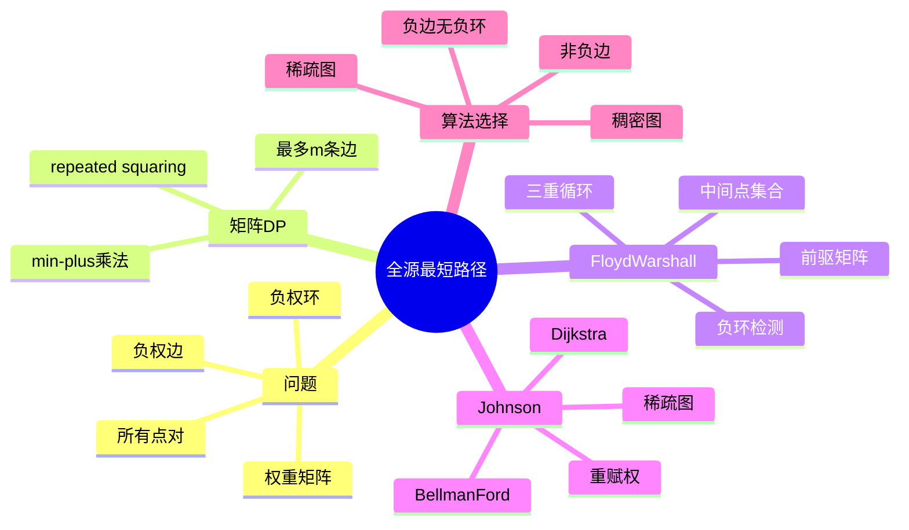

# 第 11 讲 全源最短路径

## 本讲知识图谱



## 11.1 全源最短路径问题

全源最短路径 APSP 要求求出所有有序点对 $(i,j)$ 的最短路径权重：

$$
\delta(i,j)
$$

输入通常给出权重矩阵 $W$：

$$
W_{ij}=
\begin{cases}
0, & i=j \\
w(i,j), & (i,j)\in E \\
\infty, & (i,j)\notin E
\end{cases}
$$

若图中存在负权环，则某些点对最短路径可能无定义。APSP 算法通常假设无负权环，或负责检测。

最直接方法：对每个源点运行一次单源最短路径。

- 若无负边，用 Dijkstra：$V$ 次。
- 若有负边，用 Bellman-Ford：$O(V^2E)$。

本讲重点是矩阵 DP、Floyd-Warshall 和 Johnson。

## 11.2 基于边数的动态规划

定义：

$$
d_{ij}^{(m)}=\text{从 }i\text{ 到 }j\text{ 使用至多 }m\text{ 条边的最短路径权重}
$$

边界：

$$
D^{(0)}=
\begin{cases}
0, & i=j \\
\infty, & i\ne j
\end{cases}
$$

转移：

$$
d_{ij}^{(m)}=\min_k\{d_{ik}^{(m-1)}+w_{kj}\}
$$

这与矩阵乘法形式相似，只是把普通乘法和加法替换为 min-plus 运算：

$$
C_{ij}=\min_k(A_{ik}+B_{kj})
$$

若无负权环，最短路径可取为简单路径，最多 $|V|-1$ 条边。因此计算 $D^{(n-1)}$ 即可。

朴素扩展每次 min-plus 矩阵乘法 $O(n^3)$，做 $n-1$ 次，总 $O(n^4)$。用 repeated squaring 可把乘法次数降到 $O(\log n)$，得到 $O(n^3\log n)$。

## 11.3 Floyd-Warshall

Floyd-Warshall 使用另一种 DP：限制中间顶点集合。

设顶点编号为 $1..n$，定义：

$$
d_{ij}^{(k)}=\text{从 }i\text{ 到 }j\text{，中间顶点只允许来自 }\{1,\ldots,k\}\text{ 的最短路径}
$$

边界：

$$
D^{(0)}=W
$$

考虑是否使用顶点 $k$ 作为中间点：

$$
d_{ij}^{(k)}=\min(d_{ij}^{(k-1)},d_{ik}^{(k-1)}+d_{kj}^{(k-1)})
$$

伪代码：

```text
FLOYD-WARSHALL(W):
    D = W
    for k = 1 to n:
        for i = 1 to n:
            for j = 1 to n:
                D[i][j] = min(D[i][j], D[i][k] + D[k][j])
    return D
```

时间复杂度 $O(n^3)$，空间可原地更新为 $O(n^2)$。

Floyd-Warshall 可处理负权边，但不能有负权环。若算法结束后存在 $D[i][i]<0$，说明存在可达负权环。

## 11.4 路径恢复

只求距离矩阵不够时，可以维护前驱矩阵或 next 矩阵。

一种 next 矩阵写法：

- 若存在边 $i\to j$，令 `next[i][j]=j`。
- 当通过 $k$ 改善 $D[i][j]$ 时，令 `next[i][j]=next[i][k]`。

恢复路径：

```text
RECONSTRUCT-PATH(i, j):
    if next[i][j] == nil:
        return no path
    path = [i]
    while i != j:
        i = next[i][j]
        append i to path
    return path
```

若维护 predecessor，则更新和回溯方向略有不同，但思想相同：记录最优转移来源。

## 11.5 图重赋权

Johnson 算法需要把可能含负边的图转化成非负边权图，同时保持最短路径结构。

给定势函数 $h:V\to \mathbb{R}$，定义新权重：

$$
\hat{w}(u,v)=w(u,v)+h(u)-h(v)
$$

任意路径 $p=v_0\to v_1\to\cdots\to v_k$ 的新权重：

$$
\hat{w}(p)=w(p)+h(v_0)-h(v_k)
$$

对固定起点和终点，$h(v_0)-h(v_k)$ 是常数。因此两条从同一起点到同一终点的路径在重赋权前后的相对大小不变，最短路径集合不变。

关键是选择 $h$ 使所有 $\hat{w}(u,v)\ge 0$。

## 11.6 Johnson 算法

Johnson 算法适合稀疏图上的全源最短路径，并允许负权边但不允许负权环。

步骤：

1. 增加新源点 $s$，向每个顶点 $v$ 加一条权重为 0 的边 $(s,v)$，得到 $G'$。
2. 在 $G'$ 上运行 Bellman-Ford。若检测到负权环，报告失败。
3. 令 $h(v)=\delta(s,v)$。
4. 对所有边重赋权：

$$
\hat{w}(u,v)=w(u,v)+h(u)-h(v)
$$

5. 对每个顶点 $u$，在重赋权图上运行 Dijkstra，得到 $\hat{\delta}(u,v)$。
6. 转回原距离：

$$
\delta(u,v)=\hat{\delta}(u,v)-h(u)+h(v)
$$

为什么新权重非负：Bellman-Ford 后由三角不等式，

$$
h(v)\le h(u)+w(u,v)
$$

整理得：

$$
w(u,v)+h(u)-h(v)\ge 0
$$

复杂度：

- Bellman-Ford 一次：$O(VE)$。
- Dijkstra $V$ 次：若用二叉堆，$O(VE\log V)$。
- 总计常写为 $O(VE\log V)$。

对于稀疏图，Johnson 往往优于 Floyd-Warshall；对于稠密图，Floyd-Warshall 简洁且 $O(V^3)$。

## 11.7 算法选择表

| 场景 | 推荐算法 | 原因 |
|:---:|:---:|:---:|
| 无权图单源 | BFS | $O(V+E)$ |
| DAG 单源 | DAG shortest path | $O(V+E)$，可有负边 |
| 有负边无负环单源 | Bellman-Ford | 可检测负环 |
| 非负边单源 | Dijkstra | 通常最快 |
| 稠密图全源 | Floyd-Warshall | 简洁，$O(V^3)$ |
| 稀疏图全源，允许负边无负环 | Johnson | 重赋权后多次 Dijkstra |
| 所有边非负的全源 | 对每个源跑 Dijkstra | 实现直接 |

## 11.8 与动态规划的联系

APSP 的两个经典算法都体现了 DP：

- 矩阵方法按“路径最多使用多少条边”定义状态。
- Floyd-Warshall 按“允许哪些中间顶点”定义状态。

这两种状态定义都把无限多条路径压缩成有限表格。区别在于 Floyd-Warshall 的状态转移更适合原地三重循环，因此成为最常用的教学和实现版本。

## 作业定位

本讲没有单独截图作业，但它和第 10 讲共同构成最短路径部分。若遇到所有点对最短路：

- 顶点数小或图稠密，优先考虑 Floyd-Warshall。
- 图稀疏且存在负边但无负环，考虑 Johnson。
- 只需一个源点，不要误用全源算法。

## 本讲易错点

- Floyd-Warshall 的循环顺序必须让 $k$ 在最外层，表示逐步放开中间点集合。
- Floyd-Warshall 可以处理负边，但不能处理负权环。
- Johnson 重赋权不会改变同一对端点之间路径的相对优劣。
- Johnson 中 $h(v)$ 来自新增源点的 Bellman-Ford 最短距离。
- 重赋权后的距离不是最终答案，必须转回原权重。
- 对每个源点跑 Bellman-Ford 通常太慢，除非图很小。

## 自测题

1. 定义 $d_{ij}^{(m)}$ 并写出基于边数的 APSP 转移。
2. 推导 Floyd-Warshall 的状态定义和转移。
3. 为什么 Floyd-Warshall 中 $k$ 必须放在最外层？
4. 如何用 Floyd-Warshall 检测负权环？
5. 证明 Johnson 重赋权不改变最短路径。
6. 比较 Floyd-Warshall 和 Johnson 的适用场景。

