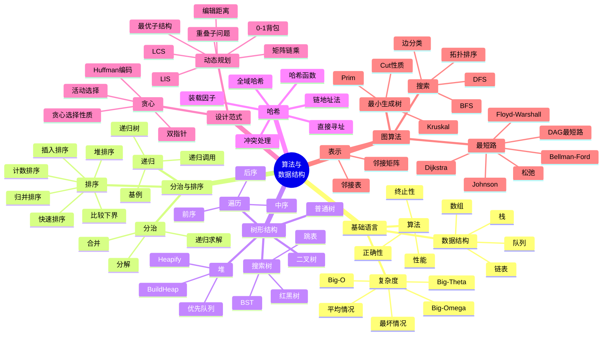

# 算法与数据结构课程学习笔记

这组笔记按 `课件` 的讲次组织，并把 `作业` 中的书面题和 LeetCode 题定位到对应知识点。希望把每讲的定义、算法模板、复杂度、证明思路和易错点整理成可复习、可查表、可串联的知识图谱。

## 文件导航

| 讲次 | 学习笔记 | 对应课件 |
|:---:|:---:|:---:|
| 第 1 讲 | [01-导论基本数据结构与复杂度.md](01-导论基本数据结构与复杂度.md) | `01Introduction.pdf` |
| 第 2 讲 | [02-递归分治树与堆.md](02-递归分治树与堆.md) | `02lecture.pdf` |
| 第 3 讲 | [03-排序算法与比较下界.md](03-排序算法与比较下界.md) | `03lecture.pdf` |
| 第 4 讲 | [04-选择问题搜索树红黑树与跳表.md](04-选择问题搜索树红黑树与跳表.md) | `04lecture.pdf` |
| 第 5 讲 | [05-哈希表.md](05-哈希表.md) | `05 哈希表.pdf` |
| 第 6 讲 | [06-动态规划.md](06-动态规划.md) | `06 动态规划.pdf` |
| 第 7 讲 | [07-贪心算法.md](07-贪心算法.md) | `07 贪心算法.pdf` |
| 第 8 讲 | [08-图基础最小生成树与BFS.md](08-图基础最小生成树与BFS.md) | `08 图算法.pdf` |
| 第 9 讲 | [09-DFS边分类与拓扑排序.md](09-DFS边分类与拓扑排序.md) | `09 DFS.pdf` |
| 第 10 讲 | [10-单源最短路径.md](10-单源最短路径.md) | `10 Shortest Path.pdf` |
| 第 11 讲 | [11-全源最短路径.md](11-全源最短路径.md) | `11 all-pairs Shortest Path.pdf` |

## 全局知识图谱

## 作业定位图

| 作业材料 | 题目 | 主要知识点 | 对应笔记 |
|:---:|:---:|:---:|:---:|
| `作业9.25/20.png` | LeetCode 20 Valid Parentheses | 栈、括号匹配、不变量 | 第 1 讲 |
| `作业9.25/150.png` | LeetCode 150 Evaluate RPN | 后缀表达式、栈求值 | 第 1 讲 |
| `作业9.25/232.png` | LeetCode 232 Implement Queue using Stacks | 栈实现队列、摊还分析 | 第 1 讲 |
| `书面作业1/hw1.py` | 二叉树构造、插入排序、合并有序数组、逆序对 | 树遍历、排序、分治计数 | 第 2/3 讲 |
| `作业10.16/144.png` | LeetCode 144 Binary Tree Preorder Traversal | 树遍历、递归/迭代 | 第 2 讲 |
| `作业10.16/215.png` | LeetCode 215 Kth Largest Element | 堆、快速选择、顺序统计量 | 第 2/4 讲 |
| `作业10.16/493.png` | LeetCode 493 Reverse Pairs | 归并排序、跨区间计数 | 第 3 讲 |
| `书面作业2/assignment2.pdf` Q1 | 最长连续子序列期望线性算法 | 哈希集合 | 第 5 讲 |
| `书面作业2/assignment2.pdf` Q2 | 已排序频率下 $O(n)$ Huffman | 双队列、贪心 | 第 7 讲 |
| `书面作业2/assignment2.pdf` Q3 | 编辑距离 | 动态规划 | 第 6 讲 |
| `书面作业2/assignment2.pdf` Q4 | 用栈消除 DFS 递归 | DFS、显式栈 | 第 9 讲 |
| `书面作业2/assignment2.pdf` Q5 | 最大瓶颈路径 | Dijkstra 变形、松弛 | 第 10 讲 |
| `作业11.27/11.png` | LeetCode 11 Container With Most Water | 双指针、贪心证明 | 第 7 讲 |
| `作业11.27/72.png` | LeetCode 72 Edit Distance | 字符串 DP | 第 6 讲 |
| `作业11.27/279.png` | LeetCode 279 Perfect Squares | 完全背包/BFS | 第 6/8 讲 |
| `作业11.27/最后一题.png` | LeetCode 1584 Min Cost to Connect Points | 完全图 MST、Kruskal/Prim | 第 8 讲 |

## 复习路线

1. 先读第 1 讲，建立课程语言：数据结构、算法、程序、复杂度、栈队列和插入排序。
2. 第 2 讲把递归、分治、递推分析、树、堆串起来，这是后面排序、选择、图搜索的共同基础。
3. 第 3 和第 4 讲集中复习排序、选择和动态集合，重点能写出快排/快速选择/堆操作/BST 操作的伪代码，并能解释复杂度。
4. 第 5 讲解决“期望 $O(1)$ 查询”的核心：哈希函数、冲突、装载因子、全域哈希。
5. 第 6 和第 7 讲对比两类设计范式：动态规划强调“记住子问题”，贪心强调“证明局部选择可被某个最优解接受”。
6. 第 8 和第 9 讲进入图搜索与结构性质：MST、BFS、DFS、边分类、拓扑排序。
7. 第 10 和第 11 讲复习加权图上的最短路：先掌握松弛，再区分 Bellman-Ford、Dijkstra、Floyd-Warshall、Johnson 的适用条件。

## 复杂度速查

| 问题/结构 | 典型算法 | 时间复杂度 | 关键条件 |
|:---:|:---:|:---:|:---:|
| 栈/队列基本操作 | 数组或链表实现 | $O(1)$ | 队列数组实现常用循环队列 |
| 插入排序 | 逐个插入已排序前缀 | 最坏 $O(n^2)$ | 小规模或近乎有序时好用 |
| 归并排序 | 分治合并 | $O(n\log n)$ | 稳定，需额外空间 |
| 堆排序 | BuildHeap + ExtractMax | $O(n\log n)$ | 原地，不稳定 |
| 快速排序 | Partition + 递归 | 期望 $O(n\log n)$ | 随机化避免固定坏例 |
| 计数排序 | 按键值计数 | $O(n+k)$ | 键值范围 $k$ 不大 |
| 快速选择 | 随机 Partition | 期望 $O(n)$ | 最坏 $O(n^2)$ |
| 中位数的中位数 | 分组选择 pivot | 最坏 $O(n)$ | 常数较大，理论重要 |
| BST 操作 | Search/Insert/Delete | $O(h)$ | $h$ 为树高 |
| 红黑树操作 | 旋转 + 着色 | $O(\log n)$ | 保持近似平衡 |
| 哈希表链地址法 | Search/Insert/Delete | 期望 $O(1+\alpha)$ | $\alpha=n/m$ |
| LCS | 二维 DP | $O(mn)$ | 可从表回溯最优解 |
| 0-1 背包 | 二维/一维 DP | $O(nW)$ | 伪多项式，依赖容量 |
| Huffman | 优先队列 | $O(n\log n)$ | 已排序频率可双队列 $O(n)$ |
| Prim | 优先队列 | $O(E\log V)$ | 适合稠密图时也可 $O(V^2)$ |
| Kruskal | 排序 + 并查集 | $O(E\log V)$ | 按边权从小到大选边 |
| BFS/DFS | 邻接表 | $O(V+E)$ | 图搜索线性时间 |
| Bellman-Ford | 多轮松弛 | $O(VE)$ | 可处理负边并检测负环 |
| Dijkstra | 最小优先队列 | $O(E\log V)$ | 边权非负 |
| Floyd-Warshall | 三重循环 DP | $O(V^3)$ | 适合稠密图/全源最短路 |
| Johnson | BF 重赋权 + Dijkstra | $O(VE\log V)$ | 稀疏图全源最短路 |

## 考前检查清单

- 能区分数据结构、算法和程序，并能解释为什么课程关注正确性、终止性和性能。
- 能用循环不变量证明插入排序、归并排序、BFS、Dijkstra 等算法的正确性。
- 能写出 $O$、$\Omega$、$\Theta$ 的形式化含义，并能比较常见增长率。
- 能根据递推式画递归树，并套用主定理。
- 能手写栈、队列、链表、堆、BST 的核心操作。
- 能解释归并排序、堆排序、快速排序的时间复杂度和适用场景。
- 能证明比较排序下界为 $\Omega(n\log n)$。
- 能说明哈希表期望常数时间依赖简单均匀散列或全域哈希假设。
- 能把 DP 题拆成状态、转移、边界、遍历顺序、答案和路径恢复。
- 能为贪心算法写出贪心选择性质和最优子结构证明。
- 能说明 MST 的 cut property，并据此证明 Prim 和 Kruskal。
- 能解释 BFS 的层次性质、DFS 的时间戳和边分类。
- 能根据边权条件选择 Bellman-Ford、Dijkstra、DAG shortest path、Floyd-Warshall 或 Johnson。

