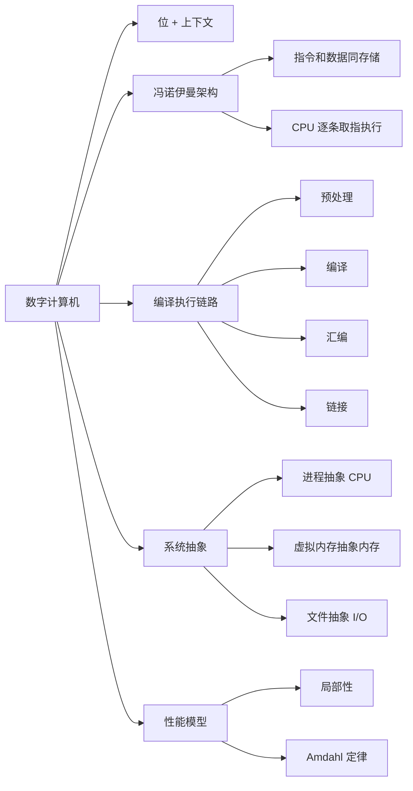

# 01 数字计算机与性能模型

## 本章知识图谱

## 课程主线

这门课的核心观点是：抽象很有用，但不能忘记现实。高级语言、操作系统、虚拟内存、文件、网络都在隐藏底层细节；但当程序溢出、慢、被攻击、链接失败、I/O 阻塞时，必须回到位、指令、内存和系统调用层理解问题。

5 个贯穿课程的现实：

- 整数不是数学整数，浮点数不是真实实数。
- 程序最终以机器指令执行，必须能读汇编。
- 随机访问内存是抽象，实际存储器有层次和局部性。
- 性能不只看渐进复杂度，常数、缓存、I/O 都可能主导。
- 计算机不只是执行程序，还要处理 I/O、网络、进程、异常和安全。

## 数字计算机

数字计算机把信息表示成离散符号，最底层是 0/1 位。位本身没有意义，必须和上下文结合：

- 同一串位可以解释为无符号数、补码整数、浮点数、字符、地址或机器指令。
- 程序和数据都可以存入内存，这就是存储程序思想。
- 指令也是位串，CPU 根据 ISA 解释这些位串。

## 图灵机与冯诺伊曼架构

图灵机是计算模型，说明“可计算”概念；冯诺伊曼架构是实际数字计算机的基本组织方式。

冯诺伊曼架构要点：

- 指令和数据统一存储在主存。
- CPU 从内存取指令，解码，执行，更新 PC。
- 程序可以像数据一样被加载、复制、链接和修改。
- 指令流通常顺序执行，但可以通过分支、调用、返回、异常改变控制流。

常见判断题：

- “指令必须按顺序执行，不能控制转移”是错的。
- 指令和数据在逻辑上统一编码，但 CPU 会按上下文解释。
- 现代机器会用 Cache、流水线、分支预测、虚拟内存等机制减轻架构瓶颈。

## 从源代码到可执行文件

C 程序的典型构建链路：

1. 预处理：处理 `#include`、`#define`、条件编译，生成扩展后的 C 源码。
2. 编译：做语法/类型检查和优化，生成汇编文本。
3. 汇编：把汇编翻译成可重定位目标文件 `.o`。
4. 链接：解析外部符号、重定位地址、合并目标文件和库，生成可执行文件。

考试易错：

- 预处理不负责语法和类型检查。
- 汇编阶段通常不生成完整 ELF 可执行文件，而是目标文件。
- 链接阶段负责外部符号解析和重定位。
- 编译器是否生成相同汇编，取决于 ISA、编译器版本、优化级别、ABI、目标平台。

## 系统硬件组成

典型系统包括 CPU、主存、I/O 设备和总线。

- CPU：执行指令，内部有寄存器、ALU、控制逻辑、Cache 等。
- 主存：存放正在运行的代码和数据。
- I/O 设备：磁盘、网络、键盘、显示器等。
- 总线：在 CPU、内存、I/O 设备之间传输地址、数据和控制信号。

程序 `hello` 的执行过程可以看成跨层协作：

1. Shell 从键盘/终端读入命令。
2. OS 加载可执行文件到虚拟地址空间。
3. CPU 执行 `hello` 的机器指令。
4. 程序通过系统调用把字符串写到标准输出。
5. I/O 设备把结果显示给用户。

## 核心系统抽象

| 抽象 | 让程序看到什么 | 底层现实 |
|:---:|:---:|:---:|
| 进程 | 自己独占 CPU | 多进程分时复用，上下文切换 |
| 虚拟内存 | 自己拥有连续地址空间 | 页表、物理内存、磁盘、权限保护 |
| 文件 | 一切 I/O 都像字节序列 | 设备驱动、磁盘块、网络 socket |
| ISA | 程序员看到稳定指令集 | 微架构可流水线、乱序、缓存、预测 |

抽象题的答题方式：

- 先说明抽象提供的接口。
- 再说明隐藏的底层机制。
- 最后说明抽象失效或泄漏时的现象，例如性能抖动、段错误、溢出、链接错误。

## 性能模型：不要只看算法复杂度

算法复杂度解决的是增长趋势；系统级性能还受常数影响：

- 内存访问模式影响 Cache 命中率。
- 分支预测失败会清空流水线。
- 函数调用、递归、虚函数、解释器都有额外开销。
- I/O 比 CPU 慢很多，系统调用和网络更会主导时间。

## Amdahl 定律

如果系统中比例为 $\alpha$ 的部分被加速 $k$ 倍，总加速比为：

$$
S=\frac{T_{old}}{T_{new}}=\frac{1}{(1-\alpha)+\alpha/k}
$$

极限情况下，即使该部分无限快：

$$
S_{max}=\frac{1}{1-\alpha}
$$

例：程序 90% 时间在矩阵运算中，矩阵运算变慢 40 倍。新的每帧时间是：

$$
T_{new}=0.1T+0.9T \times 40=36.1T
$$

原来 144 FPS，则新 FPS 为：

$$
\frac{144}{36.1}\approx 3.99
$$

答题陷阱：

- 加速或变慢只作用于某个部分，不要把全部程序时间都乘以倍数。
- FPS 和每帧时间互为倒数，帧时间变为 $r$ 倍，FPS 变为原来的 $1/r$。
- 只有瓶颈部分值得优先优化。

## 与后续章节的连接

- 信息表示解释“位 + 上下文”。
- 汇编和链接解释“程序如何成为机器指令”。
- Cache、虚拟内存、I/O 解释“抽象后的真实代价”。
- ECF、信号、网络解释“程序如何响应系统状态变化”。
- Attack Lab 说明“忽略底层现实会带来安全漏洞”。

