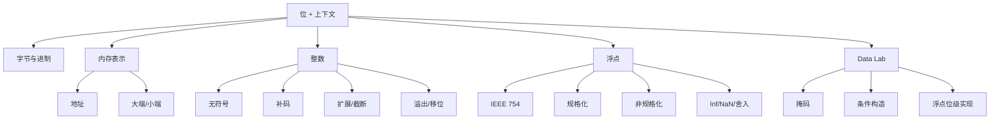

# 02 信息表示：整数、浮点与位运算

## 本章知识图谱



## 字节、十六进制与转换

1 byte = 8 bits。十六进制一位对应二进制四位，所以十六进制是观察机器数据最方便的表示。

| 十六进制 | 二进制 | 十进制 |
|---|---|---|
| `0x0` | `0000` | 0 |
| `0x9` | `1001` | 9 |
| `0xA` | `1010` | 10 |
| `0xF` | `1111` | 15 |

转换方法：

- 二进制转十六进制：从低位起每 4 位分组。
- 十六进制转二进制：每一位展开成 4 位。
- 十六进制加减：按 16 进位，或先转成二进制/十进制辅助。

常见题：

- `0x39A7F8` 转二进制：每位展开。
- 二进制 `1100100101111011` 转十六进制：`1100 1001 0111 1011` = `0xC97B`。

## 内存、指针与端序

内存可视为按字节编址的一维数组。指针保存的是某个对象起始字节的地址，读取多少字节由类型决定。

端序只影响多字节对象内部的字节顺序：

- 大端：最高有效字节放在低地址。
- 小端：最低有效字节放在低地址，x86/x86-64 常用小端。

例：`int x = 0x01234567`，假设 `&x = 0x100`。

| 地址 | 大端 | 小端 |
|---|---|---|
| `0x100` | `01` | `67` |
| `0x101` | `23` | `45` |
| `0x102` | `45` | `23` |
| `0x103` | `67` | `01` |

判断机器端序的方法：

```c
int x = 1;
unsigned char *p = (unsigned char *)&x;
if (p[0] == 1) {
    /* little endian */
} else {
    /* big endian */
}
```

原理：整数 1 的最低有效字节是 `0x01`。若它位于最低地址，就是小端。

字符串的单个字符本身只有 1 字节，因此大端/小端不改变字符串中字节的顺序。

## 布尔运算与位运算

C 中的位运算：

- `&`：按位与，用于取掩码。
- `|`：按位或，用于置位或合并字段。
- `^`：按位异或，用于翻转不同位、构造 XOR。
- `~`：按位取反。
- `<<`：左移，低位补 0。
- `>>`：右移。无符号逻辑右移补 0；有符号通常算术右移补符号位。

注意位运算和逻辑运算不同：

- 位运算作用于每一位。
- `&&`、`||`、`!` 把 0 当 false，非 0 当 true，结果通常是 0 或 1。

集合表示技巧：

- 一个 $w$ 位整数可表示 $\{0,\dots,w-1\}$ 的子集。
- 第 $i$ 位为 1 表示元素 $i$ 在集合中。
- 并集：`a | b`；交集：`a & b`；差集：`a & ~b`。

## 无符号整数

$w$ 位无符号整数的值：

$$
B2U_w(\vec{x})=\sum_{i=0}^{w-1}x_i2^i
$$

范围：

$$
0 \le U \le 2^w-1
$$

无符号加法按模 $2^w$：

$$
UAdd_w(u,v)=(u+v)\bmod 2^w
$$

## 补码整数

$w$ 位补码整数的值：

$$
B2T_w(\vec{x})=-x_{w-1}2^{w-1}+\sum_{i=0}^{w-2}x_i2^i
$$

范围：

$$
TMin_w=-2^{w-1},\quad TMax_w=2^{w-1}-1
$$

典型位模式：

| 值 | 位模式 |
|:---:|:---:|
| 0 | `000...0` |
| -1 | `111...1` |
| $TMin$ | `100...0` |
| $TMax$ | `011...1` |

求相反数：

$$
-x = \sim x + 1
$$

唯一例外是 $TMin$：它的相反数在同样位宽下仍是自己，因为正数范围少一个。

## 有符号与无符号转换

C 中混合 signed/unsigned 时，signed 往往会隐式转换成 unsigned。位模式不变，解释方式改变。

例：32 位下 `-1` 的位模式是 `0xffffffff`，作为 unsigned 是 $2^{32}-1$。

高频陷阱：

- `-1 < 0U` 为 false，因为 `-1` 被转换成很大的 unsigned。
- 比较前先看参与比较的类型。
- 显式转换不会改变位，只改变解释。

## 扩展与截断

无符号扩展：高位补 0。

补码符号扩展：高位补符号位。

截断：保留低 $k$ 位，丢弃高位。无符号意义下等价于模 $2^k$：

$$
x' = x \bmod 2^k
$$

补码截断后再按补码解释，因此可能改变符号。

## 移位与快速乘除

无符号左移：

$$
u << k = u \times 2^k \pmod{2^w}
$$

无符号右移：

$$
u >> k = \lfloor u / 2^k \rfloor
$$

补码算术右移对负数向负无穷方向取整，不等价于 C 语言整数除法的向 0 截断。若要让负数除以 $2^k$ 向 0 舍入，常加 bias：

$$
(x + (1 << k)-1) >> k \quad \text{for } x<0
$$

## IEEE 754 浮点数

浮点数位段：

- sign：符号位 $s$。
- exponent：阶码字段。
- fraction：尾数字段。

单精度：1 位符号，8 位阶码，23 位 fraction，Bias = 127。

双精度：1 位符号，11 位阶码，52 位 fraction，Bias = 1023。

### 规格化数

条件：`exp` 既不全 0，也不全 1。

$$
E=Exp-Bias,\quad M=1.frac_2
$$

$$
V=(-1)^s \times M \times 2^E
$$

### 非规格化数

条件：`exp` 全 0。

$$
E=1-Bias,\quad M=0.frac_2
$$

作用：

- 表示 0 附近更小的数。
- 实现逐步下溢。
- `+0.0` 和 `-0.0` 位模式不同，但数值比较相等。

### 特殊值

条件：`exp` 全 1。

| fraction | 含义 |
|:---:|:---:|
| 全 0 | $+\infty$ 或 $-\infty$ |
| 非 0 | NaN |

## 自定义浮点格式模板

若格式为 1 位符号、$e$ 位阶码、$f$ 位尾数：

$$
Bias=2^{e-1}-1
$$

最大规格化正数：

$$
s=0,\quad Exp=2^e-2,\quad frac=111...1
$$

$$
E=(2^e-2)-Bias,\quad M=2-2^{-f}
$$

$$
V_{max}=(2-2^{-f})2^E
$$

例：8 位浮点，1/4/3，Bias = 7。

$$
E=14-7=7,\quad M=1.111_2=1+\frac12+\frac14+\frac18=1.875
$$

$$
V_{max}=1.875 \times 2^7=240
$$

十进制 `-1.25`：

$$
-1.25=-1.01_2 \times 2^0
$$

符号位 1，阶码 $0+7=7=0111_2$，尾数取 `010`，位模式：

```text
1 0111 010
```

## 浮点运算性质

浮点运算通常是“先精确计算，再舍入”。因此：

- 加法不满足结合律。
- 乘法也可能不满足结合律。
- 很大的数加很小的数，小数可能被舍掉。
- `float` 只有 24 位有效精度，不能精确表示所有 32 位 int。
- `double` 有 53 位有效精度，可以精确表示所有 32 位 int。

## FP16 与 BF16

低精度浮点的核心权衡是指数范围和尾数精度。

| 格式 | sign | exponent | fraction | 特点 |
|:---:|:---:|:---:|:---:|:---:|
| FP32 | 1 | 8 | 23 | 标准单精度，范围和精度都较好 |
| FP16 | 1 | 5 | 10 | 精度相对 BF16 更好，但指数范围小 |
| BF16 | 1 | 8 | 7 | 指数范围接近 FP32，尾数精度较低 |

直觉：

- FP16 更容易上溢/下溢。
- BF16 更适合保留深度学习中的动态范围。
- 二者都比 FP32 更容易产生舍入误差。

常见判断：

```c
int x = some_int_value;
float f = (float)x;
int y = (int)f;
```

不保证所有 `x == y`。若换成 `double`，对 32 位 `int` 通常可以保证，因为 53 位有效精度覆盖 32 位整数。

## Data Lab 解题模式

Data Lab 限制只用少数位运算，所以要把控制流、比较、取反、条件选择都变成位级表达式。

作业中常见函数与对应知识点：

| 函数 | 核心知识点 |
|:---:|:---:|
| `bitXor` | 德摩根律，用 `~` 和 `&` 构造 XOR |
| `tmin` | 最高位为 1 的补码最小值 |
| `isTmax` | $TMax+1=TMin$，排除 `-1` 特例 |
| `allOddBits` | 构造 `0xAAAAAAAA` 掩码 |
| `negate` | `~x + 1` |
| `isAsciiDigit` | 区间判断与补码减法 |
| `conditional` | 用全 0/全 1 mask 模拟三目运算 |
| `isLessOrEqual` | 符号不同防溢出，符号相同看差值 |
| `logicalNeg` | 只有 0 和 `-0` 的符号位都不为 1 |
| `howManyBits` | 规格化符号后找最高有效位 |
| `floatScale2` | 区分 NaN/Inf、denorm、normal |
| `floatFloat2Int` | 指数范围、隐含 1、符号恢复 |
| `floatPower2` | 上溢 Inf、下溢 0、denorm 边界 |

常用构造：

```c
/* -x */
~x + 1

/* x 是否非零，结果 0 或 1 */
!!x

/* 构造全 0 或全 1 mask */
int mask = ~!!x + 1;

/* x ? y : z */
(mask & y) | (~mask & z)
```

判断 2 的幂：

```c
x > 0 && !(x & (x - 1))
```

若不能用 `-`，写成：

```c
x > 0 && !(x & (x + ~0))
```

判断 ASCII digit：

- 下界：`x - 0x30 >= 0`
- 上界：`0x39 - x >= 0`
- 注意用补码减法和符号位判断。

浮点位级题顺序：

1. 拆出 `sign = uf & 0x80000000`。
2. 拆出 `exp = (uf >> 23) & 0xff`。
3. 拆出 `frac = uf & 0x7fffff`。
4. 先处理 `exp == 0xff` 的 NaN/Inf。
5. 再处理 `exp == 0` 的 0/denorm。
6. 最后处理 normalized。

## 本章高频错因

- 把十六进制一位误认为 8 位。
- 忘记小端序写地址时字节反过来。
- `cmp`、`test`、比较条件里混淆 signed 与 unsigned。
- 把补码右移除法当成永远向 0 截断。
- 认为所有浮点数均匀分布。实际上指数越大，间距越大。
- 把非规格化数指数写成 `0 - Bias`；正确是 $1-Bias$。
