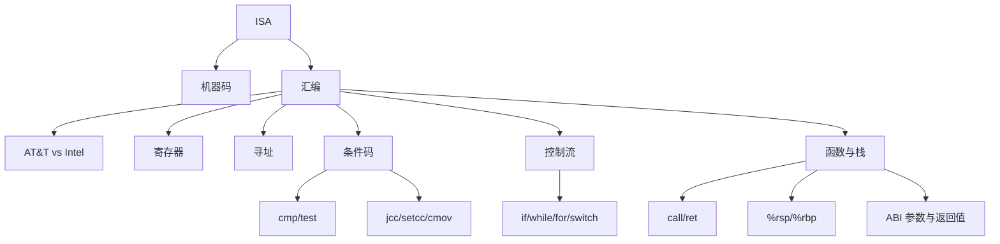

# 03 x86-64 汇编与机器级程序

## 本章知识图谱



## ISA 与机器级代码

ISA 是处理器对程序员可见的抽象：有哪些寄存器、有哪些指令、指令如何编码、条件码如何定义。微架构是 ISA 的具体实现，例如 Cache 大小、流水线深度、频率。

代码形态：

- C 源码：人写的高级语言。
- 汇编：机器指令的文本表示。
- 机器码：CPU 实际执行的字节序列。
- 反汇编：把机器码翻译回汇编文本。

同一段机器码可以显示为 AT&T 或 Intel 语法，底层字节相同。

AT&T 语法特点：

- 源操作数在前，目的操作数在后：`movq Src, Dst`。
- 寄存器带 `%`，立即数带 `$`。
- 指令后缀表示大小：`b/w/l/q` 对应 1/2/4/8 字节。

## 核心寄存器

| 寄存器 | 常见用途 |
|:---:|:---:|
| `%rax` | 返回值，临时值 |
| `%rdi` | 第 1 个整数/指针参数 |
| `%rsi` | 第 2 个整数/指针参数 |
| `%rdx` | 第 3 个整数/指针参数 |
| `%rcx` | 第 4 个整数/指针参数 |
| `%r8` | 第 5 个整数/指针参数 |
| `%r9` | 第 6 个整数/指针参数 |
| `%rsp` | 栈顶指针 |
| `%rbp` | 栈帧基址，可被优化省略 |
| `%rip` | 当前指令指针 |
| `%rbx,%rbp,%r12-%r15` | callee-saved |

System V x86-64 ABI 前 6 个整数/指针参数：

```text
%rdi, %rsi, %rdx, %rcx, %r8, %r9
```

返回值通常在 `%rax`。

`%rbx` 是 callee-saved。若函数要使用它并且还会返回给调用者，就必须保存和恢复，常见模式：

```asm
pushq %rbx
...
popq %rbx
ret
```

## `mov` 与内存寻址

`movq Src, Dst` 类似赋值，但不允许内存到内存直接移动。

若 C 代码是：

```c
*a = *b;
```

汇编通常需要先读到寄存器，再写到内存：

```asm
movq (%rsi), %rax
movq %rax, (%rdi)
```

通用寻址形式：

```text
d(r1, r2, s) = Mem[Reg[r1] + s * Reg[r2] + d]
```

其中 `s` 通常为 1、2、4、8，方便数组元素寻址。

例：

```asm
movq 8(%rbp), %rdx       # rdx = *(rbp + 8)
movq (%rcx), %rax        # rax = *rcx
movq 16(%rax,%rbx,4),%rcx
```

最后一条访问地址：

$$
\text{addr} = \%rax + 4 \times \%rbx + 16
$$

## `lea`：取地址，也做整数计算

`leaq Src, Dst` 计算地址表达式本身，不访问内存。

例：

```asm
leaq (%rdi,%rdi,2), %rax  # rax = x + 2x = 3x
salq $2, %rax             # rax = 12x
```

对应：

```c
return x * 12;
```

考试常见陷阱：

- `leaq` 不读内存。
- `leaq` 不修改条件码。
- 编译器常用 `lea` 做加法、乘小常数、地址计算。

## 算术与逻辑指令

| 指令 | 含义 |
|:---:|:---:|
| `addq Src, Dst` | `Dst = Dst + Src` |
| `subq Src, Dst` | `Dst = Dst - Src` |
| `imulq Src, Dst` | `Dst = Dst * Src` |
| `salq/shlq Src, Dst` | 左移 |
| `sarq Src, Dst` | 算术右移 |
| `shrq Src, Dst` | 逻辑右移 |
| `xorq Src, Dst` | 按位异或 |
| `andq Src, Dst` | 按位与 |
| `orq Src, Dst` | 按位或 |
| `negq Dst` | 取负 |
| `notq Dst` | 按位取反 |

## 条件码

主要条件码：

| 标志 | 含义 |
|:---:|:---:|
| CF | Carry Flag，无符号进位/借位 |
| ZF | Zero Flag，结果为 0 |
| SF | Sign Flag，结果符号 |
| OF | Overflow Flag，有符号溢出 |

`cmpq b, a` 计算 `a-b` 但不保存结果，只设置条件码。

`testq b, a` 计算 `a&b` 但不保存结果，只设置条件码。

易错：AT&T 中 `cmpq %rsi, %rdi` 是比较 `x:y` 时计算 `%rdi - %rsi`。

## 条件跳转与条件设置

常见跳转：

| 指令 | 条件 | 含义 |
|:---:|:---:|:---:|
| `jmp` | true | 无条件跳转 |
| `je/jz` | ZF | 相等/为 0 |
| `jne/jnz` | !ZF | 不等/非 0 |
| `jg` | signed `>` | 有符号大于 |
| `jge` | signed `>=` | 有符号大于等于 |
| `jl` | signed `<` | 有符号小于 |
| `jle` | signed `<=` | 有符号小于等于 |
| `ja` | unsigned `>` | 无符号大于 |
| `jb` | unsigned `<` | 无符号小于 |

`setcc` 把条件结果写入 1 字节寄存器，常配合 `movzbl` 清高位：

```asm
cmpq %rsi, %rdi
setg %al
movzbl %al, %eax
ret
```

对应：

```c
return x > y;
```

## 分支与条件移动

C 中：

```c
return x > y ? x - y : y - x;
```

可能被编译为条件跳转：

```asm
cmpq %rsi, %rdi
jle .L4
movq %rdi, %rax
subq %rsi, %rax
ret
.L4:
movq %rsi, %rax
subq %rdi, %rax
ret
```

也可能被编译为条件移动：

```asm
movq %rdi, %rax
subq %rsi, %rax
movq %rsi, %rdx
subq %rdi, %rdx
cmpq %rsi, %rdi
cmovle %rdx, %rax
ret
```

条件移动减少分支预测失败，但会计算两边表达式，因此不适合有副作用或代价很高的分支。

## 循环翻译

`while` 通常可以转成 goto 形式：

```c
while (test) {
    body;
}
```

等价：

```c
goto test;
loop:
    body;
test:
    if (test) goto loop;
```

`for` 本质也可转成 `while`：

```c
for (init; test; update) {
    body;
}
```

等价：

```c
init;
while (test) {
    body;
    update;
}
```

## 函数、栈与调用

x86-64 栈向低地址增长。`%rsp` 指向栈顶。

`pushq x` 近似：

```asm
subq $8, %rsp
movq x, (%rsp)
```

`popq x` 近似：

```asm
movq (%rsp), x
addq $8, %rsp
```

`call target`：

1. 把返回地址压栈。
2. 跳转到 `target`。

`ret`：

1. 从栈顶弹出 8 字节。
2. 写入 `%rip`，跳转到该地址。

这也是缓冲区溢出能够劫持控制流的根源。

## 栈帧与递归反推

递归阶乘汇编常见形式：

```asm
func:
    cmpq $1, %rdi
    jg .L2
    movl $1, %eax
    ret
.L2:
    pushq %rbx
    movq %rdi, %rbx
    leaq -1(%rdi), %rdi
    call func
    imulq %rbx, %rax
    popq %rbx
    ret
```

反推步骤：

1. 看 base case：`n <= 1` 返回 1。
2. 看 recursive call 前参数如何变化：`n-1`。
3. 看 call 后如何组合：`rax *= old n`。
4. 得到 C：

```c
long func(long n) {
    if (n <= 1) {
        return 1;
    }
    return n * func(n - 1);
}
```

`%rbx` 用于保存原始 `n`，因为递归调用会改 `%rdi`、`%rax` 等寄存器。由于 `%rbx` 是 callee-saved，所以函数入口保存、返回前恢复。

栈溢出风险：

- 递归深度过大，每次调用都消耗栈空间。
- 没有有效终止条件或输入很大时可能 stack overflow。

## switch 与跳转表

当 case 值密集时，编译器可能生成 jump table：

- 先检查索引范围。
- 用 case 值计算跳转表下标。
- 从表中取目标地址并间接跳转。

高频判断：

- 编译器不总是把 `switch` 翻译成 if-else。
- 密集 case 可做到接近 $O(1)$ 分发。
- 跳转表通常在只读数据区或代码相关段，不在栈上。

## 本章高频错因

- 混淆 AT&T 和 Intel 操作数顺序。
- 认为 `leaq` 会访存。
- 忘记 `mov` 不支持内存到内存。
- 把 `cmpq a,b` 读成 `a-b`，实际是 `b-a`。
- 不区分有符号跳转 `jg/jl` 和无符号跳转 `ja/jb`。
- 忘记 `%rbx` 是 callee-saved。
- 忘记 `ret` 的跳转地址来自栈顶。

