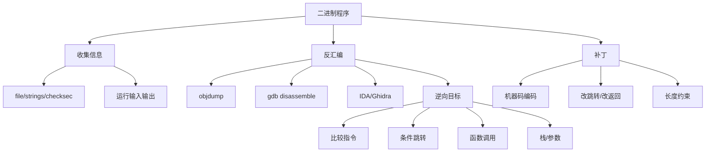

# 04 反汇编、Bomb Lab 与程序补丁

## 本章知识图谱



## 反汇编的基本目标

反汇编不是逐行翻译，而是回答三个问题：

1. 程序希望什么输入或状态？
2. 哪些指令决定成功/失败？
3. 可控输入如何影响这些指令？

常见流程：

1. 收集信息：程序架构、保护、字符串、入口、函数列表。
2. 运行程序：记录输入输出、错误提示、退出路径。
3. 找目标：成功函数、失败函数、关键字符串、比较跳转。
4. 从目标倒推：追踪参数来源、寄存器来源、栈变量来源。
5. 构造输入或补丁：让关键条件成立，或绕过失败路径。

## 常用工具

`objdump`：

```bash
objdump -d bomb > bomb.s
objdump -t bomb
```

GDB：

```gdb
disassemble phase_1
b *0x401000
run
x/16gx $rsp
x/s 0x402400
info registers
si
ni
```

IDA/Ghidra：

- 图形化控制流。
- 交叉引用字符串和函数。
- 反编译辅助理解，但最终以汇编和运行验证为准。

Python/pwntools 可辅助汇编和机器码转换：

```python
from pwn import *
context.arch = "amd64"
asm("ret")
disasm(b"\xc3")
```

## Bomb Lab 逆向方法

Bomb Lab 的本质是输入验证题。每个 phase 都有：

- 输入解析。
- 约束检查。
- 错误则调用 `explode_bomb`。
- 正确则返回进入下一关。

通用策略：

1. 找到 `phase_n`。
2. 找 `strings_not_equal`、`sscanf`、`strcmp`、`explode_bomb`。
3. 看 `cmp/test` 和后继 `jcc`。
4. 对跳转条件做反向推导。
5. 对递归/循环写出等价 C。
6. 用 GDB 单步验证。

## 常见 phase 模式

字符串比较：

```asm
call strings_not_equal
test %eax, %eax
je success
call explode_bomb
```

解法：找到被比较的目标字符串。

整数序列：

- `sscanf` 读多个数字。
- 循环检查递推关系，例如等差、倍增、斐波那契。

switch/jump table：

- 一个输入作为 index。
- 范围检查后跳转表分发。
- 每个 case 设置不同结果再比较另一个输入。

递归：

- 反推 base case。
- 反推参数如何变化。
- 反推返回值如何组合。

链表/树：

- 输入可能决定节点顺序。
- 检查排序、路径编码或结构关系。

## 机器码与程序补丁

机器码示例：

| 汇编 | 常见机器码 |
|:---:|:---:|
| `ret` | `c3` |
| `nop` | `90` |
| `sub rsp, 8` | `48 83 ec 08` |

`call` 和 `jmp` 常使用相对位移，而不是绝对地址。因此手工补丁时：

- 替换成同长度指令最稳。
- 可用 `nop` 填充剩余字节。
- 直接扩大/缩短代码很难，因为会影响后续地址。
- 补丁保存后要重新运行验证。

## 补丁思路

常见补丁目标：

- 把条件跳转反转或取消。
- 把 `call explode_bomb` 改成 `nop` 或跳过。
- 把函数开头改成 `ret`，直接返回。
- 修改立即数或比较值。

注意：

- 补丁是理解机器码的训练，不是正常软件工程手段。
- 可执行程序通常只能就地修改字节，不方便增减长度。
- 真实系统还有签名、完整性检查、ASLR、RELRO、W^X 等保护。

## 反汇编读题模板

看到：

```asm
cmpq $1, %rdi
jg .L2
movl $1, %eax
ret
```

写：

- 比较 `n` 和 1。
- 若 `n > 1` 跳到递归/复杂逻辑。
- 否则返回 1。

看到：

```asm
leaq -1(%rdi), %rdi
call func
imulq %rbx, %rax
```

写：

- 调用 `func(n-1)`。
- 返回值乘原来的 `n`。
- 可能是阶乘。

看到：

```asm
callq strings_not_equal
testl %eax, %eax
jne explode
```

写：

- `strings_not_equal` 返回 0 表示相等。
- `jne` 在不等时爆炸。
- 需要输入等于目标字符串。

## 与 Attack Lab 的连接

反汇编里 `call`/`ret` 的机制会直接用于 Attack Lab：

- `call` 把返回地址压栈。
- 局部数组通常位于返回地址下方。
- 溢出数组可覆盖保存的返回地址。
- `ret` 会跳到被覆盖的新地址。

因此 Bomb Lab 训练“读控制流”，Attack Lab 训练“改控制流”。

## 本章高频错因

- 只看反编译伪代码，不验证汇编。
- 忘记小端序，地址字节写反。
- 把相对跳转当绝对地址。
- 修改指令长度导致后续代码错位。
- 看到 `test %eax,%eax` 不知道是在检查返回值是否为 0。
- 不理解 `call` 自动压入返回地址，导致栈分析错误。

