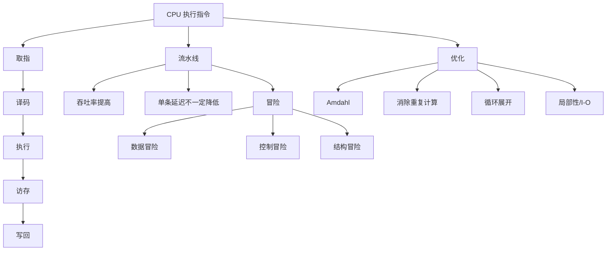

# 05 CPU、流水线与程序优化

## 本章知识图谱



## CPU 如何执行汇编

最简模型：

1. 根据 `%rip` 从内存取出指令字节。
2. 解码指令类型和操作数。
3. 从寄存器或内存读取输入。
4. ALU/控制逻辑执行运算。
5. 写回寄存器或内存。
6. 更新 `%rip`。

真实 CPU 会复杂得多：流水线、乱序执行、分支预测、缓存、寄存器重命名等。但考试通常关注经典五级流水线。

## 五级流水线

经典阶段：

| 阶段 | 英文 | 功能 |
|:---:|:---:|:---:|
| IF | Instruction Fetch | 取指 |
| ID | Instruction Decode | 译码、读寄存器 |
| EX | Execute | ALU 运算、地址计算 |
| MEM | Memory | 访存 |
| WB | Write Back | 写回寄存器 |

理想情况下，流水线填满后每个周期完成一条指令，提高吞吐率。但单条指令的延迟并不会因为流水线而减少。

## 数据冒险

数据冒险是后一条指令需要前一条指令还没写回的结果。

常见 RAW：

```asm
addq %rsi, %rdi
movq (%rdi), %rax
```

第二条需要第一条的新 `%rdi`。

解决方式：

- Stall：停顿等待结果写回。
- Forwarding/Bypassing：把 EX/MEM/WB 阶段产生的结果直接转发给后续阶段。
- 编译器指令调度：插入无关指令填空。

加载-使用冒险：

```asm
movq (%rdi), %rax
addq %rax, %rbx
```

load 的数据通常到 MEM 末尾才可用，紧邻使用时即使有转发也可能需要 stall。

镜像卷子常见问法：

- 分支预测不能消除数据冒险停顿，它处理的是控制冒险。
- 硬件阻塞可以保证正确性，但不是“消除停顿”。

## 控制冒险

分支指令在确定跳转方向前，后续取到的指令可能是错的。

解决方式：

- Stall：等分支结果出来再取。
- Branch Prediction：预测方向和目标，预测错则冲刷流水线。
- 延迟槽或编译器调度：部分架构使用。

判断：

- 分支预测处理控制冒险，不处理 RAW 数据冒险。
- 流水线越深，预测失败代价通常越高。

## 程序优化原则

优化不等于换算法。课程中的常数优化关注：

- 消除循环内重复计算。
- 用更便宜的指令替代昂贵指令。
- 减少函数调用、分支、内存访问。
- 利用流水线和指令级并行。
- 改善 Cache 和 I/O 局部性。

先找瓶颈，再优化。没有测量的优化通常不可靠。

## 计时与性能指标

常用方式：

- Linux `time`：看整程序运行时间。
- 程序内计时：注意重复运行和预热。
- 性能计数器：cache miss、branch miss、cycles 等。

CPE：Cycles Per Element，衡量每个元素平均消耗周期。适合比较循环优化。

## 消除重复计算

循环不变量外提：

```c
for (int i = 0; i < n; i++) {
    a[i] = b[i] * (x * y);
}
```

改为：

```c
int k = x * y;
for (int i = 0; i < n; i++) {
    a[i] = b[i] * k;
}
```

编译器不一定能做，因为它必须保证语义完全等价，尤其涉及指针别名、函数调用、副作用时。

## 强度削减

用便宜操作替代贵操作：

- `x % 2` 可在某些非负场景下用 `x & 1`。
- `x * 24` 可转成 `(x << 5) - (x << 3)`。
- 数组下标递推可减少乘法。

注意：

- 对负数，`%` 和位运算不一定完全等价。
- 现代编译器可能已经做了强度削减。

## 循环展开与并行

循环展开减少循环控制开销，并暴露更多独立操作给 CPU。

原始：

```c
for (int i = 0; i < n; i++) {
    sum += a[i];
}
```

展开：

```c
for (int i = 0; i < n; i += 4) {
    sum0 += a[i];
    sum1 += a[i+1];
    sum2 += a[i+2];
    sum3 += a[i+3];
}
sum = sum0 + sum1 + sum2 + sum3;
```

多个累加器能打破串行依赖链，提高指令级并行。

## 霍纳法则

多项式：

$$
a_0 + a_1x + a_2x^2 + \dots + a_nx^n
$$

霍纳形式：

$$
a_0 + x(a_1 + x(a_2 + \dots + xa_n))
$$

优点：减少乘法次数。

缺点：形成强依赖链，可能限制流水线并行。实际性能要结合 CPU 和编译器评估。

## I/O 优化

I/O 远慢于 CPU，优化重点：

- 批量读写，减少系统调用次数。
- 使用缓冲，避免逐字符系统调用。
- 选择合适的 I/O 抽象：标准 I/O、Unix I/O、RIO。
- 网络程序要处理 short count，不假设一次读写完成全部数据。

## 本章高频错因

- 认为流水线让单条指令更快。它主要提高吞吐率。
- 认为加深流水线可消除数据冒险。通常只会增加冒险处理复杂度。
- 把分支预测用于数据冒险。
- 忽略 load-use 冒险。
- 过早优化，没有根据 Amdahl 定律找瓶颈。
- 位运算优化没有检查 signed/unsigned 和负数语义。

