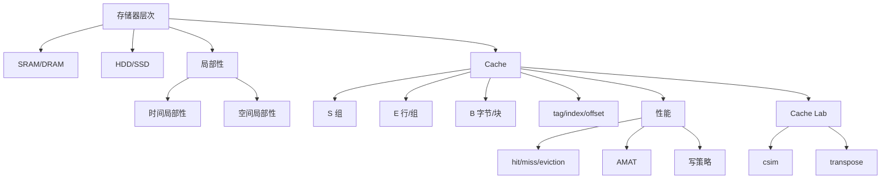

# 06 存储器层次、Cache 与 Cache Lab

## 本章知识图谱



## 存储技术

| 技术 | 特点 | 常见用途 |
|:---:|:---:|:---:|
| SRAM | 快、贵、每 bit 需要更多晶体管、不需刷新 | CPU Cache |
| DRAM | 慢于 SRAM、便宜、需要刷新 | 主存 |
| SSD | 基于闪存、随机访问好于 HDD、有擦写寿命和 FTL | 固态硬盘 |
| HDD | 机械寻道和旋转延迟明显、顺序吞吐可用 | 大容量存储 |

HDD 访问时间通常包括：

- 寻道时间。
- 旋转延迟。
- 传输时间。

旋转延迟估算：

$$
T_{max\ rotation}=\frac{60s}{RPM}
$$

平均旋转延迟约为最大旋转延迟的一半：

$$
T_{avg\ rotation}=\frac{1}{2}\times\frac{60s}{RPM}
$$

## 局部性

时间局部性：最近访问过的数据/指令，未来可能再次访问。

空间局部性：访问某地址后，附近地址未来可能被访问。

好模式：

```c
for (int i = 0; i < rows; i++) {
    for (int j = 0; j < cols; j++) {
        sum += a[i][j];   /* C 数组行优先，步长 1 */
    }
}
```

坏模式：

```c
for (int j = 0; j < cols; j++) {
    for (int i = 0; i < rows; i++) {
        sum += a[i][j];   /* 按列扫，步长 cols */
    }
}
```

在 C 中二维数组按行连续存储，因此按行访问空间局部性好。

## Cache 基本组织

用 `Cache(S,E,B,m)` 表示：

- $m$：地址位数。
- $S=2^s$：组数。
- $E$：每组行数，相联度。
- $B=2^b$：每块字节数。
- $C=S \times E \times B$：数据容量，不含 tag/valid/dirty 等元数据。

地址拆分：

```text
| tag t bits | set index s bits | block offset b bits |
```

$$
t=m-s-b
$$

计算模板：

1. $B$ 字节块，所以 $b=\log_2 B$。
2. $S=C/(E \times B)$。
3. $s=\log_2 S$。
4. $t=m-s-b$。
5. index = `(addr >> b) & ((1 << s) - 1)`。
6. tag = `addr >> (s + b)`。

例：32KB L1 D-Cache，8 路组相联，块 64B。

$$
C=32KB=32768,\quad E=8,\quad B=64
$$

$$
S=\frac{32768}{8\times64}=64
$$

所以组数 64，索引位 $s=6$，块偏移 $b=6$。

## 映射方式

| 映射 | $E$ | 优点 | 缺点 |
|:---:|:---:|:---:|:---:|
| 直接映射 | 1 | 硬件简单、命中快 | 冲突不命中严重 |
| 组相联 | 中间值 | 减少冲突，成本可控 | 需要组内并行比较 tag |
| 全相联 | 所有行同一组 | 冲突最少 | 硬件复杂，不适合大 Cache |

组索引使用中间位，是为了让连续地址在同一块内用 offset，跨块后自然落到相邻组，降低连续访问冲突。

## 命中、缺失与替换

一次访问流程：

1. 取地址中的 index，找到组。
2. 在组内所有有效行比较 tag。
3. 若 tag 匹配且 valid = 1，hit。
4. 否则 miss。
5. 若组内有空行，填入。
6. 若组满，按替换策略 eviction。

三类 miss：

- 冷不命中：第一次访问某块。
- 冲突不命中：缓存总容量够，但映射到同一组互相挤掉。
- 容量不命中：工作集超过缓存容量。

LRU：替换最近最久未使用的行。模拟时可用时间戳或计数器记录最近访问时间。

## 写策略

| 策略 | 行为 | 常见搭配 |
|:---:|:---:|:---:|
| Write-through | 写 Cache 同时写主存 | no-write-allocate |
| Write-back | 只写 Cache，脏块替换时写回主存 | write-allocate |
| Write-allocate | 写 miss 时先把块加载进 Cache 再写 | write-back |
| No-write-allocate | 写 miss 时直接写主存，不加载进 Cache | write-through |

高频判断：

- 写回策略下，主存数据不一定总是最新。
- 脏块被替换时才写回主存。
- 写分配能利用后续对同一块的空间/时间局部性。

## AMAT

平均访问时间：

$$
\text{AMAT}=T_{hit}+r_{miss}\times T_{miss\ penalty}
$$

例：命中率 99%，命中时间 1ns，缺失惩罚 100ns：

$$
\text{AMAT}=1+0.01\times100=2ns
$$

多级 Cache 可递归：

$$
\text{AMAT}=T_{L1}+r_{L1}\times(T_{L2}+r_{L2}\times T_{mem})
$$

## Cache 访问模拟例题

题：2 路组相联，总容量 128B，块 16B，LRU，地址 8 位。访问 `0x10, 0x14, 0x50, 0x18`。

参数：

$$
C=128,\quad E=2,\quad B=16
$$

$$
S=\frac{128}{2\times16}=4,\quad s=2,\quad b=4,\quad t=8-2-4=2
$$

地址拆分：

| 地址 | tag | index | offset |
|:---:|:---:|:---:|:---:|
| `0x10` = `0001 0000` | `00` | `01` | `0000` |
| `0x14` = `0001 0100` | `00` | `01` | `0100` |
| `0x50` = `0101 0000` | `01` | `01` | `0000` |
| `0x18` = `0001 1000` | `00` | `01` | `1000` |

过程：

- `0x10`：组 1 无 tag 00，miss，装入 tag 00。
- `0x14`：同块 tag 00/index 01，hit。
- `0x50`：组 1 tag 01，不同块，miss，2 路还有空行，装入 tag 01。
- `0x18`：tag 00/index 01，hit。

结果：miss, hit, miss, hit。

## Cache Lab Part A：`csim`

目标：读 Valgrind trace，模拟 Cache 的 hit/miss/eviction。

trace 格式：

```text
I 0400d7d4,8
 M 0421c7f0,4
 L 04f6b868,8
 S 7ff0005c8,8
```

操作含义：

- `I`：指令访问，忽略。
- `L`：数据加载，一次访问。
- `S`：数据存储，一次访问。
- `M`：modify，等价于 load + store，同一地址两次访问。第二次必 hit。

命令行参数：

```text
./csim [-hv] -s <s> -E <E> -b <b> -t <tracefile>
```

实现结构：

```c
typedef struct {
    int valid;
    unsigned long long tag;
    unsigned int lru;
} line_t;
```

访问逻辑：

1. 计算 set index 和 tag。
2. 扫描该组找 hit。
3. 同时记录空行和 LRU 行。
4. hit：`hit++`，更新时间戳。
5. miss 且有空行：`miss++`，填空行。
6. miss 且无空行：`miss++`，`eviction++`，替换 LRU。

## Cache Lab Part B：矩阵转置

评测 Cache：$s=5,E=1,b=5$。

因此：

$$
S=32,\quad B=32B
$$

`int` 4B，每块可容纳 8 个 `int`。

### 32 x 32

适合 8x8 分块：

- A 的一行 8 个 int 正好一个块。
- 读 A 有良好空间局部性。
- 写 B 时要注意对角线块冲突。

常见策略：

- 对角线元素先暂存，最后写回，减少 A/B 同组冲突。
- 非对角块直接转置。

### 64 x 64

仍用 8x8 但直接处理冲突严重，因为 64 行跨度更容易映射到同一组。

常见策略：

- 把 8x8 拆成四个 4x4。
- 先读 A 上半 4 行，把右上暂存在 B 的临时位置。
- 再交换位置，处理下半部分。

### 61 x 67

非规则尺寸，边界不整齐。通常用 16x16 或类似块大小：

- 块内按行读 A。
- 写 B。
- 循环条件加 `i < N`、`j < M` 防越界。

## 本章高频错因

- 容量 $C$ 不含 tag、valid、dirty 位。
- index 位数来自组数，不是行数。
- 块偏移位数来自块大小字节数，不是元素个数。
- 直接映射是 $E=1$，不是 $S=1$。
- `M` 操作忘记算两次访问。
- LRU 只在同一组内比较。
- 写回策略下忘记 dirty bit 的意义。
- C 二维数组行优先，按列访问空间局部性差。

