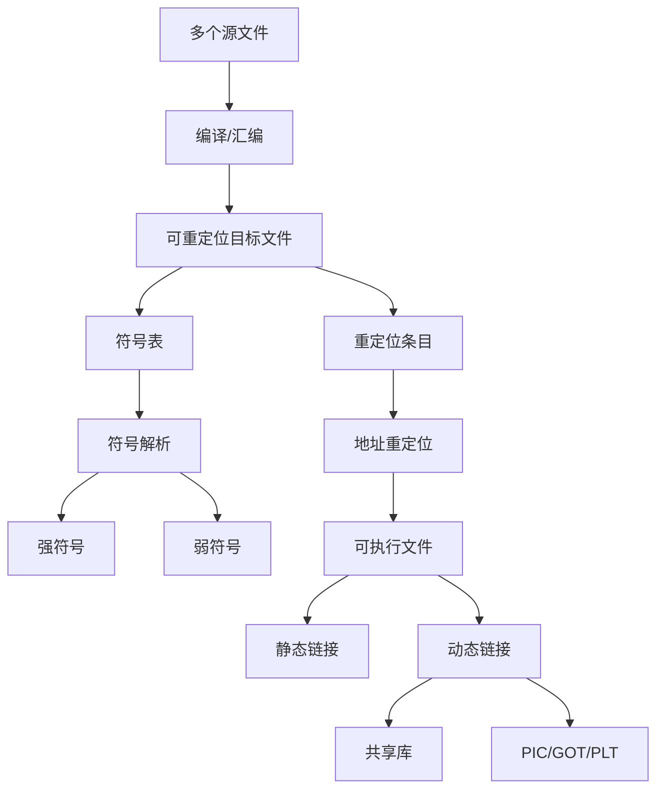

# 07 链接：目标文件、符号与库

## 本章知识图谱



## 为什么需要链接

大型程序通常被拆成多个文件和库：

- 不同小组编写不同模块。
- 调用系统库和第三方库。
- 发布库时不必公开源码。
- 编译可以增量完成，只重新编译改动文件。

编译后的目标文件包含机器码片段，但很多地址还未知：

- 外部函数在哪里？
- 全局变量在哪里？
- 多个目标文件的代码段如何排布？
- 库函数是否需要复制进可执行文件？

链接器负责回答这些问题。

## 构建链路回顾

```text
main.c -> main.i -> main.s -> main.o
add.c  -> add.i  -> add.s  -> add.o

main.o + add.o + libraries -> executable
```

链接阶段主要任务：

1. 符号解析：把每个符号引用绑定到唯一定义。
2. 重定位：确定每段代码/数据的最终地址，并修正引用位置。

## 目标文件中的符号

常见符号：

- 全局函数。
- 全局变量。
- 静态函数/静态变量。
- 外部引用。

局部自动变量通常在栈上，不作为链接器符号处理。

## 强符号与弱符号

规则：

- 函数和已初始化全局变量通常是强符号。
- 未初始化全局变量通常是弱符号。
- 不允许多个同名强符号。
- 一个强符号和多个弱符号同名，选择强符号。
- 多个弱符号同名，链接器通常选择其中一个，不一定报错。

例：

```c
/* a.c */
int x = 1;        /* strong */

/* b.c */
int x;            /* weak */
```

链接时选择 `a.c` 的 `x`。

高频选择题：

- “允许多个同名强符号”是错的。
- “多个弱符号一定报错”通常是错的。
- “函数名通常是弱符号”是错的，函数通常是强符号。

## 静态链接

静态库常见形式：

- Linux：`.a`
- Windows：`.lib`

静态链接时，链接器从库中抽取需要的目标模块，把代码复制进最终可执行文件。

优点：

- 运行时不依赖对应动态库。
- 部署简单。

缺点：

- 可执行文件变大。
- 多个进程无法共享同一份库代码。
- 库更新后需要重新链接程序。

## 动态链接

动态库常见形式：

- Linux：`.so`
- Windows：`.dll`

动态链接方式：

- 加载时链接：程序启动时由动态链接器加载共享库并解析符号。
- 运行时加载：程序调用 `dlopen`/`dlsym` 或 Windows `LoadLibrary`/`GetProcAddress`。

优点：

- 多个进程共享库代码页。
- 可执行文件较小。
- 更新库不一定需要重编译程序。

缺点：

- 运行时依赖库文件存在且版本兼容。
- 符号解析和间接跳转有额外开销。
- 可能出现 DLL hell 或 ABI 不兼容问题。

## PIC 与共享库

PIC：Position Independent Code，位置无关代码。

共享库需要 PIC 的原因：

- 同一个 `.so` 可能被映射到不同进程的不同虚拟地址。
- 如果代码中写死绝对地址，每个进程都要修改代码页，无法共享。
- PIC 通过相对寻址、GOT/PLT 等机制，让代码段尽量保持只读和可共享。

GOT/PLT：

- GOT 保存全局变量和外部函数的运行时地址。
- PLT 是调用外部函数的跳板。
- 延迟绑定时，第一次调用解析地址，后续调用直接跳转。

Windows 中 IAT 与 Linux GOT 有相似角色：保存导入函数地址。

## 重定位

目标文件中某些位置需要在链接时修正，例如：

```asm
call add
mov global(%rip), %rax
```

链接器确定 `add` 和 `global` 的最终地址后，把对应机器码字段填好。

重定位包括：

- 代码中对函数的引用。
- 数据中对全局变量的引用。
- 跳转表和指针常量。

## 链接顺序

静态库链接常见问题：

```bash
gcc main.o libx.a
```

链接器通常从左到右扫描，库只为之前未解析的符号提供定义。因此库顺序可能影响结果。若 `liba.a` 依赖 `libb.a`，通常 `liba.a` 要放在 `libb.a` 前。

## DLL 注入与 Hook 的课程定位

课件中提到 DLL 注入、IAT/GOT Hook、消息钩子，是为了说明动态链接和地址表可以在运行时改变程序行为。

核心概念：

- 进程地址空间可以加载额外动态库。
- 导入地址表保存外部函数地址。
- 修改表项可让原程序调用替换函数。
- 这属于系统级机制，也可用于调试、插件、监控或攻击。

复习时掌握原理即可，不需要背具体 Windows API 代码。

## 本章高频错因

- 把编译和链接混为一谈。
- 不知道链接器负责符号解析和重定位。
- 认为静态库在运行时才加载。
- 认为动态库代码会复制进每个可执行文件。
- 强弱符号规则记反。
- 认为共享库不需要 PIC。
- 忘记动态库丢失会导致可执行文件无法正常启动或调用失败。

