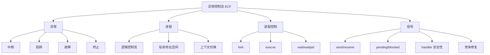

# 08 异常控制流、进程与信号

## 本章知识图谱



## 什么是 ECF

普通控制流由分支、跳转、调用、返回改变，通常只依赖程序内部状态。

异常控制流 ECF 响应系统状态变化：

- 磁盘或网络数据到达。
- 除零或非法内存访问。
- 用户按下 Ctrl-C。
- 定时器中断。
- 子进程终止。

ECF 存在于多个层次：

- 硬件/OS：异常。
- OS：进程上下文切换。
- OS：信号。
- C 运行时：`setjmp`/`longjmp`。

## 四类异常

| 类型 | 原因 | 同步/异步 | 返回行为 | 例子 |
|:---:|:---:|:---:|:---:|:---:|
| interrupt | I/O 设备信号 | 异步 | 返回下一条指令 | 键盘、磁盘完成 |
| trap | 故意触发 | 同步 | 返回下一条指令 | 系统调用 |
| fault | 可能可恢复错误 | 同步 | 可能返回当前指令 | page fault |
| abort | 不可恢复错误 | 同步 | 不返回 | 硬件致命错误 |

系统调用是 trap。用户程序主动进入内核，请求内核服务。

## 进程抽象

进程是运行中程序的实例。它提供两个关键抽象：

- 独立逻辑控制流：每个程序好像独占 CPU。
- 私有地址空间：每个程序好像独占内存。

实际机制：

- CPU 在多个进程间切换。
- 内核保存当前寄存器上下文。
- 调度另一个进程。
- 恢复另一个进程寄存器和地址空间。

并发与并行：

- 并发：两个控制流时间区间重叠。
- 并行：两个控制流真的同时在不同 CPU/core 上运行。

## 用户模式与内核模式

用户程序不能直接执行特权操作，例如直接访问设备、修改页表。需要通过系统调用进入内核。

内核模式可以：

- 访问硬件设备。
- 修改页表和进程状态。
- 调度进程。
- 发送信号。

## 进程状态

常见状态：

- Running：正在运行或可运行等待调度。
- Stopped：暂停，直到收到继续信号。
- Terminated：终止，等待父进程回收。

僵尸进程：

- 子进程已经终止。
- 父进程尚未 `wait` 回收。
- 内核仍保留退出状态等信息。

## `fork`

`fork` 创建子进程：

- 父子进程几乎拥有相同的虚拟地址空间内容。
- 父进程中返回子进程 PID。
- 子进程中返回 0。
- 失败返回 -1。

典型代码：

```c
pid_t pid = fork();
if (pid == 0) {
    /* child */
} else {
    /* parent */
}
```

多次 `fork` 输出行数：

```c
fork();
fork();
printf("hello\n");
```

若不考虑缓冲复制造成的额外复杂性，进程数为 $2^2=4$，输出 4 行。

复杂 fork 题步骤：

1. 画进程树。
2. 每个 `fork` 父子都从下一条语句继续执行。
3. 条件中的 `fork` 要区分父进程返回非 0、子进程返回 0。
4. 输出次数等于到达 `printf` 的进程数。

## `execve`

`execve` 在当前进程中加载并运行新程序：

```c
int execve(char *filename, char *argv[], char *envp[]);
```

特点：

- 不创建新进程。
- 替换当前进程的代码、数据、堆、栈。
- PID 通常不变。
- 成功后不返回；失败才返回 -1。

Shell 执行外部命令常用：

```c
if (fork() == 0) {
    execve(path, argv, envp);
    exit(1);
}
waitpid(pid, &status, 0);
```

## `wait` 和 `waitpid`

`wait` 等待任意一个子进程终止。

`waitpid` 可等待指定子进程，或配合选项实现非阻塞等待。

用途：

- 回收子进程，避免僵尸。
- 获取退出状态。
- Shell 等待前台任务完成。

后台任务问题：

- 简单 shell 只等待前台进程。
- 后台进程终止时，父进程若不处理 `SIGCHLD` 并回收，会产生僵尸。

## 信号基本概念

信号是内核发送给进程的小消息，通知某类事件发生。

发送信号：

- 内核更新目标进程上下文中的信号状态。
- 触发原因可以是硬件异常、键盘、`kill`、子进程终止等。

接收信号：

- 内核把进程从内核态切回用户态时，检查待处理且未阻塞的信号。
- 若有信号，则让进程执行默认动作或用户 handler。

默认动作：

- 终止。
- 终止并 dump core。
- 停止。
- 忽略。

## Pending 与 Blocked

重要事实：

- pending：信号已发送但未接收。
- blocked：进程暂时阻塞某类信号。
- 同一类型 pending 信号最多记录一个，信号不是可靠队列。

内核检查：

$$
pnb = pending \& \sim blocked
$$

若 `pnb` 非空，选择一个未阻塞 pending 信号处理。

## 信号处理函数安全性

handler 与主程序并发执行，共享全局数据，容易产生竞争。

规则：

- handler 尽量简单。
- 只调用 async-signal-safe 函数。
- 不要在 handler 中调用 `printf`。
- 共享标志使用 `volatile sig_atomic_t`。
- 访问复杂共享数据结构时阻塞相关信号。

典型 handler：

```c
volatile sig_atomic_t flag = 0;

void handler(int sig) {
    flag = 1;
}
```

## 信号竞争与 `sigprocmask`

典型 shell 竞态：

```c
if (fork() == 0) {
    execve(...);
}
job_count++;
```

风险：子进程可能在父进程 `job_count++` 前终止，触发 `SIGCHLD` handler，handler 先修改 job list，父进程随后再添加，状态错乱。

修复思路：

1. fork 前阻塞 `SIGCHLD`。
2. 父进程添加 job。
3. 父进程解除阻塞。
4. 子进程在 exec 前恢复信号屏蔽字。

模板：

```c
sigset_t mask, prev;
sigemptyset(&mask);
sigaddset(&mask, SIGCHLD);

sigprocmask(SIG_BLOCK, &mask, &prev);
pid_t pid = fork();
if (pid == 0) {
    sigprocmask(SIG_SETMASK, &prev, NULL);
    execve(path, argv, envp);
    _exit(1);
}
addjob(pid);
sigprocmask(SIG_SETMASK, &prev, NULL);
```

## `sigsuspend`

只用：

```c
while (!flag) {
}
```

会忙等。若改成先检查 flag 再 `pause()`，可能出现信号在检查和 pause 之间到达，导致永久睡眠。

`sigsuspend` 原子地：

1. 临时替换信号屏蔽字。
2. 挂起进程等待信号。
3. handler 返回后恢复原屏蔽字。

模板：

```c
sigset_t mask, prev, empty;
sigemptyset(&mask);
sigaddset(&mask, SIGUSR1);
sigemptyset(&empty);

sigprocmask(SIG_BLOCK, &mask, &prev);
while (!flag) {
    sigsuspend(&empty);
}
sigprocmask(SIG_SETMASK, &prev, NULL);
```

## `setjmp` 与 `longjmp`

`setjmp` 保存当前执行环境，`longjmp` 可以跨多个调用栈帧跳回保存点。

高频判断：

- 它不等同于普通 `return`，可以非本地跳转。
- 不会自动清理所有资源。
- 滥用会破坏程序结构，尤其和资源管理、局部变量优化交织时。

## 本章高频错因

- 把异常都当成错误。系统调用也是异常的一类 trap。
- 认为 `fork` 后只有子进程继续执行。
- 认为 `execve` 创建新进程。
- 忘记回收子进程会产生僵尸。
- 认为信号会排队。同类型 pending 信号最多一个。
- 在 handler 中调用 `printf`。
- 用 `pause` 修复等待信号竞态，忽略检查和睡眠之间的窗口。

